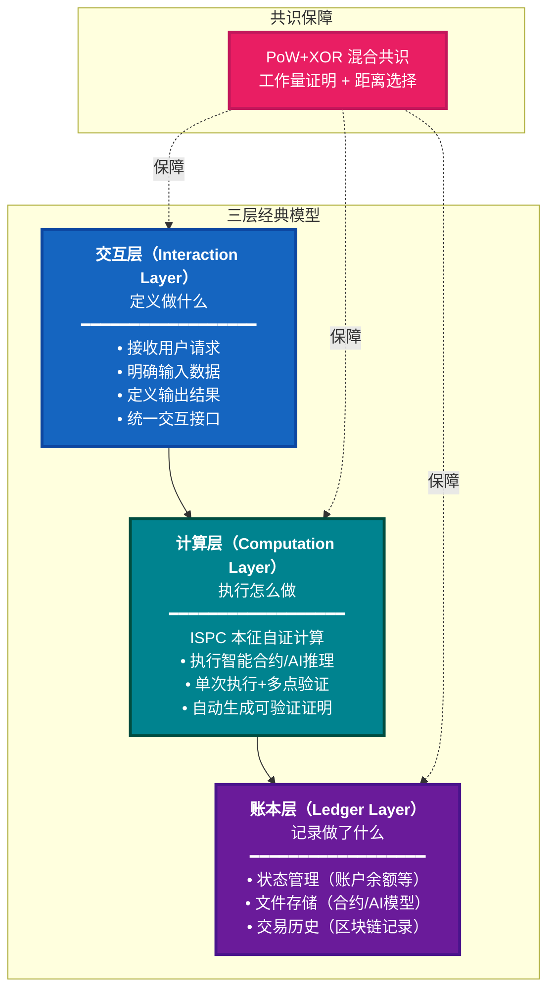
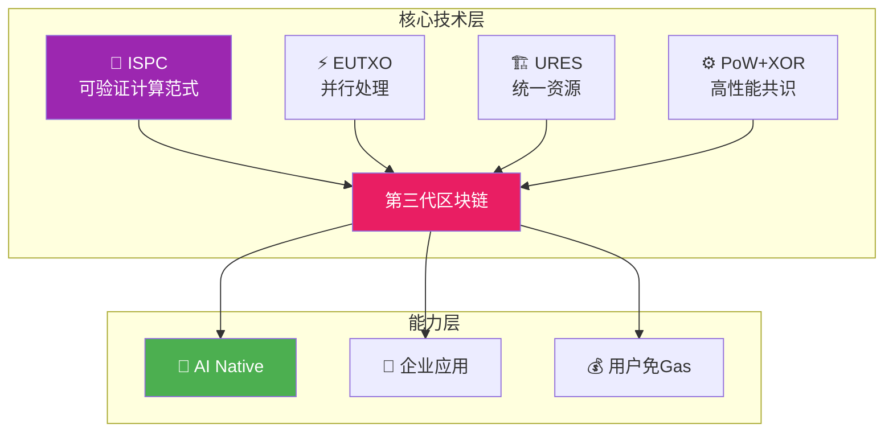

# WES —— 定义区块链的可验证计算范式

<div align="center">

<pre>
__          ________ _____  _______     ___   _ 
\ \        / /  ____|_   _|/ ____\ \   / / \ | |
 \ \  /\  / /| |__    | | | (___  \ \_/ /|  \| |
  \ \/  \/ / |  __|   | |  \___ \  \   / | . ` |
   \  /\  /  | |____ _| |_ ____) |  | |  | |\  |
    \/  \/   |______|_____|_____/   |_|  |_| \_|
</pre>

**开启 AI 时代的去中心化智能**  
**突破确定性共识限制，让 AI 等复杂计算能够在链上可信运行**

📖 **[English](README_EN.md) | 中文**

[](https://golang.org/)
[](LICENSE)
[]()
[]()

[🚀 立即体验](#-30秒上手) • [💡 核心突破](#-核心突破) • [📖 文档中心](#-文档导航)

</div>

---

## 🌌 时代命题：生产关系与生产力的结合

在数字经济的演进中，我们面临一个根本性矛盾：

- **区块链定义了新的生产关系**：去中心化、不可篡改、透明可信
- **AI 代表了新的生产力**：智能化、自动化、高效决策
- **但两者严重脱节**：
  - **传统区块链无法运行 AI**：确定性共识限制，无法支持非确定性计算
  - **AI 迫切需要区块链**：黑盒决策无法追溯，关键场景缺乏可审计性，数据所有权归属不清

这不是一个技术优化问题，而是一个**范式缺失问题**。

### 💥 现实困境

**场景一：电商想用区块链获客，但业务流程无法上链**

电商平台希望将"下单→支付→库存扣减→物流创建"的完整业务流程上链，通过代币激励、NFT权益等区块链经济模型来吸引用户、提升粘性。然而，传统区块链要求所有（如50个）节点重复执行整个流程——支付接口被调用50次，库存数据库被操作50次，物流API被请求50次。外部系统无法承受如此高频的重复调用，直接崩溃。**这就是为什么区块链发展15年，还停留在炒币，无法真正服务企业应用的根本原因。**

**场景二：医院想用AI上链应对纠纷，但AI无法在链上运行**

医院希望用AI辅助诊断，并将推理过程完整记录在链上。当发生医患纠纷时，可以追溯诊断依据、明确责任归属。然而，传统区块链要求所有节点执行AI模型并得到完全相同的输出结果——但AI推理本身是非确定性的，不同节点运行同一模型可能产生不同结果，无法达成共识。**传统区块链从架构上就无法运行AI。**

**场景三：工厂需要跨系统原子性，但区块链只支持单笔交易**

工厂的生产流程横跨ERP、MES、WMS等多个系统，需要保证"订单创建→生产排程→库存扣减"的原子性，任何一个环节失败都要全部回滚。然而，传统区块链只能处理单笔交易，无法支持跨系统的长事务。如果拆分成多个独立交易，就会出现部分成功、部分失败的状态不一致窗口期，业务风险极高。

### ❌ 传统区块链的架构性缺陷

```text
传统区块链 = 确定性共识 + 重复执行

50个节点 = 50次执行 = 50次数据库操作 = 💥 系统崩溃
                  = 50次API调用 = 💸 成本爆炸
                  = 无法运行AI = ❌ 功能受限
```

**传统区块链为什么无法运行 AI？**
- ❌ **确定性共识要求**：同一输入必须产生相同输出 → AI 推理是非确定性的
- ❌ **重复执行限制**：所有节点重复执行 → AI 模型太大、计算太昂贵
- ❌ **无法集成外部**：需要预言机喂数据 → 实时数据无法获取

**传统区块链为什么无法做企业应用？**
- ❌ **外部副作用问题**：50个节点 = 50次数据库操作 = 数据库崩溃
- ❌ **原子性受限**：只支持单笔交易，无法支持长事务业务流程
- ❌ **集成成本高**：需要大规模改造传统业务系统

---

## ✨ WES 的回答：可验证计算范式

面对传统区块链的架构性缺陷，WES 给出了自己的回答：通过 ISPC 可验证计算范式，重新定义区块链的计算方式。

### 🏗️ 理解 WES：从三层经典模型开始

要理解 WES 如何突破传统区块链的限制，我们需要先理解它的基础架构。**WES 采用经典的三层架构模型**：

```
交互层 → 计算层 → 账本层
```



**第一层：交互层（Interaction Layer）**
- **职责**：定义"做什么"——接收用户请求，明确需要什么输入，期望什么输出
- **通俗理解**：就像编程中的函数接口，你告诉系统要执行什么操作（函数名），需要什么参数（输入），系统告诉你会返回什么结果（输出）

**第二层：计算层（Computation Layer）**
- **职责**：执行"怎么做"——实际执行计算，并生成可验证的证明
- **通俗理解**：就像函数的具体实现，执行实际的业务逻辑，同时自动生成一份"执行证明"，证明计算是按照正确程序执行的
- **核心**：**ISPC 是这一层的核心创新**，让AI等复杂计算能在链上运行

**第三层：账本层（Ledger Layer）**
- **职责**：记录"做了什么"——将操作结果永久保存到不可篡改的账本中
- **通俗理解**：就像数据库和日志系统，记录所有操作的结果和历史，任何人都可以查看但无法篡改

**共识保障（横跨各层）**：
- **PoW+XOR**：混合共识机制，保障三层协同的安全性和一致性

---

这个三层模型是 WES 的基础架构：所有功能都基于此实现，任何操作都可以抽象为"交互定义 → 计算执行 → 账本记录"。

**在第二层（计算层），WES 的核心创新是 ISPC（Intrinsic Self-Proving Computing）本征自证计算**。ISPC 定义了一种全新的计算方式，让区块链真正能够承载 AI 等复杂计算。

> **ISPC 定义了区块链可验证计算范式**  
> 突破确定性共识限制，开启可验证计算时代。  
> **为 AI 而生，但不限于 AI。**

### 🔑 ISPC 的核心突破：单次执行 + 多点验证

ISPC 如何突破传统区块链的限制？让我们通过一个类比来理解：

**传统方式的问题**：
想象一下，如果50个法官要审理同一个案件，传统方式要求50个法官都亲自审理一遍，然后对比结果。这不仅效率低下，而且对于AI推理这种非确定性的计算，根本无法得到相同结果。

**ISPC 的创新**：
只需要1个法官审理，同时自动生成一份"可验证的证明文件"（就像公证处的公证书），其他49个法官只需验证这份证明是否有效，无需重复审理。

```text
传统区块链：
节点A执行 → 结果1
节点B执行 → 结果2    } 对比结果，必须相同（确定性共识）
节点C执行 → 结果3

WES ISPC：
节点A执行 → 结果 + 可验证性证明（自动生成）
节点B验证证明 → ✓                      } 验证证明是否有效，无需相同结果（可验证性共识）
节点C验证证明 → ✓
```

> 💡 **什么是可验证性证明？**  
> 就像公证处的公证书一样，证明"计算结果是通过正确程序得到的"，任何人都可以验证这份证明的真伪，但无需重新执行计算。这是密码学技术（零知识证明）的产物。

**ISPC 的突破**：
- ✅ **可验证性共识**：验证可验证性证明，不要求相同结果 → 支持非确定性计算（如AI）
- ✅ **单次执行+多点验证**：只有一个节点执行 AI 推理，其他节点仅验证证明 → 大幅降低计算成本
- ✅ **可控外部交互**：外部系统调用被控制和见证 → 实时数据可信获取

**这些突破带来了什么？**

- ✅ **AI 可以在链上运行**：验证证明，不要求相同结果
- ✅ **系统不会崩溃**：只有1个节点执行，其他节点验证
- ✅ **用户免Gas体验**：赞助池机制，降低使用门槛
- ✅ **企业应用真正上链**：支持长事务、外部集成

> **如同 CUDA 定义了 GPU 通用计算，**  
> **ISPC 定义了区块链可验证计算。**

> **我们不是在改进区块链，我们是在定义新的计算范式**

---

## 📊 三代区块链演进

ISPC 的突破让 WES 成为第三代区块链。让我们看看区块链的演进历程：

| 时代 | 代表 | 定义 | 应用 | 局限 |
|------|------|------|------|------|
| **第一代** | 比特币 | 数字货币 | 价值存储、支付 | ❌ 只能转账，无法运行业务逻辑 |
| **第二代** | 以太坊 | 智能合约 | DeFi、NFT、DAO | ❌ 确定性共识限制，无法支持 AI |
| **第三代** | **WES** | **可验证计算** | **AI、企业应用、一切复杂计算** | ✅ **突破确定性共识限制** |

**WES 的范式突破**：
- **可验证性共识**：验证可验证性证明，而非要求相同结果
- **单次执行**：只有一个节点执行，其他节点验证
- **可控外部交互**：外部系统调用被控制和见证，形成可验证闭环

这些突破带来了什么？让我们看看 WES 的核心能力：

---

## 🎯 核心能力

### 1. 🤖 AI Native：行业唯一支持链上AI

**为什么这很重要？**

| 传统区块链 | WES |
|----------|-----|
| ❌ 无法运行AI（确定性共识限制） | ✅ AI模型推理链上运行 |
| ❌ AI结果必须上链（中心化风险） | ✅ AI推理过程可验证 |
| ❌ 需要预言机（信任瓶颈） | ✅ 原生支持，无需中介 |

**应用场景**：
- 🏥 **医疗AI**：诊断决策链上可审计，数据不出域
- 🏭 **制造业**：AI排产决策透明可追溯
- 💼 **金融AI**：风险评估、投资建议链上可信

### 2. 🏢 企业应用支持：真实业务场景落地

**核心能力**：

- **原子性长事务**：跨系统业务流程在一个原子边界内执行
- **零改造成本**：现有ERP/CRM/支付系统无缝集成
- **外部副作用控制**：数据库、API调用被控制和见证

**典型场景**：
- 🛒 **电商订单**：下单→支付→库存→物流，原子性保证
- 🚚 **物流追踪**：接单→运输→签收，全程可追溯
- 🏗️ **建筑业**：多方协作，权限链上管理

### 3. 💰 灵活的费用机制：降低使用门槛

**费用即激励（核心）** - 交易手续费聚合为矿工激励，零增发模型  
**多Token支付** - 支持多种Token支付手续费，无需持有特定平台币  
**ISPC成本优化** - 单次执行大幅降低计算成本，手续费更低廉  
**赞助池代付（可选）** - 项目方可选择为用户代付，实现免Gas体验

> 💡 **说明**: WES底层是完整的"费用即激励"机制。用户可直接支付多Token手续费；项目方也可通过赞助池代付，实现用户免Gas体验。这是ISPC架构带来的成本优势。

---

了解了 WES 的核心能力，让我们开始使用它：

## 🚀 30秒上手

### 快速启动

```bash
# 1. 克隆并构建
git clone https://github.com/weisyn/weisyn.git
cd weisyn
make build-dev

# 2. 启动开发环境
./bin/development --cli-only

# 3. 体验核心功能
> 账户管理 → 钱包管理 → 创建钱包
> 挖矿控制 → 开始挖矿
> 账户管理 → 查询账户余额
```

### API 快速验证

```bash
# 启动API服务
./bin/development --api-only

# 获取链信息
curl http://localhost:8080/api/v1/info | jq .

# 启动挖矿
curl -X POST http://localhost:8080/api/v1/mining/start \
  -H 'Content-Type: application/json' \
  -d '{"miner_address": "<你的地址>"}'
```

> 📖 **完整指南**：[快速开始指南](./docs/README.md) | [应用示例](./examples/README.md)

---

## 🏗️ 技术架构

WES 的技术架构基于三层经典模型，通过四大核心技术实现上述核心能力：

### 四大核心技术



### 技术栈

| 技术 | 说明 | 价值 |
|------|------|------|
| **ISPC** | 单次执行+可验证性证明验证 | 🌟 **核心差异化**：支持AI链上运行 |
| **EUTXO** | 消除全局状态锁，并行处理 | 高性能，支持大规模并发 |
| **URES** | 合约/AI/数据统一管理 | 降低复杂度，无缝互操作 |
| **PoW+XOR** | 距离寻址共识 | 零配置，微秒级选择 |

> 💡 **技术细节**：ISPC 使用零知识证明（ZK Proof）技术生成可验证性证明，这是密码学领域的成熟技术。对于技术人员，详见 [ISPC 技术详解](./docs/components/core/ispc/README.md)

> 📖 **深入了解**：[系统架构](./docs/system/architecture/README.md) | [ISPC 技术详解](./docs/components/core/ispc/README.md)

---

## 🆚 为什么选择 WES？

了解了 WES 的技术架构，让我们看看它与其他方案的对比：

### 范式创新 vs 改良优化

| 维度 | 🌩️ 云平台 | ⛓️ 传统区块链 | 🏢 企业链 | **🚀 WES** |
|------|-----------|--------------|----------|-----------|
| **数据控制** | ❌ 依赖服务商 | ⚠️ 公链无隐私 | ✅ 企业控制 | **✅ 自主+隐私** |
| **业务能力** | ✅ 功能完整 | ❌ 无法AI | ⚠️ 功能受限 | **✅ AI+企业** |
| **可信度** | ❌ 中心化 | ✅ 去中心化 | ⚠️ 联盟可信 | **✅ 密码学级** |
| **运维成本** | ⚠️ 持续付费 | ❌ Gas昂贵 | ❌ 复杂维护 | **✅ 低成本** |

### 🎯 WES 的独特价值：范式创新 vs 改良优化

**改良思维（大多数项目）**：
- 提高 TPS → 仍是重复执行
- 降低 Gas 费 → 仍有 Gas 费
- 链下 AI → 牺牲可验证性

**范式思维（WES）**：
- 定义新的计算范式 → ISPC
- 从架构上突破限制 → 单次执行+验证
- 一次突破，多点收益 → AI、成本优化、企业集成

---

## 📋 文档导航

想要深入了解 WES？以下是按角色组织的文档导航：

### 🎯 按角色导航

**👨‍💻 开发者**
- [快速开始](#-30秒上手) → [应用示例](./examples/README.md) → [智能合约开发](./contracts/README.md)

**🏗️ 架构师**
- [系统架构](./docs/system/architecture/README.md) → [ISPC 技术](./docs/components/core/ispc/README.md)

**💼 投资人/合作伙伴**
- [项目总览](./docs/overview.md) → [市场定位](./docs/system/positioning.md)

**🏢 企业用户**
- [应用场景](#-核心突破) → [市场定位](./docs/system/positioning.md)

### 📘 核心文档

| 文档 | 说明 |
|------|------|
| ⭐ [项目总览](./docs/overview.md) | 完整的战略定位和价值主张 |
| 🏗️ [系统架构](./docs/system/architecture/README.md) | 五视图架构详解 |
| 🔬 [ISPC 技术](./docs/components/core/ispc/README.md) | 可验证计算范式详解 |

---

## 🌟 社区与愿景

### 获取帮助

- 💬 [Discord](https://discord.gg/weisyn) - 技术讨论与实时支持
- 🐛 [GitHub Issues](https://github.com/weisyn/weisyn/issues) - Bug报告与功能请求
- 📖 [技术文档](https://docs.weisyn.io) - 完整开发指南

### 🌌 愿景：从"简单交易时代"到"企业应用时代"

WES 不仅仅是一个技术突破，更是一个愿景的实现。让我们展望未来：

#### 3年后的世界

> **让每个企业都有一个选择**
>
> 关键业务可以运行在真正属于自己的基础设施上：数据归属清晰，AI模型自主可控，业务流程透明可审计。这不是对抗云服务，而是给企业多一个选择的自由。

#### 从技术突破到商业价值的完整路径

```text
15年前：比特币诞生，价值可信但功能有限
10年前：以太坊出现，智能合约但无法承载企业级应用  
今天：  WES突破，完整商业系统可以链上运行
3年后： 企业数字文明在分布式网络中永续运行
```

#### 我们不是在改进区块链，我们是在重新定义它

- ✅ **技术突破**：ISPC 可验证计算范式、EUTXO 并行架构、URES 统一资源、PoW+XOR 共识
- ✅ **商业价值**：从简单工具到企业基础设施  
- ✅ **用户价值**：数字资产真正归属，业务系统永续运行
- ✅ **开发体验**：一个平台解决所有问题
- ✅ **未来愿景**：区块链企业应用时代的开创者

---

## 🤝 贡献指南

我们欢迎社区贡献！查看 [贡献指南](CONTRIBUTING.md) 了解详情。

```bash
# 设置开发环境
go mod tidy
go test ./...

# 提交变更
git commit -S -m "feat: your contribution"
git push origin your-branch
```

---

## 🔧 常见问题

### 构建失败
```bash
go version    # 需要 >= 1.19
```

### 节点启动失败
```bash
netstat -tulpn | grep :8080  # 检查端口占用
./bin/development --verbose   # 查看详细日志
```

> 📖 **完整故障排查**：[开发者文档](./docs/README.md) | [GitHub Issues](https://github.com/weisyn/weisyn/issues)

---

## 📄 许可证

本项目基于 MIT 许可证开源 - 详见 [LICENSE](LICENSE) 文件。

---

<div align="center">

### 定义区块链的可验证计算范式，开启 AI 时代的去中心化智能

[立即开始](#-30秒上手) • [加入社区](https://discord.gg/weisyn) • [查看文档](./docs/overview.md)

Made with ❤️ by the WES Team

</div>
