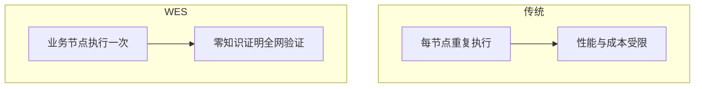
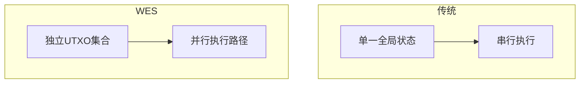
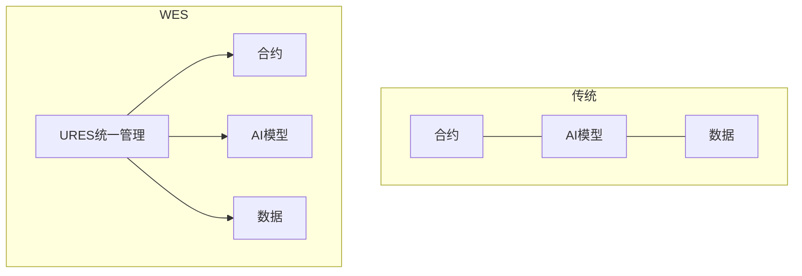
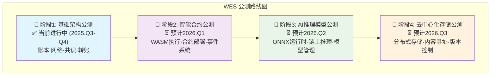
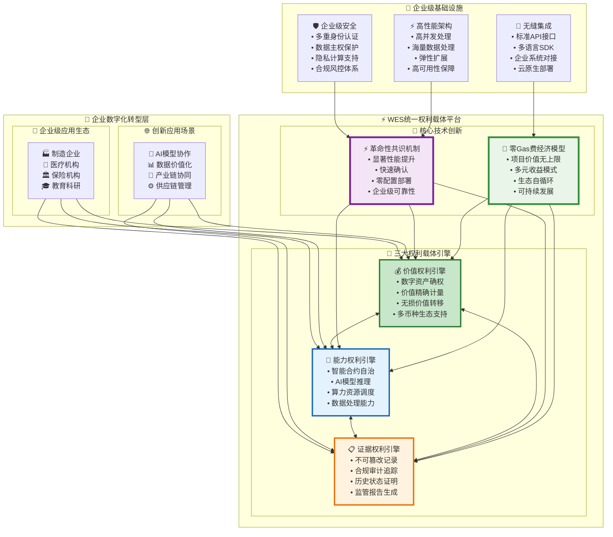
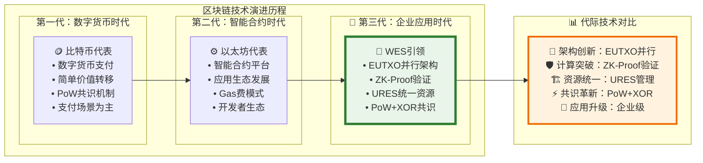

# WES —— 微迅链可信可控的企业级数字基础设施

<div align="center">

<pre>
__          ________ _____  _______     ___   _ 
\ \        / /  ____|_   _|/ ____\ \   / / \ | |
 \ \  /\  / /| |__    | | | (___  \ \_/ /|  \| |
  \ \/  \/ / |  __|   | |  \___ \  \   / | . ` |
   \  /\  /  | |____ _| |_ ____) |  | |  | |\  |
    \/  \/   |______|_____|_____/   |_|  |_| \_|
</pre>

**可信可控的企业级数字基础设施**  
**让企业数据、AI模型、业务逻辑自主可控运行**

📖 **[English](README_EN.md) | 中文**

[](https://golang.org/)
[](LICENSE)
[]()
[]()

[快速开始](#🚀-快速开始) • [核心特性](#核心特性) • [使用示例](#📚-使用示例) • [社区](#🌟-社区与愿景)

</div>

## 目录

- [📖 项目简介](#📖-项目简介)
- [🌌 深度解读](#🌌-深度解读)
- [💡 为什么选择WES](#💡-为什么选择weisyn)
- [⚡ 核心特性](#核心特性)
- [🧭 公测进度与路线图](#🧭-公测进度与路线图)
- [🧪 如何参与公测](#🧪-如何参与公测)
- [🚀 快速开始](#🚀-快速开始)
- [📚 使用示例](#📚-使用示例)
- [🏗️ 架构概览](#🏗️-架构概览)
- [📋 文档](#📋-文档)
- [🌟 社区与愿景](#🌟-社区与愿景)
- [🤝 贡献指南](#🤝-贡献指南)
- [📄 许可证](#📄-许可证)

## 📖 项目简介

**WES (Weisyn Chain)** 是新一代**可信可控的企业级数字基础设施平台**。

WES突破了传统区块链存储和计算限制，让企业的数据、AI模型、业务逻辑可以在微迅链分布式网络上自主可控运行，同时获得区块链级的可信保障。

### 核心价值主张

WES为企业提供前所未有的数字自主权：

- **🏢 高度自主**：数据、AI模型、业务逻辑由企业自主控制
- **⚡ 功能完整**：统一资源架构，可执行资源（智能合约/AI模型）与通用资源（文档/数据）一体化管理
- **🔒 可信可控**：区块链级可信保障 + 零知识证明 + 完整审计轨迹
- **🚀 企业级性能**：大规模并行处理，支持大型AI模型

> **我们不是在改进区块链，我们是在<mark>**重新定义企业数字基础设施**</mark>**

---

## 🌌 深度解读

### 定位：从"租赁基础设施"到"自有基础设施"

> **"如果说云计算是企业的'租赁办公楼'，**  
> **那么WES就是企业的'自建总部大厦'**  
> **——高度自主控制，不受外部服务商制约。"**

**电梯陈述（30秒版本）**：
> WES让企业拥有真正属于自己的数字基础设施。企业的数据、AI模型、业务流程在分布式网络上自主运行，获得区块链级别的可信度和永续性，同时具备云平台级别的功能完整性。我们不是要替代云服务，而是给企业一个<mark>"永远属于自己"</mark>的选择。

### 背景：解决15年区块链发展的根本局限

**区块链15年发展的核心局限**：

- **比特币**：价值可信，但业务逻辑无法运行（<span style="color:red">**只能转账**</span>）
- **以太坊**：业务可跑，但<span style="color:red">**离不开外部数据/AI/存储**</span>（<span style="color:red">**无法处理大型资源**</span>）
- **结果**：<u>长期以来主要停留在简单交易应用阶段，无法支撑真实的企业级业务</u>

**企业数字化的现实困境**：

- 关键数据依赖第三方云服务，面临成本波动、服务不可用、合规风险
- AI模型托管在外部平台，缺乏自主控制权
- 业务流程缺乏可审计性，合规成本高昂
- **核心问题**：<span style="background-color:#fff2cc">**企业缺乏真正属于自己的数字基础设施**</span>

### 突破：WES的技术创新路径

### ⚡ 创新性技术突破

#### 对象-困境-突破-价值（概览）

| 对象 | 传统困境 | WES突破 | 业务价值 |
|------|----------|----------|----------|
| 比特币 | 只能转账，无法运行业务逻辑 | 可执行资源（合约/AI）链上运行 | 企业业务可上链，扩大应用边界 |
| 以太坊 | 依赖外部存储/AI，难以处理大型资源 | URES统一资源管理，链上一体化 | 合约、模型、数据统一治理，降低系统复杂度 |
| 企业链 | 功能受限，难以证明正确性 | 零知识证明验证计算结果 | 满足审计与合规，提升可信度 |
| 云平台 | 数据和成本受制于第三方 | 自有节点网络+去中心化存储 | 数字自主权与成本可控 |

> 注：为避免夸大，本文不使用未经验证的性能数字。并行带来的能力提升以“架构级并行”进行定性描述。

#### 三个独立的突破小图

1) 零知识证明：从"重复执行"到"一次执行+全网验证"



2) EUTXO并行：从"全局状态锁"到"天然并行分片"



3) URES统一资源：从"合约/AI/数据分离"到"统一治理的一体化资源"



**为什么我们能做到？**

- **零知识证明(ZK)架构**：业务节点执行计算，全网验证结果，突破"每个节点重复执行"的根本限制
- **并行处理架构**：消除全局状态锁，实现真正的并行处理，大幅提升处理能力
- **统一资源管理(URES)**：大型AI模型、完整业务数据、智能合约统一管理，一体化运行

**实际价值**：让<mark>**大型AI诊断模型、完整电商库存系统、智能制造调度算法能够在分布式网络上可信运行**</mark>

---

## 💡 为什么选择WES

### 🆚 WES vs 现有方案的根本差异

| 对比维度 | 🌩️ 云平台 (AWS/阿里云) | ⛓️ 传统区块链 (以太坊) | 🏢 企业区块链 (Fabric) | **🚀 WES优势** |
|---------|-------------------------|--------------------------|--------------------------|----------------|
| **🔐 数据控制权** | ❌ 依赖服务商 | ⚠️ 公链无隐私 | ✅ 企业控制 | **✅ 高度自主+隐私** |
| **⚡ 业务能力** | ✅ 功能完整 | ❌ 无法处理大数据AI | ⚠️ 功能有限 | **✅ 云级功能** |
| **🛡️ 可信度** | ❌ 中心化风险 | ✅ 去中心化可信 | ⚠️ 联盟可信 | **✅ 密码学级证明** |
| **💰 运维成本** | ⚠️ 持续付费 | ❌ 执行费用费昂贵 | ❌ 复杂维护 | **✅ 低维护成本** |

### 解锁的真实商业场景

#### `AI模型本地化部署`  
数据不出域的智能推理

**现实需求**：医院拥有影像科、病理科、检验科等多个科室，每个科室需要专业AI模型，但面临两难选择：
- **调用云端AI服务**：患者数据需上传到第三方平台，存在隐私合规风险
- **本地部署AI模型**：每个科室独立部署成本高昂，维护复杂

**传统区块链为什么解决不了？**
- **存储限制**：<span style="color:red">**无法存储大型AI模型文件**</span>
- **计算能力不足**：<span style="color:red">**所有节点重复执行AI模型推理**</span>，性能和成本都无法承受
- **缺乏AI运行时**：<span style="color:red">**没有内置的AI模型推理引擎**</span>

**WES解决方案**：
```text
技术实现: AI模型作为可执行资源统一管理，内置ONNX推理引擎
业务价值: 医疗数据不出域，多科室共享AI能力，降低部署成本
合规保障: 满足医疗数据安全法规，审计轨迹完整可追溯
```

#### `复杂业务智能合约`  
突破传统合约边界

**现实需求**：智能制造企业需要整合多方数据（设备状态、生产记录、质量检测、环境监控）进行智能调度决策，但传统智能合约面临技术瓶颈：

**传统区块链为什么解决不了？**
- **外部依赖性**：<span style="color:red">**需要Oracle获取链外数据**</span>，增加信任风险和成本
- **存储容量限制**：<span style="color:red">**无法存储完整的企业历史生产数据**</span>
- **计算成本过高**：<span style="color:red">**复杂调度算法在所有节点重复执行**</span>，执行费用费用昂贵
- **性能瓶颈**：<u>全网串行处理，无法支撑高频业务场景</u>

**WES解决方案**：
```text
技术实现: 零知识证明架构，业务节点执行复杂逻辑，全网只验证结果
数据管理: 生产数据作为资源统一存储，合约可直接调用无需外部Oracle
业务价值: 支撑复杂制造逻辑，处理能力匹配工业级应用需求
```

#### `企业级资源协作`  
多方安全共享与版本管理

**现实需求**：建筑设计院与施工方、监理方、政府部门需要协作管理大量资源：设计图纸、施工方案、监理报告、合规文档，传统解决方案存在明显不足：

**现有方案的局限性**：
- **中心化平台**：依赖单一平台，存在<span style="color:red">**服务中断风险**</span>和<span style="color:red">**数据控制权问题**</span>
- **传统区块链**：<span style="color:red">**存储能力有限**</span>，<span style="color:red">**无法处理大型文档和多媒体资源**</span>
- **版本管理复杂**：<u>多方协作中资源版本控制困难，权限管理复杂</u>

**WES解决方案**：
```text
技术实现: 去中心化存储引擎，支持大型资源分布式存储和版本控制
资源管理: 通过URES统一管理文档、图纸、视频等通用资源
协作价值: 多方透明协作，资源访问权限链上管理，版本历史不可篡改
合规支撑: 满足建筑行业数据安全和审计要求
```

---

## 核心特性

### 企业级自主能力

#### **数据高度自主**

- **链上存储系统**：大规模数据、AI模型、业务文档分布式存储，企业自主控制
- **自主运行网络**：业务逻辑在企业节点网络执行，摆脱外部制约
- **成本可控预期**：基于自有节点网络运行，成本结构透明可控

#### **可信可审保障**

- **零知识证明(ZK)**：业务执行结果获得密码学级正确性保证
- **完整审计轨迹**：不可篡改的执行记录，支持实时监管审计
- **合规友好架构**：满足医疗、制造等最严格行业合规要求

### 核心技术能力

#### **高性能并行架构**

- **EUTXO扩展模型**：消除全局状态锁，实现真正并行处理
- **性能突破**：从传统区块链串行处理跃升为大规模并行处理
- **资源利用优化**：支持大型AI模型和大规模数据处理

#### **开发者体验优化**

- **多语言支持**：Go、Rust、C++等主流语言，无需学习专门区块链语言  
- **熟悉开发环境**：使用现有IDE和开发工具链
- **丰富SDK支持**：完整的开发和测试工具集

### 统一架构优势

<details>
<summary><strong>URES统一资源管理</strong></summary>
<br>

- **一体化管理**：智能合约、存储文件、AI模型统一UTXO管理
- **资源互操作**：不同类型资源间无缝交互和组合
- **版本控制**：完整的资源版本管理和回滚能力

</details>

#### **统一资源架构优势**

| **资源分类** | **引擎/系统** | **当前状态** | **业务价值** |
|-------------|-------------|-------------|-------------|
| **智能合约** | WASM执行引擎 | 🚧 公测中 | 业务逻辑链上运行，高度可控 |
| **AI模型** | ONNX推理引擎 | ⏳ 待公测 | AI模型推理链上运行，数据不出域 |
| **通用资源** | 混合存储系统 | 🚧 公测中 | 企业数据高度自主可控 |
| **统一治理** | URES资源管理 | 🚧 公测中 | 所有资源统一管理，互相调用 |

> **核心技术栈**：零知识证明 + 并行处理 + 统一资源管理 + 多引擎执行（WASM+ONNX）

---

## 🧭 公测进度与路线图

### 🎯 当前公测范围（阶段1）- 区块链基础架构

**核心功能验证**：
- ⛓️ **账本系统**：EUTXO 模型、余额查询、交易记录
- 🌐 **网络层**：P2P 节点通信、区块同步、交易广播
- ⚙️ **共识机制**：PoW 挖矿、区块生产、难度调整
- 💸 **资产转账**：原生币转账、批量转账、交易签名

**验证路径**：
- 🖥️ **CLI 交互**：个人用户、开发测试、本地钱包管理
- 🔗 **HTTP API**：企业集成、自动化脚本、第三方对接

**技术栈验证**：
- 零知识证明架构基础
- 并行处理能力验证
- 统一资源管理框架
- 多环境配置嵌入

### 🗓️ 后续开放计划



## 🧪 如何参与公测

### 🖥️ 方式一：CLI 交互体验（个人用户推荐）

**CLI 定位**：面向个人用户、开发测试、本地钱包管理的交互式体验

```bash
# 启动 CLI 交互模式
./bin/development --cli-only
```

**完整功能菜单**：
- 💼 **账户管理**：创建/导入钱包、查看余额、钱包列表（自动读取地址）
- 💸 **转账操作**：普通转账、批量转账（自动选择钱包地址）
- ⛏️ **挖矿控制**：开始/停止挖矿、查看状态（需手动输入矿工地址）
- 📦 **资源管理**：部署和管理区块链资源
- 📊 **区块信息**：查看最新区块、链状态、交易信息
- 🔧 **系统中心**：节点状态、系统设置

**体验路径**：
1. 账户管理 → 钱包管理 → 创建钱包（设置密码）
2. 挖矿控制 → 开始挖矿（输入上步创建的钱包地址）
3. 账户管理 → 查询账户余额（自动选择钱包）

### 🔗 方式二：API 快速验证（企业集成）

**API 定位**：面向企业后端、自动化脚本、第三方系统集成

```bash
# 启动 API 服务
make build-dev && ./bin/development --api-only

# 基础验证
curl -s http://localhost:8080/health
curl -s http://localhost:8080/api/v1/info
```

### 📋 反馈与参与

- **Issue 提交**：使用标签 `public-beta`，提供最小复现步骤
- **Discord 讨论**：实时技术交流与问题反馈
- **系统信息**：请附上操作系统、Go 版本、错误日志

更多运行模式详见：[bin/README.md](bin/README.md)

## 🚀 快速开始

### 环境要求

| 组件 | 版本要求 | 说明 |
|------|---------|------|
| Go | 1.24+ | 主要开发语言（项目使用 go 1.24.2） |
| TinyGo | 0.31+ | 智能合约编译器（可选，仅合约开发需要） |
| Git | 任意版本 | 代码管理工具 |

> **重要**: 
> - 基础功能（CLI、API、挖矿、转账）只需要 Go 1.24+
> - 智能合约开发需要 TinyGo 0.31+，使用了新的 `//go:wasmimport` 语法

### 安装方式

#### 1. 源码构建（推荐）

```bash
git clone https://github.com/weisyn/weisyn.git
cd weisyn
# 仅开发环境二进制
make build-dev
# 或一次性构建全部环境
make build-all
```

等价 Go 命令（可选）：

```bash
go build -o bin/development ./cmd/development
go build -o bin/testing ./cmd/testing
go build -o bin/production ./cmd/production
```

#### 2. Docker（暂不可用）

```bash
# Docker 支持正在开发中
# 当前请使用源码构建方式
```

### 3分钟体验

**环境专用启动方式**：
```bash
# 1. 开发环境启动（个人用户推荐）
./bin/development                    # 完整功能：CLI交互 + API服务

# 2. 仅CLI模式（本地钱包管理）
./bin/development --cli-only         # 个人钱包、转账操作

# 3. 仅API模式（后端集成）
./bin/development --api-only         # 纯API服务，适合脚本对接

# 4. 自动演示模式（可选）
./bin/development --auto-demo        # 跳过交互，演示核心流程
```

**快速验证功能**：
```bash
# 验证基础功能（推荐）
./bin/development --version
curl -s http://localhost:8080/health  # 需先启动 --api-only

# 体验CLI钱包功能（完整流程）
./bin/development --cli-only
> 账户管理 → 钱包管理 → 创建钱包
> 挖矿控制 → 开始挖矿（输入上步地址）
> 账户管理 → 查询账户余额

# 体验智能合约引擎（需要 TinyGo）
cd examples/basic/hello-world
./scripts/build.sh && ./scripts/deploy.sh

# 体验存储引擎
cd ../data-storage
./scripts/setup.sh && ./scripts/run_demo.sh
```

> **说明**: 
> - 基础验证（CLI、API、挖矿、转账）无需额外依赖
> - 智能合约示例需要安装 TinyGo 0.31+

### 验证安装

```bash
# 基础验证
./bin/development --version
./bin/development --help

# API 验证（需先启动 --api-only）
curl -s http://localhost:8080/health
curl -s http://localhost:8080/api/v1/info
```

### 进阶体验

```bash
# 1. 区块链基础架构（当前公测）
./bin/development --cli-only  # CLI 完整交互
./bin/development --api-only  # API 服务模式

# 2. 智能合约引擎（需要 TinyGo）
cd examples/basic/hello-world
./scripts/build.sh && ./scripts/deploy.sh

# 3. 存储引擎  
cd ../data-storage
./scripts/setup.sh && ./scripts/run_demo.sh

# 4. AI模型推理引擎（计划 2026.Q2）
# 预期支持：
# cd ../ai-inference
# ./scripts/deploy_model.sh sample_model.onnx
# ./scripts/run_inference.sh
echo "AI模型推理引擎集成调试中，即将支持ONNX模型链上运行"
```

## 📚 使用示例

### CLI 快速上手

```bash
# 启动交互式CLI（开发环境）
./bin/development --cli-only

# 交互菜单路径
> 账户管理 → 钱包管理 → 创建钱包
> 挖矿控制 → 开始挖矿（粘贴上一步的钱包地址）
> 账户管理 → 查询账户余额
```

### API 入门（最小验证）

```bash
# 获取链信息
curl -s http://localhost:8080/api/v1/info | jq .

# 启动挖矿（将奖励发送到你的地址）
curl -s -X POST http://localhost:8080/api/v1/mining/start \
  -H 'Content-Type: application/json' \
  -d '{"miner_address": "<你的地址>"}' | jq .

# 查询账户原生币余额
curl -s http://localhost:8080/api/v1/accounts/<你的地址>/balance | jq .

# 停止挖矿（可选）
curl -s -X POST http://localhost:8080/api/v1/mining/stop | jq .
```

进阶与完整示例：
- 智能合约快速开始：`contracts/QUICK_START.md`
- 示例应用与脚本：`examples/README.md`
- HTTP API 列表：`internal/api/http/handlers/API_METHODS_DOCUMENTATION.md`

---

## 🏗️ 架构概览

### 🏗️ 第三代企业级区块链架构：重新定义数字世界基础设施

WES基于**EUTXO、ZK-Proof、URES、PoW+XOR**四大核心技术，构建了全球首个企业级区块链基础设施，突破传统区块链长期停留在简单交易应用阶段的根本局限，实现对真实企业级业务的完整支撑。

#### 🌟 WES革命性架构全景



#### 🎯 三代区块链演进：WES引领第三代革命



### 🎯 WES四大核心技术突破：第三代区块链的技术基石

#### 🔬 技术突破一：EUTXO并行处理架构

**核心创新**：扩展UTXO模型，彻底消除全局状态锁，实现真正的并行处理

- **🚫 消除状态锁**：摒弃Account模型的全局状态依赖，每个UTXO独立处理
- **⚡ 天然并行**：交易之间无状态冲突，支持大规模并发执行
- **🎯 精确权利**：通过TxInput/TxOutput精确表达数字权利的转换和分配
- **🔗 链式验证**：基于UTXO引用链实现高效的交易验证机制

**技术价值**：从串行处理跃升为并行处理，为企业级应用提供性能基础。

#### 🛡️ 技术突破二：ZK-Proof计算架构

**核心创新**：业务节点执行计算，全网ZK-Proof验证，突破"重复执行"根本限制

- **📍 单点执行**：复杂业务逻辑仅在业务节点执行一次，避免全网重复计算
- **🔍 全网验证**：通过ZK-Proof技术，全网节点快速验证执行结果正确性
- **🎯 计算分离**：执行与验证分离，大幅降低网络计算负担
- **⚖️ 密码学保证**：基于密码学的强安全保证，确保计算结果可信

**技术价值**：让大型AI模型、复杂业务逻辑能够在区块链上高效可信运行。

#### 🏗️ 技术突破三：URES统一资源管理

**核心创新**：智能合约、AI模型、数据存储的统一管理和互操作架构

- **🔄 统一治理**：所有资源类型采用统一的管理接口和生命周期
- **🤝 无缝互操作**：合约可直接调用AI模型，AI模型可访问链上数据
- **📦 内容寻址**：基于内容哈希的去重存储，优化资源利用效率
- **🔐 权限控制**：统一的访问控制机制，支持企业级权限管理

**技术价值**：实现数据、AI、合约的一体化管理，降低系统复杂度。

#### ⚡ 技术突破四：PoW+XOR距离寻址共识

**核心创新**：基于XOR距离算法的确定性区块选择，零配置高性能共识

- **📏 距离寻址**：采用Kademlia DHT的XOR距离计算，实现确定性区块选择
- **🎯 零配置**：无需参数调优、权重配置，算法天然确定性且抗操纵
- **⚡ 微秒级选择**：单次XOR操作完成区块选择，性能极致优化
- **🔒 抗操纵性**：矿工无法预测距离计算结果，确保共识公平性

**技术价值**：告别复杂共识配置，实现高性能、高可靠的企业级共识机制。

更多技术详情参见: [📚 技术实现文档](#-技术实现文档)

---

## 📋 文档

### 🎯 核心技术文档（面向决策层）

| 文档 | 核心价值 |
|------|----------|
| [🚀 共识机制技术创新](docs/consensus-innovation.md) | 突破性能提升，重新定义区块链效率边界 |
| [💰 零Gas费经济模型](docs/zero-gas-economics.md) | 释放区块链生态无限价值潜能，项目价值无上限 |
| [🏗️ 统一资源架构](docs/unified-resource-architecture.md) | 企业级数字化转型基石，显著降低技术复杂度 |
| [🛡️ 企业级合规框架](docs/enterprise-compliance.md) | 数字化信任基础设施，大幅降低合规成本 |
| [🌟 开发者生态平台](docs/developer-ecosystem.md) | Web3时代开发者天堂，显著提升开发效率 |

### 📚 技术实现文档

| 资源 | 说明 |
|------|------|
| [API参考](internal/api/README.md) | 完整API文档 |
| [智能合约开发](contracts/README.md) | 合约开发完整指南 |
| [应用示例](examples/README.md) | 从Hello World到企业级应用 |
| [架构实现](_docs/architecture/README.md) | 底层技术架构详解 |

### 🎯 按用户类型分类

#### 🤝 合作伙伴与投资方
- [🚀 共识机制技术创新](docs/consensus-innovation.md) - 技术护城河与商业价值
- [💰 零Gas费经济模型](docs/zero-gas-economics.md) - 商业模式创新与生态价值
- [🛡️ 企业级合规框架](docs/enterprise-compliance.md) - 风险控制与合规保障

#### 👨‍💻 开发者
- [🌟 开发者生态平台](docs/developer-ecosystem.md) - 开发体验与生态机会
- [智能合约开发指南](contracts/README.md) - 完整开发工具链
- [应用示例集合](examples/README.md) - 从入门到高级

#### 🏢 企业用户
- [🏗️ 统一资源架构](docs/unified-resource-architecture.md) - 数字化转型解决方案
- [🛡️ 企业级合规框架](docs/enterprise-compliance.md) - 合规保障与风险管理
- [API参考文档](internal/api/README.md) - 企业集成接口

---

## 🌟 社区与愿景

### 获取帮助

| 平台 | 用途 | 链接 |
|------|------|------|
| Discord | 技术讨论与实时支持 | [加入Discord](https://discord.gg/weisyn) |
| GitHub Issues | Bug报告与功能请求 | [提交Issue](https://github.com/weisyn/weisyn/issues) |
| 技术文档 | 完整开发指南 | [docs.weisyn.io](https://docs.weisyn.io) |
| 教程示例 | 实战学习资源 | [tutorials.weisyn.io](https://tutorials.weisyn.io) |

### 参与贡献

- 🐛 **发现Bug?** [立即报告](https://github.com/weisyn/weisyn/issues/new?template=bug_report.md)
- 💡 **有想法?** [分享建议](https://github.com/weisyn/weisyn/issues/new?template=feature_request.md)
- 📝 **完善文档?** [贡献文档](docs/CONTRIBUTING.md)
- 💻 **代码贡献?** [提交PR](https://github.com/weisyn/weisyn/pulls)

### 🌌 愿景：从"简单交易时代"到"企业应用时代"

#### 3年后的世界

> **让每个企业都有一个选择**
>
> 关键业务可以运行在真正属于自己的基础设施上：数据归属清晰，AI模型自主可控，业务流程透明可审计。这不是对抗云服务，而是给企业多一个选择的自由。

#### 从技术突破到商业价值的完整路径

```text
15年前：比特币诞生，价值可信但功能有限
10年前：以太坊出现，智能合约但无法承载企业级应用  
今天：  WES突破，完整商业系统可以链上运行
3年后： 企业数字文明在分布式网络中永续运行
```

#### 我们不是在改进区块链，我们是在重新定义它

- ✅ **技术突破**：EUTXO、ZK-Proof、URES、PoW+XOR
- ✅ **商业价值**：从简单工具到企业基础设施  
- ✅ **用户价值**：数字资产真正归属，业务系统永续运行
- ✅ **开发体验**：一个平台解决所有问题
- ✅ **未来愿景**：区块链企业应用时代的开创者

---

## 🤝 贡献指南

我们欢迎社区贡献！请查看我们的 [贡献指南](CONTRIBUTING.md) 了解详情。

### 开发流程

```bash
# 设置开发环境
go mod tidy

# 运行测试
go test ./...

# 代码检查
go vet ./...

# 提交变更
git commit -S -m "feat: your contribution"
git push origin your-branch
```

### 序列化规范

**🔧 Protobuf优先原则**：

- **核心区块链数据结构**（`pb/`目录中定义的Block、Transaction、Resource、Address等）**必须使用protobuf序列化**
- **内部应用数据结构**（如配置、状态、处理结果等）可以根据需要使用JSON或其他序列化方式
- **客户端代码**（CLI工具、示例代码等）可以使用JSON进行API交互

**违规示例**：
```go
// ❌ 错误：对pb定义的结构使用JSON
block := &blockpb.Block{...}
json.Marshal(block)  // 违规！应该使用proto.Marshal

// ✅ 正确：对pb定义的结构使用protobuf
block := &blockpb.Block{...}
proto.Marshal(block)

// ✅ 正确：内部结构可以使用JSON
type ProcessResult struct {
    Success bool `json:"success"`
}
```

## 故障排查

### 三大引擎故障排查

#### 🏗️ 节点基础环境

##### 构建失败

- 确认Go版本 >= 1.19: `go version`
- 确认TinyGo版本 >= 0.31: `tinygo version`  
- 构建节点和CLI: `go build -o bin/node cmd/node/main.go`

##### 节点启动失败

- 检查配置文件: `configs/development/single/config.json`
- 确认端口未被占用: `netstat -tulpn | grep :8080`
- 查看详细日志: `./bin/node --config configs/development/single/config.json --verbose`

#### ⚙️ 智能合约引擎

##### 合约编译失败

- 验证Go语法: `go vet examples/basic/hello-world/src/hello_world.go`
- 构建WASM文件: `cd examples/basic/hello-world && ./scripts/build.sh`
- 检查TinyGo兼容性: `tinygo build -target=wasi -o test.wasm src/hello_world.go`

##### 合约部署失败

- 确认节点正在运行: `curl -s http://localhost:8080/health`
- 检查WASM文件完整性: `file hello_world.wasm`
- 查看部署日志: `./scripts/deploy.sh --verbose`

#### 🧠 AI模型推理引擎

##### AI模型加载失败（功能完善中）

- 验证ONNX模型格式: `python -c "import onnx; onnx.checker.check_model('model.onnx')"`
- 检查模型文件完整性: `ls -la models/*.onnx`
- 模型推理测试: `# 集成测试完成后提供具体命令`

##### 推理结果异常

- 验证输入数据格式: `# JSON格式检查功能完善中`
- 检查模型版本兼容性: `# 兼容性测试进行中`
- 查看推理日志: `# 日志功能集成调试中`

#### 💾 存储引擎

##### 数据存储失败

- 测试存储功能: `cd examples/basic/data-storage && ./scripts/run_demo.sh`
- 检查存储权限: `ls -la data/`
- 验证UTXO状态: `# 使用区块链浏览器查看`

##### 数据检索失败

- 运行查询测试: `cd examples/basic/data-storage && ./scripts/query_data.sh`
- 检查数据完整性: `./scripts/integrity_check.sh`
- 验证索引状态: `# 检查区块链索引完整性`

更多问题解决方案请查看: [故障排查指南](docs/troubleshooting.md)

需要帮助？请在我们的 [讨论区](https://github.com/weisyn/weisyn/discussions) 提问，或加入 [Discord社区](https://discord.gg/weisyn) 获取实时支持。

---

## 🔥 **配置嵌入技术 - 零依赖部署革命**

WES 4.0 引入了革命性的**配置完全嵌入技术**，彻底改变区块链应用的部署方式：

### **✨ 技术亮点**

| 特性 | 传统方式 | WES 嵌入式 |
|------|--------|------------|
| 部署文件 | 可执行文件 + 配置目录 | **仅需单一可执行文件** |
| 启动依赖 | 需确保配置路径正确 | **完全无外部依赖** |
| 容器化 | FROM alpine + 配置复制 | **FROM scratch 极简镜像** |
| 配置安全 | 外部文件可能被篡改 | **编译时版本绑定** |

### **🚀 零依赖验证**

```bash
# 完全移除配置文件目录
$ rm -rf configs/

# 二进制文件仍能正常运行
$ ./bin/production --version
WES 生产环境节点 v1.0.0
配置: configs/production/config.json (嵌入式)  # ← 嵌入式标识

# 无任何外部依赖启动完整服务  
$ ./bin/production --api-only
🚀 正在启动WES生产环境节点...
📁 配置: configs/production/config.json (嵌入式配置)
✅ API服务启动成功！
```

### **⚙️ 技术实现**

采用 Go 1.16+ 的 `//go:embed` 指令，将配置文件在**编译时**完全嵌入二进制数据段：

```go
// internal/config/embedded.go
//go:embed production.json
var productionConfig []byte    // 配置内容编译时嵌入
```

**运行时处理**: 动态创建临时配置文件 → 应用使用 → 自动清理，对现有代码零影响。

> 💡 **云原生最佳实践**: 这种架构实现了真正的"不可变基础设施"，配置与代码版本完全绑定，彻底消除了部署环境配置不一致的风险。

---

## 📄 许可证

本项目基于 MIT 许可证开源 - 详见 [LICENSE](LICENSE) 文件。

了解更多: [项目愿景](docs/vision.md) | [技术白皮书](docs/whitepaper.md) | [架构设计](docs/architecture/README.md)

---

<div align="center">

### 构建企业数字自主权

[立即开始](docs/guides/README.md) • [加入社区](https://discord.gg/weisyn) • [查看示例](examples/README.md)

Made with ❤️ by the WES Team

</div>
