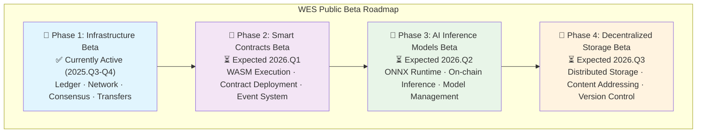
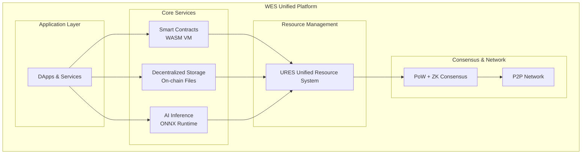

# WES —— Enterprise-Grade Trusted Digital Infrastructure

<div align="center">

<pre>
__          ________ _____  _______     ___   _ 
\ \        / /  ____|_   _|/ ____\ \   / / \ | |
 \ \  /\  / /| |__    | | | (___  \ \_/ /|  \| |
  \ \/  \/ / |  __|   | |  \___ \  \   / | . ` |
   \  /\  /  | |____ _| |_ ____) |  | |  | |\  |
    \/  \/   |______|_____|_____/   |_|  |_| \_|
</pre>

**Enterprise-Grade Trusted Digital Infrastructure**  
**Making enterprise data, AI models, and business logic autonomously controllable**

📖 **English | [中文](README.md)**

[](https://golang.org/)
[](LICENSE)
[]()
[]()

[Quick Start](#-quick-start) • [Core Features](#core-features) • [Usage Examples](#-usage-examples) • [Community](#-community--vision)

</div>

## Table of Contents

- [📖 Project Overview](#-project-overview)
- [🌌 In-Depth Understanding](#-in-depth-understanding)
- [💡 Why Choose WES](#-why-choose-wes)
- [⚡ Core Features](#core-features)
- [🧭 Public Beta Progress & Roadmap](#-public-beta-progress--roadmap)
- [🧪 How to Join Public Beta](#-how-to-join-public-beta)
- [🚀 Quick Start](#-quick-start)
- [📚 Usage Examples](#-usage-examples)
- [🏗️ Architecture Overview](#️-architecture-overview)
- [📋 Documentation](#-documentation)
- [🌟 Community & Vision](#-community--vision)
- [🤝 Contributing Guide](#-contributing-guide)
- [📄 License](#-license)

## 📖 Project Overview

**WES (Weisyn Chain)** is a next-generation **enterprise-grade trusted digital infrastructure platform**.

WES breaks through traditional blockchain storage and computing limitations, allowing enterprises' data, AI models, and business logic to run autonomously and controllably on the Weisyn Chain distributed network, while obtaining blockchain-level trust guarantees.

### Core Value Proposition

**🎯 For Enterprises**: Create a trusted execution environment where your business data, AI models, and logic can run autonomously under your control while leveraging blockchain's immutable trust guarantees.

**🔒 Autonomous & Controllable**: Enterprise assets remain under your sovereignty while benefiting from decentralized network effects.

**🚀 All-in-One Platform**: Smart contracts + decentralized storage + AI inference in one unified platform, eliminating complex multi-chain architectures.

**Core Innovation**: Zero-Knowledge proof driven architecture enabling massive resource processing while maintaining blockchain security guarantees.

## 💡 Why WES?

### The Problem with Current Blockchain Systems

| Challenge | Traditional Solutions | WES Solution |
|-----------|----------------------|---------------|
| **Large Data Processing** | ❌ Can't handle GB-scale resources | ✅ Native support for AI models, videos, datasets |
| **AI Integration** | ❌ Relies on external oracles | ✅ On-chain ONNX runtime for deterministic AI |
| **Storage & Compute** | ❌ Separate systems (IPFS + blockchain) | ✅ Unified resource management (URES) |
| **Scalability** | ❌ Global state bottleneck | ✅ Parallel processing with EUTXO model |

### Real-World Applications Unlocked

- **🏥 Healthcare**: 2GB AI diagnostic models with patient data privacy
- **🏦 Finance**: Real-time AI risk assessment with regulatory compliance
- **🎨 Media**: Full-chain NFTs with embedded AI generation
- **🎮 Gaming**: Completely on-chain games with AI-powered NPCs

## ⚡️ Key Features

### 🔗 **Unified Architecture**
- **Smart Contracts**: WebAssembly VM supporting any programming language
- **Decentralized Storage**: Native on-chain file storage (no external dependencies)
- **AI Inference**: Built-in ONNX runtime for machine learning models

### 🚀 **Enterprise Performance**
- **High Throughput**: 10,000+ TPS with parallel EUTXO processing
- **Compliance Ready**: Built-in regulatory controls and audit trails
- **ZK-Powered**: Zero-knowledge proofs for private computation at scale

### 🛠️ **Developer Friendly**
- **Multi-Language Support**: Write contracts in Go, Rust, C++, or any WASM-compilable language
- **Rich SDK**: Comprehensive tooling for rapid development
- **Familiar APIs**: Ethereum-compatible interfaces where applicable

---

## 🧭 Public Beta Progress & Roadmap

### 🎯 Current Public Beta Scope (Phase 1) - Blockchain Infrastructure

**Core Functionality Validation**:
- ⛓️ **Ledger System**: EUTXO model, balance queries, transaction records
- 🌐 **Network Layer**: P2P node communication, block synchronization, transaction broadcasting
- ⚙️ **Consensus Mechanism**: PoW mining, block production, difficulty adjustment
- 💸 **Asset Transfers**: Native coin transfers, batch transfers, transaction signing

**Validation Paths**:
- 🖥️ **CLI Interaction**: Individual users, development testing, local wallet management
- 🔗 **HTTP API**: Enterprise integration, automation scripts, third-party integration

**Technology Stack Validation**:
- Zero-knowledge proof architecture foundation
- Parallel processing capability validation
- Unified resource management framework
- Multi-environment configuration embedding

### 🗓️ Future Rollout Plan



## 🧪 How to Join Public Beta

### 🖥️ Method 1: CLI Interactive Experience (Recommended for Individual Users)

**CLI Positioning**: Interactive experience for individual users, development testing, and local wallet management

```bash
# Start CLI interactive mode
./bin/testing --cli-only
```

**Complete Feature Menu**:
- 💼 **Account Management**: Create/import wallets, view balances, wallet lists (auto-read addresses)
- 💸 **Transfer Operations**: Regular transfers, batch transfers (auto-select wallet addresses)
- ⛏️ **Mining Control**: Start/stop mining, view status (manual input of miner address)
- 📦 **Resource Management**: Deploy and manage blockchain resources
- 📊 **Block Information**: View latest blocks, chain status, transaction info
- 🔧 **System Center**: Node status, system settings

**Experience Path**:
1. Account Management → Wallet Management → Create Wallet (set password)
2. Mining Control → Start Mining (input wallet address from step 1)
3. Account Management → Query Account Balance (auto-select wallet)

### 🔗 Method 2: API Quick Validation (Enterprise Integration)

**API Positioning**: For enterprise backends, automation scripts, third-party system integration

```bash
# Start API service
./bin/testing --api-only

# Basic validation
curl -s http://localhost:8080/health
curl -s http://localhost:8080/api/v1/info
```

### 📋 Feedback & Participation

- **Issue Submission**: Use the `public-beta` label, provide minimal reproduction steps
- **Discord Discussion**: Real-time technical exchange and problem feedback
- **System Information**: Please include OS, Go version, error logs

For more deployment modes, see: [bin/README.md](bin/README.md)

---

## 🏗️ Architecture Overview



## 🚀 Quick Start

### Prerequisites

| Component | Version | Required | Purpose |
|-----------|---------|----------|---------|
| Go | 1.19+ | ✅ | Build from source |
| Git | Any | ✅ | Clone repository |
| 8GB+ RAM | - | 💡 | Recommended for mining |
| 10GB+ Disk | - | 💡 | For blockchain data |

### 🎯 Public Beta Quick Experience

```bash
# 1. Clone and build testing environment
git clone https://github.com/weisyn/weisyn.git
cd weisyn
go build -o bin/testing ./cmd/testing

# 2. CLI Interactive Experience (Individual Users)
./bin/testing --cli-only

# 3. API Service Mode (Enterprise Integration)  
./bin/testing --api-only

# 4. Full Mode (CLI + API)
./bin/testing

# 5. Verify installation
./bin/testing --version
./bin/testing --help
```

### 🎯 Public Beta Experience Path

1. **Create Wallet**: Account Management → Wallet Management → Create Wallet
2. **Start Mining**: Mining Control → Start Mining (input wallet address)
3. **Check Balance**: Account Management → Query Account Balance
4. **Make Transfer**: Transfer Operations → Send Transaction

**🎉 Congratulations!** You've just experienced the world's first unified blockchain platform.

## 🛠️ Installation

### Option 1: Pre-built Binaries

Download the latest release from [GitHub Releases](https://github.com/weisyn/weisyn/releases):

```bash
# Linux/macOS
wget https://github.com/weisyn/weisyn/releases/latest/download/weisyn-linux-amd64.tar.gz
tar -xzf weisyn-linux-amd64.tar.gz
```

### Option 2: Build from Source

```bash
# Clone repository
git clone https://github.com/weisyn/weisyn.git
cd weisyn

# Install dependencies
go mod download

# Build all components
make build

# Install globally (optional)
make install
```

### Option 3: Docker

```bash
# Pull latest image
docker pull weisyn/node:latest

# Run local node
docker run -p 8080:8080 weisyn/node:latest
```

## 📝 Usage Examples

### Smart Contract Development

```go
// hello_world.go
package main

import "github.com/weisyn/sdk/contract"

func main() {
    contract.Export("hello", hello)
}

func hello(name string) string {
    return "Hello, " + name + " from WES!"
}
```

### File Storage

```go
// Store and retrieve files
import "github.com/weisyn/sdk/storage"

func main() {
    // Upload file
    uri, err := storage.Upload("document.pdf")
    
    // Retrieve file
    data, err := storage.Download(uri)
}
```

### AI Inference

```go
// Run AI models on-chain
import "github.com/weisyn/sdk/ai"

func main() {
    // Load model
    model, err := ai.LoadModel("classifier.onnx")
    
    // Run inference
    result, err := model.Predict(inputData)
}
```

## 📚 Documentation

| Resource | Description |
|----------|-------------|
| [🏗️ Architecture Guide](docs/architecture/README.md) | System design and technical architecture |
| [⚡ Quick Start](docs/guides/README.md) | Step-by-step tutorials for beginners |
| [🔧 API Reference](docs/api/README.md) | Complete API documentation |
| [🎓 Examples](examples/README.md) | Sample applications and use cases |
| [🛠️ Development Guide](docs/guides/development.md) | Contributing and development setup |

### For Different User Types

**👨‍💻 Developers**
- [Contract Development Guide](docs/guides/contracts/README.md)
- [SDK Documentation](docs/api/sdk.md)
- [Local Development Setup](docs/guides/development.md)

**🏢 Enterprise Users**
- [Deployment Guide](docs/guides/deployment/README.md)
- [Compliance Configuration](docs/guides/compliance.md)
- [Performance Tuning](docs/guides/performance.md)

**🎯 Node Operators**
- [Node Setup Guide](docs/guides/node-setup.md)
- [Network Configuration](docs/guides/network.md)
- [Monitoring and Maintenance](docs/guides/monitoring.md)

## 🤝 Contributing

We welcome contributions from the community! Please see our [Contributing Guide](CONTRIBUTING.md) for details.

### Development

```bash
# Set up development environment
make dev-setup

# Run tests
make test

# Run linter
make lint

# Submit changes
git commit -S -m "feat: your contribution"
git push origin your-branch
```

## 🌍 Community

### Get Help & Stay Updated

| Platform | Purpose | Link |
|----------|---------|------|
| 💬 **Discord** | Community chat and support | [Join Discord](https://discord.gg/weisyn) |
| 🐛 **GitHub Issues** | Bug reports and feature requests | [GitHub Issues](https://github.com/weisyn/weisyn/issues) |
| 📖 **Documentation** | Complete technical guides | [docs.weisyn.io](https://docs.weisyn.io) |
| 🎓 **Tutorials** | Learn by example | [tutorials.weisyn.io](https://tutorials.weisyn.io) |

### Contributing

- **🐛 Found a bug?** [Report it](https://github.com/weisyn/weisyn/issues/new?template=bug_report.md)
- **💡 Have an idea?** [Share it](https://github.com/weisyn/weisyn/issues/new?template=feature_request.md)
- **📝 Documentation?** [Improve it](docs/CONTRIBUTING.md)
- **💻 Code contributions?** [Submit a PR](https://github.com/weisyn/weisyn/pulls)

## 📄 License

This project is licensed under the MIT License - see the [LICENSE](LICENSE) file for details.

---

<div align="center">

**🚀 Ready to build the future of Web3+AI?**

[Get Started Now](docs/guides/README.md) • [Join Our Community](https://discord.gg/weisyn) • [View Examples](examples/README.md)

Made with ❤️ by the WES Team

</div>
