# WES —— Defining the Verifiable Computing Paradigm for Blockchain

<div align="center">

<pre>
__          ________ _____  _______     ___   _ 
\ \        / /  ____|_   _|/ ____\ \   / / \ | |
 \ \  /\  / /| |__    | | | (___  \ \_/ /|  \| |
  \ \/  \/ / |  __|   | |  \___ \  \   / | . ` |
   \  /\  /  | |____ _| |_ ____) |  | |  | |\  |
    \/  \/   |______|_____|_____/   |_|  |_| \_|
</pre>

**Enabling Decentralized Intelligence in the AI Era**  
**Breaking through deterministic consensus limitations, enabling AI and other complex computations to run trustworthily on-chain**

📖 **[English](README_EN.md) | [中文](README.md)**

[](https://golang.org/)
[](LICENSE)
[]()
[]()

<sub>📊 Codebase: 398K lines of Go code</sub>

[🚀 Quick Start](#-30-second-getting-started) • [💡 Core Breakthrough](#-core-capabilities) • [📖 Documentation](#-documentation-navigation)

</div>

---

## 🌌 The Era's Challenge: Combining Production Relations with Productive Forces

In the evolution of the digital economy, we face a fundamental contradiction:

- **Blockchain defines new production relations**: Decentralized, immutable, transparent, and trustworthy
- **AI represents new productive forces**: Intelligent, automated, efficient decision-making
- **But they are severely disconnected**:
  - **Traditional blockchain cannot run AI**: Deterministic consensus limitations prevent support for non-deterministic computation
  - **AI urgently needs blockchain**: Black-box decisions cannot be traced, critical scenarios lack auditability, data ownership is unclear

This is not a technical optimization problem, but a **paradigm deficiency**.

### 💥 Real-World Dilemmas

**Scenario 1: E-commerce Wants Blockchain for Customer Acquisition, But Business Processes Cannot Go On-Chain**

E-commerce platforms hope to put the complete business process "order → payment → inventory deduction → logistics creation" on-chain, leveraging token incentives, NFT benefits, and other blockchain economic models to attract users and increase engagement. However, traditional blockchain requires all nodes (e.g., 50 nodes) to repeatedly execute the entire process—the payment interface is called 50 times, the inventory database is operated 50 times, logistics APIs are requested 50 times. External systems cannot withstand such high-frequency repeated calls and crash directly.

**Scenario 2: Hospitals Want AI On-Chain to Handle Disputes, But AI Cannot Run On-Chain**

Hospitals hope to use AI-assisted diagnosis and record the complete inference process on-chain. When medical disputes occur, they can trace diagnostic evidence and clarify accountability. However, traditional blockchain requires all nodes to execute the AI model and produce identical output results—but AI inference itself is non-deterministic, different nodes running the same model may produce different results, making consensus impossible. **Traditional blockchain cannot run AI at the architectural level.**

**Scenario 3: Factories Need Cross-System Atomicity, But Blockchain Only Supports Single Transactions**

Factory production processes span multiple systems (ERP, MES, WMS) and require atomicity for "order creation → production scheduling → inventory deduction"—if any step fails, everything must roll back. However, traditional blockchain can only handle single transactions and cannot support cross-system long transactions. If split into multiple independent transactions, there will be inconsistent state windows where some succeed and some fail, creating high business risk.

### ❌ Architectural Defects of Traditional Blockchain

```text
Traditional Blockchain = Deterministic Consensus + Repeated Execution

50 nodes = 50 executions = 50 database operations = 💥 System crash
                  = 50 API calls = 💸 Cost explosion
                  = Cannot run AI = ❌ Limited functionality
```

**Why can't traditional blockchain run AI?**
- ❌ **Deterministic consensus requirement**: Same input must produce same output → AI inference is non-deterministic
- ❌ **Repeated execution limitation**: All nodes execute repeatedly → AI models are too large, computation too expensive
- ❌ **Cannot integrate external systems**: Requires oracles to feed data → Real-time data cannot be obtained

**Why can't traditional blockchain support enterprise applications?**
- ❌ **External side effects problem**: 50 nodes = 50 database operations = Database crash
- ❌ **Atomicity limitation**: Only supports single transactions, cannot support long-transaction business processes
- ❌ **High integration cost**: Requires large-scale transformation of traditional business systems

This is the fundamental reason why blockchain has been stuck in cryptocurrency trading for over a decade and cannot truly serve enterprise applications.

---

## ✨ WES's Answer: Verifiable Computing Paradigm

Facing the architectural defects of traditional blockchain, WES provides its own answer: redefining blockchain's computing approach through the ISPC verifiable computing paradigm.

### 🏗️ Understanding WES: Starting from the Three-Layer Classic Model

To understand how WES breaks through traditional blockchain limitations, we need to first understand its foundational architecture. **WES adopts a classic three-layer architecture model**:

```
Interaction Layer → Computation Layer → Ledger Layer
```



```mermaid
graph TB
    subgraph "Three-Layer Classic Model"
        INTERACTION["<b>Interaction Layer</b><br/>Define what to do<br/>━━━━━━━━━━━━━━━━━━<br/>• Receive user requests<br/>• Clarify input data<br/>• Define output results<br/>• Unified interaction interface"]
        
        COMPUTATION["<b>Computation Layer</b><br/>Execute how to do<br/>━━━━━━━━━━━━━━━━━━<br/>ISPC Intrinsic Self-Proving Computing<br/>• Execute smart contracts/AI inference<br/>• Single execution + multi-point verification<br/>• Automatically generate verifiable proofs"]
        
        LEDGER["<b>Ledger Layer</b><br/>Record what was done<br/>━━━━━━━━━━━━━━━━━━<br/>• State management (account balances, etc.)<br/>• File storage (contracts/AI models)<br/>• Transaction history (blockchain records)"]
    end
    
    subgraph "Consensus Guarantee (Across All Layers)"
        CONSENSUS["PoW+XOR Hybrid Consensus<br/>Proof of Work + XOR Distance Selection"]
    end
    
    INTERACTION --> COMPUTATION
    COMPUTATION --> LEDGER
    CONSENSUS -.guarantees.-> INTERACTION
    CONSENSUS -.guarantees.-> COMPUTATION
    CONSENSUS -.guarantees.-> LEDGER
    
    style INTERACTION fill:#1565C0,color:#fff,stroke:#0D47A1,stroke-width:3px
    style COMPUTATION fill:#00838F,color:#fff,stroke:#004D40,stroke-width:3px
    style LEDGER fill:#6A1B9A,color:#fff,stroke:#4A148C,stroke-width:3px
    style CONSENSUS fill:#E91E63,color:#fff,stroke:#C2185B,stroke-width:3px
```

**Layer 1: Interaction Layer**
- **Responsibility**: Define "what to do"—receive user requests, clarify required inputs, and expected outputs
- **Simple understanding**: Like function interfaces in programming, you tell the system what operation to execute (function name), what parameters are needed (input), and the system tells you what result will be returned (output)

**Layer 2: Computation Layer**
- **Responsibility**: Execute "how to do"—actually execute computation and generate verifiable proofs
- **Simple understanding**: Like function implementations, execute actual business logic while automatically generating an "execution proof" that proves the computation followed the correct program
- **Core**: **ISPC is the core innovation of this layer**, enabling AI and other complex computations to run on-chain

**Layer 3: Ledger Layer**
- **Responsibility**: Record "what was done"—permanently save operation results to an immutable ledger
- **Simple understanding**: Like databases and logging systems, record all operation results and history that anyone can view but cannot tamper with

**Consensus Guarantee (Across All Layers)**:
- **PoW+XOR**: Hybrid consensus mechanism ensuring security and consistency across all three layers

---

This three-layer model is WES's foundational architecture: all functionality is implemented based on this model, and any operation can be abstracted as "interaction definition → computation execution → ledger record".

**In the second layer (Computation Layer), WES's core innovation is ISPC (Intrinsic Self-Proving Computing)**. ISPC defines a completely new computing approach that enables blockchain to truly carry AI and other complex computations.

> **ISPC defines the blockchain verifiable computing paradigm**  
> Breaking through deterministic consensus limitations, ushering in the era of verifiable computing.  
> **Born for AI, but not limited to AI.**

### 🔑 ISPC's Core Breakthrough: Single Execution + Multi-Point Verification

How does ISPC break through traditional blockchain limitations? Let's understand through an analogy:

**The problem with traditional approaches**:
Imagine if 50 judges need to hear the same case, the traditional approach requires all 50 judges to personally hear it and then compare results. This is not only inefficient, but for non-deterministic computations like AI inference, it's impossible to get the same result.

**ISPC's innovation**:
Only one judge needs to hear the case, while automatically generating a "verifiable proof document" (like a notary's certificate), and the other 49 judges only need to verify whether this proof is valid, without repeating the hearing.

```text
Traditional Blockchain:
Node A executes → Result 1
Node B executes → Result 2    } Compare results, must be identical (deterministic consensus)
Node C executes → Result 3

WES ISPC:
Node A executes → Result + Verifiability Proof (auto-generated)
Node B verifies proof → ✓                      } Verify proof validity, no need for identical results (verifiability consensus)
Node C verifies proof → ✓
```

> 💡 **What is a verifiability proof?**  
> Like a notary's certificate, it proves "the computation result was obtained through the correct program". Anyone can verify the authenticity of this proof, but there's no need to re-execute the computation. This is a product of cryptographic technology (zero-knowledge proofs).

**ISPC's breakthroughs**:
- ✅ **Verifiability consensus**: Verify verifiability proofs, don't require identical results → Support non-deterministic computation (like AI)
- ✅ **Single execution + multi-point verification**: Only one node executes AI inference, other nodes only verify proofs → Significantly reduce computation costs
- ✅ **Controlled external interactions**: External system calls are controlled and witnessed → Trustworthy real-time data acquisition

**What do these breakthroughs bring?**

- ✅ **AI can run on-chain**: Verify proofs, don't require identical results
- ✅ **System won't crash**: Only 1 node executes, other nodes verify
- ✅ **User gas-free experience**: Sponsor pool mechanism, lowering usage barriers
- ✅ **Enterprise applications truly on-chain**: Support long transactions, external integration

> **Just as CUDA defined GPU general-purpose computing,**  
> **ISPC defines blockchain verifiable computing.**

> **We're not improving blockchain, we're defining a new computing paradigm**

---

## 📊 Three Generations of Blockchain Evolution

ISPC's breakthrough makes WES the third-generation blockchain. Let's look at the evolution of blockchain:

| Generation | Representative | Definition | Applications | Limitations |
|------------|----------------|------------|--------------|-------------|
| **First Gen** | Bitcoin | Digital Currency | Value storage, payments | ❌ Can only transfer, cannot run business logic |
| **Second Gen** | Ethereum | Smart Contracts | DeFi, NFT, DAO | ❌ Deterministic consensus limitations, cannot support AI |
| **Third Gen** | **WES** | **Verifiable Computing** | **AI, enterprise applications, all complex computations** | ✅ **Breakthrough deterministic consensus limitations** |

**WES's paradigm breakthroughs**:
- **Verifiability consensus**: Verify verifiability proofs, rather than requiring identical results
- **Single execution**: Only one node executes, other nodes verify
- **Controlled external interactions**: External system calls are controlled and witnessed, forming a verifiable closed loop

What do these breakthroughs bring? Let's look at WES's core capabilities:

---

## 🎯 Core Capabilities

### 1. 🤖 AI Native: Industry's Only On-Chain AI Support

**Why is this important?**

| Traditional Blockchain | WES |
|------------------------|-----|
| ❌ Cannot run AI (deterministic consensus limitation) | ✅ AI model inference runs on-chain |
| ❌ AI results must be on-chain (centralization risk) | ✅ AI inference process is verifiable |
| ❌ Requires oracles (trust bottleneck) | ✅ Native support, no intermediaries needed |

**Application Scenarios**:
- 🏥 **Medical AI**: Diagnostic decisions auditable on-chain, data stays within domain
- 🏭 **Manufacturing**: AI production scheduling decisions transparent and traceable
- 💼 **Financial AI**: Risk assessment, investment advice trustworthy on-chain

### 2. 🏢 Enterprise Application Support: Real Business Scenarios

**Core Capabilities**:

- **Atomic long transactions**: Cross-system business processes execute within a single atomic boundary
- **Zero transformation cost**: Seamless integration with existing ERP/CRM/payment systems
- **External side effects control**: Database and API calls are controlled and witnessed

**Typical Scenarios**:
- 🛒 **E-commerce orders**: Order → Payment → Inventory → Logistics, atomic guarantee
- 🚚 **Logistics tracking**: Order acceptance → Transport → Delivery, fully traceable
- 🏗️ **Construction**: Multi-party collaboration, permissions managed on-chain

### 3. 💰 Flexible Fee Mechanism: Lowering Usage Barriers

**Fee as Incentive (Core)** - Transaction fees aggregated as miner incentives, zero-inflation model  
**Multi-Token Payment** - Support multiple tokens for fee payment, no need to hold specific platform tokens  
**ISPC Cost Optimization** - Single execution significantly reduces computation costs, lower fees  
**Sponsor Pool Payment (Optional)** - Projects can choose to pay for users, achieving gas-free experience

> 💡 **Note**: WES's underlying mechanism is a complete "fee as incentive" system. Users can directly pay multi-token fees; projects can also pay for users through sponsor pools, achieving a gas-free experience. This is a cost advantage brought by the ISPC architecture.

---

Now that we understand WES's core capabilities, let's start using it:

## 🚀 30-Second Getting Started

### Quick Start

```bash
# 1. Clone and build
git clone https://github.com/weisyn/weisyn.git
cd weisyn
make build-dev

# 2. Start development environment
./bin/development --cli-only

# 3. Experience core features
> Account Management → Wallet Management → Create Wallet
> Mining Control → Start Mining
> Account Management → Query Account Balance
```

### API Quick Verification

```bash
# Start API service
./bin/development --api-only

# Get chain information
curl http://localhost:28680/api/v1/info | jq .

# Start mining
curl -X POST http://localhost:28680/api/v1/mining/start \
  -H 'Content-Type: application/json' \
  -d '{"miner_address": "<your_address>"}'
```

> 📖 **Complete Guide**: [Documentation Center](./docs/en/README.md) | [Quick Start Guide](./docs/en/getting-started/quickstart-local.md) | [Application Examples](./examples/README.md)

---

## 🏗️ Technical Architecture

WES's technical architecture is based on the three-layer classic model, implementing the above core capabilities through four core technologies:

### Four Core Technologies

```mermaid
graph TB
    subgraph "Core Technology Layer"
        A["🔮 ISPC<br/>Verifiable Computing Paradigm"] --> V[Third-Generation Blockchain]
        B["⚡ EUTXO<br/>Parallel Processing"] --> V
        C["🏗️ URES<br/>Unified Resources"] --> V
        D["⚙️ PoW+XOR<br/>High-Performance Consensus"] --> V
    end
    
    subgraph "Capability Layer"
        V --> E["🤖 AI Native"]
        V --> F["🏢 Enterprise Applications"]
        V --> G["💰 User Gas-Free"]
    end
    
    style A fill:#9C27B0,color:#fff
    style V fill:#e91e63,color:#fff
    style E fill:#4caf50,color:#fff
```



### Technology Stack

| Technology | Description | Value |
|------------|-------------|-------|
| **ISPC** | Single execution + verifiability proof verification | 🌟 **Core Differentiation**: Supports AI on-chain |
| **EUTXO** | Eliminates global state locks, parallel processing | High performance, supports large-scale concurrency |
| **URES** | Unified management of contracts/AI/data | Reduces complexity, seamless interoperability |
| **PoW+XOR** | Distance-based addressing consensus | Zero configuration, microsecond-level selection |

> 💡 **Technical Details**: ISPC uses zero-knowledge proof (ZK Proof) technology to generate verifiability proofs, which is mature cryptographic technology. For technical personnel, see [ISPC Technical Details](./docs/components/core/ispc/README.md)

> 📖 **Learn More**: [System Architecture](./docs/system/architecture/README.md) | [ISPC Technical Details](./docs/components/core/ispc/README.md)

---

## 🆚 Why Choose WES?

Now that we understand WES's technical architecture, let's see how it compares to other solutions:

### Paradigm Innovation vs. Incremental Optimization

| Dimension | 🌩️ Cloud Platform | ⛓️ Traditional Blockchain | 🏢 Enterprise Chain | **🚀 WES** |
|-----------|-------------------|---------------------------|---------------------|-----------|
| **Data Control** | ❌ Depends on service provider | ⚠️ Public chain has no privacy | ✅ Enterprise control | **✅ Autonomous + Privacy** |
| **Business Capability** | ✅ Full functionality | ❌ Cannot run AI | ⚠️ Limited functionality | **✅ AI + Enterprise** |
| **Trustworthiness** | ❌ Centralized | ✅ Decentralized | ⚠️ Consortium trust | **✅ Cryptographically Secure** |
| **Operational Cost** | ⚠️ Ongoing payments | ❌ Expensive Gas | ❌ Complex maintenance | **✅ Low Cost** |

### 🎯 WES's Unique Value: Paradigm Innovation vs. Incremental Optimization

**Incremental Thinking (Most Projects)**:
- Increase TPS → Still repeated execution
- Lower Gas fees → Still has Gas fees
- Off-chain AI → Sacrifices verifiability

**Paradigm Thinking (WES)**:
- Define new computing paradigm → ISPC
- Break through limitations architecturally → Single execution + verification
- One breakthrough, multiple benefits → AI, cost optimization, enterprise integration

---

## 📋 Documentation Navigation

Want to learn more about WES? Here's documentation navigation organized by role:

### 🎯 Navigation by Role

**👨‍💻 Developers**
- [Quick Start](./docs/en/getting-started/quickstart-local.md) → [Tutorials](./docs/en/tutorials/) → [Smart Contract Development](./contracts/README.md)

**🏗️ Architects**
- [System Architecture](./docs/en/concepts/architecture-overview.md) → [ISPC Technology](./docs/en/concepts/ispc.md) → [EUTXO / URES / Consensus](./docs/en/concepts/)

**💼 Investors/Partners**
- [What is WES](./docs/en/concepts/what-is-wes.md) → [Architecture Overview](./docs/en/concepts/architecture-overview.md) → [Core Innovations](./docs/en/concepts/)

**🏢 Enterprise Users**
- [Application Scenarios](#-core-capabilities) → [Scenario Practices](./docs/en/tutorials/scenarios/) → [ISPC Concept](./docs/en/concepts/ispc.md)

### 📘 Core Documents

| Document | Description |
|----------|-------------|
| [Documentation Center](./docs/en/README.md) | Complete English documentation portal (Getting Started / Concepts / Tutorials / Guides / Reference) |
| [What is WES](./docs/en/concepts/what-is-wes.md) | Strategic positioning and core values |
| [Architecture Overview](./docs/en/concepts/architecture-overview.md) | System architecture overview and module boundaries |
| [ISPC](./docs/en/concepts/ispc.md) | Verifiable computing paradigm and execution model |
| [EUTXO](./docs/en/concepts/eutxo.md) | EUTXO representation and constraints for state and resources |

---

## 🌟 Community & Vision

### Get Help

- 💬 [Discord](https://discord.gg/weisyn) - Technical discussions and real-time support
- 🐛 [GitHub Issues](https://github.com/weisyn/weisyn/issues) - Bug reports and feature requests
- 📖 [Technical Documentation](https://docs.weisyn.io) - Complete development guide

### 🌌 Vision: From "Simple Transaction Era" to "Enterprise Application Era"

WES is not just a technical breakthrough, but the realization of a vision. Let's look to the future:

#### The Future World

> **Give every enterprise a choice**
>
> Critical business can run on truly owned infrastructure: clear data ownership, autonomous and controllable AI models, transparent and auditable business processes. This is not against cloud services, but giving enterprises the freedom of choice.

#### The Complete Path from Technical Breakthrough to Business Value

```text
Over a decade ago: Bitcoin was born, value trustworthy but functionality limited
Several years ago: Ethereum appeared, smart contracts but cannot carry enterprise applications
Today:            WES breakthrough, complete business systems can run on-chain
Future:           Enterprise digital civilization runs perpetually in distributed networks
```

#### We're Not Improving Blockchain, We're Redefining It

- ✅ **Technical Breakthrough**: ISPC verifiable computing paradigm, EUTXO parallel architecture, URES unified resources, PoW+XOR consensus
- ✅ **Business Value**: From simple tools to enterprise infrastructure
- ✅ **User Value**: True digital asset ownership, perpetual business system operation
- ✅ **Developer Experience**: One platform solves all problems
- ✅ **Future Vision**: Pioneer of the blockchain enterprise application era

---

## 🤝 Contributing

We welcome community contributions! See [Contributing Guide](CONTRIBUTING.md) for details.

```bash
# Set up development environment
go mod tidy
go test ./...

# Submit changes
git commit -S -m "feat: your contribution"
git push origin your-branch
```

---

## 🔧 FAQ

### Build Failures
```bash
go version    # Requires >= 1.19
```

### Node Startup Failures
```bash
netstat -tulpn | grep :28680  # Check port usage
./bin/development --verbose   # View detailed logs
```

> 📖 **Complete Troubleshooting**: [Documentation Center](./docs/en/README.md) | [Getting Started FAQ](./docs/en/getting-started/faq.md) | [GitHub Issues](https://github.com/weisyn/weisyn/issues)

---

## 📄 License

This project is open source under the MIT License - see the [LICENSE](LICENSE) file for details.

---

<div align="center">

### Defining the Verifiable Computing Paradigm for Blockchain, Enabling Decentralized Intelligence in the AI Era

[Get Started](#-30-second-getting-started) • [Join Community](https://discord.gg/weisyn) • [View Documentation](./docs/en/README.md)

Made with ❤️ by the WES Team

</div>

