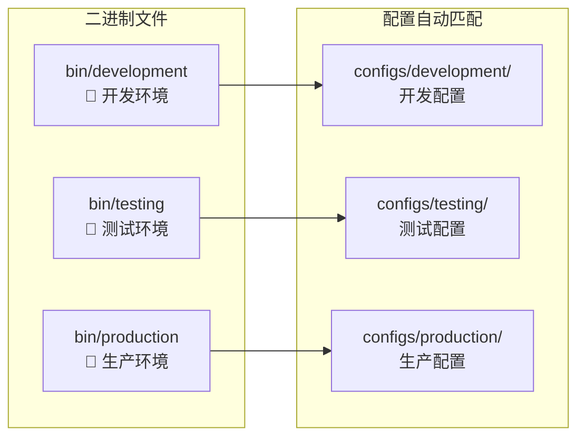

# WES 可执行文件目录

【目录定位】
　　本目录采用环境专用二进制架构，每个环境对应独立的可执行文件，实现编译时环境绑定、零配置启动。通过将环境信息硬编码到不同的二进制文件中，彻底消除环境参数混乱，确保部署安全和使用简便。

【设计原则】
- **环境专用编译**：每个环境独立编译，配置硬编码绑定
- **零配置启动**：执行文件自动匹配对应环境配置
- **部署安全**：编译时确定环境，运行时无法误用
- **用户友好**：一键启动，无需记忆复杂参数
- **配置匹配**：完美对应 configs/ 目录结构

【核心职责】
1. **环境隔离**：不同环境的二进制文件完全独立
2. **配置绑定**：自动加载对应环境的配置文件
3. **部署简化**：只需拷贝对应环境的单个文件
4. **服务模式**：支持 API-only 和 CLI-only 模式选择
5. **用户分层**：面向服务器用户和个人用户的不同需求

## 🎯 **环境专用架构设计**



## 📁 **目录结构**

```
bin/
├── 🔧 development           # 开发环境区块链节点
├── 🧪 testing               # 测试环境区块链节点
├── 🚀 production            # 生产环境区块链节点
└── 📚 README.md             # 本说明文档
```

## 🎯 **可执行文件说明**

### **🔧 development** - 开发环境区块链节点

**环境特性**：
- 🎯 **目标用户**: 开发者、个人用户、本地测试
- 🗂️ **配置绑定**: 自动加载 `configs/development/single/config.json`
- ✨ **服务特点**: 完整功能，CLI交互界面 + API服务
- 🔧 **调试友好**: 详细日志输出，开发者工具集成

**启动方式**：
```bash
# 全功能启动（推荐个人用户）
./bin/development                           # CLI交互 + API服务

# 仅API服务（适合脚本对接）
./bin/development --api-only                # 后台运行，仅提供API

# 仅CLI交互（适合纯本地操作）
./bin/development --cli-only                # 本地钱包管理
```

**适用场景**：
- ✅ 个人钱包管理（本地加密存储私钥）
- ✅ 开发调试和功能测试
- ✅ 学习区块链操作
- ✅ 本地转账和余额查询

### **🧪 testing** - 测试环境区块链节点

**环境特性**：
- 🎯 **目标用户**: 测试工程师、CI/CD流水线
- 🗂️ **配置绑定**: 自动加载 `configs/testing/config.json`
- ✨ **服务特点**: 稳定配置，测试优化参数
- 🧪 **测试友好**: 快速启动，一致性保证

**启动方式**：
```bash
# 测试环境启动
./bin/testing                               # 默认完整功能

# 测试API服务
./bin/testing --api-only                    # 适合集成测试
```

**适用场景**：
- ✅ 集成测试和回归测试
- ✅ CI/CD流水线自动化
- ✅ 性能基准测试
- ✅ 功能验证

### **🚀 production** - 生产环境区块链节点

**环境特性**：
- 🎯 **目标用户**: 运维工程师、企业部署
- 🗂️ **配置绑定**: 自动加载 `configs/production/config.json`
- ✨ **服务特点**: 高性能优化，生产级稳定性
- 🚀 **部署优化**: 资源优化，监控集成

**启动方式**：
```bash
# 生产环境启动
./bin/production                            # 完整功能部署

# 生产API服务（常用）
./bin/production --api-only                 # 服务器后台运行
```

**适用场景**：
- ✅ 正式环境部署
- ✅ 企业级服务
- ✅ 高并发API服务
- ✅ 7x24小时运行

## 🤝 **WES双层用户接口设计**

所有环境的二进制文件都支持WES的双层用户接口架构，满足不同用户群体的需求：

### **🎯 用户类型与使用模式**

| **用户类型** | **使用模式** | **推荐启动方式** | **核心特点** |
|-------------|-------------|-----------------|-------------|
| **个人用户** | CLI层 | `./bin/development --cli-only` | 本地钱包管理、交互式操作 |
| **企业后端** | API层 | `./bin/production --api-only` | 无状态服务、私钥外部管理 |
| **开发调试** | 双层模式 | `./bin/development` | API + CLI 同时启动 |

### **🔑 私钥管理对比**

**API层私钥管理**（面向企业/开发者）：
```bash
# 企业自行管理私钥，通过API传入
curl -X POST "http://localhost:8080/api/v1/transactions/transfer" \
  -H "Content-Type: application/json" \
  -d '{"sender_private_key": "企业KMS提供", "to_address": "...", "amount": "100.0"}'

# 适合场景：
# ✓ 企业KMS集成    ✓ 第三方托管服务    ✓ 临时私钥传入    ✓ 批量处理
```

**CLI层私钥管理**（面向个人用户）：
```bash
# 本地钱包管理，加密存储私钥
./bin/development --cli-only
> 钱包管理 → 创建钱包 → 设置密码 → 自动加密存储

# 适合场景：  
# ✓ 个人钱包管理    ✓ 密码保护存储    ✓ 本地安全操作    ✓ 学习使用
```

### **🚀 典型使用示例**

**个人用户场景**：
```bash
# 开发环境 - 个人钱包管理
./bin/development --cli-only
> 创建钱包 → 转账操作 → 余额查询

# 或使用全功能模式（CLI + API）
./bin/development
```

**企业部署场景**：
```bash
# 生产环境 - 仅API服务
./bin/production --api-only

# 企业应用通过HTTP调用
curl -X POST "http://prod-server:8080/api/v1/transactions/transfer" ...
```

**开发测试场景**：
```bash
# 测试环境 - 快速验证
./bin/testing --api-only

# 开发环境 - 完整调试
./bin/development
```

## 🏗️ **环境专用构建流程**

### **自动构建（推荐）**
```bash
# 使用环境专用构建脚本
./scripts/build/build-all-envs.sh

# 构建输出
# ✅ bin/development     - 开发环境二进制
# ✅ bin/testing         - 测试环境二进制  
# ✅ bin/production      - 生产环境二进制
```

### **单独构建**
```bash
# 构建开发环境
go build -o bin/development ./cmd/development
go build -ldflags "-X main.Environment=development" ./cmd/development

# 构建测试环境
go build -o bin/testing ./cmd/testing
go build -ldflags "-X main.Environment=testing" ./cmd/testing

# 构建生产环境
go build -o bin/production ./cmd/production  
go build -ldflags "-X main.Environment=production" ./cmd/production
```

### **构建特性**
- **环境硬编码**: 编译时绑定环境信息，运行时无需参数
- **配置路径嵌入**: 自动匹配对应环境的配置文件路径
- **版本信息嵌入**: Git版本、构建时间、Go版本信息
- **优化构建**: 不同环境使用相应的优化参数
- **权限自动设置**: 构建后自动设置可执行权限(755)

## 🚀 **部署指南**

### **🔧 开发环境部署**
```bash
# 本地开发使用
./bin/development                    # 完整功能启动

# 或者源码调试
go run ./cmd/development
```

### **🧪 测试环境部署**
```bash
# CI/CD流水线部署
scp bin/testing user@test-server:/opt/weisyn/
ssh user@test-server "./opt/weisyn/testing --api-only"

# 自动化测试
./bin/testing --api-only &          # 后台启动
test_pid=$!
# 运行测试用例...
kill $test_pid                      # 测试完成后停止
```

### **🚀 生产环境部署**
```bash
# 生产服务器部署
scp bin/production user@prod-server:/usr/local/bin/weisyn
ssh user@prod-server "weisyn --api-only"

# 系统服务部署
sudo cp bin/production /usr/local/bin/weisyn-production
sudo systemctl enable weisyn-production
sudo systemctl start weisyn-production
```

## 🔧 **版本与环境信息**

每个环境专用二进制文件都包含：
- **环境标识**: development/testing/production
- **配置路径**: 硬编码的配置文件路径
- **版本信息**: Git提交哈希和构建时间
- **Go版本**: 编译使用的Go运行时版本

查看版本信息：
```bash
./bin/development --version
./bin/testing --version
./bin/production --version
```

## 📊 **文件管理**

### **Git版本控制**
- ✅ **排除二进制文件**: bin/ 目录在 .gitignore 中
- ✅ **源码版本管理**: 仅管理 cmd/ 目录下的源码
- ✅ **环境配置管理**: configs/ 目录纳入版本控制
- ✅ **构建脚本管理**: scripts/build/ 纳入版本控制

### **环境文件清理**
```bash
# 清理所有环境的二进制文件
rm -f bin/development bin/testing bin/production

# 清理特定环境
rm -f bin/production                 # 仅清理生产环境

# 重新构建
./scripts/build/build-all-envs.sh
```

## ⚠️ **注意事项**

### **环境安全**
- ✅ **编译时绑定**: 运行时无法切换环境，避免误用
- ✅ **配置隔离**: 不同环境的配置完全独立
- ✅ **部署简化**: 每个环境只需要对应的单个二进制文件
- ✅ **版本追踪**: 每个文件包含完整的构建信息

### **部署要求**
1. **系统兼容性**: 确保目标系统与编译环境兼容
2. **权限设置**: 二进制文件需要可执行权限
3. **配置文件**: 确保对应的configs/目录存在
4. **数据目录**: 程序会自动创建必要的数据目录

### **常见问题**
```bash
# 权限问题
chmod +x bin/*

# 配置文件不存在
ls -la configs/production/config.json

# 查看详细信息
./bin/production --version
./bin/production --help
```

---

> 💡 **架构优势**: 环境专用二进制架构彻底消除了环境参数混乱，实现编译时环境绑定、零配置启动，确保部署安全性和使用便利性。

> 🔄 **维护建议**: 每次发布新版本时，同时构建所有环境的二进制文件，确保环境配置与代码版本的一致性。

---

## 🚀 **配置嵌入技术 - 真正的零依赖部署**

### **✅ 技术实现**

WES采用了Go 1.16+的`//go:embed`指令，将所有配置文件在编译时完全嵌入到二进制文件中：

```bash
# 验证真正的零依赖部署
$ rm -rf configs/                    # 删除所有外部配置文件
$ ./bin/production --version         # 仍可正常运行
WES 生产环境节点 v1.0.0
环境: production
配置: configs/production/config.json (嵌入式)  # ← 显示嵌入式标识
构建时间: 2025-01-26
Go版本: 1.21+

$ ./bin/production --api-only        # 完全无外部依赖启动
🚀 正在启动WES生产环境节点...
📁 配置: configs/production/config.json (嵌入式配置)
✅ API服务启动成功！
```

### **🔥 部署优势**

| **特性** | **传统方式** | **WES嵌入式** |
|---------|-------------|---------------|
| **部署文件数量** | 可执行文件 + 配置文件目录 | **仅需单一可执行文件** |
| **配置管理** | 需要维护外部配置文件 | **配置编译到二进制中** |
| **启动依赖** | 必须确保配置文件路径正确 | **无任何外部依赖** |
| **容器镜像** | FROM ubuntu/alpine + 文件复制 | **FROM scratch 最小镜像** |
| **配置安全** | 配置文件可能被意外修改 | **配置不可被外部篡改** |
| **版本一致性** | 配置与代码可能不匹配 | **配置与代码版本绑定** |

### **🛠 技术细节**

```go
// internal/config/embedded.go
package config

import _ "embed"

//go:embed development.json    // 开发环境配置嵌入
var developmentConfig []byte

//go:embed testing.json        // 测试环境配置嵌入
var testingConfig []byte

//go:embed production.json     // 生产环境配置嵌入
var productionConfig []byte
```

**运行时处理流程**：
1. **编译时**：配置内容嵌入到二进制文件的数据段
2. **启动时**：从嵌入数据创建临时配置文件
3. **运行中**：应用正常使用临时配置文件
4. **结束时**：自动清理临时文件，无残留

### **💻 容器化部署示例**

```dockerfile
# 极简容器镜像 - 仅8MB左右
FROM scratch
COPY bin/production /weisyn
EXPOSE 8080
CMD ["/weisyn", "--api-only"]
```

```bash
# 构建和部署
$ docker build -t weisyn:latest .
$ docker run -d -p 8080:8080 weisyn:latest    # 无需挂载任何配置

# 验证运行
$ curl http://localhost:8080/health
{"status": "ok", "config": "embedded"}
```
