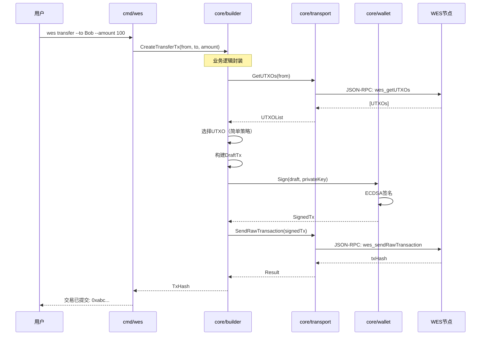
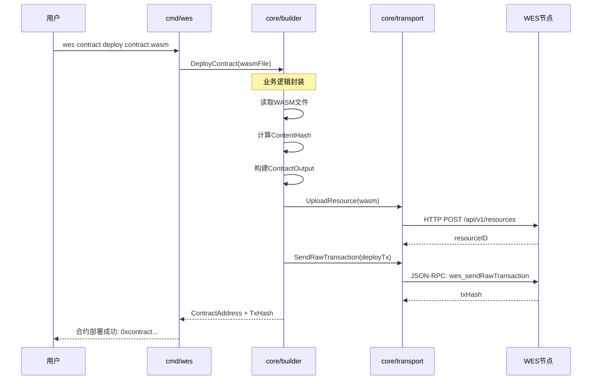
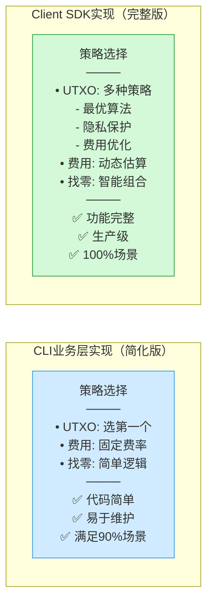

# client/core - CLI 核心业务层

**定位**: CLI 业务逻辑层（L2），提供基础业务语义的封装

**架构层次**: 介于应用层(`cmd/wes`)和TX核心层(`internal/core/tx`)之间

---

## 🎯 设计理念

### 架构定位

```
L4: 应用层 (cmd/wes)              ← CLI命令定义
    ↓
    调用
    ↓
L2: CLI业务层 (client/core) ⭐     ← 本目录
    ↓                              • 基础业务封装
    ↓                              • 简化实现
    ↓                              • 90%场景
    调用 API
    ↓
L1: TX核心层 (internal/core/tx)   ← 纯技术实现
    ↓
L0: 节点核心                       ← 区块链运行时
```

### 核心原则

| 原则 | 说明 | 示例 |
|------|------|------|
| ✅ **包含基础业务逻辑** | 封装常见的业务操作 | 简单转账、合约部署、基础查询 |
| ✅ **允许与SDK重复** | 与Client SDK功能可重复 | 转账功能CLI和SDK都实现，但CLI更简单 |
| ❌ **不追求完整语义** | 不实现所有高级功能 | 不实现批量转账、复杂策略、高级编排 |
| 🎯 **满足90%场景** | 覆盖日常使用需求 | 基础转账、部署、调用即可 |
| 📝 **代码简单直接** | 易读易维护 | 使用最简单的算法，不过度优化 |

---

## 📋 职责边界

### ✅ 应该做的（核心业务）

#### 1. 转账业务（✅ 已实现）

**1.1 简单转账** (`client/core/transfer/service.go`)
- **功能**: 1对1转账，基础UTXO选择，简单找零逻辑
- **实现**: 
  - 余额检查：查询UTXO列表并验证余额充足
  - UTXO选择：FirstFit策略（选择第一个满足金额的UTXO）
  - 找零计算：精确计算找零金额（基于big.Int）
  - 费用估算：基于交易大小的简单估算（10 sat/byte）
  - 完整流程：Draft → Seal → Sign → Broadcast
- **代码量**: ~300行
- **对比SDK**: SDK实现多种UTXO选择策略（隐私/费用/确认速度优化）
- **核心方法**: `TransferService.ExecuteTransfer()`

**1.2 批量转账** (`client/core/transfer/batch_service.go`)
- **功能**: 1对多转账，支持多个收款人
- **实现**:
  - 批量验证：验证所有收款人参数，过滤无效项
  - UTXO选择：Greedy策略（最小化输入数量）
  - 找零计算：统一计算总金额和找零
  - 错误处理：记录失败项，不阻断整体流程
- **代码量**: ~350行
- **核心方法**: `BatchTransferService.ExecuteBatchTransfer()`

**1.3 时间锁转账** (`client/core/transfer/timelock_service.go`)
- **功能**: 支持时间锁的转账（接收方在指定时间后才能花费）
- **实现**:
  - 时间验证：确保解锁时间在未来
  - 锁定脚本：使用OP_CHECKLOCKTIMEVERIFY生成时间锁脚本
  - 交易参数：设置LockTime字段
  - 完整支持：Draft → Seal → Sign → Broadcast
- **代码量**: ~320行
- **核心方法**: `TimeLockTransferService.ExecuteTimeLockTransfer()`

**示例流程**：
```
用户输入：wes transfer --to Bob --amount 100

CLI业务层处理：
1. 查询发送方UTXO列表（通过transport.Client.GetUTXOs）
2. UTXO选择：FirstFitSelector.Select()
3. 构建Draft：builder.TransferBuilder.Build()
4. Seal：draft.Seal() → ComposedTx
5. 添加证明：composed.WithProofs() → ProvenTx
6. 签名：wallet.Signer.SignData() + proven.Sign() → SignedTx
7. 广播：transport.Client.SendRawTransaction()
```

#### 2. 挖矿业务（✅ 已实现）

**挖矿控制服务** (`client/core/mining/service.go`)
- **功能**: 启动/停止挖矿，查询挖矿状态和算力
- **实现**:
  - 状态查询：`GetMiningStatus()` - 查询是否在挖矿、算力、矿工地址、已挖区块数
  - 启动挖矿：`StartMining()` - 指定矿工地址和线程数启动挖矿
  - 停止挖矿：`StopMining()` - 停止挖矿并返回统计信息
  - 算力查询：`GetHashRate()` - 查询当前算力
  - 奖励查询：`GetPendingRewards()` - 查询待领取奖励
- **代码量**: ~250行
- **CLI命令**: `wes mining status/start/stop/hashrate/rewards`
- **对比SDK**: SDK可能提供矿池管理、算力优化等高级功能

**示例流程**：
```
用户输入：wes mining start --miner wes1abc... --threads 4

CLI业务层处理：
1. 验证矿工地址格式
2. 检查当前挖矿状态
3. 调用节点API启动挖矿
4. 返回启动结果
```

#### 3. 合约业务（✅ 已实现）

**3.1 合约部署** (`client/core/contract/service.go`)
- **功能**: 上传WASM文件，部署智能合约到链上
- **实现**:
  - WASM验证：验证文件magic number（\0asm）
  - 哈希计算：SHA256计算文件哈希作为合约地址
  - 费用估算：基于文件大小（基础费用 + 存储费用）
  - 交易构建：使用ContractBuilder构建部署交易
  - 完整流程：Draft → Seal → Sign → Broadcast
- **代码量**: ~300行
- **核心方法**: `ContractService.DeployContract()`

**3.2 合约调用** (`client/core/contract/service.go`)
- **功能**: 调用已部署的智能合约方法
- **实现**:
  - 参数编码：简单的参数序列化
  - 金额支持：支持携带转账金额调用合约
  - 费用估算：基于参数数量
  - 交易构建：使用ContractBuilder构建调用交易
- **代码量**: ~250行
- **核心方法**: `ContractService.CallContract()`

**3.3 合约查询** (`client/core/contract/service.go`)
- **功能**: 只读查询合约状态（不上链）
- **实现**: 调用节点的contract_query RPC方法
- **代码量**: ~50行
- **核心方法**: `ContractService.QueryContract()`

**对比SDK**: SDK提供完整生命周期管理（版本、升级、权限、事件监听、批量调用）

#### 4. 资源业务（✅ 已实现）

**4.1 资源部署** (`client/core/resource/service.go`)
- **功能**: 部署静态资源文件到链上（如图片、文档等）
- **实现**:
  - 文件读取：读取任意类型的文件
  - 哈希计算：SHA256计算文件哈希作为资源地址
  - 费用估算：基于文件大小（基础费用 + 存储费用）
  - 交易构建：使用ResourceBuilder构建部署交易
  - 完整流程：Draft → Seal → Sign → Broadcast
- **代码量**: ~250行
- **核心方法**: `ResourceService.DeployResource()`

**4.2 资源获取** (`client/core/resource/service.go`)
- **功能**: 从链上查询和下载资源文件
- **实现**: 调用节点的resource_get RPC方法
- **代码量**: ~50行
- **核心方法**: `ResourceService.FetchResource()`

**对比SDK**: SDK可能提供缓存、CDN集成、版本管理等高级功能

#### 5. 基础查询（✅ 已实现）
- **功能**: 封装API调用，格式化输出
- **实现**: 直接调用JSON-RPC，格式化为表格/JSON
- **代码量**: ~50行/接口
- **实现位置**: `client/core/transport/interface.go`
- **对比SDK**: SDK提供缓存、重试、批量查询优化

### ❌ 不应该做的（交给SDK）

| 功能类型 | 为什么不实现 | 交给谁 |
|---------|------------|-------|
| **批量转账** | 复杂UTXO组合优化，代码量大 | Client SDK |
| **质押/治理** | 业务逻辑复杂，状态管理困难 | Client SDK |
| **复杂合约编排** | 需要事件监听、状态订阅 | Client SDK + DApp |
| **DeFi操作** | 高级业务语义，超出CLI范围 | DApp |

---

## 📁 目录结构

```
client/core/
├── builder/              # 交易构建器（Draft/Composed/Signed状态机）
│   ├── builder.go        # 基础交易构建器
│   ├── types.go          # 交易状态类型定义（DraftTx/ComposedTx/ProvenTx/SignedTx）
│   ├── amount.go         # ✅ 金额类型（基于big.Int，精确计算）
│   ├── amount_test.go    # ✅ 金额类型测试
│   ├── utxo_selector.go  # ✅ UTXO选择策略（FirstFit/Greedy）
│   ├── transfer_builder.go  # ✅ 转账Draft构建器
│   ├── contract_builder.go  # ✅ 合约Draft构建器
│   └── resource_builder.go  # ✅ 资源Draft构建器
│
├── transfer/             # ✅ 转账业务服务
│   ├── service.go        # ✅ 简单转账服务（ExecuteTransfer）
│   ├── batch_service.go  # ✅ 批量转账服务（ExecuteBatchTransfer）
│   └── timelock_service.go  # ✅ 时间锁转账服务（ExecuteTimeLockTransfer）
│
├── mining/               # ✅ 挖矿业务服务
│   └── service.go        # ✅ 挖矿控制服务（StartMining/StopMining/GetStatus）
│
├── contract/             # ✅ 合约业务服务
│   └── service.go        # ✅ 合约部署/调用服务（DeployContract/CallContract/QueryContract）
│
├── resource/             # ✅ 资源业务服务
│   └── service.go        # ✅ 资源部署/获取服务（DeployResource/FetchResource）
│
├── transport/            # 传输层（API客户端封装）
│   ├── factory.go        # 客户端工厂
│   ├── interface.go      # 统一接口
│   ├── jsonrpc_client.go # JSON-RPC实现
│   ├── rest_client.go    # REST实现
│   ├── ws_client.go      # WebSocket实现
│   └── README.md
│
├── wallet/               # 本地签名
│   ├── account_manager.go # 账户管理
│   ├── keystore.go       # Keystore加密存储
│   └── signer.go         # 签名接口
│
├── config/               # 配置管理
│   └── profile.go        # Profile配置
│
└── output/               # 格式化输出
    └── formatter.go      # JSON/表格格式化
```

---

## 🔄 工作流程示例

### 转账流程



### 合约部署流程



---

## 🆚 CLI业务层 vs Client SDK

### 功能对比

| 功能 | CLI业务层 (core/) | Client SDK | 代码量对比 |
|------|------------------|------------|-----------|
| **简单转账** | ✅ 基础实现 | ✅ 完整实现 | 200行 vs 1000行 |
| **批量转账** | ❌ 不实现 | ✅ 完整实现 | 0行 vs 1500行 |
| **合约部署** | ✅ 基础实现 | ✅ 完整实现 | 150行 vs 800行 |
| **合约调用** | ✅ 简单调用 | ✅ 完整编排 | 100行 vs 600行 |
| **查询接口** | ✅ 基础封装 | ✅ 完整优化 | 50行 vs 200行 |
| **质押/治理** | ❌ 不实现 | ✅ 完整实现 | 0行 vs 2000行 |
| **事件订阅** | ❌ 不实现 | ✅ 完整实现 | 0行 vs 500行 |

### 实现策略对比



---

## 💡 设计决策

### 为什么CLI业务层需要包含业务逻辑？

**背景**: WES采用EUTXO模型，业务逻辑复杂度高于传统区块链

| 模型 | 复杂度 | CLI能否只调用API |
|------|--------|-----------------|
| **账户模型** (Ethereum) | 低 | ✅ 可以<br/>转账=修改余额 |
| **UTXO** (Bitcoin) | 中 | 🟡 勉强<br/>需要UTXO选择 |
| **EUTXO** (WES) | 高 | ❌ 不可以<br/>需要业务封装 |

**WES EUTXO复杂度**：
- 3种输出类型（Transfer/Contract/Coinbase）
- 7种锁定条件（Pubkey/Hash/Multi/Time/Script等）
- 复杂的UTXO选择和找零逻辑
- 多种业务场景（转账/合约/资源）

**结论**: CLI需要`client/core`业务层来封装这些复杂度

### 为什么允许与SDK重复？

**合理性**:
1. **不同受众**: CLI面向命令行用户，SDK面向应用开发者
2. **不同场景**: CLI满足90%日常需求，SDK满足100%需求
3. **不同实现**: CLI简化实现，SDK完整实现
4. **独立演进**: CLI和SDK可以独立版本迭代

**参考案例**: Solana CLI和Solana SDK也存在重复，但这是合理的设计

---

## 📝 实现指南

### 添加新的业务逻辑

**检查清单**：
1. ✅ 是否属于"基础业务"？（简单转账、合约部署等）
2. ✅ 是否覆盖90%的CLI使用场景？
3. ✅ 实现是否足够简单（代码量<300行）？
4. ❌ 是否需要复杂策略优化？（如果是，交给SDK）
5. ❌ 是否需要状态订阅/事件监听？（如果是，交给SDK）

**示例**：

```go
// ✅ 推荐：简单直接的实现
func (b *Builder) CreateSimpleTransfer(from, to string, amount uint64) (*DraftTx, error) {
    // 1. 查询UTXO
    utxos, err := b.transport.GetUTXOs(from)
    if err != nil {
        return nil, err
    }
    
    // 2. 简单选择：选第一个足够的UTXO
    var selectedUTXO *UTXO
    for _, utxo := range utxos {
        if utxo.Amount >= amount {
            selectedUTXO = &utxo
            break
        }
    }
    
    if selectedUTXO == nil {
        return nil, errors.New("insufficient balance")
    }
    
    // 3. 构建交易
    draft := NewDraftTx()
    draft.AddInput(selectedUTXO)
    draft.AddOutput(to, amount)
    
    // 4. 添加找零（如果有）
    if selectedUTXO.Amount > amount {
        change := selectedUTXO.Amount - amount
        draft.AddOutput(from, change)
    }
    
    return draft, nil
}

// ❌ 不推荐：复杂的优化（交给SDK）
func (b *Builder) CreateOptimizedTransfer(...) {
    // 多种UTXO选择策略
    // 隐私保护算法
    // Gas优化
    // ... 复杂逻辑
}
```

---

## 🔗 相关文档

- [CLI架构规范](../../_docs/architecture/CLI_ARCHITECTURE_SPECIFICATION.md) - 完整的CLI架构设计
- [pkg/interfaces/README.md](../../pkg/interfaces/README.md) - 系统全局视图
- [client/README.md](../README.md) - CLI客户端支持库总览

---

## 📋 变更记录

| 日期 | 变更内容 |
|------|---------|
| 2025-10-27 | 创建文档，明确CLI核心业务层的设计理念和职责边界 |

---

**最后更新**: 2025-10-27  
**维护者**: WES CLI 开发团队

