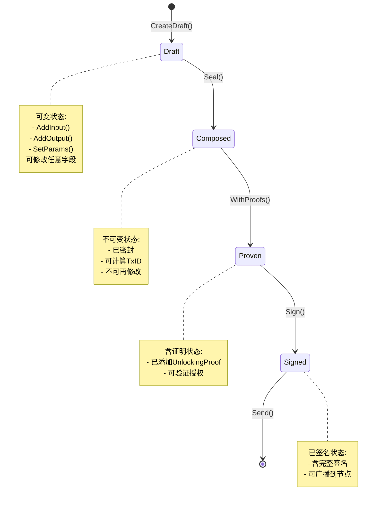

# CLI 交易构建器 (internal/cli/builder)

> **📌 模块定位**: Type-State模式的交易构建器,编译期防止非法交易

---

## 📍 核心定位

本模块实现**Type-State模式的交易构建器**,通过类型系统强制交易构建的正确顺序,在编译期防止非法状态。

**解决什么问题**:
- ✅ **类型安全**: 编译期防止非法交易状态转换
- ✅ **链式构建**: 流畅的API设计,易于使用
- ✅ **离线友好**: 支持完全离线构建和签名
- ✅ **UTXO管理**: 自动选择UTXO和计算找零

**不解决什么问题**(边界):
- ❌ 不处理私钥管理(由`wallet/`模块负责)
- ❌ 不直接与节点通信(由`transport/`模块负责)
- ❌ 不实现共识逻辑(由节点核心负责)

---

## 🏗️ Type-State 状态机

### 状态转换图



### 类型系统强制

```go
// ✅ 正确:类型系统强制顺序
builder := NewTxBuilder(client)
draft := builder.CreateDraft()
draft.AddInput(input).AddOutput(output)

composed, _ := draft.Seal()                    // DraftTx → ComposedTx
proven, _ := composed.WithProofs(proofs)       // ComposedTx → ProvenTx  
signed, _ := proven.Sign(signer, signers)      // ProvenTx → SignedTx
result, _ := signed.Send(client)               // SignedTx → SendTxResult

// ❌ 错误:编译失败
client.SendRawTransaction(draft)  // 类型错误:需要SignedTx
```

**编译期保证**:
- 未密封的草稿不能计算TxID
- 未添加证明的交易不能签名
- 未签名的交易不能发送

---

## 📁 模块结构

```
internal/cli/builder/
├── types.go      # Type-State类型定义
├── builder.go    # 默认构建器实现
└── README.md     # 本文档
```

---

## 🔑 核心类型

### 1. TxBuilder 接口

```go
type TxBuilder interface {
    // CreateDraft 创建交易草稿
    CreateDraft() *DraftTx
    
    // LoadDraft 从文件加载草稿
    LoadDraft(filePath string) (*DraftTx, error)
}
```

### 2. Type-State 交易类型

| 类型 | 可变性 | 方法 | 说明 |
|-----|-------|------|------|
| **DraftTx** | 可变 | `AddInput`, `AddOutput`, `SetParams`, `Seal` | 草稿状态,可修改 |
| **ComposedTx** | 不可变 | `TxID`, `WithProofs`, `Save` | 已密封,不可修改 |
| **ProvenTx** | 不可变 | `TxID`, `Sign` | 含解锁证明 |
| **SignedTx** | 不可变 | `Raw`, `Hash`, `Send`, `Save` | 含签名,可广播 |

### 3. Input/Output 类型

```go
// Input 交易输入
type Input struct {
    TxHash      string // UTXO引用
    OutputIndex uint32
    Amount      string
    Address     string
    LockScript  string
}

// Output 交易输出
type Output struct {
    Address    string
    Amount     string
    Type       OutputType // transfer/contract/resource/state
    LockScript string
    Data       map[string]interface{} // 扩展数据
}
```

---

## 🚀 使用示例

### 示例1: 简单转账

```go
package main

import (
    "context"
    "github.com/weisyn/v1/client/core/builder"
    "github.com/weisyn/v1/client/core/transport"
)

func main() {
    client := transport.NewJSONRPCClient("http://localhost:28680", 0)
    defer client.Close()
    
    // 1. 创建转账构建器
    tb := builder.NewTransferBuilder(client)
    
    // 2. 构建交易草稿(自动选择UTXO)
    draft, err := tb.Build(context.Background(), 
        "0xalice...",  // from
        "0xbob...",    // to
        "10.5",        // amount
    )
    if err != nil {
        panic(err)
    }
    
    // 3. 密封交易
    composed, err := draft.Seal()
    if err != nil {
        panic(err)
    }
    
    fmt.Println("TxID:", composed.TxID())
    
    // 4. 添加证明(简化,实际需要调用wallet)
    proofs := []builder.UnlockingProof{
        {InputIndex: 0, Type: "signature", Data: []byte("...")},
    }
    proven, _ := composed.WithProofs(proofs)
    
    // 5. 签名交易
    signers := map[string]string{"0xalice...": "password"}
    signed, _ := proven.Sign(client, signers)
    
    // 6. 发送交易
    result, _ := signed.Send(client)
    fmt.Println("TxHash:", result.TxHash)
}
```

### 示例2: 离线构建

```go
// === 在线节点:准备离线数据 ===
draft, _ := builder.NewTransferBuilder(client).Build(ctx, from, to, amount)
draft.Save("draft.json") // 导出草稿

// === 离线机器:签名 ===
offlineBuilder := builder.NewTxBuilder(nil) // 无需client
draft, _ := offlineBuilder.LoadDraft("draft.json")

composed, _ := draft.Seal()
proven, _ := composed.WithProofs(proofs)
signed, _ := proven.Sign(nil, signers)  // 离线签名
signed.Save("signed.json")              // 导出签名交易

// === 在线节点:广播 ===
// 方法1: 通过CLI
// $ wes tx send --file signed.json

// 方法2: 通过代码
signedData, _ := os.ReadFile("signed.json")
var signedTxFile struct {
    RawHex string `json:"raw_hex"`
}
json.Unmarshal(signedData, &signedTxFile)
result, _ := client.SendRawTransaction(ctx, signedTxFile.RawHex)
```

### 示例3: 合约部署

```go
draft := builder.NewTxBuilder(client).CreateDraft()

// 添加输入(费用来源)
draft.AddInput(feeInput)

// 添加合约部署输出
draft.AddOutput(builder.Output{
    Address: "0x0000...0000", // 合约创建地址
    Amount:  "0",
    Type:    builder.OutputTypeContract,
    Data: map[string]interface{}{
        "wasm_code": wasmHex,
        "init_args": initArgs,
    },
})

// 后续流程与转账相同
composed, _ := draft.Seal()
// ...
```

---

## 🔍 UTXO选择策略

### 贪心算法(默认)

```
1. 按金额从大到小排序
2. 依次选择UTXO直到满足目标金额
3. 计算找零: change = total - spent - fee
```

**适用场景**: 大部分常规转账

### 最佳匹配算法(未来)

```
1. 寻找单个UTXO恰好满足目标金额
2. 若无,使用贪心算法
```

**优势**: 最小化找零,减少UTXO碎片化

---

## ⚡ 性能特性

| 特性 | 实现 | 性能 |
|-----|------|------|
| **UTXO查询** | 通过transport层 | 取决于网络延迟 |
| **交易序列化** | JSON编码 | ~1ms |
| **TxID计算** | SHA-256哈希 | <1ms |
| **离线构建** | 无网络调用 | 瞬时 |

---

## 🔒 安全特性

### 1. 类型安全

- **编译期检查**: 防止非法状态转换
- **不可变性**: Composed/Proven/Signed状态不可修改
- **强制顺序**: Seal → WithProofs → Sign → Send

### 2. 金额验证

```go
func (d *DraftTx) validateBalance() error {
    totalInput := sumInputs(d.inputs)
    totalOutput := sumOutputs(d.outputs)
    fee := estimateFee(d)
    
    if totalInput < totalOutput + fee {
        return ErrInsufficientFunds
    }
    return nil
}
```

### 3. 离线安全

- 私钥永不触碰在线环境
- 草稿在在线环境准备
- 签名在离线环境完成
- 已签名交易在在线环境广播

---

## ⚠️ 已知限制

| 限制 | 影响 | 规避方法 |
|-----|------|---------|
| 金额使用string | 精度问题 | Phase 2使用big.Int |
| UTXO选择简单 | 可能选择过多UTXO | Phase 2实现最佳匹配 |
| 不支持RBF | 无法费用加速 | Phase 3支持 |
| 不支持CPFP | 无法子交易加速 | Phase 3支持 |

---

## 🎯 设计原则

| 原则 | 说明 | 体现 |
|-----|------|------|
| **Type-State** | 类型系统防止非法状态 | Draft→Composed→Proven→Signed |
| **不可变性** | 密封后不可修改 | Composed/Proven/Signed是只读的 |
| **链式调用** | 流畅的API | `draft.AddInput(...).AddOutput(...)` |
| **离线优先** | 支持冷钱包 | LoadDraft/SaveSigned |

---

## 📚 相关文档

- **CLI架构**: [`_docs/architecture/CLI_ARCHITECTURE_SPECIFICATION.md`](../../../_docs/architecture/CLI_ARCHITECTURE_SPECIFICATION.md)
- **TX状态机**: [`_docs/architecture/TX_STATE_MACHINE_ARCHITECTURE.md`](../../../_docs/architecture/TX_STATE_MACHINE_ARCHITECTURE.md)
- **传输层**: [`client/core/transport/README.md`](../transport/README.md)
- **密钥管理**: [`client/core/wallet/`](../wallet/)

---

**文档版本**: v1.0.0  
**最后更新**: 2025-10-24  
**维护者**: WES CLI团队

