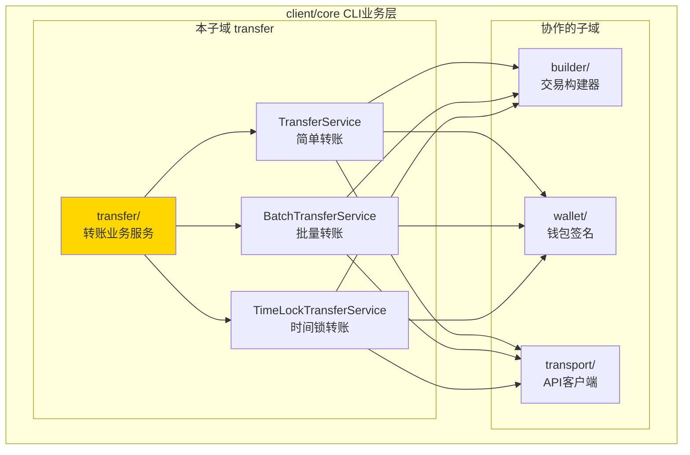
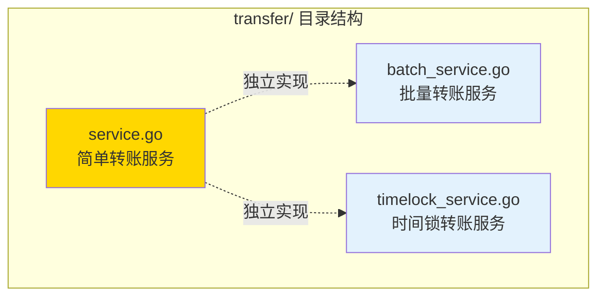

# transfer - 转账业务服务

---

## 📌 版本信息

- **版本**：1.0
- **状态**：stable
- **最后更新**：2025-11-01
- **所有者**：CLI 开发组
- **适用范围**：CLI 转账业务功能

---

## 🎯 子域定位

**路径**：`client/core/transfer/`

**所属组件**：`client/core`（CLI 核心业务层）

**核心职责**：提供完整的转账业务逻辑封装，包括简单转账、批量转账和时间锁转账

**在组件中的角色**：
- 转账业务的核心实现层
- 封装 UTXO 选择、找零计算、费用估算等业务逻辑
- 提供完整的转账流程：Draft → Seal → Sign → Broadcast

---

## 🏗️ 架构设计

### 在组件中的位置



**位置说明**：

| 关系类型 | 目标 | 关系说明 |
|---------|------|---------|
| **协作** | builder/ | 使用 TransferBuilder 构建转账交易草稿 |
| **协作** | wallet/ | 使用 Signer 对交易进行签名 |
| **协作** | transport/ | 通过 Client 调用节点 API（查询 UTXO、广播交易） |

---

### 内部组织



---

## 📁 目录结构

```
client/core/transfer/
├── README.md                    # 本文档
├── service.go                   # 简单转账服务（TransferService）
├── batch_service.go             # 批量转账服务（BatchTransferService）
└── timelock_service.go          # 时间锁转账服务（TimeLockTransferService)
```

---

## 🔧 核心实现

### 1. 简单转账服务：`service.go`

**核心类型**：`TransferService`

**职责**：提供 1对1 转账的完整业务逻辑，包括余额检查、UTXO 选择、找零计算、费用估算等

**关键字段**：

```go
type TransferService struct {
    builder        *builder.TransferBuilder  // 交易构建器
    transport      transport.Client          // API 客户端
    signer         *wallet.Signer            // 签名器
    addressManager *address.AddressService   // 地址管理器
}
```

**关键方法**：

| 方法名 | 职责 | 可见性 | 备注 |
|-------|------|-------|-----|
| `NewTransferService()` | 创建转账服务 | Public | 依赖注入 |
| `ExecuteTransfer()` | 执行转账流程 | Public | 核心方法，完整流程：Draft → Seal → Sign → Broadcast |
| `validateTransferRequest()` | 验证转账请求 | Private | 参数验证 |
| `checkBalance()` | 余额检查 | Private | 查询 UTXO 并验证余额充足 |

**转账流程**：

```
1. 参数验证 - 验证地址格式、金额格式
2. 余额检查 - 查询发送方 UTXO 列表，验证余额充足
3. 构建 Draft - 使用 TransferBuilder 构建交易草稿
4. Seal - 密封交易，计算 TxID
5. Sign - 使用钱包私钥签名交易
6. Broadcast - 通过 transport.Client 广播到网络
```

---

### 2. 批量转账服务：`batch_service.go`

**核心类型**：`BatchTransferService`

**职责**：提供 1对多 批量转账功能，支持向多个收款人同时转账

**关键字段**：

```go
type BatchTransferService struct {
    transport transport.Client  // API 客户端
    signer    *wallet.Signer    // 签名器
    selector  builder.UTXOSelector  // UTXO 选择器（Greedy 策略）
}
```

**关键方法**：

| 方法名 | 职责 | 可见性 | 备注 |
|-------|------|-------|-----|
| `NewBatchTransferService()` | 创建批量转账服务 | Public | 使用 Greedy UTXO 选择策略 |
| `ExecuteBatchTransfer()` | 执行批量转账 | Public | 支持多个收款人，统一计算总金额和找零 |

**特点**：
- ✅ 批量验证：验证所有收款人参数，过滤无效项
- ✅ UTXO 选择：使用 Greedy 策略（最小化输入数量）
- ✅ 统一找零：统一计算总金额和找零
- ✅ 错误处理：记录失败项，不阻断整体流程

---

### 3. 时间锁转账服务：`timelock_service.go`

**核心类型**：`TimeLockTransferService`

**职责**：提供带时间锁的转账功能，接收方在指定时间后才能花费

**关键字段**：

```go
type TimeLockTransferService struct {
    transport transport.Client  // API 客户端
    signer    *wallet.Signer    // 签名器
    selector  builder.UTXOSelector  // UTXO 选择器（FirstFit 策略）
}
```

**关键方法**：

| 方法名 | 职责 | 可见性 | 备注 |
|-------|------|-------|-----|
| `NewTimeLockTransferService()` | 创建时间锁转账服务 | Public | 使用 FirstFit UTXO 选择策略 |
| `ExecuteTimeLockTransfer()` | 执行时间锁转账 | Public | 支持设置解锁时间 |

**特点**：
- ✅ 时间验证：确保解锁时间在未来
- ✅ 锁定脚本：使用 OP_CHECKLOCKTIMEVERIFY 生成时间锁脚本
- ✅ 交易参数：设置 LockTime 字段
- ✅ 完整支持：Draft → Seal → Sign → Broadcast

---

## 🔗 协作关系

### 依赖的接口

| 接口 | 来源 | 用途 |
|-----|------|-----|
| `builder.TransferBuilder` | `client/core/builder/` | 构建转账交易草稿 |
| `builder.UTXOSelector` | `client/core/builder/` | UTXO 选择策略（FirstFit/Greedy） |
| `transport.Client` | `client/core/transport/` | 调用节点 API（查询 UTXO、广播交易） |
| `wallet.Signer` | `client/core/wallet/` | 对交易进行签名 |
| `address.AddressService` | `internal/core/infrastructure/crypto/address/` | 地址格式验证和转换 |

---

### 被依赖关系

**被以下模块使用**：
- `cmd/weisyn/` - CLI 入口，调用转账服务执行用户转账命令
- `client/pkg/ux/flows/` - UI 流程层，调用转账服务实现转账交互流程

**示例**：

```go
// 在 CLI 命令中使用
import "github.com/weisyn/v1/client/core/transfer"

func handleTransferCommand(req *TransferRequest) {
    service := transfer.NewTransferService(client, signer, addrMgr)
    result, err := service.ExecuteTransfer(ctx, req)
    if err != nil {
        // 处理错误
    }
    // 显示结果
}
```

---

## 📊 关键设计决策

### 决策 1：三种独立的转账服务

**问题**：简单转账、批量转账、时间锁转账的功能差异较大，如何组织代码？

**方案**：为每种转账类型创建独立的服务（TransferService、BatchTransferService、TimeLockTransferService）

**理由**：
- ✅ 职责清晰：每个服务专注于一种转账场景
- ✅ 易于维护：修改一种转账类型不影响其他类型
- ✅ 符合单一职责原则

**权衡**：
- ✅ 优点：代码结构清晰，易于理解和维护
- ⚠️ 缺点：存在一些代码重复（如签名、广播逻辑）

---

### 决策 2：使用不同的 UTXO 选择策略

**问题**：不同转账场景是否需要不同的 UTXO 选择策略？

**方案**：
- 简单转账：使用 FirstFit 策略（选择第一个满足金额的 UTXO）
- 批量转账：使用 Greedy 策略（最小化输入数量）

**理由**：
- ✅ 简单转账：追求简单快速，FirstFit 策略最简单
- ✅ 批量转账：追求交易大小优化，Greedy 策略能最小化输入数量

---

### 决策 3：完整的转账流程封装

**问题**：转账服务应该封装到什么程度？

**方案**：封装完整的转账流程（Draft → Seal → Sign → Broadcast），对外只暴露一个 `ExecuteTransfer()` 方法

**理由**：
- ✅ 简化调用方：调用方无需了解内部实现细节
- ✅ 保证一致性：所有转账都遵循相同的流程
- ✅ 易于测试：可以独立测试完整的转账流程

---

## 🧪 测试

### 测试覆盖

| 测试类型 | 文件 | 覆盖率目标 | 当前状态 |
|---------|------|-----------|---------|
| 单元测试 | `*_test.go` | ≥ 80% | 待补充 |
| 集成测试 | `../integration/` | 核心场景 | 待补充 |

---

## 📚 相关文档

- [CLI 核心业务层总览](../README.md)
- [交易构建器](../builder/README.md)
- [钱包管理](../wallet/README.md)
- [传输层](../transport/README.md)
- [CLI 客户端支持库](../../README.md)

---

## 📝 变更历史

| 版本 | 日期 | 变更内容 | 作者 |
|-----|------|---------|------|
| 1.0 | 2025-11-01 | 初始版本，添加 README 文档 | CLI 开发组 |

---

## 🚧 待办事项

- [ ] 添加单元测试覆盖
- [ ] 优化费用估算算法（当前使用简单的固定费率）
- [ ] 支持更多 UTXO 选择策略（隐私优化、费用优化）
- [ ] 添加转账历史查询功能

