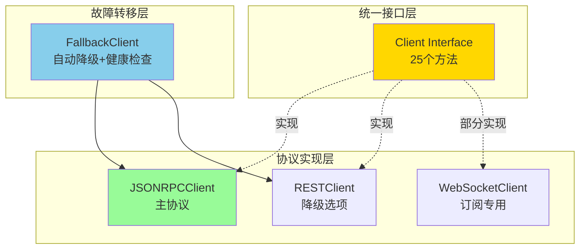
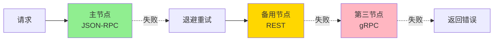

# CLI 传输适配层 (internal/cli/transport)

> **📌 模块定位**: CLI与节点通信的唯一通道,实现协议适配与故障转移

---

## 📍 核心定位

本模块是**CLI与区块链节点通信的唯一适配层**,遵循"协议优先、实现无关"原则,确保CLI不直接依赖`internal/core`,实现真正的薄客户端架构。

**解决什么问题**:
- ✅ **协议抽象**: 统一的Client接口,屏蔽JSON-RPC/REST/WebSocket协议差异
- ✅ **故障转移**: 自动降级到备用节点,提升可用性
- ✅ **重组安全**: 支持状态锚定查询和重组感知订阅
- ✅ **多协议支持**: JSON-RPC(主协议) → REST(降级) → gRPC(可选)

**不解决什么问题**(边界):
- ❌ 不处理私钥管理(由`wallet/`模块负责)
- ❌ 不实现交易构建(由`builder/`模块负责)
- ❌ 不包含业务逻辑(仅提供数据传输)

---

## 🏗️ 架构设计

### 接口层次



---

## 📁 模块结构

```
internal/cli/transport/
├── interface.go           # Client接口定义(25个方法+16个类型)
├── jsonrpc_client.go      # JSON-RPC 2.0 客户端实现
├── rest_client.go         # REST API 客户端实现
├── ws_client.go           # WebSocket 订阅客户端实现
├── factory.go             # 故障转移客户端工厂
└── README.md              # 本文档
```

---

## 🔑 核心接口

### Client 接口(25个方法)

| 分类 | 方法 | 说明 | 状态锚定 |
|-----|------|------|---------|
| **链信息** | `ChainID`, `Syncing`, `BlockNumber` | 基础链状态 | ❌ |
| **区块查询** | `GetBlockByHeight`, `GetBlockByHash` | 区块数据获取 | ✅ |
| **交易提交** | `SendRawTransaction` | 发送已签名交易 | ❌ |
| **交易查询** | `GetTransaction`, `GetTransactionReceipt`, `EstimateFee` | 交易状态与费用 | ❌ |
| **状态查询** | `GetBalance`, `GetUTXOs`, `Call` | 账户状态与模拟调用 | ✅ |
| **交易池** | `TxPoolStatus`, `TxPoolContent` | Mempool状态 | ❌ |
| **订阅** | `Subscribe` | 实时事件订阅(WebSocket) | ✅(重组安全) |
| **SPV** | `GetBlockHeader`, `GetTxProof` | 轻客户端支持 | ❌ |
| **健康检查** | `Ping`, `Close` | 连接管理 | ❌ |

---

## 🚀 使用示例

### 1. 创建JSON-RPC客户端

```go
package main

import (
	"context"
	"fmt"
	"time"
	"internal/cli/transport"
)

func main() {
	// 创建JSON-RPC客户端
	client := transport.NewJSONRPCClient("http://localhost:28680", 30*time.Second)
	defer client.Close()
	
	ctx := context.Background()
	
	// 获取链ID
	chainID, err := client.ChainID(ctx)
	if err != nil {
		panic(err)
	}
	fmt.Println("Chain ID:", chainID)
	
	// 获取最新区块高度
	height, err := client.BlockNumber(ctx)
	if err != nil {
		panic(err)
	}
	fmt.Println("Latest Block:", height)
}
```

### 2. 状态锚定查询

```go
// 查询特定高度的余额
anchor := &transport.StateAnchor{
	Height: uint64Ptr(12345),
}

balance, err := client.GetBalance(ctx, "0x123...", anchor)
if err != nil {
	panic(err)
}

fmt.Printf("Balance at height %d: %s\n", balance.Height, balance.Balance)
```

### 3. 故障转移客户端

```go
// 配置多节点故障转移
config := transport.ClientConfig{
	Endpoints: []transport.EndpointConfig{
		{
			Name:     "primary",
			Priority: 1,
			JSONRPC:  "http://node1.example.com:28680",
		},
		{
			Name:     "backup",
			Priority: 2,
			REST:     "http://node2.example.com:28680/api/v1",
		},
	},
	Timeout:             30 * time.Second,
	RetryAttempts:       3,
	HealthCheckInterval: 30 * time.Second,
}

client, err := transport.NewFallbackClient(config)
if err != nil {
	panic(err)
}
defer client.Close()

// 使用与普通客户端相同的接口
chainID, _ := client.ChainID(ctx)
```

### 4. WebSocket订阅(重组安全)

```go
// 创建WebSocket客户端
wsClient, err := transport.NewWebSocketClient("ws://localhost:28681")
if err != nil {
	panic(err)
}
defer wsClient.Close()

// 订阅新区块事件
sub, err := wsClient.Subscribe(ctx, transport.SubscribeNewHeads, nil, "")
if err != nil {
	panic(err)
}
defer sub.Unsubscribe()

// 处理事件
for {
	select {
	case event := <-sub.Events():
		if event.Removed {
			fmt.Printf("⚠️  区块 %d 被重组移除 (reorgId: %s)\n", event.Height, event.ReorgID)
		} else {
			fmt.Printf("✅ 新区块 %d: %s\n", event.Height, event.Hash)
		}
		
		// 持久化resumeToken用于断线恢复
		saveResumeToken(event.ResumeToken)
		
	case err := <-sub.Err():
		fmt.Println("订阅错误:", err)
		return
	}
}
```

---

## 🔒 安全特性

### 1. 零信任签名验证

- **客户端签名**: 交易必须在本地签名后才能通过`SendRawTransaction`提交
- **无私钥传递**: 接口不接受也不传输私钥
- **验证节点侧**: 节点仅验证签名,不进行签名操作

### 2. 状态锚定查询

所有状态查询接口支持`StateAnchor`参数:

```go
type StateAnchor struct {
	Height *uint64 // 指定区块高度
	Hash   *string // 指定区块哈希
}
```

**保证**:
- ✅ 查询结果可重现
- ✅ 重组时结果一致性
- ✅ 历史状态审计

### 3. 重组安全订阅

WebSocket订阅事件包含重组标记:

```go
type Event struct {
	Type        SubscriptionType
	Data        map[string]interface{}
	
	// 重组安全字段
	Removed     bool   `json:"removed"`       // 是否被重组移除
	ReorgID     string `json:"reorg_id"`      // 重组标识符
	ResumeToken string `json:"resume_token"`  // 可恢复游标
	
	// 状态锚定
	Height    uint64
	Hash      string
	Timestamp time.Time
}
```

**客户端责任**:
1. 检查`Removed`字段,回滚UI/本地状态
2. 持久化`ResumeToken`,断线重连时恢复订阅
3. 根据`ReorgID`关联重组事件

---

## ⚡ 性能优化

### 1. 连接池

- HTTP客户端使用连接池(`MaxIdleConns=100`)
- 空闲连接保持90秒

### 2. 超时控制

- 默认30秒超时(可配置)
- 所有方法接受`context.Context`支持取消

### 3. 健康检查

- 故障转移客户端自动探活(默认30秒间隔)
- 失败节点自动降级

---

## 🔍 故障转移机制

### 降级策略



### 退避算法

```
重试间隔 = RetryBackoff * (attempt + 1)

示例:
- 第1次失败: 等待 1s
- 第2次失败: 等待 2s
- 第3次失败: 等待 3s
```

---

## 📊 协议对比

| 特性 | JSON-RPC | REST | WebSocket | gRPC |
|-----|---------|------|-----------|------|
| **CLI主协议** | ✅ | ❌ | ❌ | ❌ |
| **状态锚定** | ✅ | ✅ | ✅ | ✅ |
| **实时订阅** | ❌ | ❌ | ✅ | ✅ |
| **web3.js兼容** | ✅ | ❌ | ✅ | ❌ |
| **人类可读** | ❌ | ✅ | ❌ | ❌ |
| **高性能** | ⚠️ | ⚠️ | ✅ | ✅ |
| **跨平台** | ✅ | ✅ | ✅ | ⚠️ |

**推荐使用策略**:
- **默认**: JSON-RPC (生态兼容性最佳)
- **降级**: REST (人类友好、调试方便)
- **订阅**: WebSocket (唯一支持实时事件)
- **企业**: gRPC (高性能、可选)

---

## ⚠️ 已知限制

| 限制 | 影响 | 规避方法 |
|-----|------|---------|
| JSON-RPC不支持订阅 | 必须使用WebSocket | 创建专门的WebSocket客户端 |
| 故障转移不支持订阅 | 订阅无法降级 | 为订阅保留稳定端点 |
| 状态锚定依赖归档节点 | 历史查询受限 | 文档说明节点保留策略 |
| WebSocket无自动重连 | 需手动处理断线 | 使用resumeToken恢复 |

---

## 🎯 设计原则

| 原则 | 说明 | 体现 |
|-----|------|------|
| **协议优先** | 只依赖协议,不依赖实现 | 接口不import internal/core |
| **零信任** | 客户端签名,节点验证 | SendRawTransaction只接受已签名交易 |
| **重组安全** | 感知链重组 | Event.Removed字段 |
| **状态锚定** | 查询可重现 | StateAnchor参数 |
| **故障转移** | 高可用性 | FallbackClient自动降级 |

---

## 📚 相关文档

### 架构规范
- **API 网关架构**: [`_docs/architecture/API_GATEWAY_ARCHITECTURE.md`](../../../_docs/architecture/API_GATEWAY_ARCHITECTURE.md) - 协议端口映射、配置驱动
- **CLI 架构**: [`_docs/architecture/CLI_ARCHITECTURE_SPECIFICATION.md`](../../../_docs/architecture/CLI_ARCHITECTURE_SPECIFICATION.md) - CLI 与 API 边界
- **顶层架构**: [`pkg/interfaces/README.md`](../../../pkg/interfaces/README.md) - WES 生态总览

### 实现文档
- **API 网关实现**: [`internal/api/README.md`](../../../internal/api/README.md) - 服务端 API 实现
- **Builder 模块**: [../builder/README.md](../builder/README.md) - 交易构建器
- **Wallet 模块**: [../wallet/](../wallet/) - 密钥管理

### 配置说明
- **API 配置**: [`configs/README.md`](../../../configs/README.md) - enable_* 开关、端口配置

---

**文档版本**: v1.0.0  
**最后更新**: 2025-10-24  
**维护者**: WES CLI团队


---

## 🛡️ 错误处理策略

### 错误分类

**1. 网络错误（临时性）**

```go
var (
    ErrConnectionRefused  = errors.New("connection refused")
    ErrTimeout            = errors.New("request timeout")
    ErrTemporaryFailure   = errors.New("temporary network failure")
)

// 处理策略：退避重试
for attempt := 0; attempt < maxRetries; attempt++ {
    result, err := client.ChainID(ctx)
    if err == nil {
        return result, nil
    }
    
    if isTemporaryError(err) {
        time.Sleep(retryBackoff * time.Duration(attempt+1))
        continue
    }
    
    return nil, err // 非临时性错误，立即返回
}
```

**2. 协议错误（永久性）**

```go
// JSON-RPC 错误码
const (
    ErrCodeInvalidRequest = -32600
    ErrCodeMethodNotFound = -32601
    ErrCodeInvalidParams  = -32602
    ErrCodeInternalError  = -32603
)

// 处理策略：根据错误码决策
if rpcErr, ok := err.(*JSONRPCError); ok {
    switch rpcErr.Code {
    case ErrCodeMethodNotFound:
        // 降级到 REST
        return fallbackClient.GetBalance(ctx, addr, anchor)
    case ErrCodeInvalidParams:
        // 参数错误，不应重试
        return nil, fmt.Errorf("invalid params: %w", err)
    default:
        // 其他错误，可重试
        return retryRequest(ctx, req)
    }
}
```

**3. 业务错误（链层面）**

```go
// 业务错误（不应重试）
var (
    ErrInsufficientFunds  = errors.New("insufficient funds")
    ErrInvalidSignature   = errors.New("invalid signature")
    ErrNonceConflict      = errors.New("nonce conflict")
    ErrTxRejected         = errors.New("transaction rejected")
)

// 处理策略：返回给用户
result, err := client.SendRawTransaction(ctx, signedTx)
if err != nil {
    if errors.Is(err, ErrInsufficientFunds) {
        return fmt.Errorf("余额不足，当前余额: %s", currentBalance)
    }
    // ... 其他业务错误
}
```

**4. 重组错误（状态不一致）**

```go
// WebSocket 事件监听
for {
    select {
    case event := <-sub.Events():
        if event.Removed {
            // 重组发生，回滚本地状态
            log.Warnf("区块 %d 被重组移除 (reorgId: %s)", event.Height, event.ReorgID)
            rollbackLocalState(event.Height)
            
            // 使用状态锚定重新查询
            anchor := &StateAnchor{Height: &event.Height}
            freshData, _ := client.GetBlockByHeight(ctx, event.Height, true, anchor)
            updateLocalState(freshData)
        }
    case err := <-sub.Err():
        // 订阅错误，尝试重连
        log.Errorf("订阅错误: %v", err)
        if isRecoverable(err) {
            sub = reconnectWithResumeToken(ctx, lastResumeToken)
        }
    }
}
```

### 错误决策树

```
错误发生
  │
  ├─ 网络层？
  │    ├─ 超时/连接失败 → 退避重试（3次）
  │    └─ DNS解析失败 → 切换备用节点
  │
  ├─ 协议层？
  │    ├─ 方法不存在 → 降级到 REST
  │    ├─ 参数错误 → 立即返回，不重试
  │    └─ 内部错误 → 重试或切换节点
  │
  ├─ 业务层？
  │    ├─ 余额不足 → 返回用户，提示充值
  │    ├─ 签名错误 → 返回用户，检查私钥
  │    └─ 交易被拒 → 返回用户，检查参数
  │
  └─ 重组层？
       ├─ 区块被移除 → 回滚本地状态，重新查询
       └─ 订阅断开 → 使用 resumeToken 重连
```

---

**文档更新**: 2025-10-25 - 新增错误处理策略、更新协议推荐对齐 API 网关架构
