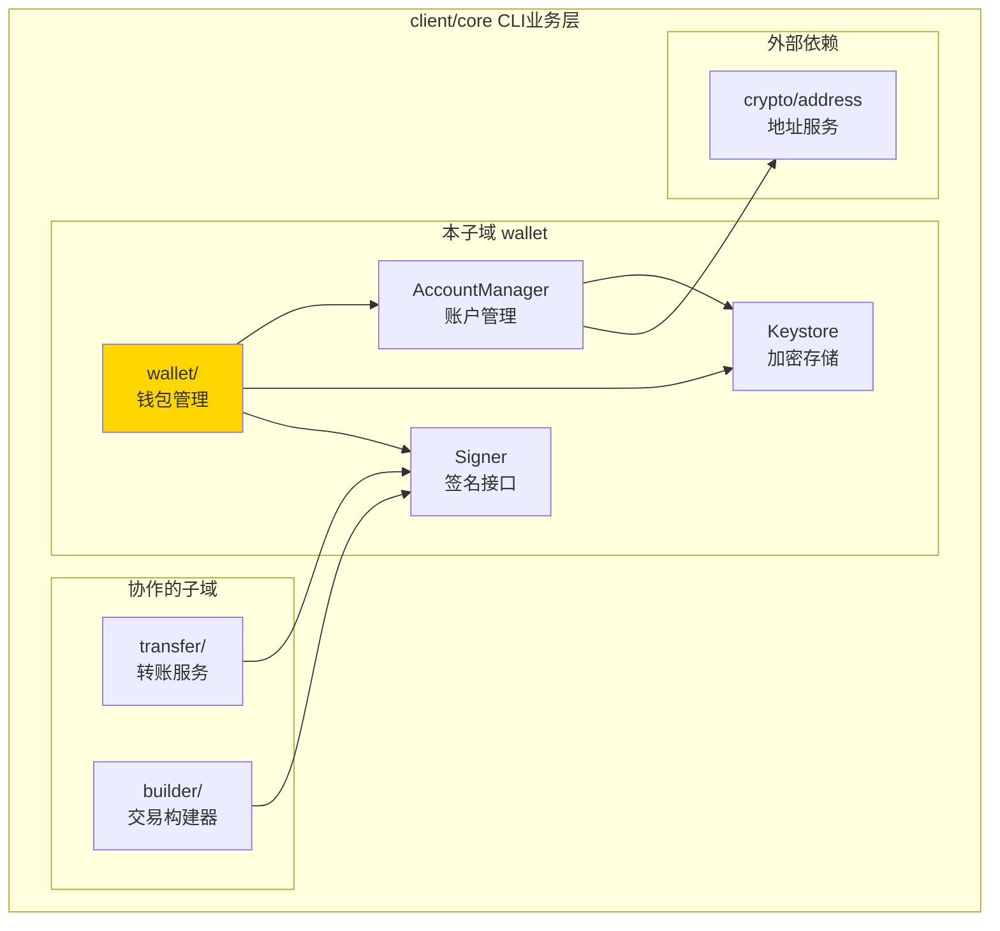
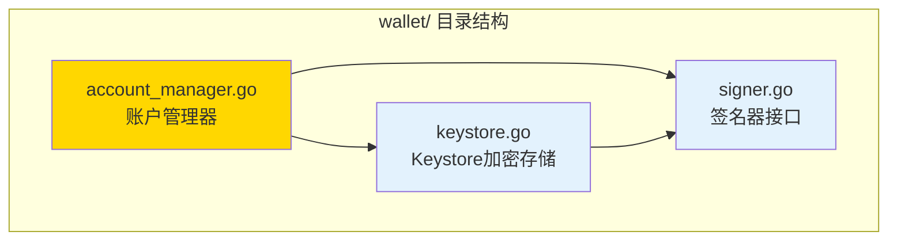

# wallet - 钱包管理

---

## 📌 版本信息

- **版本**：1.0
- **状态**：stable
- **最后更新**：2025-11-01
- **所有者**：CLI 开发组
- **适用范围**：CLI 钱包管理和签名功能

---

## 🎯 子域定位

**路径**：`client/core/wallet/`

**所属组件**：`client/core`（CLI 核心业务层）

**核心职责**：提供本地钱包管理、私钥加密存储和交易签名功能

**在组件中的角色**：
- 钱包账户的创建、导入、导出、删除
- 私钥的加密存储（Keystore 格式）
- 交易签名和哈希签名
- 账户解锁/锁定管理

---

## 🏗️ 架构设计

### 在组件中的位置



**位置说明**：

| 关系类型 | 目标 | 关系说明 |
|---------|------|---------|
| **被使用** | transfer/ | 转账服务使用 Signer 对交易进行签名 |
| **被使用** | builder/ | 交易构建器使用 Signer 签名交易 |
| **依赖** | crypto/address | 使用 AddressService 生成和验证地址 |

---

### 内部组织



---

## 📁 目录结构

```
client/core/wallet/
├── README.md                    # 本文档
├── account_manager.go          # 账户管理器（AccountManager）
├── keystore.go                 # Keystore 加密存储实现
└── signer.go                   # 签名器接口定义
```

---

## 🔧 核心实现

### 1. 账户管理器：`account_manager.go`

**核心类型**：`AccountManager`

**职责**：管理钱包账户的创建、导入、导出、删除和查询

**关键字段**：

```go
type AccountManager struct {
    keystoreDir      string                          // Keystore 目录路径
    addressManager   AddressManager                  // 地址管理器（可选）
    unlockedAccounts map[string]*unlockedAccountData // 内存解锁缓存
}
```

**关键方法**：

| 方法名 | 职责 | 可见性 | 备注 |
|-------|------|-------|-----|
| `NewAccountManager()` | 创建账户管理器 | Public | 初始化 Keystore 目录 |
| `CreateAccount()` | 创建新账户 | Public | 生成32字节随机私钥，使用 Cf 前缀地址 |
| `ImportPrivateKey()` | 导入私钥 | Public | 支持 Cf 前缀地址格式 |
| `ExportPrivateKey()` | 导出私钥 | Public | 需要密码验证 |
| `DeleteAccount()` | 删除账户 | Public | 需要密码验证 |
| `ListAccounts()` | 列出所有账户 | Public | 扫描 Keystore 目录 |
| `GetAccount()` | 获取账户信息 | Public | 根据地址查找 |
| `UnlockAccount()` | 解锁账户 | Public | 内存缓存解锁状态 |
| `LockAccount()` | 锁定账户 | Public | 清除内存缓存 |

**账户信息结构**：

```go
type AccountInfo struct {
    ID            string    // 账户ID（使用地址）
    Name          string    // 账户名称
    Address       string    // 账户地址（Cf 前缀）
    PrivateKeyHex string    // 私钥（十六进制，仅调试用）
    KeystorePath  string    // Keystore 文件路径
    Label         string    // 用户标签
    CreatedAt     time.Time // 创建时间
    UpdatedAt     time.Time // 更新时间
    IsDefault     bool      // 是否默认账户
    IsUnlocked    bool      // 是否已解锁
}
```

---

### 2. Keystore 加密存储：`keystore.go`

**核心类型**：`KeystoreV1`、`KeystoreSigner`

**职责**：实现 Keystore 文件格式的加密存储和签名功能

**Keystore 文件格式（v1.0.0）**：

```json
{
  "version": "1.0.0",
  "id": "uuid",
  "address": "Cf...",
  "crypto": {
    "cipher": "aes-256-gcm",
    "ciphertext": "hex...",
    "cipherparams": {
      "iv": "hex..."
    },
    "kdf": "pbkdf2",
    "kdfparams": {
      "dklen": 32,
      "salt": "hex...",
      "c": 262144,
      "prf": "hmac-sha256"
    },
    "mac": "hex..."
  },
  "created_at": "2025-11-01T10:00:00Z",
  "label": "My Wallet"
}
```

**加密算法**：
- ✅ **密码派生**：PBKDF2（HMAC-SHA256，262144 次迭代）
- ✅ **对称加密**：AES-256-GCM
- ✅ **完整性校验**：MAC（SHA256）

**关键方法**：

| 方法名 | 职责 | 可见性 | 备注 |
|-------|------|-------|-----|
| `NewKeystoreSigner()` | 创建 Keystore 签名器 | Public | 验证文件存在 |
| `Unlock()` | 解锁 Keystore | Public | 解密私钥到内存 |
| `Lock()` | 锁定 Keystore | Public | 清除内存私钥 |
| `Sign()` | 签名交易 | Public | 使用 ECDSA 签名 |
| `SignHash()` | 签名哈希值 | Public | 用于消息签名 |

**安全特性**：
- ✅ 私钥加密存储（AES-256-GCM）
- ✅ 密码派生（PBKDF2，262144 次迭代）
- ✅ 内存锁定机制（解锁后缓存，锁定后清除）
- ✅ 地址大小写敏感（Base58 地址区分大小写）

---

### 3. 签名器接口：`signer.go`

**核心接口**：`Signer`

**职责**：定义统一的签名抽象，支持多种签名方式

**接口定义**：

```go
type Signer interface {
    // 签名交易
    Sign(tx []byte, fromAddr string) ([]byte, error)
    
    // 签名哈希值（用于消息签名）
    SignHash(hash []byte, fromAddr string) ([]byte, error)
    
    // 获取地址
    GetAddress(derivationPath string) (string, error)
    
    // 列出所有管理的地址
    ListAddresses() ([]string, error)
    
    // 解锁签名器（如需密码）
    Unlock(password string, duration time.Duration) error
    
    // 锁定签名器
    Lock()
    
    // 检查是否已锁定
    IsLocked() bool
    
    // 返回签名器类型
    Type() SignerType
}
```

**签名器类型**：

| 类型 | 说明 | 实现状态 |
|-----|------|---------|
| `keystore` | 加密 Keystore 文件 | ✅ 已实现 |
| `mnemonic` | BIP39 助记词 | 🚧 计划中 |
| `hardware` | 硬件钱包 | 🚧 计划中 |
| `external` | 外部签名器 | 🚧 计划中 |

---

## 🔗 协作关系

### 依赖的接口

| 接口 | 来源 | 用途 |
|-----|------|-----|
| `AddressManager` | `internal/core/infrastructure/crypto/address/` | 地址生成和验证 |

---

### 被依赖关系

**被以下模块使用**：
- `client/core/transfer/` - 转账服务使用 Signer 对交易进行签名
- `client/core/builder/` - 交易构建器使用 Signer 签名交易
- `cmd/weisyn/` - CLI 入口使用 AccountManager 管理钱包账户

**示例**：

```go
// 在转账服务中使用
import "github.com/weisyn/v1/client/core/wallet"

func executeTransfer(signer *wallet.Signer, tx []byte) error {
    // 解锁签名器（如果需要）
    if signer.IsLocked() {
        if err := signer.Unlock(password, 5*time.Minute); err != nil {
            return err
        }
    }
    
    // 签名交易
    signedTx, err := signer.Sign(tx, fromAddress)
    if err != nil {
        return err
    }
    
    // 使用签名后的交易...
    return nil
}
```

---

## 📊 关键设计决策

### 决策 1：使用 Keystore 文件格式

**问题**：如何安全地存储私钥？

**方案**：使用以太坊兼容的 Keystore v1.0.0 格式

**理由**：
- ✅ 行业标准：以太坊生态广泛使用，工具兼容性好
- ✅ 安全性高：AES-256-GCM 加密 + PBKDF2 密码派生
- ✅ 完整性校验：MAC 确保文件未被篡改

**权衡**：
- ✅ 优点：安全性高，工具兼容性好
- ⚠️ 缺点：文件格式复杂，需要 JSON 解析

---

### 决策 2：内存解锁缓存机制

**问题**：每次签名都需要输入密码，用户体验差，如何平衡安全性和便利性？

**方案**：实现内存解锁缓存，解锁后在一定时间内无需重复输入密码

**理由**：
- ✅ 提升用户体验：解锁后短时间内无需重复输入密码
- ✅ 安全性：私钥仅存在于内存中，程序退出后自动清除
- ✅ 可配置：支持设置解锁时长，0 表示永久解锁（直到调用 Lock）

**实现**：
- `AccountManager` 维护 `unlockedAccounts` map，缓存解锁状态
- `KeystoreSigner` 在内存中保存解密后的私钥
- 调用 `Lock()` 或程序退出时清除内存缓存

---

### 决策 3：支持 Cf 前缀地址格式

**问题**：如何兼容旧版地址格式？

**方案**：在地址生成和验证时支持 Cf 前缀格式

**理由**：
- ✅ 向后兼容：支持旧版地址格式
- ✅ 地址标准化：统一使用 Cf 前缀标识

**实现**：
- `CreateAccount()` 使用 `deriveAddressCf()` 生成 Cf 前缀地址
- `ImportPrivateKey()` 支持移除 `Cf` 前缀
- 地址比较时使用 `normalizeAddress()` 统一格式

---

## 🧪 测试

### 测试覆盖

| 测试类型 | 文件 | 覆盖率目标 | 当前状态 |
|---------|------|-----------|---------|
| 单元测试 | `*_test.go` | ≥ 80% | 待补充 |
| 集成测试 | `../integration/` | 核心场景 | 待补充 |

---

## 📚 相关文档

- [CLI 核心业务层总览](../README.md)
- [转账服务](../transfer/README.md)
- [交易构建器](../builder/README.md)
- [CLI 客户端支持库](../../README.md)

---

## 📝 变更历史

| 版本 | 日期 | 变更内容 | 作者 |
|-----|------|---------|------|
| 1.0 | 2025-11-01 | 初始版本，添加 README 文档 | CLI 开发组 |

---

## 🚧 待办事项

- [ ] 添加单元测试覆盖
- [ ] 支持 BIP39 助记词钱包
- [ ] 支持硬件钱包（Ledger/Trezor）
- [ ] 添加账户备份/恢复功能
- [ ] 优化解锁缓存机制（自动超时锁定）

