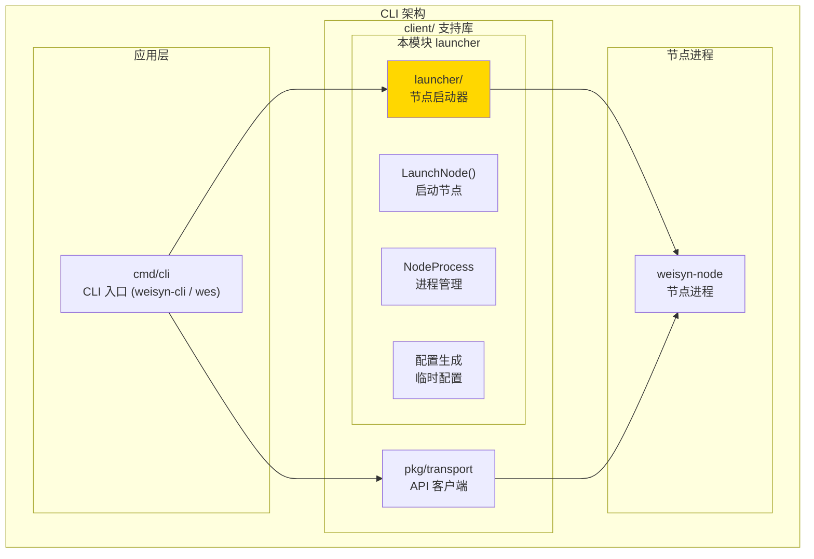
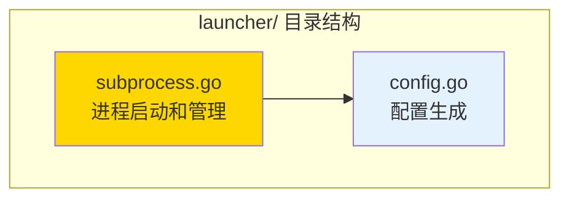

# launcher - 节点启动器

---

## 📌 版本信息

- **版本**：1.0
- **状态**：stable
- **最后更新**：2025-11-01
- **所有者**：CLI 开发组
- **适用范围**：CLI 节点子进程启动和管理

---

## 🎯 模块定位

**路径**：`client/launcher/`

**核心职责**：提供节点子进程的启动、监控和管理功能

**在 CLI 架构中的角色**：
- ✅ 仅作为 **CLI 的可选“可视化启动壳”**，用于本地开发/测试
- ✅ 帮助在本机快速拉起私链节点（`weisyn-node --chain private`）
- ✅ 管理节点进程的生命周期（启动、监控、停止）
- ✅ 生成和管理临时配置文件（`./config-temp/`）
- ✅ 提供节点就绪检测和健康检查
- ❌ 不参与生产环境部署与配置管理

**使用场景**：
- CLI 自动启动本地测试节点
- 开发环境的快速启动
- 测试脚本中的节点管理

---

## 🏗️ 架构设计

### 在 CLI 架构中的位置



**位置说明**：

| 关系类型 | 目标 | 关系说明 |
|---------|------|---------|
| **被使用** | cmd/weisyn | CLI 入口调用 LaunchNode 启动节点子进程 |
| **管理** | weisyn 节点进程 | 启动、监控、停止节点子进程 |
| **协作** | pkg/transport | 使用 transport.WaitForNodeReady 检测节点就绪 |

---

### 内部组织



---

## 📁 目录结构

```
client/launcher/
├── README.md                    # 本文档
├── subprocess.go               # 进程启动和管理（LaunchNode、NodeProcess）
└── config.go                   # 临时配置生成（GenerateTempNodeConfig）
```

---

## 🔧 核心实现

### 1. 进程启动和管理：`subprocess.go`

**核心类型**：`NodeProcess`、`LaunchOptions`

**职责**：启动节点子进程，管理进程生命周期，提供就绪检测和停止功能

**关键类型**：

```go
// LaunchOptions 启动选项
type LaunchOptions struct {
    // 运行环境（dev/test/prod），用于写入临时配置中的 environment 字段
    // 历史写法 development/testing/production 将自动映射为 dev/test/prod
    Env          string
    KeepData     bool   // 是否保留历史数据
    ConfigPath   string // 自定义配置路径（如果指定则不生成临时配置）
    Endpoint     string // API 端点（默认 http://localhost:28680）
    Daemon       bool   // 后台运行（静默模式）
    LogToConsole bool   // 日志输出到控制台（开发模式）
}

// NodeProcess 节点子进程句柄
type NodeProcess struct {
    cmd            *exec.Cmd    // 进程命令
    endpoint       string       // API 端点
    tempConfigPath string       // 临时配置文件路径
    logFile        *os.File     // 日志文件（如果重定向到文件）
    done           chan struct{} // 进程退出信号
    err            error        // 进程错误
    mu             sync.Mutex   // 互斥锁
}
```

**关键方法**：

| 方法名 | 职责 | 可见性 | 备注 |
|-------|------|-------|-----|
| `LaunchNode()` | 启动节点子进程 | Public | 核心方法，查找二进制、生成配置、启动进程 |
| `Wait()` | 等待节点就绪 | Public | 使用 transport.WaitForNodeReady 检测 |
| `Stop()` | 停止节点 | Public | 发送 SIGTERM，优雅停机，超时后强制 Kill |
| `GetEndpoint()` | 获取 API 端点 | Public | 返回节点 API 地址 |
| `GetError()` | 获取进程错误 | Public | 如果进程已退出，返回错误 |
| `IsRunning()` | 检查是否运行 | Public | 检查进程是否还在运行 |

**启动流程**：

```
1. 查找节点二进制（优先 bin/weisyn-node，其次 PATH 中的 weisyn-node，兼容旧的 weisyn）
2. 生成临时配置文件（如果未指定 ConfigPath，使用内嵌私链模板）
3. 构建命令参数（weisyn-node --chain private --config <temp-config>）
4. 创建 exec.Cmd，设置环境变量
5. 准备日志输出（文件或控制台）
6. 启动进程（cmd.Start）
7. 创建 NodeProcess 句柄
8. 启动 goroutine 监控进程退出
```

**停止流程**：

```
1. 发送 SIGTERM（优雅停机）
2. 等待进程退出（最多 10 秒）
3. 如果超时，强制 Kill
4. 清理资源（临时配置文件、日志文件）
```

---

### 2. 配置生成：`config.go`

**核心类型**：`ConfigOverrides`

**职责**：基于内嵌私链模板生成临时节点配置文件，仅用于本机临时私链

**关键类型**：

```go
// ConfigOverrides 配置覆盖项
type ConfigOverrides struct {
    HTTPPort   int    // API HTTP 端口
    GRPCPort   int    // gRPC 端口
    DataDir    string // 数据目录
    LogPath    string // 日志路径
    KeepData   bool   // 是否保留历史数据
}
```

**关键方法**：

| 方法名 | 职责 | 可见性 | 备注 |
|-------|------|-------|-----|
| `GenerateTempNodeConfig()` | 生成临时配置 | Public | 基于内嵌私链模板 + 覆盖项生成临时配置文件 |
| `CleanupTempConfig()` | 清理临时配置 | Public | 删除指定的临时配置文件 |
| `CleanupAllTempConfigs()` | 清理所有临时配置 | Public | 清理所有 CLI 托管的临时配置文件 |

**配置生成流程**：

```
1. 获取基础配置（configs.GetPrivateChainTemplate，私链模板）
2. 解析为 map 以便修改
3. 应用环境值（environment=dev/test/prod）和覆盖项（端口、目录、日志路径等）
4. 序列化为 JSON
5. 写入临时文件（./config-temp/wes-cli-managed-{env}-*.json）
```

**环境隔离**：
- ✅ 数据根目录（data_root）：`./data/{env}-cli-managed`
- ✅ 实例数据目录（示例）：`./data/{env}/{env}-private-local`（按 Environment + 链实例自动分桶）
- ✅ 日志路径：`{instance_data_dir}/logs/weisyn.log`
- ✅ 临时配置：`./config-temp/wes-cli-managed-{env}-*.json`

---

## 🔗 协作关系

### 依赖的模块

| 模块 | 来源 | 用途 |
|-----|------|-----|
| `configs` | `github.com/weisyn/v1/configs` | 获取链配置模板（私链模板） |
| `transport` | `client/pkg/transport` | 使用 WaitForNodeReady 检测节点就绪 |

---

### 被依赖关系

**被以下模块使用**：
- `cmd/cli/` - CLI 入口可选择使用 LaunchNode 启动本地节点（可选功能）
- `client/pkg/ux/flows/` - UI 流程层可调用，用于“可视化启动节点”向导（可选）

**示例**：

```go
// 在 CLI 入口中使用（示意）
import "github.com/weisyn/v1/client/launcher"

func startLocalNode(ctx context.Context) error {
    opts := launcher.LaunchOptions{
        Env:      "dev",                          // 开发环境
        KeepData: false,                          // 不保留数据（退出时清理临时配置）
        Endpoint: "http://localhost:28680",        // 健康检查使用的 API 端点
    }

    nodeProcess, err := launcher.LaunchNode(ctx, opts)
    if err != nil {
        return err
    }

    // 等待节点就绪
    if err := nodeProcess.Wait(30 * time.Second); err != nil {
        _ = nodeProcess.Stop()
        return err
    }

    // 使用节点...
    defer nodeProcess.Stop()
    return nil
}
```

---

## 📊 关键设计决策

### 决策 1：子进程启动而非库调用

**问题**：CLI 如何启动本地节点？是作为子进程还是直接调用库？

**方案**：使用子进程启动节点（`exec.Command`）

**理由**：
- ✅ 进程隔离：节点崩溃不影响 CLI 进程
- ✅ 资源管理：独立的进程可以独立管理资源
- ✅ 日志分离：节点日志和 CLI 日志可以分开
- ✅ 灵活性：可以启动不同环境的节点实例

**权衡**：
- ✅ 优点：进程隔离、资源独立、易于管理
- ⚠️ 缺点：进程间通信需要通过 API，启动开销稍大

---

### 决策 2：临时配置文件生成

**问题**：如何为子进程节点提供配置？

**方案**：基于环境配置生成临时配置文件，启动时传递给节点

**理由**：
- ✅ 环境隔离：不同环境使用不同的数据目录和配置
- ✅ 灵活性：可以覆盖端口、目录等配置项
- ✅ 自动化：无需用户手动配置

**实现**：
- 从 `configs` 包获取基础配置
- 应用覆盖项（端口、目录、日志路径）
- 写入临时文件（`./config-temp/`）
- 进程退出时自动清理

---

### 决策 3：优雅停机机制

**问题**：如何安全地停止节点进程？

**方案**：先发送 SIGTERM（优雅停机），超时后强制 Kill

**理由**：
- ✅ 数据安全：SIGTERM 允许节点优雅关闭，保存数据
- ✅ 避免数据损坏：强制 Kill 可能导致数据损坏
- ✅ 超时保护：如果节点无法响应，超时后强制终止

**实现**：
- 发送 `os.Interrupt`（SIGTERM）
- 等待进程退出（最多 10 秒）
- 如果超时，调用 `Process.Kill()` 强制终止

---

## 🧪 测试

### 测试覆盖

| 测试类型 | 文件 | 覆盖率目标 | 当前状态 |
|---------|------|-----------|---------|
| 单元测试 | `*_test.go` | ≥ 80% | 待补充 |
| 集成测试 | `../integration/` | 核心场景 | 待补充 |

---

## 📚 相关文档

- [CLI 客户端支持库](../README.md)
- [统一启动器](../../cmd/weisyn/README.md)
- [传输层](../pkg/transport/README.md)

---

## 📝 变更历史

| 版本 | 日期 | 变更内容 | 作者 |
|-----|------|---------|------|
| 1.0 | 2025-11-01 | 初始版本，添加 README 文档 | CLI 开发组 |

---

## 🚧 待办事项

- [ ] 添加单元测试覆盖
- [ ] 支持节点进程的自动重启机制
- [ ] 优化临时配置清理逻辑（进程异常退出时）
- [ ] 添加节点进程的健康检查（定期 ping）
- [ ] 支持多个节点实例同时运行（不同端口）

