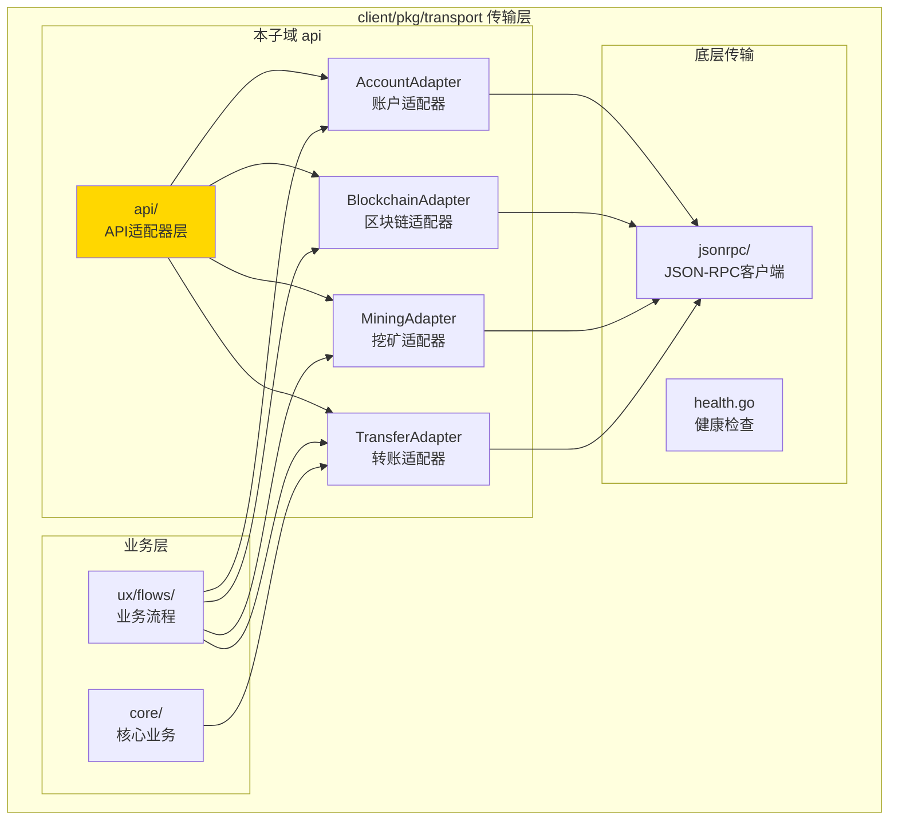
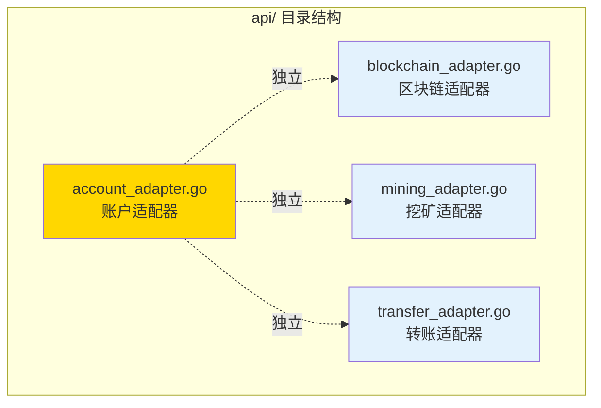

# api - API 适配器层

---

## 📌 版本信息

- **版本**：1.0
- **状态**：stable
- **最后更新**：2025-11-01
- **所有者**：CLI 开发组
- **适用范围**：CLI API 适配器层

---

## 🎯 子域定位

**路径**：`client/pkg/transport/api/`

**所属组件**：`client/pkg/transport`（传输层）

**核心职责**：提供业务领域的 API 适配器，封装 JSON-RPC 调用，处理地址格式转换和响应解析

**在组件中的角色**：
- 业务领域的 API 适配器（账户、区块链、挖矿、转账）
- 封装底层 JSON-RPC 调用
- 处理地址格式转换（Base58 ↔ Hex）
- 解析和转换 API 响应格式

---

## 🏗️ 架构设计

### 在传输层中的位置



**位置说明**：

| 关系类型 | 目标 | 关系说明 |
|---------|------|---------|
| **依赖** | jsonrpc/ | 使用 JSON-RPC 客户端调用节点 API |
| **被使用** | ux/flows/ | UI 流程层使用适配器调用 API |
| **被使用** | core/ | 核心业务层使用适配器（如转账适配器） |

---

### 内部组织



---

## 📁 目录结构

```
client/pkg/transport/api/
├── README.md                    # 本文档
├── account_adapter.go          # 账户服务适配器
├── blockchain_adapter.go       # 区块链服务适配器
├── mining_adapter.go           # 挖矿服务适配器
└── transfer_adapter.go         # 转账服务适配器
```

---

## 🔧 核心实现

### 1. 账户适配器：`account_adapter.go`

**核心类型**：`AccountAdapter`

**职责**：封装账户相关的 API 调用，处理地址格式转换

**关键字段**：

```go
type AccountAdapter struct {
    client         *jsonrpc.Client              // JSON-RPC 客户端
    addressManager *address.AddressService      // 地址管理器（用于格式转换）
}
```

**关键方法**：

| 方法名 | 职责 | 可见性 | 备注 |
|-------|------|-------|-----|
| `NewAccountAdapter()` | 创建账户适配器 | Public | 依赖注入 |
| `GetBalance()` | 获取账户余额 | Public | 转换 Base58 地址为 Hex，调用 wes_getBalance |

**地址转换流程**：

```
1. 接收 Base58 格式地址（如 CUQ3g6P5WmFN289pPn7AAhnQ3T2cZRv2BR）
2. 使用 AddressManager.AddressToBytes() 转换为字节数组
3. 使用 hex.EncodeToString() 转换为十六进制
4. 添加 0x 前缀（如 0x1234...）
5. 调用节点 API（节点要求十六进制格式）
```

---

### 2. 区块链适配器：`blockchain_adapter.go`

**核心类型**：`BlockchainAdapter`

**职责**：封装区块链查询相关的 API 调用

**关键字段**：

```go
type BlockchainAdapter struct {
    client *jsonrpc.Client  // JSON-RPC 客户端
}
```

**关键方法**：

| 方法名 | 职责 | 可见性 | 备注 |
|-------|------|-------|-----|
| `NewBlockchainAdapter()` | 创建区块链适配器 | Public | 依赖注入 |
| `GetChainID()` | 获取链ID | Public | 调用 wes_chainId |
| `GetBlockNumber()` | 获取当前区块高度 | Public | 调用 wes_blockNumber |
| `GetBlockByHeight()` | 根据高度获取区块 | Public | 调用 wes_getBlockByHeight |
| `GetBlockByHash()` | 根据哈希获取区块 | Public | 调用 wes_getBlockByHash |
| `GetTransaction()` | 获取交易信息 | Public | 调用 wes_getTransaction |

**数据结构**：

```go
// ChainInfo 链信息
type ChainInfo struct {
    ChainID   uint64
    Height    uint64
    BlockHash string
    IsSyncing bool
    NetworkID string
}

// BlockInfo 区块信息
type BlockInfo struct {
    Height       uint64
    Hash         string
    ParentHash   string
    Timestamp    uint64
    MerkleRoot   string
    StateRoot    string
    TxCount      int
    Transactions []string
}
```

---

### 3. 挖矿适配器：`mining_adapter.go`

**核心类型**：`MiningAdapter`

**职责**：封装挖矿相关的 API 调用，处理地址格式转换

**关键字段**：

```go
type MiningAdapter struct {
    client         *jsonrpc.Client              // JSON-RPC 客户端
    addressManager *address.AddressService      // 地址管理器（用于格式转换）
}
```

**关键方法**：

| 方法名 | 职责 | 可见性 | 备注 |
|-------|------|-------|-----|
| `NewMiningAdapter()` | 创建挖矿适配器 | Public | 依赖注入 |
| `StartMining()` | 启动挖矿 | Public | 转换 Base58 地址为 Hex，调用 wes_startMining |
| `StopMining()` | 停止挖矿 | Public | 调用 wes_stopMining |
| `GetMiningStatus()` | 获取挖矿状态 | Public | 调用 wes_getMiningStatus |

**数据结构**：

```go
// MiningStatus 挖矿状态
type MiningStatus struct {
    IsRunning    bool   // 是否正在挖矿
    MinerAddress string // 矿工地址（Base58格式）
}
```

---

### 4. 转账适配器：`transfer_adapter.go`

**核心类型**：`TransferAdapter`

**职责**：封装转账相关的 API 调用，集成转账服务

**关键字段**：

```go
type TransferAdapter struct {
    transportClient transport.Client      // 传输层客户端
    transferSvc     *transfer.TransferService  // 转账服务（可选）
    addressManager  *address.AddressService     // 地址管理器
}
```

**关键方法**：

| 方法名 | 职责 | 可见性 | 备注 |
|-------|------|-------|-----|
| `NewTransferAdapter()` | 创建转账适配器 | Public | 创建转账服务实例 |
| `Transfer()` | 执行转账 | Public | 转换地址格式，调用 wes_sendTransaction |

**转账流程**：

```
1. 接收转账请求（Base58 格式地址）
2. 转换发送方和接收方地址为 Hex 格式
3. 调用 transport.Client.SendTransaction()
4. 节点内部完成：构建 → 签名 → 提交
5. 返回交易哈希
```

---

## 🔗 协作关系

### 依赖的接口

| 接口 | 来源 | 用途 |
|-----|------|-----|
| `jsonrpc.Client` | `client/pkg/transport/jsonrpc/` | JSON-RPC 调用 |
| `transport.Client` | `client/core/transport/` | 传输层客户端（转账适配器） |
| `address.AddressService` | `internal/core/infrastructure/crypto/address/` | 地址格式转换 |
| `transfer.TransferService` | `client/core/transfer/` | 转账服务（转账适配器） |

---

### 被依赖关系

**被以下模块使用**：
- `client/pkg/ux/flows/` - UI 流程层使用适配器调用节点 API
- `client/core/transfer/` - 转账服务可能使用转账适配器（计划中）

**示例**：

```go
// 在 UI 流程中使用
import "github.com/weisyn/v1/client/pkg/transport/api"

func queryBalance(ctx context.Context, address string) error {
    adapter := api.NewAccountAdapter(jsonrpcClient, addrMgr)
    balance, tokens, err := adapter.GetBalance(ctx, address)
    if err != nil {
        return err
    }
    // 显示余额...
    return nil
}
```

---

## 📊 关键设计决策

### 决策 1：适配器模式

**问题**：如何封装底层 JSON-RPC 调用，提供业务友好的接口？

**方案**：使用适配器模式，为每个业务领域创建独立的适配器

**理由**：
- ✅ 职责清晰：每个适配器专注于一个业务领域
- ✅ 易于维护：修改一个领域的 API 不影响其他领域
- ✅ 易于测试：可以独立测试每个适配器
- ✅ 业务友好：提供业务语义的接口，而非底层 RPC 调用

**权衡**：
- ✅ 优点：结构清晰，易于维护和测试
- ⚠️ 缺点：增加了代码层级，可能有些重复代码

---

### 决策 2：地址格式转换

**问题**：CLI 使用 Base58 格式地址，但节点 API 要求十六进制格式，如何处理？

**方案**：在适配器层统一处理地址格式转换

**理由**：
- ✅ 集中处理：地址转换逻辑集中在一个地方
- ✅ 透明转换：调用方无需关心地址格式
- ✅ 一致性：所有适配器使用相同的转换逻辑

**实现**：
- 适配器接收 Base58 格式地址（业务层标准）
- 使用 `AddressManager.AddressToBytes()` 转换为字节数组
- 使用 `hex.EncodeToString()` 转换为十六进制
- 添加 `0x` 前缀后调用节点 API

---

### 决策 3：响应格式转换

**问题**：节点 API 返回的格式可能与业务层期望的格式不同，如何处理？

**方案**：在适配器中解析和转换响应格式

**理由**：
- ✅ 格式统一：业务层使用统一的格式
- ✅ 类型安全：使用 Go 结构体而非原始 JSON
- ✅ 易于使用：业务层无需解析 JSON

**实现**：
- 调用 `jsonrpc.Client.Call()` 获取原始响应
- 使用 `json.Unmarshal()` 解析为结构体
- 转换格式（如十六进制字符串转 uint64）
- 返回业务友好的结构体

---

## 🧪 测试

### 测试覆盖

| 测试类型 | 文件 | 覆盖率目标 | 当前状态 |
|---------|------|-----------|---------|
| 单元测试 | `*_test.go` | ≥ 80% | 待补充 |
| 集成测试 | `../integration/` | 核心场景 | 待补充 |

---

## 📚 相关文档

- [传输层总览](../README.md)
- [JSON-RPC 客户端](../jsonrpc/README.md)
- [UI 业务流程](../../ux/flows/README.md)
- [转账服务](../../../core/transfer/README.md)

---

## 📝 变更历史

| 版本 | 日期 | 变更内容 | 作者 |
|-----|------|---------|------|
| 1.0 | 2025-11-01 | 初始版本，添加 README 文档 | CLI 开发组 |

---

## 🚧 待办事项

- [ ] 添加单元测试覆盖
- [ ] 支持更多业务领域的适配器（合约、资源等）
- [ ] 优化错误处理和重试机制
- [ ] 添加请求/响应日志（调试模式）
- [ ] 支持批量 API 调用（减少网络往返）

