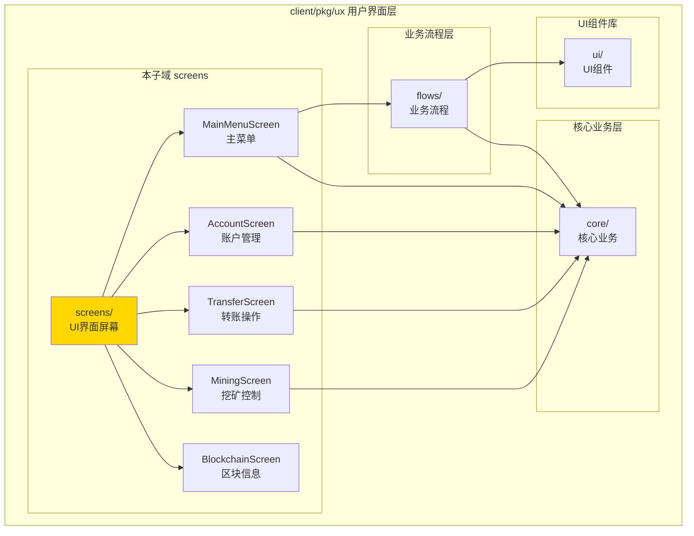
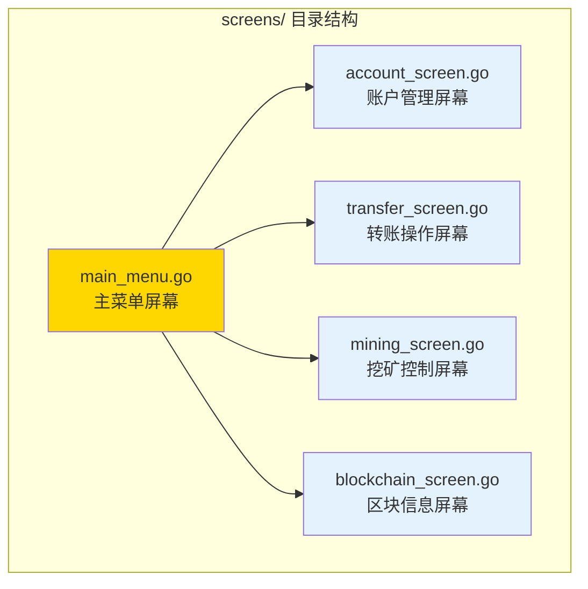

# screens - UI 界面屏幕

---

## 📌 版本信息

- **版本**：1.0
- **状态**：stable
- **最后更新**：2025-11-01
- **所有者**：CLI 开发组
- **适用范围**：CLI UI 界面屏幕组件

---

## 🎯 子域定位

**路径**：`client/pkg/ux/screens/`

**所属组件**：`client/pkg/ux`（用户界面层）

**核心职责**：提供 TTY 终端界面屏幕，实现菜单导航和用户交互

**在组件中的角色**：
- TTY 终端界面屏幕的实现层
- 菜单导航和用户输入处理
- 调用业务流程层（flows）和核心业务层（core）执行操作
- 负责界面渲染和用户交互

---

## 🏗️ 架构设计

### 在 UI 层中的位置



**位置说明**：

| 关系类型 | 目标 | 关系说明 |
|---------|------|---------|
| **调用** | flows/ | 主菜单屏幕调用业务流程层（如合约流程） |
| **调用** | core/ | 屏幕直接调用核心业务层执行操作 |
| **使用** | ui/ | 通过 flows 间接使用 UI 组件库 |

---

### 内部组织



---

## 📁 目录结构

```
client/pkg/ux/screens/
├── README.md                    # 本文档
├── main_menu.go                # 主菜单屏幕（MainMenuScreen）
├── account_screen.go           # 账户管理屏幕（AccountScreen）
├── transfer_screen.go          # 转账操作屏幕（TransferScreen）
├── mining_screen.go            # 挖矿控制屏幕（MiningScreen）
└── blockchain_screen.go       # 区块信息屏幕（BlockchainScreen）
```

---

## 🔧 核心实现

### 1. 主菜单屏幕：`main_menu.go`

**核心类型**：`MainMenuScreen`

**职责**：提供主菜单导航，协调各个功能屏幕

**关键字段**：

```go
type MainMenuScreen struct {
    transport       transport.Client          // 传输层客户端
    walletManager   *wallet.AccountManager    // 钱包管理器
    transferService *transfer.TransferService // 转账服务
    miningService   *mining.MiningService     // 挖矿服务
    contractService *contract.ContractService // 合约服务
    resourceService *resource.ResourceService // 资源服务
    contractFlow    *flows.ContractFlow       // 合约交互式流程
    reader          *bufio.Reader            // 输入读取器
}
```

**关键方法**：

| 方法名 | 职责 | 可见性 | 备注 |
|-------|------|-------|-----|
| `NewMainMenuScreen()` | 创建主菜单屏幕 | Public | 依赖注入，创建业务流程实例 |
| `Render()` | 渲染主菜单并处理选择 | Public | 核心方法，循环显示菜单并处理用户输入 |

**菜单选项**：

```
1. 账户管理    - 查看余额、创建和管理钱包账户
2. 转账操作    - 发送和接收数字资产
3. 挖矿控制    - 参与网络挖矿获得奖励
4. 资源管理    - 部署和管理区块链资源
5. 合约管理    - 部署和调用智能合约
6. 区块信息    - 查看区块链数据和交易记录
7. 系统中心    - 节点状态和系统设置
8. 使用帮助    - 获取功能说明和操作指南
0. 退出程序    - 安全退出控制台
```

---

### 2. 账户管理屏幕：`account_screen.go`

**核心类型**：`AccountScreen`

**职责**：提供账户管理的界面和交互

**关键字段**：

```go
type AccountScreen struct {
    accountManager *wallet.AccountManager  // 账户管理器
    transport      transport.Client        // 传输层客户端
}
```

**关键方法**：

| 方法名 | 职责 | 可见性 | 备注 |
|-------|------|-------|-----|
| `NewAccountScreen()` | 创建账户管理屏幕 | Public | 依赖注入 |
| `Render()` | 渲染账户管理菜单 | Public | 显示菜单并处理用户选择 |
| `createAccount()` | 创建账户 | Private | 调用 AccountManager.CreateAccount |
| `exportPrivateKey()` | 导出私钥 | Private | 调用 AccountManager.ExportPrivateKey |
| `listAccounts()` | 列出账户 | Private | 调用 AccountManager.ListAccounts |
| `viewBalance()` | 查看余额 | Private | 调用传输层客户端查询余额 |

**功能菜单**：

```
1. 创建账户
2. 导出私钥
3. 查看账户列表
4. 查看账户余额
0. 返回主菜单
```

---

### 3. 转账操作屏幕：`transfer_screen.go`

**核心类型**：`TransferScreen`

**职责**：提供转账操作的界面和交互

**关键字段**：

```go
type TransferScreen struct {
    transferService *transfer.TransferService         // 简单转账服务
    batchService    *transfer.BatchTransferService    // 批量转账服务
    timelockService *transfer.TimeLockTransferService // 时间锁转账服务
    accountManager  *wallet.AccountManager            // 账户管理器
}
```

**关键方法**：

| 方法名 | 职责 | 可见性 | 备注 |
|-------|------|-------|-----|
| `NewTransferScreen()` | 创建转账操作屏幕 | Public | 依赖注入 |
| `Render()` | 渲染转账操作菜单 | Public | 显示菜单并处理用户选择 |
| `simpleTransfer()` | 简单转账 | Private | 调用 TransferService.ExecuteTransfer |
| `batchTransfer()` | 批量转账 | Private | 调用 BatchTransferService.ExecuteBatchTransfer |
| `timelockTransfer()` | 时间锁转账 | Private | 调用 TimeLockTransferService.ExecuteTimeLockTransfer |

**功能菜单**：

```
1. 简单转账
2. 批量转账
3. 时间锁转账
0. 返回主菜单
```

---

### 4. 挖矿控制屏幕：`mining_screen.go`

**核心类型**：`MiningScreen`

**职责**：提供挖矿控制的界面和交互

**关键字段**：

```go
type MiningScreen struct {
    miningService *mining.MiningService  // 挖矿服务
}
```

**功能菜单**：

```
1. 启动挖矿
2. 停止挖矿
3. 查看挖矿状态
0. 返回主菜单
```

---

### 5. 区块信息屏幕：`blockchain_screen.go`

**核心类型**：`BlockchainScreen`

**职责**：提供区块链信息查询的界面和交互

**关键字段**：

```go
type BlockchainScreen struct {
    transport transport.Client  // 传输层客户端
}
```

**功能菜单**：

```
1. 查看链信息
2. 查询区块
3. 查询交易
0. 返回主菜单
```

---

## 🔗 协作关系

### 依赖的接口

| 接口 | 来源 | 用途 |
|-----|------|-----|
| `transport.Client` | `client/core/transport/` | 调用节点 API |
| `wallet.AccountManager` | `client/core/wallet/` | 账户管理 |
| `transfer.TransferService` | `client/core/transfer/` | 转账服务 |
| `mining.MiningService` | `client/core/mining/` | 挖矿服务 |
| `contract.ContractService` | `client/core/contract/` | 合约服务 |
| `resource.ResourceService` | `client/core/resource/` | 资源服务 |
| `flows.ContractFlow` | `client/pkg/ux/flows/` | 合约交互式流程 |

---

### 被依赖关系

**被以下模块使用**：
- `cmd/weisyn/` - CLI 入口创建并启动主菜单屏幕

**示例**：

```go
// 在 CLI 入口中使用
import "github.com/weisyn/v1/client/pkg/ux/screens"

func startCLI(ctx context.Context) {
    mainMenu := screens.NewMainMenuScreen(
        transportClient,
        walletManager,
        transferService,
        miningService,
        contractService,
        resourceService,
        uiComponents,
    )
    
    if err := mainMenu.Render(ctx); err != nil {
        // 处理错误...
    }
}
```

---

## 📊 关键设计决策

### 决策 1：屏幕式架构

**问题**：如何组织 CLI 界面代码？

**方案**：使用屏幕式架构，每个功能领域对应一个屏幕

**理由**：
- ✅ 职责清晰：每个屏幕专注于一个功能领域
- ✅ 易于导航：主菜单 → 功能屏幕 → 操作 → 返回
- ✅ 易于维护：修改一个屏幕不影响其他屏幕
- ✅ 用户体验：清晰的菜单导航，符合 CLI 应用习惯

**权衡**：
- ✅ 优点：结构清晰，易于理解和维护
- ⚠️ 缺点：可能存在一些重复代码（如输入验证）

---

### 决策 2：直接调用核心业务层

**问题**：屏幕应该调用业务流程层（flows）还是直接调用核心业务层（core）？

**方案**：简单操作直接调用核心业务层，复杂交互使用业务流程层

**理由**：
- ✅ 简单操作：创建账户、查看余额等简单操作直接调用 core
- ✅ 复杂交互：合约部署等复杂交互使用 flows（包含多步骤引导）
- ✅ 灵活性：根据操作复杂度选择合适的层

**实现**：
- 账户管理、转账操作、挖矿控制：直接调用 core
- 合约管理：使用 flows.ContractFlow（交互式引导）

---

### 决策 3：简单的 TTY 界面

**问题**：使用什么 UI 框架？

**方案**：使用简单的标准输出（fmt.Println）和标准输入（fmt.Scanf）

**理由**：
- ✅ 简单直接：无需复杂依赖，代码易读易维护
- ✅ 兼容性好：所有终端都支持标准输入输出
- ✅ 快速实现：满足 CLI 应用的基本需求

**权衡**：
- ✅ 优点：简单、兼容性好、快速实现
- ⚠️ 缺点：界面相对简陋，不支持复杂交互（如上下键选择）

**未来改进**：
- 可以考虑使用 `pterm` 库增强界面（已在 flows 中使用）

---

## 🧪 测试

### 测试覆盖

| 测试类型 | 文件 | 覆盖率目标 | 当前状态 |
|---------|------|-----------|---------|
| 单元测试 | `*_test.go` | ≥ 70% | 待补充 |
| 集成测试 | `../integration/` | 核心场景 | 待补充 |

---

## 📚 相关文档

- [UI 组件库](../ui/README.md)
- [业务流程层](../flows/README.md)
- [核心业务层](../../core/README.md)
- [CLI 客户端支持库](../../../README.md)

---

## 📝 变更历史

| 版本 | 日期 | 变更内容 | 作者 |
|-----|------|---------|------|
| 1.0 | 2025-11-01 | 初始版本，添加 README 文档 | CLI 开发组 |

---

## 🚧 待办事项

- [ ] 添加单元测试覆盖
- [ ] 优化界面显示（使用 pterm 增强视觉效果）
- [ ] 支持上下键导航（使用 pterm 的交互式选择）
- [ ] 添加输入验证和错误处理
- [ ] 支持配置文件自定义界面主题

