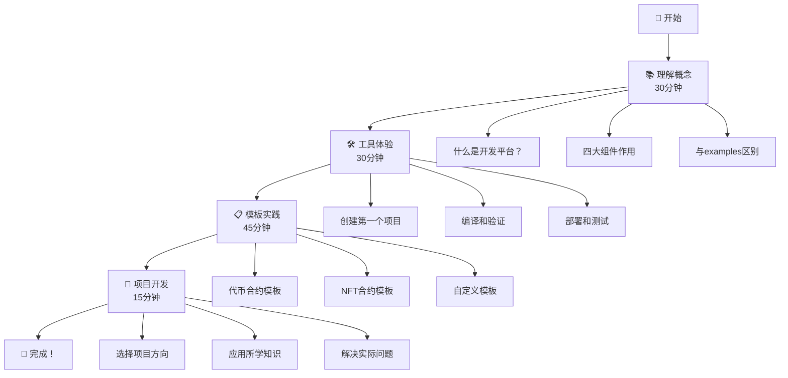

# 🔰 Contracts初学者完整指南

　　欢迎来到WES智能合约开发平台！这份指南将手把手教你从零开始掌握contracts的使用，让你在2小时内从初学者变成能独立开发合约的开发者。

## 🎯 你将学到什么？

**完成这份指南后，你将能够：**
- ✅ **5分钟创建**一个代币合约项目
- ✅ **10分钟完成**从编写到部署的完整流程  
- ✅ **独立解决**90%的常见开发问题
- ✅ **自信地开始**你的第一个区块链项目

## 🚀 学前准备

### 📋 你需要具备：
- ✅ 完成了 `examples/basic/hello-world` 学习
- ✅ 基本的Go语言知识（知道函数、变量、if语句即可）
- ✅ 安装了TinyGo编译器
- ✅ 有一颗对区块链开发的好奇心 ❤️

### ⏰ 预计学习时间：
- **快速体验**: 30分钟（如果你赶时间）
- **完整学习**: 2小时（推荐，稳扎稳打）
- **深度掌握**: 半天（如果你想成为专家）

---

## 🗺️ 完整学习地图



---

## 📚 第一阶段：概念理解 (30分钟)

### 🤔 什么是智能合约开发平台？

#### 🏗️ 用建房子来类比：

| 开发阶段 | 传统方式 | 平台方式 |
|---------|----------|----------|
| **设计** | 📐 自己画图纸 | 📋 选择标准图纸(模板) |
| **施工** | 🔨 手工建造 | 🏭 机器辅助(工具) |
| **材料** | 🛒 到处采购 | 📦 标准套件(SDK) |
| **检验** | 👀 肉眼观察 | 🔍 专业检测(验证) |

**结果**：开发时间从几周缩短到几小时！

### 🧩 四大核心组件

#### 1. 📋 模板库 (Templates) - "标准图纸"
```
🎓 学习版 → 详细注释，概念教学，适合新手
📋 标准版 → 生产就绪，最佳实践，日常使用  
🏢 企业版 → 高级功能，安全优化，大型项目
```

#### 2. 🛠️ 工具链 (Tools) - "专业设备"
```
🏗️ Scaffold → 项目脚手架，快速创建项目结构
🔨 Compiler → 智能编译器，Go代码转WASM
🛡️ Verifier → 安全验证器，检查潜在问题
🚀 Deployer → 部署管理器，一键发布上线
```

#### 3. 📚 SDK框架 (SDK) - "标准工具包"
```
🏠 合约基础 → 提供基本的合约结构和接口
🔗 区块链交互 → 封装复杂的底层区块链操作
📊 类型定义 → 标准的数据类型和错误处理
🧪 测试框架 → 完整的合约测试和调试支持
```

#### 4. ⚙️ 系统合约 (System) - "基础设施"
```
🗳️ 治理合约 → 社区投票和决策机制
💎 质押合约 → 代币质押和奖励分发
💧 水龙头合约 → 测试网络代币发放
💸 转账合约 → 基础的资产转移功能
```

### 🎯 学习重点理解

**重要概念澄清**：
- **Examples** = 样板房参观（学习什么是房子）
- **Contracts** = 建筑工厂（提供建房的工具和材料）

**核心价值**：
- ⏰ **效率提升** - 从几周到几小时
- 🛡️ **质量保证** - 经过验证的代码模板
- 📚 **降低门槛** - 新手也能开发复杂合约

---

## 🛠️ 第二阶段：工具体验 (30分钟)

### 🚀 创建你的第一个项目 (10分钟)

#### 步骤1：使用脚手架工具
```bash
# 🎯 进入contracts目录
cd contracts/

# 🏗️ 启动项目创建助手
./tools/beginner/easy-scaffold.sh
```

#### 步骤2：回答引导问题
```
🤔 你想创建什么类型的合约？
1) 💰 代币合约 (让用户可以转账、查询余额)
2) 🖼️  NFT合约 (创建独特的数字收藏品)  
3) 🎮 游戏合约 (积分、道具等功能)
4) 💡 自定义合约 (从空白模板开始)

请输入选择 (1-4): 1

📝 给你的合约起个名字: MyFirstToken
👤 你的名字 (作为作者): Alice

🔨 正在创建合约...
🎊 合约创建成功！
📁 项目位置: ./MyFirstToken
```

#### 步骤3：查看生成的项目结构
```bash
cd MyFirstToken
tree .
```

```
MyFirstToken/
├── 📖 README.md              # 项目说明文档
├── 📝 src/
│   └── main.go               # 合约主代码（有详细注释）
├── 🧪 tests/
│   └── main_test.go          # 测试代码
├── 📋 config/
│   ├── deploy.json           # 部署配置
│   └── metadata.json         # 合约元数据
├── 🔨 scripts/
│   ├── build.sh             # 编译脚本
│   ├── deploy.sh            # 部署脚本
│   └── test.sh              # 测试脚本
└── 📦 build/                 # 编译输出目录
```

### 🔨 编译和验证 (10分钟)

#### 步骤1：查看源代码
```bash
# 📖 看看生成的合约代码（有详细注释）
cat src/main.go
```

**你会看到**：
- 📚 详细的概念解释注释
- 🎯 清晰的功能模块划分
- 💡 生活化的类比说明
- ✅ 完整的错误处理

#### 步骤2：编译合约
```bash
# 🔨 使用简化编译工具
./scripts/build.sh
```

**编译过程**：
```
🔨 WES智能合约编译助手
================================
ℹ️  检测到系统: macOS
🔸 检查TinyGo编译器...
✅ TinyGo已安装: tinygo version 0.30.0
🔸 编译智能合约...
✅ 编译成功! 🎉
📁 输出文件: build/main.wasm
📏 文件大小: 15234 bytes
```

#### 步骤3：安全验证
```bash
# 🛡️ 验证合约安全性
../tools/beginner/verify.sh build/main.wasm
```

**验证结果**：
```
🛡️ 合约安全验证报告
===================
✅ 语法检查通过
✅ 安全模式检查通过  
✅ 资源使用检查通过
✅ 接口规范检查通过
🎊 验证完成，合约可以安全部署！
```

### 🚀 部署和测试 (10分钟)

#### 步骤1：部署到测试网
```bash
# 🚀 部署到测试网络
./scripts/deploy.sh testnet
```

**部署过程**：
```
🚀 WES合约部署助手
==================
📡 连接到测试网络...
📦 上传合约文件...
⚙️  初始化合约...
✅ 部署成功!

📊 部署信息:
合约地址: 0x742d35Cc6634C0532925a3b8D427dF23B84A5
部署交易: 0x9c22fe0c46b8a0156e7ff0c6b4c4a1a1f0b2e4d3...
部署时间: 2024-01-15 14:30:25

💾 部署信息已保存到: config/deployment.json
```

#### 步骤2：测试合约功能
```bash
# 🧪 运行完整测试
./scripts/test.sh
```

**测试结果**：
```
🧪 MyFirstToken合约测试
=====================
✅ 合约信息查询 - 通过
✅ 代币转账功能 - 通过  
✅ 余额查询功能 - 通过
✅ 事件发出验证 - 通过

📊 测试总结: 4/4 通过 (100%)
🎉 恭喜！你的合约运行完美！
```

---

## 📋 第三阶段：模板实践 (45分钟)

### 💰 深入学习代币合约 (20分钟)

#### 🔍 理解代币合约结构
```bash
# 📖 阅读学习版代币模板
cat ../templates/learning/simple-token/README.md
cat ../templates/learning/simple-token/src/main.go
```

**核心概念理解**：

1. **🪙 什么是代币？**
   ```
   代币 = 数字化的"货币"
   - 可以转账给其他人
   - 可以查询自己有多少  
   - 记录总共发行了多少
   - 就像游戏里的金币！
   ```

2. **🔄 转账机制**
   ```go
   // 💰 UTXO转账简单理解：
   // 传统方式：A账户-100，B账户+100
   // UTXO方式：销毁A的100代币UTXO，创建B的100代币UTXO
   
   func Transfer(from, to, amount) {
       // 1. 验证发送方有足够余额
       // 2. 销毁发送方的UTXO
       // 3. 创建接收方的UTXO  
       // 4. 发出转账事件
   }
   ```

3. **💡 余额查询**
   ```go
   func GetBalance(address) {
       // 在WES中查询余额 = 统计地址拥有的所有UTXO总和
       balance := framework.QueryBalance(address, tokenID)
       return balance
   }
   ```

#### 🛠️ 定制化修改练习
```bash
# 📝 复制模板开始定制
cp -r ../templates/learning/simple-token/ ./MyCustomToken
cd MyCustomToken
```

**练习任务**：
1. 修改代币名称和符号
2. 调整初始发行量  
3. 添加自定义的转账手续费
4. 增加暂停/恢复功能

### 🖼️ 学习NFT合约 (15分钟)

#### 🔍 理解NFT核心概念
```bash
# 📖 阅读NFT模板
cat ../templates/learning/basic-nft/README.md
```

**NFT vs 代币区别**：

| 特性 | 代币 (Token) | NFT |
|------|-------------|-----|
| **唯一性** | 🔄 可互换 | ⭐ 独一无二 |
| **用途** | 💰 支付媒介 | 🖼️ 数字收藏 |
| **价值** | 📊 数量决定 | 🎨 稀有度决定 |
| **例子** | 人民币、美元 | 艺术品、门票 |

#### 🎨 NFT功能理解
```go
// 🖼️ NFT铸造 - 创建独特的数字资产
func MintNFT(to, tokenURI) {
    // 1. 生成唯一的token ID
    // 2. 将NFT所有权给到指定地址
    // 3. 设置NFT的元数据URI
    // 4. 发出铸造事件
}

// 🔄 NFT转移 - 转移所有权
func TransferNFT(from, to, tokenID) {
    // 1. 验证发送方拥有该NFT
    // 2. 转移所有权到接收方
    // 3. 发出转移事件
}
```

### 🎮 自定义合约开发 (10分钟)

#### 🚀 从空白模板开始
```bash
# 💡 使用空白模板创建游戏合约
./tools/beginner/easy-scaffold.sh
# 选择：4) 自定义合约
# 名称：MyGameContract
```

#### 🎯 实现简单游戏功能
```go
// 🎮 简单的积分游戏合约
func EarnPoints(player, points) {
    // 玩家完成任务获得积分
}

func SpendPoints(player, points, item) {
    // 玩家消费积分购买道具
}

func GetPlayerScore(player) {
    // 查询玩家总积分
}
```

---

## 🚀 第四阶段：项目开发 (15分钟)

### 🎯 选择你的项目方向

**根据兴趣选择一个方向深入：**

#### 💰 方向1：创业代币项目
```
💡 项目想法：为你的社区/团队创建代币
🎯 学习目标：
- 代币经济学设计
- 社区治理机制
- 激励分配策略

📋 下一步：
1. 使用 templates/standard/token/
2. 学习高级代币功能
3. 设计代币分发机制
```

#### 🖼️ 方向2：数字艺术NFT  
```
💡 项目想法：创建数字艺术收藏平台
🎯 学习目标：
- NFT元数据管理
- 版税分配机制
- 市场交易功能

📋 下一步：
1. 使用 templates/standard/nft/
2. 学习IPFS元数据存储
3. 设计交易市场功能
```

#### 🎮 方向3：区块链游戏
```
💡 项目想法：开发链上游戏系统
🎯 学习目标：
- 游戏状态管理
- 道具系统设计  
- 玩家激励机制

📋 下一步：
1. 使用 templates/learning/starter/
2. 设计游戏经济模型
3. 实现核心游戏逻辑
```

### 📈 制定学习计划

#### 🎯 短期目标 (1-2周)
- [ ] 完成第一个完整项目
- [ ] 掌握所选方向的基础知识
- [ ] 能独立解决常见问题

#### 🚀 中期目标 (1-2个月)  
- [ ] 开发实际可用的合约
- [ ] 理解高级功能和优化
- [ ] 参与社区讨论和贡献

#### 🌟 长期目标 (3-6个月)
- [ ] 成为WES生态的活跃开发者  
- [ ] 开发有影响力的项目
- [ ] 帮助其他新手学习成长

---

## 🎊 完成检查清单

### ✅ 概念理解
- [ ] 理解智能合约开发平台的价值
- [ ] 明确四大组件的作用和关系
- [ ] 知道templates、tools、SDK的使用方法

### ✅ 实践技能
- [ ] 能使用脚手架创建新项目
- [ ] 会编译、验证、部署合约
- [ ] 掌握基础的模板定制方法

### ✅ 项目能力
- [ ] 能独立开发简单的代币合约
- [ ] 理解NFT的基本概念和实现
- [ ] 有信心开始自己的区块链项目

### ✅ 持续学习
- [ ] 知道如何查找文档和获得帮助
- [ ] 了解社区资源和学习路径
- [ ] 有明确的进阶学习计划

---

## 🤝 获得帮助和支持

### 📖 学习资源
- **快速参考**: [QUICK_START.md](QUICK_START.md)
- **概念深入**: [CONCEPTS.md](CONCEPTS.md)  
- **API文档**: [sdk/README.md](sdk/README.md)
- **模板说明**: [templates/README.md](templates/README.md)

### 💬 遇到问题？

#### 🔍 自助解决
1. **查看日志** - 编译和部署错误通常有详细说明
2. **阅读注释** - 模板代码有丰富的解释
3. **参考examples** - 回到examples目录查看基础概念

#### 🆘 寻求帮助
1. **文档搜索** - 在各README中搜索关键词
2. **社区讨论** - GitHub Issues或开发者群组
3. **专家咨询** - 联系WES核心开发团队

### 🎯 进阶学习路径

#### 📚 深入学习建议
1. **阅读源码** - 研究templates/standard/的实现
2. **性能优化** - 学习执行费用优化和性能调优  
3. **安全实践** - 理解常见安全问题和防范
4. **生态集成** - 学习与其他WES组件的集成

#### 🚀 贡献社区
1. **分享经验** - 写文章分享学习心得
2. **改进文档** - 发现问题及时反馈
3. **开发工具** - 为社区开发有用的工具
4. **帮助新手** - 在社区回答其他人的问题

---

## 🎉 恭喜完成学习！

你已经从一个区块链新手成长为能够独立开发智能合约的开发者！

**🌟 你现在具备的能力**：
- ✅ 理解区块链和智能合约的核心概念
- ✅ 熟练使用WES开发平台的工具和模板
- ✅ 能够开发、测试、部署智能合约
- ✅ 有信心解决大部分开发问题

**🚀 接下来的旅程**：
- 🎯 专注于你选择的项目方向
- 📚 持续学习高级功能和最佳实践
- 🤝 积极参与WES社区建设
- 🌟 开发有影响力的区块链应用

**记住**：每个专家都曾经是初学者。继续保持学习的热情，你将在区块链世界创造出令人惊叹的作品！

**下一站**：开始你的第一个真实项目！🚀
