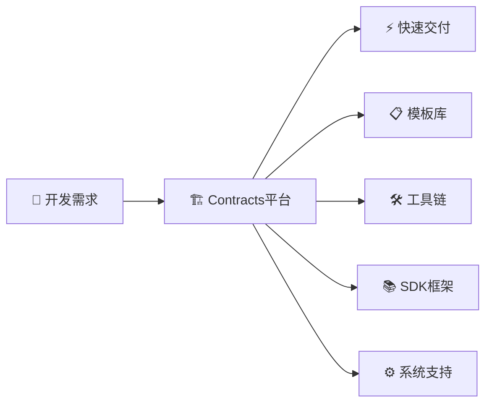
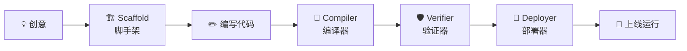

# 💡 Contracts核心概念解释

　　这份文档专门为刚从examples进阶到contracts的开发者准备，用简单语言解释智能合约开发平台的核心概念。

## 🏗️ 什么是智能合约开发平台？

### 📚 生活化理解

　　如果说智能合约开发是"建房子"，那么：

- **Examples** = 参观样板房（学习什么是房子）
- **Contracts** = 建筑工厂（提供建房工具和材料）

### 🎯 开发平台的作用



**核心价值**：从"手工作坊"到"现代化工厂"
- ⏰ **开发时间**：从几周到几小时
- 🛡️ **代码质量**：从可能有bug到经过验证  
- 🎯 **学习曲线**：从需要专家到新手可用

---

## 🧩 四大核心组件详解

### 1. 📋 模板库 (Templates)

#### 🤔 什么是模板？
　　模板就像"房屋设计图纸"，提供了标准的合约结构和功能实现。

#### 🔍 模板 vs Examples对比

| 特性 | Examples示例 | Templates模板 |
|------|-------------|---------------|
| **目的** | 🎓 教学演示 | 🏭 生产开发 |
| **完整性** | 📖 功能展示 | 🔧 可直接使用 |
| **定制性** | ❌ 不建议修改 | ✅ 专为定制设计 |
| **复杂度** | 🟢 简单易懂 | 🟡 功能完整 |
| **使用场景** | 📚 学习理解 | 💼 实际项目 |

#### 🎯 模板分类

```
templates/
├── learning/          # 🎓 学习版：详细注释，概念教学
│   ├── simple-token/   # 最简代币，理解基础概念
│   ├── basic-nft/      # 基础NFT，学习唯一性
│   └── starter/        # 空白模板，自由发挥
├── standard/          # 📋 标准版：生产就绪，最佳实践
│   ├── token/          # 标准代币，功能完整
│   ├── nft/            # 标准NFT，行业规范
│   └── defi/           # DeFi协议，高级功能
└── production/        # 🏢 企业版：企业级，安全优化
    ├── enterprise-token/
    └── institutional-nft/
```

### 2. 🛠️ 工具链 (Tools)

#### 🤔 什么是工具链？
　　工具链就像"建筑设备"，帮你高效完成开发的各个步骤。

#### 🔄 开发流程工具



#### 🎯 工具分级

| 工具类型 | 目标用户 | 特点 | 使用场景 |
|---------|---------|------|----------|
| **beginner/** | 🔰 初学者 | 简化操作，交互引导 | 学习和入门 |
| **standard/** | 👨‍💻 开发者 | 功能完整，配置灵活 | 日常开发 |
| **advanced/** | 🏗️ 专家 | 高度定制，性能优化 | 企业项目 |

### 3. 📚 SDK框架 (SDK)

#### 🤔 什么是SDK？
　　SDK就像"标准工具包"，提供了所有开发合约需要的基础功能。

#### 🧰 SDK组成

```
sdk/go/framework/
├── 🏠 contract_base.go      # 合约基础结构
├── 🔗 host_functions.go     # 区块链交互功能  
├── 📊 types.go             # 数据类型定义
├── 🧪 testing/             # 测试框架
└── 📖 examples/            # 使用示例
```

#### 💡 核心功能类比

| SDK功能 | 生活类比 | 技术说明 |
|---------|----------|----------|
| **GetCaller()** | 查看来电显示 | 获取调用者地址 |
| **EmitEvent()** | 发朋友圈 | 发出区块链事件 |
| **TransferUTXO()** | 转账支付 | 执行代币转账 |
| **SetReturnData()** | 回复消息 | 返回执行结果 |

### 4. ⚙️ 系统合约 (System)

#### 🤔 什么是系统合约？
　　系统合约就像"基础设施"，提供区块链的核心功能支持。

#### 🏗️ 系统服务

```
system/
├── governance_contract.wasm    # 🗳️ 治理投票
├── staking_contract.wasm      # 💎 质押挖矿  
├── faucet_contract.wasm       # 💧 测试代币
└── transfer_contract.wasm     # 💸 基础转账
```

---

## 🔄 开发流程详解

### 📝 传统开发 vs 平台开发

#### 😰 传统方式（手工作坊）
```
1. 📖 学习区块链原理 (1周)
2. ✏️ 从零编写合约 (2-3天)  
3. 🐛 调试各种问题 (1-2天)
4. 🔧 手动编译部署 (半天)
5. 😅 祈祷没有bug...
```

#### 😎 平台方式（现代化工厂）
```
1. 🎯 选择合适模板 (5分钟)
2. ✏️ 定制业务逻辑 (2小时)
3. 🔨 一键编译验证 (2分钟)
4. 🚀 自动部署上线 (5分钟)  
5. 🎉 享受成功喜悦！
```

### 🎯 具体开发步骤

#### 步骤1：选择模板 (5-10分钟)
```bash
# 🤔 我要开发什么？
# 💰 代币合约 → templates/learning/simple-token/
# 🖼️ NFT合约 → templates/learning/basic-nft/  
# 🎮 游戏合约 → templates/learning/starter/
```

#### 步骤2：创建项目 (2-5分钟)  
```bash
# 🏗️ 使用脚手架工具
./tools/beginner/easy-scaffold.sh

# 💬 回答几个简单问题：
# - 合约名称：MyToken
# - 作者姓名：Alice
# - 合约类型：代币合约
```

#### 步骤3：定制开发 (30分钟-2小时)
```go
// ✏️ 修改生成的代码，添加自己的业务逻辑
func Transfer(...) {
    // 🎯 这里实现你的转账逻辑
    // 💡 模板已经提供了基础结构，你只需要填充细节
}
```

#### 步骤4：编译验证 (2-5分钟)
```bash
# 🔨 一键编译
./tools/beginner/simple-build.sh

# 🛡️ 安全验证  
./tools/beginner/verify.sh
```

#### 步骤5：部署运行 (5-10分钟)
```bash
# 🚀 部署到测试网
./tools/beginner/quick-deploy.sh testnet

# 🎉 部署成功，获得合约地址！
```

---

## 🎯 学习策略建议

### 🥇 初学者路径（推荐）

1. **📚 概念理解** (30分钟)
   - 阅读本文档理解核心概念
   - 明确与examples的区别和联系

2. **🛠️ 工具体验** (30分钟)  
   - 使用beginner工具创建第一个项目
   - 体验完整的开发流程

3. **📋 模板学习** (1小时)
   - 从simple-token开始
   - 理解模板的结构和设计思路
   - 尝试小幅修改和定制

4. **🚀 项目实践** (开放时间)
   - 开发自己的第一个合约项目
   - 解决实际问题，应用所学知识

### 💡 学习小贴士

- **🎯 目标导向** - 带着具体项目需求来学习
- **🔄 迭代改进** - 从简单开始，逐步增加复杂性
- **📖 读懂模板** - 理解为什么这样设计，而不只是怎么用
- **🤝 寻求帮助** - 遇到问题及时查阅文档或求助社区

---

## 🆘 常见概念澄清

### ❓ Q: Templates和Examples有什么本质区别？
**A**: 
- **Examples**：教你"什么是智能合约"（概念学习）
- **Templates**：教你"如何高效开发智能合约"（工具使用）

### ❓ Q: 为什么需要这么多工具？
**A**: 就像建房子需要不同的设备一样：
- **Scaffold** = 打地基的设备
- **Compiler** = 建筑材料加工机  
- **Verifier** = 质量检测仪
- **Deployer** = 吊车安装设备

### ❓ Q: SDK和直接调用区块链API有什么区别？
**A**:
- **直接API** = 手工制作（复杂、易错、耗时）
- **SDK** = 使用专业工具（简单、可靠、高效）

### ❓ Q: 什么时候使用learning模板，什么时候用standard模板？
**A**:
- **Learning** = 学习阶段，理解概念，详细注释
- **Standard** = 开发阶段，生产就绪，最佳实践

---

## 🎊 准备开始了吗？

现在你应该理解了：
- ✅ Contracts是什么，为什么重要
- ✅ 四大组件的作用和关系  
- ✅ 开发流程和学习路径
- ✅ 与Examples的区别和联系

**👉 下一步**: 开始实际体验 → [QUICK_START.md](QUICK_START.md)

---

**🌟 记住**: Contracts不是让开发变得复杂，而是让复杂的开发变得简单！
