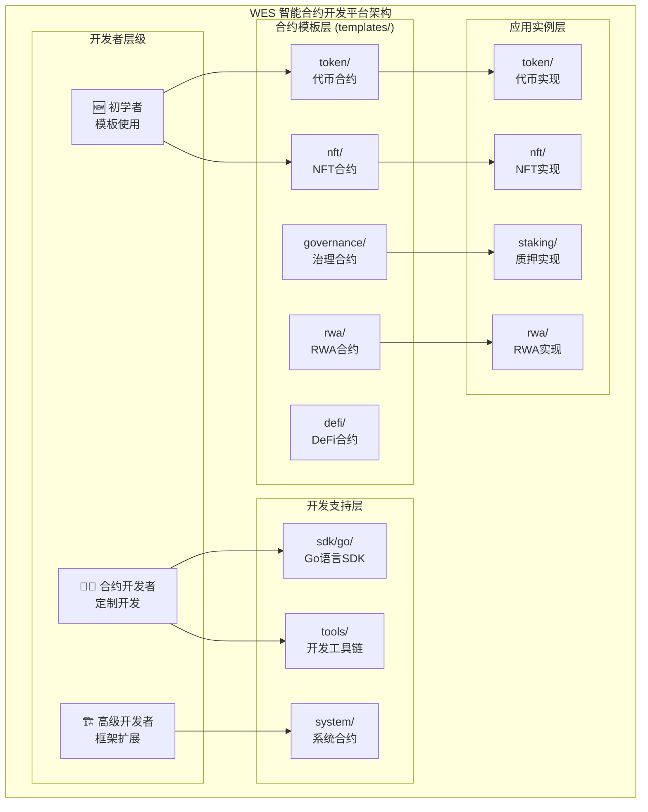

# WES 智能合约开发平台（contracts）

## 📌 版本与组件定位

- **版本**：1.0
- **状态**：stable（目录结构已稳定，但工具链仍在演进）
- **最后更新**：2025-11-15
- **最后审核**：2025-11-15
- **所有者**：合约平台组
- **适用范围**：WES 项目中智能合约开发、模板、系统合约与测试

**智能合约开发平台（contracts）** 为智能合约开发者提供完整的开发基础设施：

- 在 **业务层面** 提供标准化合约模板（代币、质押、治理等）
- 在 **平台层面** 提供系统级合约（转账、治理、质押等链上核心能力）
- 在 **测试层面** 与 `models/` 的 AI 模型示例、以及合约 SDK 模块 **@go.mod `github.com/weisyn/contract-sdk-go`** 的示例一起，
  形成一套 **统一的示例与测试规范体系**

整体关系可以简单理解为：

- `models/`：以 **AI 模型** 为核心的测试与示例平台
- `contracts/`：以 **智能合约** 为核心的开发与测试平台
- 合约 SDK：以 **@go.mod `github.com/weisyn/contract-sdk-go`** 为标识，连接运行时与合约代码

## 🎯 设计原则

- 模板驱动：提供标准化合约模板，覆盖主要应用场景
- 工具链完整：从开发、编译、测试到部署的完整工具支持
- 安全优先：内置安全检查和最佳实践指导
- 高性能：基于 WASM 的高效执行和优化编译
- 易用性：简化开发流程，降低智能合约开发门槛

## 📋 核心职责

1. **🧰 合约 SDK（外部模块）**  
   Go 语言智能合约 SDK，**正式标识为**：@go.mod `github.com/weisyn/contract-sdk-go`。  
   - **SDK 模板库**：SDK 提供完整的合约开发模板（`templates/learning/` 和 `templates/standard/`），开发者通过 `go get` 即可获得
   - 当前源码临时放置于主仓库根目录下，后续将迁移为独立 GitHub 仓库，对外只以模块路径为准
2. **📋 资源级合约示例**（`examples/`）  
   提供固定行为的合约可执行资源，用于平台功能验证与回归测试（详见 `contracts/examples/README.md`）。
3. **🔧 开发与验证工具**（`tools/`）  
   提供合约验证、分析等工具，目前已实现 `tools/verifier/`，后续会逐步补全编译、部署、脚手架工具链。
4. **⚙️ 系统合约**（`system/`）  
   提供区块链系统级核心合约（转账、质押、治理等），作为业务合约的“内核能力”。
5. **标准制定**：建立智能合约开发的行业标准和最佳实践（接口规范、模板规范、测试规范）。
6. **统一测试框架**：与 `models/` 一样，通过标准示例与测试用例，确保平台行为稳定可验证。

---

## 🧱 资源级 vs 场景级（与 models/examples 的关系）

- **资源级合约示例**（`contracts/examples/`）：  
  - 每个子目录对应一个可执行合约（WASM）资源，包含：
    - 合约源码（`src/`）
    - `README.md`（导出函数、参数、状态/事件）
    - `testcases/default.json`（标准调用与预期结果）
  - 用于单合约的功能验证与回归测试。

- **资源级模型示例**（`models/examples/`）：  
  - 每个子目录对应一个 ONNX 模型资源，包含模型文件、说明与测试用例。

- **场景级应用示例**（仓库根 `examples/`）：  
  - 面向业务场景（例如 DeFi、RWA 等），组合使用：
    - 模型资源（`models/examples`）
    - 合约资源（`contracts/examples` 或系统合约）
    - 客户端 / SDK 调用
  - 用于端到端流程演示和系统级测试。

## 🏗️ 合约架构



## 📁 文件结构（当前落地状态）

> 注意：下面的文件结构反映的是 **当前仓库实际状态**，早期文档中提到的 `sdk/`、`compiler/`、`deployer/`、`scaffold/` 等目录目前尚未落地，将在未来版本中逐步补齐。

| 路径 | 类型 | 功能描述 | 维护状态 |
|------|------|----------|----------|
| **`examples/`** | 资源级示例 | 固定行为的合约可执行资源（`basic/` + `edge_cases/`），用于功能验证 | 🟢 活跃 |
| ├─ `basic/` | 基础示例 | 基本功能测试（hello-world, simple-token） | ✅ 已就绪 |
| ├─ `edge_cases/` | 边缘情况 | 边界条件测试（待补充） | 📝 规划中 |
| **`tools/verifier/`** | 工具 | 合约验证工具（目前为 Go 可执行程序） | 🟡 部分就绪 |

**合约模板**：由合约 SDK 模块提供（**@go.mod `github.com/weisyn/contract-sdk-go`**），包含 `templates/learning/` 和 `templates/standard/`，开发者通过 `go get github.com/weisyn/contract-sdk-go` 即可获得

配套的外部模块与目录：

| 标识 | 类型 | 功能描述 | 维护状态 |
|------|------|----------|----------|
| **@go.mod `github.com/weisyn/contract-sdk-go`** | 外部 SDK 模块 | Go 合约 SDK 模块（正式标识，源码位置可变），包含 `templates/learning/` 和 `templates/standard/` | 🟢 活跃 |
| **`models/examples/`** | 模型资源级示例 | 标准化 ONNX 示范模型与测试用例（结构与 `contracts/examples/` 对齐） | 🟢 活跃 |
| **`examples/`**（仓库根） | 场景级示例 | 组合使用模型、合约等多种资源的端到端场景示例 | 🟢 活跃 |

## 合约模板对比

| 模板类型 | 应用场景 | 技术特点 | 复杂度 | 使用频率 |
|---------|----------|----------|--------|----------|
| **Token** | 代币发行、支付系统 | ERC20兼容、转账授权 | 🟢 简单 | 🔥 高频 |
| **NFT** | 数字艺术、游戏道具 | ERC721兼容、唯一性 | 🟡 中等 | 🔥 高频 |
| **Governance** | DAO治理、社区决策 | 提案投票、权限管理 | 🔴 复杂 | 🟡 中频 |
| **DeFi** | 去中心化交易 | AMM算法、流动性挖矿 | 🔴 复杂 | 🟡 中频 |
| **RWA** | 实物资产代币化 | 资产验证、收益分配 | 🔴 复杂 | 🟢 低频 |

## 开发工具链（当前与规划）

当前已落地的工具：

| 工具 | 路径 | 功能描述 | 输入 | 输出 | 状态 |
|------|------|----------|------|------|------|
| **verifier** | `tools/verifier/` | 合约静态验证/分析 | `.wasm` 字节码 | 安全报告 | 🟡 部分就绪 |

规划中的工具（尚未落地，仅在架构设计中存在）：

| 工具 | 规划路径 | 功能描述 |
|------|----------|----------|
| **scaffold** | `tools/scaffold/` | 项目脚手架生成，基于 `templates/` 快速创建合约项目 |
| **compiler** | `tools/compiler/` | TinyGo → WASM 编译器封装，与 Host ABI 版本对齐 |
| **deployer** | `tools/deployer/` | 合约部署工具，封装 WES 节点/CLI 调用 |

随着这些工具逐步实现，对应的 README 会在本文件中同步更新。

## 🚀 快速开始

## 🚀 新手入门

### 环境准备

**⚠️ 版本要求**：
- **Go**: 1.19 或更高版本
- **TinyGo**: 0.31 或更高版本（重要！）

```bash
# 安装TinyGo编译器
brew tap tinygo-org/tools
brew install tinygo

# 验证环境
tinygo version  # 确保显示 0.31.0 或更高版本
go version      # 确保显示 1.19 或更高版本
```

> 📝 **TinyGo版本说明**：
> - TinyGo 0.30及以下：不兼容（使用旧的wasmimport语法）
> - TinyGo 0.31及以上：完全兼容（使用新的wasmimport语法）

### 创建第一个代币合约（基于模板 + 外部 SDK 模块）
```bash
cd contracts

# 1. 从模板复制（过渡期：使用现有模板目录）
cp -r templates/token MyToken
cd MyToken

# 2. 配置 go.mod（推荐：只使用 SDK 模块标识）
cat <<EOF > go.mod
module my-token

go 1.24

// 合约 SDK 模块
require github.com/weisyn/contract-sdk-go v1.0.0
EOF

# 3. 查看生成的结构
tree .
```

### 开发与测试流程（与 models 的统一思路）
```bash
# 1. 编译合约（直接使用 tinygo，未来会收敛到 tools/compiler）
tinygo build -o build/MyToken.wasm \
  -target=wasi -scheduler=none -no-debug -opt=2 ./src

# 2. 安全验证（已落地工具）
../tools/verifier/verifier -contract build/MyToken.wasm -level strict

# 3. 单元测试：使用合约 SDK 提供的 mock / helper
go test ./... -v

# 4. 集成测试：在 WES 节点上部署并调用（与 models 示例类似）
# （部署与调用命令参考平台文档和 CLI 文档）
```

## 👨‍💻 开发者指南

### 使用模板快速开发
```bash
# 标准模板（推荐使用 contracts/templates/README.md 中列出的标准目录）
# 这里仅示意说明，具体模板路径以 templates/ 实际结构为准

# 代币合约（示例）
cp templates/token/standard_token.go my_token.go

# 质押/治理合约（示例）
cp templates/staking/staking_contract.go my_staking.go
cp templates/governance/governance_contract.go my_governance.go
```

### SDK使用示例
```go
import "contracts/sdk/go/framework"

// 合约主函数
func Transfer() uint32 {
    params := framework.GetContractParams()
    to := params.GetString("to")
    amount := params.GetUint64("amount")
    
    // 执行转账逻辑
    err := framework.CreateUTXO(to, "WES", amount)
    if err != nil {
        return framework.ERROR_TRANSFER_FAILED
    }
    
    // 发送事件
    framework.EmitEvent("Transfer", map[string]interface{}{
        "to": to,
        "amount": amount,
    })
    
    return framework.SUCCESS
}
```

【应用场景指导】

## 🎯 选择合适的合约模板

| 业务需求 | 推荐模板 | 主要功能 |
|---------|----------|----------|
| **项目代币发行** | [Token](templates/token/) | 转账、授权、余额查询 |
| **数字艺术品** | [NFT](templates/nft/) | 铸造、转移、元数据管理 |
| **DAO社区治理** | [Governance](templates/governance/) | 提案、投票、执行 |
| **去中心化交易** | [DeFi](templates/defi/) | 流动性、兑换、挖矿 |
| **实物资产代币化** | [RWA](templates/rwa/) | 资产验证、收益分配 |

【最佳实践】

## 💡 开发最佳实践

### 安全开发原则
- ✅ 输入验证：验证所有外部输入参数
- ✅ 重入保护：使用重入锁保护关键函数
- ✅ 整数安全：防止溢出和下溢攻击
- ✅ 权限控制：实施适当的访问控制机制

### 性能优化技巧
- ⚡ 内存管理：及时释放内存，使用对象池
- ⚡ 计算优化：缓存复杂计算结果
- ⚡ 存储优化：最小化链上存储，批量操作
- ⚡ 执行费用优化：避免循环，使用事件记录

### 代码质量标准
- 📝 清晰命名：使用有意义的变量和函数名
- 📝 完整注释：为复杂逻辑添加详细注释
- 📝 模块化设计：分离关注点，提高可维护性
- 📝 测试覆盖：单元测试、集成测试、边界测试

【监控和运维】

## 📊 合约监控

### 性能监控
```go
func MonitorPerformance() {
    start := framework.GetTimestamp()
    
    // 执行业务逻辑
    
    duration := framework.GetTimestamp() - start
    framework.EmitEvent("Performance", map[string]interface{}{
        "function": "MonitorPerformance",
        "duration_ms": duration,
    })
}
```

### 事件日志
```go
// 业务事件
framework.EmitEvent("Transfer", map[string]interface{}{
    "from": fromAddress,
    "to": toAddress,
    "amount": amount,
    "token": tokenType,
})
```

---

## 📚 相关文档

### 平台文档（高层次视图）

- [智能合约平台文档](../docs/system/platforms/contracts/README.md) - 智能合约平台的综合文档
  - [市场价值](../docs/system/platforms/contracts/market-value.md) - 市场价值和商业潜力
  - [产品设计](../docs/system/platforms/contracts/product-design.md) - 产品特性和用户体验
  - [技术架构](../docs/system/platforms/contracts/technical-architecture.md) - 技术实现架构
  - [应用场景](../docs/system/platforms/contracts/use-cases.md) - 实际应用案例
  - [快速开始](../docs/system/platforms/contracts/getting-started.md) - 开发者快速入门

### 技术实现文档

- [ISPC 组件文档](../docs/components/core/ispc/README.md) - ISPC 核心范式和实现细节
- [WASM 引擎文档](../docs/components/core/ispc/capabilities/unified-engines.md) - WASM 执行引擎架构
- [HostABI 文档](../docs/components/core/ispc/capabilities/hostabi-primitives.md) - HostABI 17个原语设计

### 开发实践文档

- **合约 SDK 模块**：**@go.mod `github.com/weisyn/contract-sdk-go`**（源码位置：`_sdks/contract-sdk-go/`）
  - [SDK README](../_sdks/contract-sdk-go/README.md) - Go 语言合约开发框架
  - [SDK Framework 层](../_sdks/contract-sdk-go/framework/README.md) - HostABI 封装和基础能力
  - [SDK Helpers 层](../_sdks/contract-sdk-go/helpers/README.md) - 业务语义接口
  - **合约 SDK 模块**（**@go.mod `github.com/weisyn/contract-sdk-go`**）：SDK 模板库

### 教程文档

- [合约快速开始](../docs/tutorials/contract-quickstart.md) - 端到端快速入门
- [合约核心概念](../docs/tutorials/contracts/CONCEPTS.md) - 核心概念解释
- [合约学习路径](../docs/tutorials/contracts/LEARNING_PATH.md) - 分阶段学习路径
- [初学者指南](../docs/tutorials/contracts/BEGINNER_GUIDE.md) - 详细初学者教程

---

**最后更新**：2024年12月31日  
**平台版本**：v1.0.0  
**支持语言**：Go (TinyGo)  
**目标架构**：WebAssembly (WASM)  
**合约总数**：20个合约文件，5个模板类型