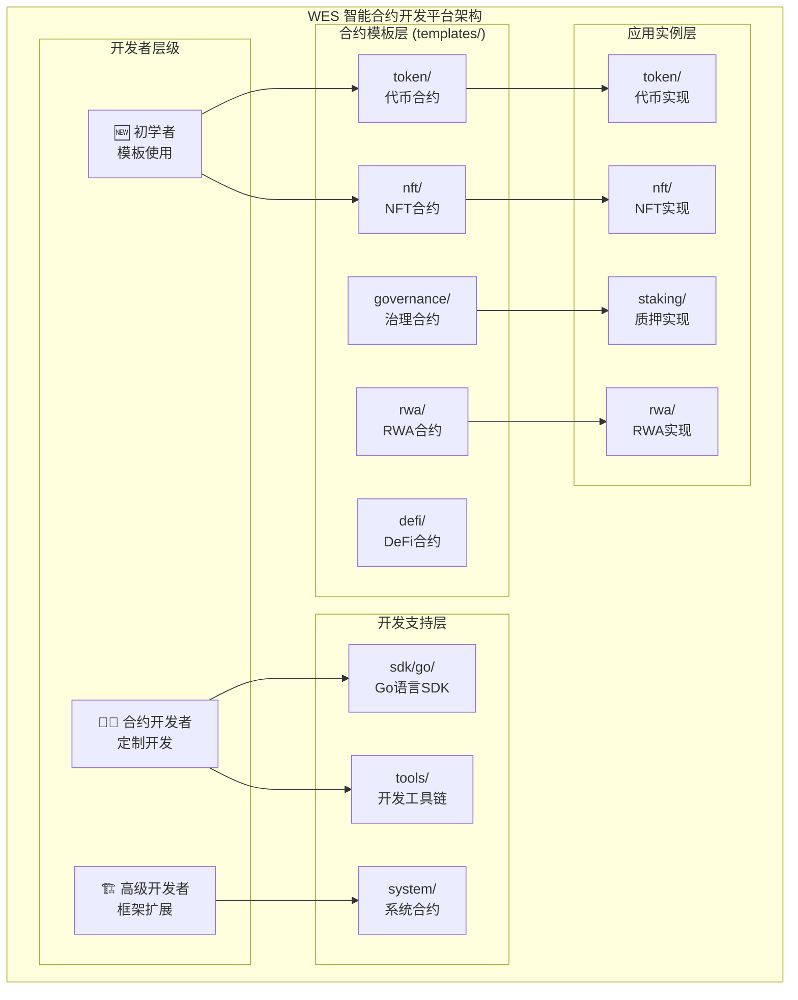
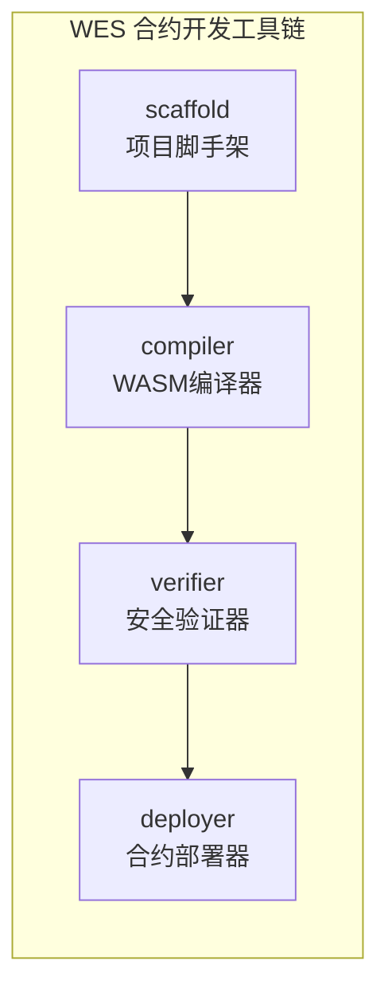

# WES 智能合约开发平台（contracts）

【模块定位】
　　**智能合约开发平台** - 为智能合约开发者提供完整的开发基础设施。本目录专注于提供标准化的开发工具、模板库、SDK框架和系统级合约，确保开发者能够高效、安全地构建生产级智能合约。

【设计原则】
- 模板驱动：提供标准化合约模板，覆盖主要应用场景
- 工具链完整：从开发、编译、测试到部署的完整工具支持
- 安全优先：内置安全检查和最佳实践指导
- 高性能：基于WASM的高效执行和优化编译
- 易用性：简化开发流程，降低智能合约开发门槛

【核心职责】
1. **📋 标准模板库** (`templates/`) - 提供各种合约类型的标准化模板
2. **🧰 开发SDK** (`sdk/`) - 提供Go语言智能合约开发框架
3. **🔧 开发工具** (`tools/`) - 提供编译、部署、验证等开发工具
4. **⚙️ 系统合约** (`system/`) - 提供区块链系统级核心合约
5. **标准制定**：建立智能合约开发的行业标准和最佳实践
6. **开发效率提升**：通过工具链和框架大幅提升开发效率

【合约架构】



【文件结构】

| 路径 | 类型 | 功能描述 | 合约数量 | 维护状态 |
|------|------|----------|----------|----------|
| **[templates/](templates/)** | 模板 | 标准化合约模板库 | 5个模板类型 | 🟢 活跃 |
| └── [token/](templates/token/) | 模板 | 标准代币合约模板 | 1个标准模板 | 🟢 活跃 |
| └── [nft/](templates/nft/) | 模板 | NFT合约模板 | 1个标准模板 | 🟢 活跃 |
| └── [governance/](templates/governance/) | 模板 | DAO治理合约模板 | 1个标准模板 | 🟢 活跃 |
| └── [defi/](templates/defi/) | 模板 | DeFi应用合约模板 | 1个AMM模板 | 🟢 活跃 |
| └── [rwa/](templates/rwa/) | 模板 | 实物资产代币化模板 | 1个RWA模板 | 🟢 活跃 |
| **[sdk/](sdk/)** | 框架 | 智能合约开发SDK | Go语言SDK | 🟢 活跃 |
| └── [go/](sdk/go/) | SDK | Go语言开发框架 | 3个模块 | 🟢 活跃 |
| **[tools/](tools/)** | 工具 | 开发工具链 | 4个工具 | 🟢 活跃 |
| └── compiler/ | 工具 | TinyGo到WASM编译器 | 编译工具 | 🟢 活跃 |
| └── deployer/ | 工具 | 合约部署工具 | 部署工具 | 🟢 活跃 |
| └── scaffold/ | 工具 | 项目脚手架工具 | 脚手架工具 | 🟢 活跃 |
| └── verifier/ | 工具 | 安全验证工具 | 验证工具 | 🟢 活跃 |
| **[system/](system/)** | 系统 | 系统级智能合约 | 7个系统合约 | 🟢 活跃 |
| **[token/](token/)** | 实现 | WES原生代币实现 | 1个代币合约 | 🟢 活跃 |
| **[nft/](nft/)** | 实现 | NFT合约实现示例 | 1个NFT合约 | 🟢 活跃 |
| **[staking/](staking/)** | 实现 | 质押合约实现 | 1个质押合约 | 🟢 活跃 |
| **[rwa/](rwa/)** | 实现 | RWA合约实现示例 | 1个RWA合约 | 🟢 活跃 |
| **[adder/](adder/)** | 示例 | 简单加法合约示例 | 1个示例合约 | 🟡 示例 |

【合约模板对比】

| 模板类型 | 应用场景 | 技术特点 | 复杂度 | 使用频率 |
|---------|----------|----------|--------|----------|
| **Token** | 代币发行、支付系统 | ERC20兼容、转账授权 | 🟢 简单 | 🔥 高频 |
| **NFT** | 数字艺术、游戏道具 | ERC721兼容、唯一性 | 🟡 中等 | 🔥 高频 |
| **Governance** | DAO治理、社区决策 | 提案投票、权限管理 | 🔴 复杂 | 🟡 中频 |
| **DeFi** | 去中心化交易 | AMM算法、流动性挖矿 | 🔴 复杂 | 🟡 中频 |
| **RWA** | 实物资产代币化 | 资产验证、收益分配 | 🔴 复杂 | 🟢 低频 |

【开发工具链】



| 工具 | 功能描述 | 输入 | 输出 | 特点 |
|------|----------|------|------|------|
| **scaffold** | 项目脚手架生成 | 模板类型、项目名 | 完整项目结构 | 一键创建项目 |
| **compiler** | TinyGo到WASM编译 | .go源码 | .wasm字节码 | 优化编译 |
| **verifier** | 安全验证分析 | .wasm字节码 | 安全报告 | 静态分析 |
| **deployer** | 合约部署管理 | .wasm + 配置 | 合约地址 | 多网络支持 |

【快速开始】

## 🚀 新手入门

### 环境准备

**⚠️ 版本要求**：
- **Go**: 1.19 或更高版本
- **TinyGo**: 0.31 或更高版本（重要！）

```bash
# 安装TinyGo编译器
brew tap tinygo-org/tools
brew install tinygo

# 验证环境
tinygo version  # 确保显示 0.31.0 或更高版本
go version      # 确保显示 1.19 或更高版本
```

> 📝 **TinyGo版本说明**：
> - TinyGo 0.30及以下：不兼容（使用旧的wasmimport语法）
> - TinyGo 0.31及以上：完全兼容（使用新的wasmimport语法）

### 创建第一个代币合约
```bash
# 1. 使用脚手架创建项目
cd contracts
./tools/scaffold/scaffold -name MyToken -type token -author "Your Name"

# 2. 进入项目目录
cd MyToken

# 3. 查看生成的结构
tree .
```

### 开发流程
```bash
# 1. 编译合约
../tools/compiler/compiler -input src/MyToken.go -output build/MyToken.wasm

# 2. 安全验证
../tools/verifier/verifier -contract build/MyToken.wasm -level strict

# 3. 运行测试
go test ./tests/... -v

# 4. 部署合约
../tools/deployer/deployer -contract build/MyToken.wasm -network testnet
```

## 👨‍💻 开发者指南

### 使用模板快速开发
```bash
# 代币合约
cp templates/token/standard_token_template.go my_token.go

# NFT合约
cp templates/nft/standard_nft_template.go my_nft.go

# DeFi合约
cp templates/defi/amm_dex_template.go my_dex.go
```

### SDK使用示例
```go
import "contracts/sdk/go/framework"

// 合约主函数
func Transfer() uint32 {
    params := framework.GetContractParams()
    to := params.GetString("to")
    amount := params.GetUint64("amount")
    
    // 执行转账逻辑
    err := framework.CreateUTXO(to, "WES", amount)
    if err != nil {
        return framework.ERROR_TRANSFER_FAILED
    }
    
    // 发送事件
    framework.EmitEvent("Transfer", map[string]interface{}{
        "to": to,
        "amount": amount,
    })
    
    return framework.SUCCESS
}
```

【应用场景指导】

## 🎯 选择合适的合约模板

| 业务需求 | 推荐模板 | 主要功能 |
|---------|----------|----------|
| **项目代币发行** | [Token](templates/token/) | 转账、授权、余额查询 |
| **数字艺术品** | [NFT](templates/nft/) | 铸造、转移、元数据管理 |
| **DAO社区治理** | [Governance](templates/governance/) | 提案、投票、执行 |
| **去中心化交易** | [DeFi](templates/defi/) | 流动性、兑换、挖矿 |
| **实物资产代币化** | [RWA](templates/rwa/) | 资产验证、收益分配 |

【最佳实践】

## 💡 开发最佳实践

### 安全开发原则
- ✅ 输入验证：验证所有外部输入参数
- ✅ 重入保护：使用重入锁保护关键函数
- ✅ 整数安全：防止溢出和下溢攻击
- ✅ 权限控制：实施适当的访问控制机制

### 性能优化技巧
- ⚡ 内存管理：及时释放内存，使用对象池
- ⚡ 计算优化：缓存复杂计算结果
- ⚡ 存储优化：最小化链上存储，批量操作
- ⚡ 执行费用优化：避免循环，使用事件记录

### 代码质量标准
- 📝 清晰命名：使用有意义的变量和函数名
- 📝 完整注释：为复杂逻辑添加详细注释
- 📝 模块化设计：分离关注点，提高可维护性
- 📝 测试覆盖：单元测试、集成测试、边界测试

【监控和运维】

## 📊 合约监控

### 性能监控
```go
func MonitorPerformance() {
    start := framework.GetTimestamp()
    
    // 执行业务逻辑
    
    duration := framework.GetTimestamp() - start
    framework.EmitEvent("Performance", map[string]interface{}{
        "function": "MonitorPerformance",
        "duration_ms": duration,
    })
}
```

### 事件日志
```go
// 业务事件
framework.EmitEvent("Transfer", map[string]interface{}{
    "from": fromAddress,
    "to": toAddress,
    "amount": amount,
    "token": tokenType,
})
```

---

**最后更新**：2024年12月31日  
**平台版本**：v1.0.0  
**支持语言**：Go (TinyGo)  
**目标架构**：WebAssembly (WASM)  
**合约总数**：20个合约文件，5个模板类型