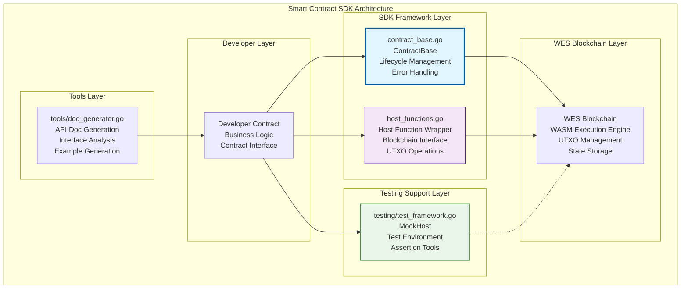

# 智能合约SDK（contracts/sdk）

【模块定位】
　　本目录提供WES智能合约开发的完整SDK框架，为Go语言智能合约开发提供统一的开发框架、测试工具和文档生成器。通过标准化的API和工具链，大幅简化智能合约的开发、测试和部署流程。

【设计原则】
- 开发友好：提供直观易用的开发接口和工具
- 类型安全：强类型的合约开发框架
- 测试驱动：完整的测试框架和模拟环境
- 文档自动化：自动生成API文档和使用指南
- 最佳实践：内置安全和性能最佳实践

【核心职责】
1. **合约框架**：提供合约开发的基础框架和通用接口
2. **宿主函数封装**：封装WES区块链的原生功能
3. **测试框架**：提供完整的合约测试和模拟环境
4. **工具支持**：文档生成、代码分析等开发工具
5. **示例代码**：丰富的示例和最佳实践指导
6. **类型定义**：合约开发相关的标准类型定义

## SDK架构设计



## SDK组件说明

### go/framework/ - 核心框架

#### contract_base.go - 合约基础框架
**功能**：
- `ContractBase` - 合约基类，提供通用功能
- 生命周期管理（初始化、执行、清理）
- 统一的错误处理和日志记录
- 合约元数据和版本管理

**核心接口**：
```go
type Contract interface {
    Initialize(ctx *ContractContext) error
    Execute(method string, params []byte) ([]byte, error)
    GetMetadata() *ContractMetadata
}
```

#### host_functions.go - 宿主函数封装
**功能**：
- 封装WES区块链的原生功能
- UTXO操作（查询、创建、花费）
- 区块链状态查询
- 事件发射和日志记录

**主要函数**：
- `GetUTXO(txHash, index)` - 获取UTXO
- `CreateOutput(amount, address)` - 创建输出
- `EmitEvent(eventType, data)` - 发射事件
- `GetBlockHeight()` - 获取区块高度

### go/testing/ - 测试框架

#### test_framework.go - 测试框架
**功能**：
- `MockHost` - 模拟区块链环境
- 测试断言工具
- 合约测试辅助函数
- 性能基准测试支持

**使用示例**：
```go
func TestTokenTransfer(t *testing.T) {
    host := testing.NewMockHost()
    contract := NewTokenContract()
    
    // 初始化合约
    err := contract.Initialize(host.Context())
    assert.NoError(t, err)
    
    // 执行转账
    result, err := contract.Execute("transfer", transferParams)
    assert.NoError(t, err)
    assert.Equal(t, "success", result.Status)
}
```

### go/tools/ - 开发工具

#### doc_generator.go - 文档生成器
**功能**：
- 自动分析合约接口
- 生成API文档和使用指南
- 提取注释和示例代码
- 生成交互式文档

**使用示例**：
```bash
# 生成合约文档
go run tools/doc_generator.go -contract=./my_contract.go -output=./docs/
```

## 使用指南

### 创建新合约
```go
package main

import (
    "github.com/weisyn/v1/contracts/sdk/go/framework"
)

type MyContract struct {
    framework.ContractBase
}

func (c *MyContract) Initialize(ctx *framework.ContractContext) error {
    // 合约初始化逻辑
    return nil
}

func (c *MyContract) Execute(method string, params []byte) ([]byte, error) {
    switch method {
    case "my_method":
        return c.handleMyMethod(params)
    default:
        return nil, framework.ErrMethodNotFound
    }
}

func (c *MyContract) handleMyMethod(params []byte) ([]byte, error) {
    // 业务逻辑实现
    return []byte("result"), nil
}
```

### 使用宿主函数
```go
import "github.com/weisyn/v1/contracts/sdk/go/framework"

func (c *MyContract) transfer(from, to []byte, amount uint64) error {
    // 检查余额
    utxos, err := framework.GetUTXOsByAddress(from)
    if err != nil {
        return err
    }
    
    // 创建输出
    err = framework.CreateOutput(amount, to)
    if err != nil {
        return err
    }
    
    // 发射事件
    framework.EmitEvent("Transfer", map[string]interface{}{
        "from":   from,
        "to":     to,
        "amount": amount,
    })
    
    return nil
}
```

### 编写测试
```go
func TestMyContract(t *testing.T) {
    // 创建测试环境
    host := testing.NewMockHost()
    contract := &MyContract{}
    
    // 设置测试数据
    host.SetUTXO("addr1", 1000)
    
    // 初始化合约
    err := contract.Initialize(host.Context())
    require.NoError(t, err)
    
    // 执行合约方法
    result, err := contract.Execute("transfer", []byte(`{"to":"addr2","amount":100}`))
    require.NoError(t, err)
    
    // 验证结果
    assert.Equal(t, "success", string(result))
    assert.Equal(t, uint64(900), host.GetBalance("addr1"))
    assert.Equal(t, uint64(100), host.GetBalance("addr2"))
}
```

## 最佳实践

### 1. 错误处理
```go
// 使用统一的错误类型
func (c *MyContract) validateInput(data []byte) error {
    if len(data) == 0 {
        return framework.NewContractError("INVALID_INPUT", "输入数据不能为空")
    }
    return nil
}
```

### 2. 事件发射
```go
// 发射结构化事件
func (c *MyContract) emitTransferEvent(from, to []byte, amount uint64) {
    framework.EmitEvent("Transfer", framework.EventData{
        "from":      framework.AddressToString(from),
        "to":        framework.AddressToString(to),
        "amount":    amount,
        "timestamp": framework.GetTimestamp(),
    })
}
```

### 3. 状态管理
```go
// 使用UTXO模型进行状态管理
func (c *MyContract) updateBalance(address []byte, delta int64) error {
    current := framework.GetBalance(address)
    if int64(current) + delta < 0 {
        return framework.ErrInsufficientBalance
    }
    
    return framework.SetBalance(address, uint64(int64(current) + delta))
}
```

---

## 🔗 相关文档

- **合约模板**：`contracts/templates/README.md` - 标准合约模板
- **开发工具**：`contracts/tools/README.md` - 编译部署工具
- **示例合约**：各合约目录的README - 具体实现示例
- **生产指南**：`contracts/PRODUCTION_CONTRACTS_GUIDE.md` - 生产环境指导