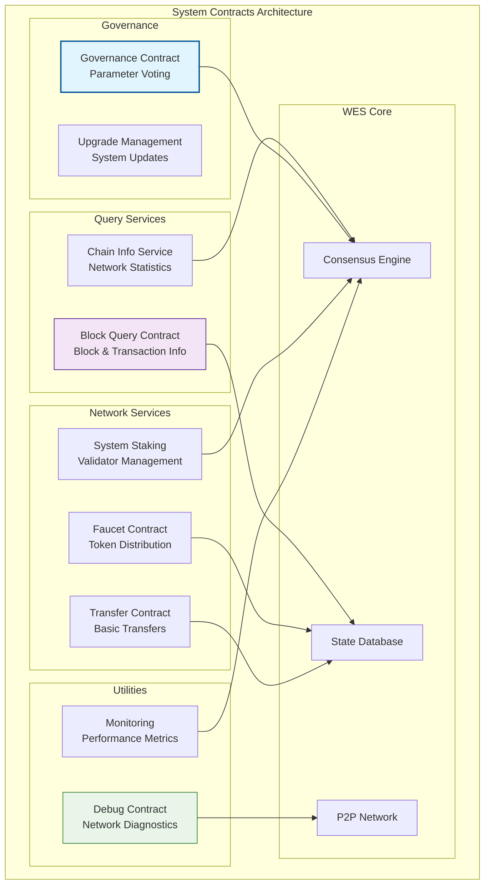

# 系统合约（contracts/system）

【模块定位】
　　本目录包含WES区块链系统的核心系统合约，提供区块链网络运行所需的基础功能和服务。这些合约直接集成到区块链节点中，为网络治理、区块查询、调试和基础服务提供支持。

【设计原则】
- 系统级权限：具有特殊的系统级访问权限
- 高可靠性：经过严格测试，确保网络稳定运行
- 最小化接口：只暴露必要的公共接口
- 安全优先：防范各种攻击和误用
- 向后兼容：保证系统升级时的兼容性

【核心职责】
1. **区块查询服务**：提供区块链数据的查询接口
2. **网络治理**：参数调整和网络升级管理
3. **调试和诊断**：网络问题诊断和调试工具
4. **代币分发**：测试网代币分发（水龙头）
5. **转账服务**：基础转账功能服务
6. **质押管理**：网络质押和验证者管理

## 系统合约列表

### 1. block_query_contract.go - 区块查询合约
**功能**：
- `get_block_by_height(height)` - 根据高度查询区块
- `get_block_by_hash(hash)` - 根据哈希查询区块
- `get_transaction(tx_hash)` - 查询交易详情
- `get_latest_block()` - 获取最新区块信息
- `get_chain_info()` - 获取链基本信息

**使用场景**：
- 区块浏览器后端服务
- 钱包应用查询接口
- 数据分析和统计服务

### 2. governance_contract.wasm - 治理合约
**功能**：
- 网络参数投票和修改
- 系统升级提案管理
- 验证者准入和退出
- 紧急暂停和恢复机制

**治理参数**：
- 区块大小限制
- 执行费用价格参数
- 网络手续费设置
- 共识算法参数

### 3. faucet_contract.wasm - 水龙头合约
**功能**：
- 测试网代币免费分发
- 每日领取限额控制
- 反作弊和反滥用机制
- 分发统计和监控

**分发策略**：
- 每个地址每日最多领取100 WES
- IP地址限制防止批量申请
- 简单的人机验证集成

### 4. transfer_contract.wasm - 转账合约
**功能**：
- 基础代币转账服务
- 批量转账处理
- 转账手续费计算
- 交易历史记录

### 5. staking_contract.wasm - 系统质押合约
**功能**：
- 验证者质押管理
- 委托质押服务
- 奖励分发机制
- 惩罚机制执行

### 6. debug_contract.wasm - 调试合约
**功能**：
- 网络状态诊断
- 性能监控数据收集
- 错误日志聚合
- 节点健康检查

## 系统合约架构



## 使用示例

### 1. 区块查询服务
```bash
# 查询最新区块
weisyn-cli contract call 
  --address $BLOCK_QUERY_CONTRACT 
  --method "get_latest_block" 
  --执行费用-limit 100000

# 根据高度查询区块
weisyn-cli contract call 
  --address $BLOCK_QUERY_CONTRACT 
  --method "get_block_by_height" 
  --params '{"height": 12345}' 
  --执行费用-limit 100000

# 查询交易详情
weisyn-cli contract call 
  --address $BLOCK_QUERY_CONTRACT 
  --method "get_transaction" 
  --params '{"tx_hash": "0x123...abc"}' 
  --执行费用-limit 100000
```

### 2. 测试网水龙头
```bash
# 申请测试币
weisyn-cli contract call 
  --address $FAUCET_CONTRACT 
  --method "request_tokens" 
  --params '{"recipient": "0x456...def"}' 
  --执行费用-limit 200000

# 查询今日剩余额度
weisyn-cli contract call 
  --address $FAUCET_CONTRACT 
  --method "get_daily_limit" 
  --params '{"address": "0x456...def"}' 
  --执行费用-limit 50000
```

### 3. 治理参与
```bash
# 创建治理提案
weisyn-cli contract call 
  --address $GOVERNANCE_CONTRACT 
  --method "create_proposal" 
  --params '{
    "title": "Increase Block Size Limit",
    "description": "Proposal to increase block size from 1MB to 2MB",
    "parameter": "max_block_size",
    "new_value": 2097152,
    "voting_period": 86400
  }' 
  --执行费用-limit 300000

# 投票支持提案
weisyn-cli contract call 
  --address $GOVERNANCE_CONTRACT 
  --method "vote" 
  --params '{"proposal_id": 1, "support": true}' 
  --执行费用-limit 150000
```

### 4. 网络诊断
```bash
# 检查网络状态
weisyn-cli contract call 
  --address $DEBUG_CONTRACT 
  --method "network_health_check" 
  --执行费用-limit 200000

# 获取性能指标
weisyn-cli contract call 
  --address $DEBUG_CONTRACT 
  --method "get_performance_metrics" 
  --执行费用-limit 150000
```

## 部署和管理

### 1. 系统合约部署
```bash
# 部署治理合约（需要特殊权限）
weisyn-cli system deploy 
  --wasm ./governance_contract.wasm 
  --name "System Governance" 
  --system-level true 
  --deployer-key $SYSTEM_KEY

# 注册系统服务
weisyn-cli system register 
  --contract $GOVERNANCE_CONTRACT 
  --service-type "governance" 
  --priority high
```

### 2. 合约升级
```bash
# 创建升级提案
weisyn-cli governance propose-upgrade 
  --contract $BLOCK_QUERY_CONTRACT 
  --new-wasm ./block_query_v2.wasm 
  --migration-script ./migration.js 
  --voting-period 7d

# 执行已通过的升级
weisyn-cli governance execute-upgrade 
  --proposal-id 5 
  --executor-key $ADMIN_KEY
```

## 安全机制

### 1. 权限控制
```go
// 系统级权限检查
func requireSystemPermission() error {
    caller := getCaller()
    if !isSystemContract(caller) && !isAdmin(caller) {
        return errors.New("Unauthorized: system permission required")
    }
    return nil
}

// 治理权限验证
func requireGovernancePermission(action string) error {
    if !hasGovernancePermission(getCaller(), action) {
        return errors.New("Unauthorized: governance permission required")
    }
    return nil
}
```

### 2. 参数验证
```go
func validateProposal(proposal *Proposal) error {
    if len(proposal.Title) == 0 || len(proposal.Title) > 100 {
        return errors.New("Invalid proposal title")
    }
    
    if proposal.VotingPeriod < MIN_VOTING_PERIOD || 
       proposal.VotingPeriod > MAX_VOTING_PERIOD {
        return errors.New("Invalid voting period")
    }
    
    return nil
}
```

### 3. 状态保护
```go
func requireNotPaused() error {
    if isSystemPaused() {
        return errors.New("System is paused")
    }
    return nil
}

func emergencyPause() error {
    requireSystemPermission()
    setSystemPaused(true)
    emitEvent("SystemPaused", getCaller(), getCurrentTime())
    return nil
}
```

## 监控和维护

### 1. 系统指标监控
```go
type SystemMetrics struct {
    TotalBlocks         uint64  `json:"total_blocks"`
    AverageBlockTime    uint64  `json:"avg_block_time"`
    NetworkHashRate     uint64  `json:"network_hashrate"`
    ActiveValidators    uint64  `json:"active_validators"`
    PendingTransactions uint64  `json:"pending_txs"`
    SystemLoad          uint64  `json:"system_load"`
}

func collectSystemMetrics() SystemMetrics {
    return SystemMetrics{
        TotalBlocks:         getLatestBlockHeight(),
        AverageBlockTime:    calculateAverageBlockTime(),
        NetworkHashRate:     getNetworkHashRate(),
        ActiveValidators:    getActiveValidatorCount(),
        PendingTransactions: getPendingTxCount(),
        SystemLoad:          getSystemLoad(),
    }
}
```

### 2. 自动化维护
```go
// 定期清理过期数据
func periodicCleanup() {
    cleanExpiredProposals()
    archiveOldDebugLogs()
    updateNetworkStatistics()
    refreshValidatorSet()
}

// 健康检查
func healthCheck() HealthStatus {
    status := HealthStatus{Healthy: true}
    
    if getLastBlockTime() > getCurrentTime() - MAX_BLOCK_INTERVAL {
        status.Healthy = false
        status.Issues = append(status.Issues, "Block production delayed")
    }
    
    if getValidatorCount() < MIN_VALIDATOR_COUNT {
        status.Healthy = false
        status.Issues = append(status.Issues, "Insufficient validators")
    }
    
    return status
}
```

## 升级和兼容性

### 1. 向后兼容保证
- 保持接口签名不变
- 添加新功能时使用可选参数
- 废弃功能提前通知

### 2. 数据迁移
```go
func migrateContractState(oldVersion, newVersion string) error {
    switch {
    case oldVersion == "1.0" && newVersion == "1.1":
        return migrateV1ToV1_1()
    case oldVersion == "1.1" && newVersion == "2.0":
        return migrateV1_1ToV2()
    default:
        return errors.New("Unsupported migration path")
    }
}
```

---

## 🔗 相关文档

- **治理机制**：`contracts/templates/governance/README.md` - 治理合约模板
- **质押系统**：`contracts/staking/README.md` - 质押合约详情
- **网络规范**：查看网络治理和升级相关文档
- **API文档**：`api/README.md` - 系统API接口说明
