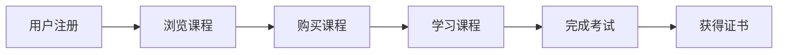

# 🚀 自定义合约开发 - 入门模板

## 🎯 学习目标

通过这个入门模板，你将学会：
- ✅ **从零构建合约** - 理解合约的基本结构和组成
- ✅ **设计合约功能** - 如何规划和实现业务逻辑
- ✅ **最佳实践应用** - 掌握合约开发的标准模式
- ✅ **自由发挥创意** - 实现你独特的合约创意

## 🤔 什么是自定义合约？

### 📚 生活化理解
　　自定义合约就像**自己设计房子**：
- 🏗️ 不使用标准户型（模板），而是根据需求定制
- 📐 自己决定房间布局（功能设计）
- 🎨 选择装修风格（实现方式）
- 🔧 安装特殊设备（独特功能）

### 🎯 适用场景
- **🆕 全新的业务模式** - 现有模板无法满足需求
- **🔀 功能组合** - 需要混合多种不同类型的功能
- **🎮 创新应用** - 探索区块链的新可能性
- **📚 深度学习** - 完全理解合约开发的每个细节

## 🛠️ 合约开发框架

### 📋 基础结构模板
```go
package main

import "github.com/weisyn/v1/contracts/sdk/go/framework"

// ==================== 合约配置区 ====================
const (
    CONTRACT_NAME    = "你的合约名"
    CONTRACT_VERSION = "1.0.0"
    CONTRACT_AUTHOR  = "你的名字"
)

// ==================== 状态管理区 ====================
// 定义合约需要跟踪的状态变量

// ==================== 业务逻辑区 ====================
// 实现具体的业务功能

// ==================== 查询接口区 ====================
// 提供数据查询功能

// ==================== 管理功能区 ====================
// 实现合约管理和配置功能

func main() {}
```

### 🧩 可选功能模块

#### 1. 💰 资产管理模块
```go
// 🎯 适用场景：需要管理代币、积分、资产
func TransferAsset() uint32 {
    // 实现资产转移逻辑
}

func GetBalance() uint32 {
    // 查询资产余额
}
```

#### 2. 👥 用户管理模块
```go
// 🎯 适用场景：需要用户注册、权限管理
func RegisterUser() uint32 {
    // 用户注册逻辑
}

func GetUserInfo() uint32 {
    // 获取用户信息
}
```

#### 3. 🗳️ 投票治理模块
```go
// 🎯 适用场景：需要社区决策、投票功能
func CreateProposal() uint32 {
    // 创建提案
}

func Vote() uint32 {
    // 投票功能
}
```

#### 4. ⏰ 时间锁模块
```go
// 🎯 适用场景：需要定时执行、锁定期
func LockAsset() uint32 {
    // 锁定资产
}

func UnlockAsset() uint32 {
    // 解锁资产
}
```

#### 5. 🎮 游戏逻辑模块
```go
// 🎯 适用场景：游戏合约、互动应用
func PlayGame() uint32 {
    // 游戏逻辑
}

func GetGameState() uint32 {
    // 获取游戏状态
}
```

## 🎨 项目创意示例

### 💡 创意1：数字藏书馆
```
📚 功能描述：
- 用户可以上传电子书籍
- 设置阅读权限和借阅规则
- 实现版权保护和收益分配

🔧 需要的模块：
- 资产管理（书籍NFT）
- 用户管理（读者、作者）
- 时间锁（借阅期限）
```

### 💡 创意2：技能认证平台
```
📜 功能描述：
- 专家发布技能认证挑战
- 学习者完成挑战获得证书
- 证书可以验证和展示

🔧 需要的模块：
- 用户管理（专家、学习者）
- 资产管理（证书NFT）
- 投票治理（专家认证）
```

### 💡 创意3：社区众筹平台
```
💰 功能描述：
- 项目方发起众筹
- 用户投资获得代币或权益
- 项目成功后分配收益

🔧 需要的模块：
- 资产管理（众筹代币）
- 时间锁（众筹期限）
- 投票治理（项目决策）
```

### 💡 创意4：碳积分交易
```
🌱 功能描述：
- 记录个人碳减排行为
- 获得碳积分奖励
- 积分可以交易或兑换

🔧 需要的模块：
- 用户管理（个人档案）
- 资产管理（碳积分）
- 投票治理（标准制定）
```

## 🛠️ 开发步骤指南

### 📝 第一步：需求分析 (30分钟)

#### 🤔 关键问题
1. **你的合约要解决什么问题？**
   ```
   示例：我想创建一个去中心化的技能学习平台
   ```

2. **主要用户是谁？**
   ```
   示例：学习者、专家老师、认证机构
   ```

3. **核心功能有哪些？**
   ```
   示例：课程发布、学习进度跟踪、技能认证
   ```

4. **需要什么类型的资产？**
   ```
   示例：课程NFT、学习积分、技能证书
   ```

#### 📋 需求文档模板
```markdown
## 项目概述
- 项目名称：
- 目标用户：
- 解决问题：

## 功能需求
- 核心功能1：
- 核心功能2：
- 核心功能3：

## 技术需求
- 需要的资产类型：
- 权限管理需求：
- 数据存储需求：
```

### 🏗️ 第二步：架构设计 (45分钟)

#### 🎯 选择功能模块
```
✅ 需要的模块打勾：
□ 资产管理模块
□ 用户管理模块  
□ 投票治理模块
□ 时间锁模块
□ 游戏逻辑模块
□ 自定义模块
```

#### 📊 设计数据结构
```go
// 示例：技能学习平台的数据结构
type Course struct {
    ID          uint64
    Title       string
    Teacher     string
    Price       uint64
    Students    []string
}

type Certificate struct {
    StudentID   string
    CourseID    uint64
    Score       uint64
    IssueTime   uint64
}
```

#### 🔄 设计功能流程


### 💻 第三步：编码实现 (2-4小时)

#### 🚀 使用本模板开始编码
```bash
# 1. 复制模板
cp -r templates/learning/starter-contract/ my-project/

# 2. 进入项目目录
cd my-project/

# 3. 编辑源代码
vim src/main.go

# 4. 根据需求添加功能模块
```

#### 📝 编码建议
1. **先实现核心功能** - 从最重要的功能开始
2. **逐步添加模块** - 不要一次性实现所有功能
3. **频繁测试** - 每完成一个功能就测试一次
4. **详细注释** - 为未来的自己和其他人着想

### 🧪 第四步：测试验证 (1小时)

#### ✅ 测试检查清单
```
基础功能测试：
□ 合约部署成功
□ 所有函数调用正常
□ 参数验证正确
□ 错误处理完善

业务逻辑测试：
□ 核心功能符合预期
□ 边界条件处理正确
□ 权限控制有效
□ 事件发出正常

安全性测试：
□ 不能访问他人资产
□ 不能执行未授权操作
□ 输入数据验证严格
□ 状态更新一致
```

### 🚀 第五步：部署发布 (30分钟)

#### 📦 部署流程
```bash
# 1. 最终编译
./scripts/build.sh

# 2. 安全验证
./scripts/verify.sh

# 3. 部署到测试网
./scripts/deploy.sh testnet

# 4. 功能测试
./scripts/test.sh

# 5. 部署到主网（生产环境）
./scripts/deploy.sh mainnet
```

## 💡 开发最佳实践

### 🛡️ 安全原则

#### 1. 输入验证
```go
// ✅ 好的做法
func ProcessData() uint32 {
    params := framework.GetContractParams()
    data := params.ParseJSON("data")
    
    if data == "" {
        return framework.ERROR_INVALID_PARAMS
    }
    
    // 继续处理...
}
```

#### 2. 权限检查
```go
// ✅ 好的做法
func AdminFunction() uint32 {
    caller := framework.GetCaller()
    if !isAdmin(caller) {
        return framework.ERROR_UNAUTHORIZED
    }
    
    // 执行管理操作...
}
```

#### 3. 状态一致性
```go
// ✅ 好的做法
func TransferAsset() uint32 {
    // 先检查，再执行，最后通知
    
    // 1. 检查条件
    if !checkConditions() {
        return framework.ERROR_INVALID_PARAMS
    }
    
    // 2. 执行操作
    err := executeTransfer()
    if err != nil {
        return framework.ERROR_EXECUTION_FAILED
    }
    
    // 3. 发出事件
    emitEvent()
    
    return framework.SUCCESS
}
```

### 📈 性能优化

#### 1. 减少复杂计算
```go
// ✅ 预计算复杂值
const COMPLEX_CONSTANT = 12345 // 预先计算好

// ❌ 避免在合约中进行复杂计算
func Calculate() uint32 {
    // 避免复杂的数学运算
}
```

#### 2. 优化存储访问
```go
// ✅ 批量操作
func BatchProcess() uint32 {
    // 一次性处理多个操作，减少存储访问次数
}
```

### 🎯 可扩展设计

#### 1. 模块化结构
```go
// 将功能分解为独立的模块
func UserModule() uint32 { /* 用户相关功能 */ }
func AssetModule() uint32 { /* 资产相关功能 */ }
func GameModule() uint32 { /* 游戏相关功能 */ }
```

#### 2. 版本兼容
```go
const CONTRACT_VERSION = "1.0.0"

func GetVersion() uint32 {
    // 提供版本信息，便于升级和兼容性检查
}
```

## 🚀 进阶学习方向

### 📚 深入学习建议

1. **🔧 工具掌握** (1-2周)
   - 熟练使用WES开发工具链
   - 掌握调试和性能分析技巧
   - 学习自动化测试方法

2. **🛡️ 安全深化** (2-3周)
   - 研究常见安全漏洞和防护
   - 学习安全审计方法
   - 实践安全编码规范

3. **⚡ 性能优化** (2-3周)
   - 理解WES的性能特性
   - 学习执行费用优化技巧
   - 掌握存储优化方法

4. **🌐 生态集成** (开放时间)
   - 学习与其他WES组件集成
   - 研究跨链互操作
   - 探索Layer2解决方案

### 🎯 项目实战建议

#### 🥉 初级项目 (1-2周)
- **个人代币** - 为自己或团队创建代币
- **简单投票** - 实现基础的投票功能
- **积分系统** - 为社区创建积分奖励

#### 🥈 中级项目 (1-2个月)
- **众筹平台** - 实现项目众筹功能
- **技能认证** - 创建技能评估和认证系统
- **游戏合约** - 开发简单的链上游戏

#### 🥇 高级项目 (3-6个月)
- **DeFi协议** - 创建借贷或交易协议
- **DAO系统** - 构建完整的去中心化组织
- **元宇宙平台** - 开发虚拟世界基础设施

## 🎊 开始你的创作之旅！

现在你已经具备了：
- ✅ 完整的合约开发框架
- ✅ 丰富的功能模块选择
- ✅ 详细的开发步骤指导
- ✅ 实用的最佳实践建议

**🚀 接下来**：
1. 选择一个你感兴趣的项目创意
2. 使用本模板开始编码实现
3. 在开发过程中不断学习和改进
4. 与WES社区分享你的作品

**记住**：每个伟大的项目都始于一个简单的想法。现在就开始，把你的创意变成现实！

---

**🌟 提示**：如果你刚开始学习合约开发，建议先完成 [simple-token](../simple-token/) 和 [basic-nft](../basic-nft/) 的学习，这将为你使用本模板打下坚实的基础。
