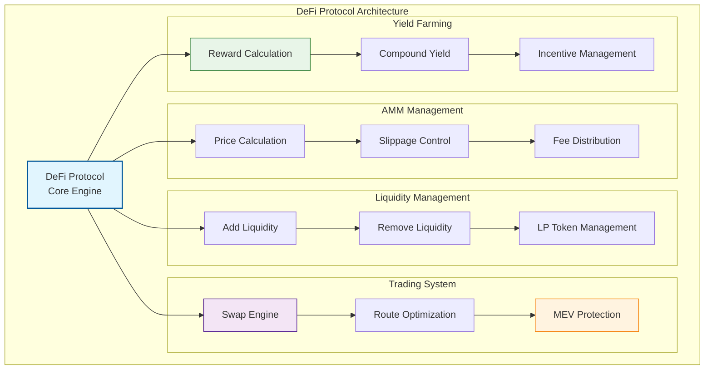
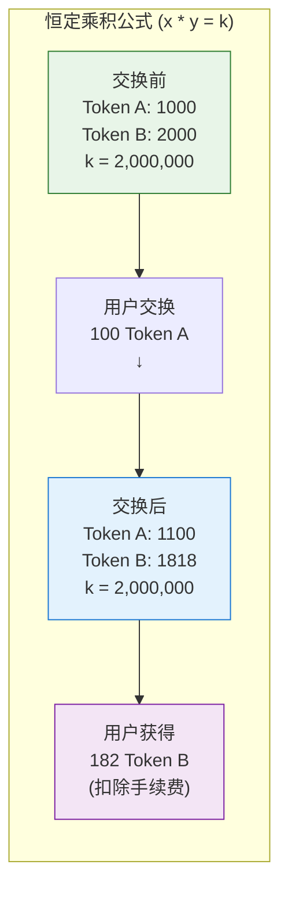
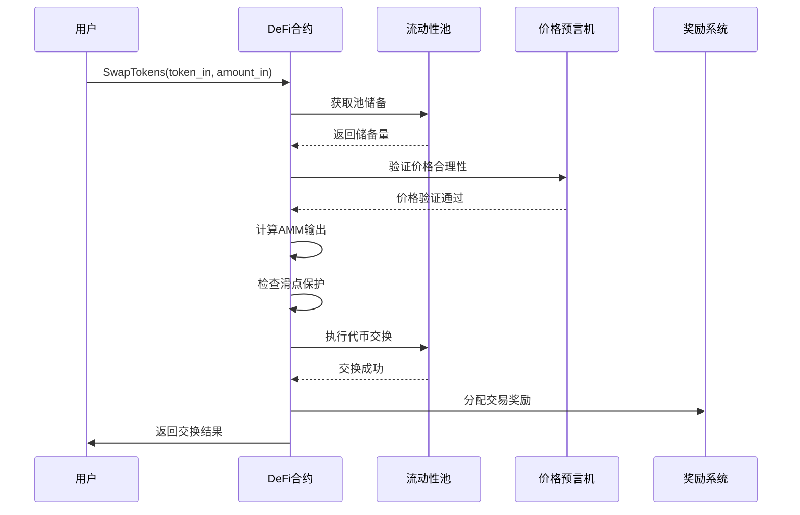
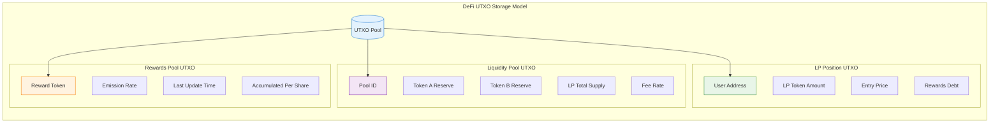

# 💰 WES标准DeFi合约模板

## 🎯 模板定位

**这是一个生产就绪的标准DeFi合约模板，适合有经验的开发者用于构建专业级去中心化金融应用。**

### 📚 DeFi概念初学者引导

如果你是第一次接触DeFi（去中心化金融）概念，让我们先从基础开始：

#### 🤔 什么是DeFi？

### 📚 生活化理解
　　DeFi（去中心化金融）就像**没有银行的金融服务**：
- 🏦 传统银行的所有功能：存款、贷款、交易、保险
- 🤖 但由智能合约自动运行，无需人工审批
- 🌍 全球任何人都可以参与，无需开户和身份验证
- 💰 收益通常比传统银行更高，因为没有中间商抽成

#### 🆚 传统金融 vs DeFi 对比

| 特性 | 传统金融 | DeFi |
|------|---------|------|
| **准入门槛** | 🏦 需要开户审批 | 🌐 任何人都可参与 |
| **营业时间** | ⏰ 银行上班时间 | 🕐 24/7全天候服务 |
| **中间商** | 🏢 银行、券商抽成 | 🤖 智能合约自动化 |
| **透明度** | 📋 内部运作不透明 | 🔍 代码开源可审计 |
| **地域限制** | 🗺️ 受国家监管限制 | 🌍 全球无边界访问 |
| **利率决定** | 👨‍💼 银行内部决定 | 📊 市场供需自动调节 |

### 🌟 DeFi的核心组件
- **🔄 DEX（去中心化交易所）** - 无需中心化交易所即可交易代币
- **💎 流动性挖矿** - 提供流动性获得代币奖励
- **🏦 借贷协议** - 无需银行即可借贷资金
- **⚖️ 自动化做市商(AMM)** - 算法自动调节价格和流动性

### 🔄 从基础概念到Standard版本

现在你了解了DeFi的基本概念，让我们看看这个Standard版本提供的完整功能：

### 🆚 基础理解 vs Standard版本 功能对比

| 特性 | 基础理解 | Standard版本 (本模板) |
|------|---------|---------------------|
| **目标** | 🎓 概念学习 | 🏭 生产级DeFi协议 |
| **交易机制** | 💱 简单代币交换 | 🔄 完整AMM+流动性池 |
| **收益机制** | 💰 基础利息 | 🌾 多层流动性挖矿 |
| **风险控制** | 🛡️ 基础检查 | 🔒 完整风险管理系统 |
| **价格发现** | 📊 固定比率 | 📈 动态价格算法 |
| **流动性管理** | 👤 手动管理 | 🤖 自动化做市商 |
| **收益优化** | 📈 单一收益 | 🚀 复合收益+治理激励 |

---

## 📋 **模板概述**

　　本模板提供了基于WES URES模型的去中心化金融（DeFi）协议实现，集成了自动化做市商（AMM）、流动性挖矿、借贷协议和收益聚合等完整DeFi功能。

**模板类型**：DeFi协议合约（DeFi Protocol Contract）  
**接口标准**：IContractBase + IDeFiProtocol  
**设计模式**：无状态流动性池模型  
**编程语言**：Go (TinyGo编译到WASM)

---

## 🎯 **核心特性**

### **1. 完整AMM协议**
- 自动化做市商：恒定乘积公式(x*y=k)价格发现
- 流动性池管理：多代币对流动性提供和管理
- 滑点保护：自动滑点计算和保护机制
- 手续费分成：流动性提供者收益分配

### **2. 标准DeFi功能**
- ✅ **AddLiquidity**: 添加流动性
- ✅ **RemoveLiquidity**: 移除流动性
- ✅ **SwapTokens**: 代币交换
- ✅ **GetPrice**: 价格查询
- ✅ **ClaimRewards**: 领取奖励
- ✅ **GetPoolInfo**: 流动性池信息

### **3. 高级DeFi机制**
- 流动性挖矿：多代币奖励和激励机制
- 收益复合：自动复投和收益最大化
- 闪电贷：无抵押瞬时借贷功能
- 治理集成：协议参数的去中心化治理

---

## 🏗️ **架构设计**



---

## 💡 **DeFi概念进阶指南**

### 🎓 从概念理解到实际实现

让我们通过实际的代码示例来理解DeFi是如何工作的：

#### 基础概念：简单代币交换
```go
// 概念层面：基础代币交换
func SimpleSwap(tokenA, tokenB, amount) {
    // 1. 检查余额
    // 2. 按固定比率交换
    // 3. 转移代币
}
```

#### Standard版本：专业级AMM交换
```go
// Standard版本：完整的AMM交换（简化示例）
func SwapTokens() uint32 {
    // 1. 复杂参数解析和验证
    params := parseAndValidateSwapParams()
    
    // 2. 获取流动性池状态
    poolInfo := getPoolInfo(params.TokenPair)
    
    // 3. 使用恒定乘积公式计算价格
    outputAmount := calculateAMMPrice(
        poolInfo.ReserveA, 
        poolInfo.ReserveB, 
        params.InputAmount
    )
    
    // 4. 滑点保护检查
    if outputAmount < params.MinOutputAmount {
        return ERROR_SLIPPAGE_TOO_HIGH
    }
    
    // 5. 手续费计算和分配
    fee := calculateTradingFee(params.InputAmount)
    distributeFeeToLPs(fee)
    
    // 6. 执行原子化代币交换
    if err := executeAtomicSwap(params, outputAmount); err != nil {
        return handleError(err)
    }
    
    // 7. 更新池储备和价格
    updatePoolReserves(params.TokenPair, outputAmount)
    
    // 8. 发出交易事件和价格更新
    emitSwapEvent(params, outputAmount, fee)
    
    return SUCCESS
}
```

### 📈 主要进阶特性

#### 1. **更智能的价格发现**
- 基础: 固定汇率
- Standard: 动态AMM算法 + 多池路由优化

#### 2. **更完善的流动性管理**
- 基础: 手动资金池
- Standard: 自动化做市商 + LP代币 + 收益复合

#### 3. **更先进的收益机制**
- 基础: 简单利息
- Standard: 流动性挖矿 + 治理代币 + 多层激励

---

## 🔄 **AMM价格计算原理**



---

## 🚀 **快速开始指南**

### 📋 前置条件

确保你已经：
- ✅ 理解DeFi和AMM的基本概念
- ✅ 熟悉流动性挖矿和收益机制
- ✅ 了解代币经济学和激励设计
- ✅ 具备多代币管理和风险控制经验

### 🔧 使用步骤

#### 1. 复制并配置模板

```bash
# 复制模板到你的项目
cp -r templates/standard/defi/ my-defi-protocol/
cd my-defi-protocol/

# 编辑DeFi参数
vim defi_protocol_template.go
```

#### 2. 配置DeFi协议参数

```go
// 修改DeFi协议配置
const (
    PROTOCOL_NAME         = "My Professional DeFi"
    BASE_TOKEN           = "USDC"          // 基础交易代币
    GOVERNANCE_TOKEN     = "DEFI_TOKEN"    // 治理代币
    TRADING_FEE_RATE     = 30              // 0.3% 交易手续费
    LP_FEE_RATE          = 25              // 0.25% LP收益
    PROTOCOL_FEE_RATE    = 5               // 0.05% 协议收益
    REWARD_EMISSION_RATE = 100             // 每天奖励发放率
    MIN_LIQUIDITY        = 1000            // 最小流动性要求
)
```

#### 3. 编译和测试

```bash
# 生产级编译
tinygo build -o defi.wasm -target wasi -opt=2 defi_protocol_template.go

# 运行DeFi测试
go test ./tests/defi/ -v

# AMM算法测试
go test ./tests/defi/ -run TestAMM
```

#### 4. 部署和初始化

```bash
# 部署DeFi协议
./deploy.sh testnet defi.wasm

# 初始化流动性池
./scripts/init-pools.sh

# 验证AMM功能
./scripts/test-amm.sh
```

---

## 💡 **使用示例**

### **添加流动性**

```javascript
// 为交易对添加流动性
const addLiquidityResult = await contract.call("AddLiquidity", {
    token_a: "USDC",
    token_b: "ETH",
    amount_a: "10000000000", // 10,000 USDC
    amount_b: "5000000000",  // 5 ETH
    min_liquidity: "7000000000", // 最小LP代币
    provider: "0x742d35Cc6644C4532B10C7782afd4e7f4f42c07c"
});
```

### **代币交换**

```javascript
// 执行代币交换
const swapResult = await contract.call("SwapTokens", {
    token_in: "USDC",
    token_out: "ETH",
    amount_in: "1000000000", // 1,000 USDC
    min_amount_out: "480000000", // 最少0.48 ETH
    slippage_tolerance: 100, // 1% 滑点容忍度
    trader: "0x742d35Cc6644C4532B10C7782afd4e7f4f42c07c"
});
```

### **移除流动性**

```javascript
// 移除流动性并领取手续费收益
const removeLiquidityResult = await contract.call("RemoveLiquidity", {
    token_a: "USDC",
    token_b: "ETH", 
    liquidity_amount: "5000000000", // LP代币数量
    min_amount_a: "4900000000", // 最少USDC
    min_amount_b: "2450000000", // 最少ETH
    provider: "0x742d35Cc6644C4532B10C7782afd4e7f4f42c07c"
});
```

### **领取流动性挖矿奖励**

```javascript
// 领取流动性挖矿奖励
const claimResult = await contract.call("ClaimRewards", {
    pool_id: "USDC_ETH_POOL",
    user: "0x742d35Cc6644C4532B10C7782afd4e7f4f42c07c"
});
```

---

## 🔄 **DeFi交易流程图**



---

## 📋 **接口规范**

### **必需导出函数**

```go
//export Initialize
func Initialize() uint32

//export AddLiquidity
func AddLiquidity() uint32

//export RemoveLiquidity
func RemoveLiquidity() uint32

//export SwapTokens
func SwapTokens() uint32

//export GetPrice
func GetPrice() uint32

//export GetPoolInfo
func GetPoolInfo() uint32

//export ClaimRewards
func ClaimRewards() uint32

//export GetUserInfo
func GetUserInfo() uint32

//export GetVersion
func GetVersion() uint32
```

### **标准错误码**

| 错误码 | 名称 | 描述 |
|--------|------|------|
| 0 | SUCCESS | 成功 |
| 1 | ERROR_INVALID_PARAMS | 无效参数 |
| 2 | ERROR_INSUFFICIENT_LIQUIDITY | 流动性不足 |
| 3 | ERROR_SLIPPAGE_TOO_HIGH | 滑点过高 |
| 4 | ERROR_POOL_NOT_EXISTS | 流动性池不存在 |
| 5 | ERROR_INSUFFICIENT_BALANCE | 余额不足 |
| 6 | ERROR_PRICE_IMPACT_TOO_HIGH | 价格影响过大 |

---

## ⚙️ **流动性池存储模型**



---

## 🔧 **高级配置选项**

### **AMM参数配置**

```go
// AMM算法配置
const (
    ENABLE_PRICE_IMPACT_PROTECTION = true  // 价格影响保护
    MAX_PRICE_IMPACT_PERCENT      = 500   // 5% 最大价格影响
    ENABLE_MEV_PROTECTION         = true  // MEV保护
    MIN_TRADE_AMOUNT             = 1000   // 最小交易金额
    MAX_TRADE_AMOUNT             = 0      // 最大交易金额(0=无限制)
)
```

### **收益参数配置**

```go
// 流动性挖矿配置
const (
    ENABLE_LIQUIDITY_MINING = true     // 启用流动性挖矿
    ENABLE_COMPOUND_REWARDS = true     // 启用复合奖励
    REWARD_VESTING_PERIOD   = 2592000  // 30天奖励解锁期
    EARLY_EXIT_PENALTY      = 1000     // 10% 早期退出惩罚
    BOOST_MULTIPLIER        = 200      // 2x 最大奖励倍数
)
```

---

## 🧪 **测试策略**

### **测试覆盖率要求**

```bash
# 运行完整DeFi测试
go test ./... -coverprofile=coverage.out
go tool cover -html=coverage.out

# 目标覆盖率 > 95%
```

### **关键测试用例**

1. **AMM算法测试**
   - 价格计算准确性
   - 滑点保护机制
   - 极端市场条件

2. **流动性管理测试**
   - 添加/移除流动性
   - LP代币铸造/销毁
   - 手续费分配

3. **安全性测试**
   - 重入攻击防护
   - 闪电贷攻击防护
   - 价格操纵防护

4. **经济机制测试**
   - 奖励计算准确性
   - 激励机制有效性
   - 通胀控制测试

---

## 📚 **进阶学习路径**

### 🎯 掌握Standard版本后的下一步

#### 如果你想建设DeFi生态
→ 学习 `../governance/` 模板，实现协议的去中心化治理

#### 如果你想集成NFT金融化
→ 学习 `../nft/` 模板，实现NFT抵押借贷和碎片化

#### 如果你想处理实物资产
→ 学习 `../rwa/` 模板，将实物资产代币化进入DeFi

#### 如果你想发行治理代币
→ 学习 `../token/` 模板，设计激励相容的代币经济学

### 📖 推荐进阶资源

- **DeFi协议研究**: 深入分析Uniswap、Compound等经典协议
- **AMM算法优化**: 了解不同AMM模型和价格曲线设计
- **MEV防护机制**: 学习最大可提取价值的防护策略
- **流动性挖矿设计**: 可持续的激励机制和通胀控制

---

## 🤝 **社区支持**

### 💬 获得帮助

- **技术问题**: GitHub Issues 或开发者社区
- **DeFi设计**: 查看 `../../BEGINNER_GUIDE.md`
- **概念学习**: 参考 `../../CONCEPTS.md`  
- **快速上手**: 使用 `../../tools/beginner/help.sh`

### 🏆 贡献方式

- **代码贡献**: 提交AMM算法优化和新功能
- **协议研究**: 分享DeFi协议的创新设计和最佳实践
- **安全审计**: 补充安全测试和攻击防护
- **经济分析**: 分享代币经济学和激励机制设计经验

---

## 📚 **参考资料**

- [Uniswap协议文档](https://docs.uniswap.org/)
- [自动化做市商原理](https://ethereum.org/en/developers/docs/dapps/defi/dexs/)
- [DeFi安全最佳实践](https://github.com/crytic/awesome-ethereum-security)
- [WES DeFi框架文档](../../../../docs/specs/defi/DEFI_SPEC.md)

---

## 🆘 **常见问题**

### **Q: 如何防止流动性池被攻击？**
A: 使用价格预言机验证、设置价格影响限制，并实施时间锁定机制。

### **Q: 滑点是如何计算的？**
A: 基于AMM公式计算预期输出与实际输出的差异百分比。

### **Q: 如何设计可持续的流动性挖矿？**
A: 平衡奖励发放率、设置递减机制，并与协议收入挂钩。

### **Q: 闪电贷如何防止被滥用？**
A: 实施严格的还款检查、设置使用限制，并监控异常交易模式。

---

## 💡 总结

这个Standard DeFi模板提供了**完整的去中心化金融解决方案**：

- **✅ 从基础概念到生产实现的完整路径**
- **🔄 专业级的AMM和流动性管理机制**  
- **🔒 企业级的安全和风险控制特性**
- **🌾 可持续的流动性挖矿和激励系统**

**记住**: DeFi不仅是技术实现，更是金融创新和经济机制设计。技术为金融服务，创新让价值流动更高效！

🚀 **开始构建你的去中心化金融协议吧！**

---

**📝 更新日志**

| 版本 | 日期 | 更新内容 |
|------|------|----------|
| v1.0.0 | 2024-12 | 初始版本，完整DeFi协议功能 |

---

*📄 如需更多帮助，请参考WES开发者文档或联系技术支持。*