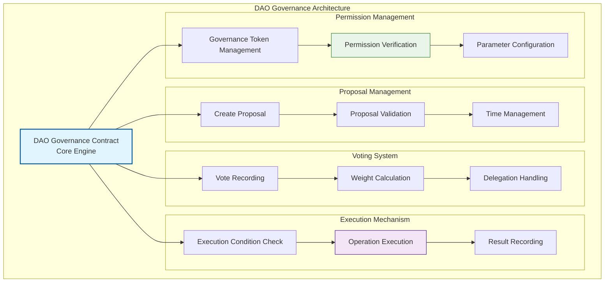
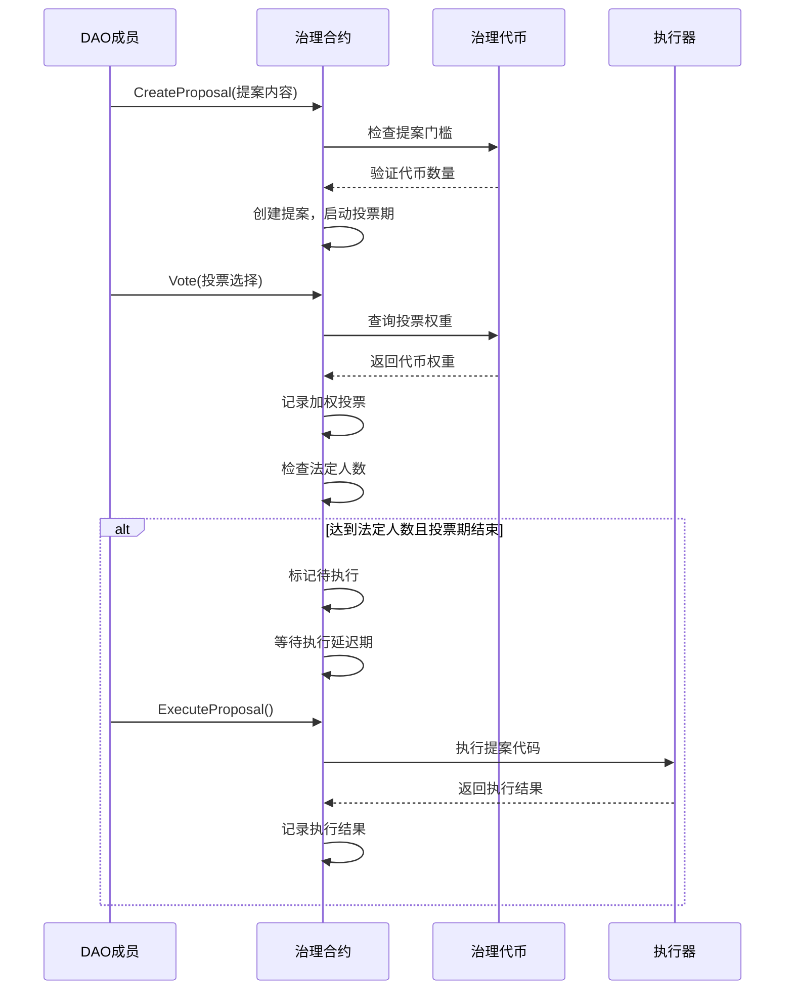

# 🏛️ WES标准DAO治理合约模板

## 🎯 模板定位

**这是一个生产就绪的标准DAO治理合约模板，适合有经验的开发者用于构建专业级去中心化自治组织。**

### 📚 治理概念初学者引导

如果你是第一次接触DAO治理概念，让我们先从基础开始：

#### 🤔 什么是DAO治理？

### 📚 生活化理解
　　DAO（去中心化自治组织）就像**数字化的民主议会**：
- 🗳️ 每个代币持有者都是"议员"，可以投票决策
- 📜 任何人都可以提出"法案"（提案）供大家讨论  
- ⚖️ 通过投票来决定组织的重大事项
- 🤖 决策通过后自动执行，无需人工干预

#### 🆚 传统公司 vs DAO 对比

| 特性 | 传统公司 | DAO |
|------|---------|-----|
| **决策方式** | 👨‍💼 董事会决定 | 🗳️ 社区投票 |
| **权力结构** | 🏢 层级管理 | 🌐 去中心化 |
| **透明度** | 📊 财报公开 | 🔍 链上透明 |
| **执行方式** | 👥 人工执行 | 🤖 自动执行 |
| **参与门槛** | 💰 股权投资 | 🪙 代币持有 |

### 🌟 DAO治理的特点
- **🔒 透明公开** - 所有提案、投票都在区块链上公开记录
- **⚖️ 民主决策** - 按代币权重进行公平投票
- **🤖 自动执行** - 决策通过后智能合约自动执行，无法篡改
- **🌍 全球参与** - 任何地方的代币持有者都可以参与治理

### 🔄 从基础概念到Standard版本

现在你了解了DAO治理的基本概念，让我们看看这个Standard版本提供的完整功能：

### 🆚 基础理解 vs Standard版本 功能对比

| 特性 | 基础理解 | Standard版本 (本模板) |
|------|---------|---------------------|
| **目标** | 🎓 概念学习 | 🏛️ 生产级DAO平台 |
| **投票机制** | 🗳️ 简单多数决 | ⚖️ 加权投票+委托投票 |
| **提案类型** | 📝 文本提案 | 🔧 可执行代码提案 |
| **执行方式** | 👥 人工处理 | 🤖 智能合约自动执行 |
| **安全控制** | 🛡️ 基础验证 | 🔒 多层安全+延迟执行 |
| **参与方式** | 👤 直接参与 | 🤝 支持投票委托 |
| **治理范围** | 📊 基础参数 | 🌟 完整DAO生态管理 |

---

## 📋 **模板概述**

　　本模板提供了基于WES URES模型的去中心化自治组织（DAO）治理平台实现，支持提案创建、投票治理、权力委托和自动执行等完整的DAO功能。

**模板类型**：DAO治理合约（Governance Contract）  
**接口标准**：IContractBase + IGovernance  
**设计模式**：无状态事件驱动模型  
**编程语言**：Go (TinyGo编译到WASM)

---

## 🎯 **核心特性**

### **1. 完整DAO治理体系**
- 提案创建和管理：支持复杂的治理提案
- 投票系统：加权投票、委托投票、法定人数控制
- 自动执行：提案通过后的自动执行机制
- 时间管理：投票期间、执行延迟等时间控制

### **2. 标准治理功能**
- ✅ **CreateProposal**: 创建治理提案
- ✅ **Vote**: 投票表决
- ✅ **ExecuteProposal**: 执行通过的提案
- ✅ **GetProposalInfo**: 查询提案信息
- ✅ **DelegateVoting**: 委托投票权
- ✅ **GetDAOStats**: DAO统计信息

### **3. 高级治理机制**
- 投票权重系统：基于治理代币的权重计算
- 提案门槛控制：防止垃圾提案的最低门槛
- 法定人数要求：确保决策的代表性
- 执行延迟：给予社区反应时间

---

## 🏗️ **架构设计**



---

## 💡 **治理概念进阶指南**

### 🎓 从概念理解到实际实现

让我们通过实际的代码示例来理解治理是如何工作的：

#### 基础概念：简单投票
```go
// 概念层面：基础投票流程
func SimpleVote(proposal_id, voter, vote_choice) {
    // 1. 记录投票
    // 2. 统计票数
    // 3. 如果超过50%则通过
}
```

#### Standard版本：专业级治理实现
```go
// Standard版本：完整的治理投票（简化示例）
func Vote() uint32 {
    // 1. 复杂参数解析和验证
    params := parseAndValidateVoteParams()
    
    // 2. 投票权重计算（基于代币持有量）
    votingPower := calculateVotingPower(params.Voter)
    
    // 3. 委托投票处理
    if hasDelegation(params.Voter) {
        votingPower += getDelegatedPower(params.Voter)
    }
    
    // 4. 时间窗口验证
    if !isVotingPeriodActive(params.ProposalID) {
        return ERROR_VOTING_CLOSED
    }
    
    // 5. 防重复投票检查
    if hasVoted(params.Voter, params.ProposalID) {
        return ERROR_ALREADY_VOTED
    }
    
    // 6. 记录加权投票
    recordWeightedVote(params, votingPower)
    
    // 7. 检查是否达到法定人数
    if checkQuorumReached(params.ProposalID) {
        markProposalForExecution(params.ProposalID)
    }
    
    // 8. 发出投票事件
    emitVoteEvent(params, votingPower)
    
    return SUCCESS
}
```

### 📈 主要进阶特性

#### 1. **更智能的投票机制**
- 基础: 一人一票
- Standard: 代币权重投票 + 委托投票 + 法定人数

#### 2. **更安全的执行机制**
- 基础: 立即执行
- Standard: 延迟执行 + 多重验证 + 可撤销窗口

#### 3. **更完善的提案管理**
- 基础: 简单文本提案
- Standard: 可执行代码提案 + 参数修改 + 复杂操作

---

## 📋 **治理参数配置**

| 参数 | 默认值 | 描述 | 可调整 |
|------|--------|------|---------|
| 最小投票期间 | 1天 | 提案最短投票时间 | ✅ |
| 最大投票期间 | 7天 | 提案最长投票时间 | ✅ |
| 法定人数阈值 | 1,000,000 | 投票生效的最低票数 | ✅ |
| 提案门槛 | 100,000 | 创建提案的最低代币数 | ✅ |
| 执行延迟 | 2天 | 提案通过后的执行延迟 | ✅ |

---

## 🚀 **快速开始指南**

### 📋 前置条件

确保你已经：
- ✅ 理解DAO治理的基本概念
- ✅ 熟悉代币权重和委托投票原理
- ✅ 了解提案-投票-执行的完整流程
- ✅ 具备治理代币发行和管理经验

### 🔧 使用步骤

#### 1. 复制并配置模板

```bash
# 复制模板到你的项目
cp -r templates/standard/governance/ my-dao-platform/
cd my-dao-platform/

# 编辑治理参数
vim governance_template.go
```

#### 2. 配置DAO治理参数

```go
// 修改DAO治理配置
const (
    DAO_NAME              = "My Professional DAO"
    GOVERNANCE_TOKEN      = "DAO_TOKEN_ID"
    MIN_PROPOSAL_THRESHOLD = 100000    // 10万代币才能提案
    QUORUM_THRESHOLD      = 1000000    // 100万代币法定人数
    MIN_VOTING_PERIOD     = 86400      // 1天最小投票期
    MAX_VOTING_PERIOD     = 604800     // 7天最大投票期
    EXECUTION_DELAY       = 172800     // 2天执行延迟
)
```

#### 3. 编译和测试

```bash
# 生产级编译
tinygo build -o governance.wasm -target wasi -opt=2 governance_template.go

# 运行治理测试
go test ./tests/governance/ -v

# 压力测试
go test ./tests/governance/ -bench=BenchmarkVoting
```

#### 4. 部署和初始化

```bash
# 部署治理合约
./deploy.sh testnet governance.wasm

# 初始化DAO参数
./scripts/init-dao.sh

# 验证治理功能
./scripts/test-governance.sh
```

---

## 💡 **使用示例**

### **创建提案**

```javascript
// 创建治理提案
const proposalResult = await contract.call("CreateProposal", {
    title: "Increase Transaction Fee",
    description: "Proposal to increase transaction fee from 0.1% to 0.2%",
    execution_code: "updateTransactionFee(200)", // 0.2%
    voting_period: 432000, // 5天
    proposer: "0x742d35Cc6644C4532B10C7782afd4e7f4f42c07c"
});
```

### **委托投票权**

```javascript
// 委托投票权给专家
const delegateResult = await contract.call("DelegateVoting", {
    delegator: "0x742d35Cc6644C4532B10C7782afd4e7f4f42c07c",
    delegate: "0x8ba1f109551bD432803012645Hac136c5aB635D",
    token_amount: "50000" // 委托5万代币的投票权
});
```

### **参与投票**

```javascript
// 对提案进行投票
const voteResult = await contract.call("Vote", {
    proposal_id: "PROP_1_1640995200",
    voter: "0x742d35Cc6644C4532B10C7782afd4e7f4f42c07c",
    vote_choice: "YES", // YES, NO, ABSTAIN
    voting_power: "100000" // 基于代币持有量计算
});
```

### **执行提案**

```javascript
// 提案通过后执行
const executeResult = await contract.call("ExecuteProposal", {
    proposal_id: "PROP_1_1640995200",
    executor: "0x742d35Cc6644C4532B10C7782afd4e7f4f42c07c"
});
```

---

## 🔄 **DAO治理流程图**



---

## 📋 **接口规范**

### **必需导出函数**

```go
//export Initialize
func Initialize() uint32

//export CreateProposal
func CreateProposal() uint32

//export Vote
func Vote() uint32

//export ExecuteProposal
func ExecuteProposal() uint32

//export GetProposalInfo
func GetProposalInfo() uint32

//export DelegateVoting
func DelegateVoting() uint32

//export GetDAOStats
func GetDAOStats() uint32

//export GetVersion
func GetVersion() uint32
```

### **标准错误码**

| 错误码 | 名称 | 描述 |
|--------|------|------|
| 0 | SUCCESS | 成功 |
| 1 | ERROR_INVALID_PARAMS | 无效参数 |
| 2 | ERROR_INSUFFICIENT_TOKENS | 代币不足 |
| 3 | ERROR_PROPOSAL_NOT_EXISTS | 提案不存在 |
| 4 | ERROR_VOTING_CLOSED | 投票已关闭 |
| 5 | ERROR_ALREADY_VOTED | 已经投票 |
| 6 | ERROR_EXECUTION_FAILED | 执行失败 |
| 7 | ERROR_NOT_EXECUTABLE | 不可执行 |

---

## 🔧 **高级配置选项**

### **治理机制配置**

```go
// 高级治理配置
const (
    ENABLE_DELEGATION     = true    // 支持投票委托
    ENABLE_VETO           = true    // 支持否决权
    ENABLE_EMERGENCY_STOP = true    // 紧急停止机制
    MAX_PROPOSALS_PER_DAY = 10      // 每日最大提案数
    DELEGATION_LIMIT      = 5       // 委托链长度限制
)
```

### **安全参数**

```go
// 安全控制参数
const (
    MIN_EXECUTION_DELAY   = 86400   // 最小执行延迟1天
    MAX_EXECUTION_DELAY   = 604800  // 最大执行延迟7天
    EMERGENCY_THRESHOLD   = 500000  // 紧急制动门槛
    ADMIN_OVERRIDE_LIMIT  = 2       // 管理员覆盖次数限制
)
```

---

## 🧪 **测试策略**

### **测试覆盖率要求**

```bash
# 运行完整治理测试
go test ./... -coverprofile=coverage.out
go tool cover -html=coverage.out

# 目标覆盖率 > 90%
```

### **关键测试用例**

1. **提案生命周期测试**
   - 提案创建、投票、执行完整流程
   - 不同投票结果的处理
   - 执行延迟和安全机制

2. **投票机制测试**
   - 权重投票准确性
   - 委托投票功能
   - 防重复投票验证

3. **安全性测试**
   - 权限控制验证
   - 恶意提案防护
   - 紧急制动机制

4. **边界条件测试**
   - 法定人数边界
   - 时间窗口边界
   - 代币权重计算

---

## 📚 **进阶学习路径**

### 🎯 掌握Standard版本后的下一步

#### 如果你想集成代币经济
→ 学习 `../token/` 模板，了解治理代币的发行和管理

#### 如果你想建设NFT社区DAO
→ 学习 `../nft/` 模板，实现基于NFT的治理权重

#### 如果你想构建DeFi协议治理
→ 学习 `../defi/` 模板，了解流动性治理和收益分配

#### 如果你想管理现实资产
→ 学习 `../rwa/` 模板，实现资产管理的DAO治理

### 📖 推荐进阶资源

- **DAO治理理论**: 深入理解不同投票机制和治理模型
- **智能合约安全**: DAO治理的安全最佳实践和攻击防护
- **经济机制设计**: 代币经济学和激励机制设计
- **社区建设指南**: 如何构建健康的DAO社区生态

---

## 🤝 **社区支持**

### 💬 获得帮助

- **技术问题**: GitHub Issues 或开发者社区
- **治理设计**: 查看 `../../BEGINNER_GUIDE.md`
- **概念学习**: 参考 `../../CONCEPTS.md`  
- **快速上手**: 使用 `../../tools/beginner/help.sh`

### 🏆 贡献方式

- **代码贡献**: 提交治理机制优化和新功能
- **治理研究**: 分享DAO治理的最佳实践和案例分析
- **测试用例**: 补充治理安全和边界测试
- **社区分享**: 分享你的DAO治理经验和创新模式

---

## 📚 **参考资料**

- [DAO治理最佳实践指南](https://ethereum.org/en/dao/)
- [治理代币设计原则](https://github.com/compound-finance/compound-protocol)
- [投票机制理论研究](https://papers.ssrn.com/sol3/papers.cfm?abstract_id=3551392)
- [WES治理框架文档](../../../../docs/specs/governance/GOVERNANCE_SPEC.md)

---

## 🆘 **常见问题**

### **Q: 如何防止治理攻击？**
A: 设置合理的提案门槛、法定人数要求，并启用执行延迟机制。

### **Q: 投票委托如何工作？**
A: 代币持有者可以将投票权委托给专家，被委托者可以代表委托者投票。

### **Q: 如何处理提案冲突？**
A: 通过提案优先级和执行顺序控制，避免冲突执行。

### **Q: DAO如何实现紧急响应？**
A: 设置紧急制动机制，允许在特殊情况下快速响应。

---

## 💡 总结

这个Standard DAO治理模板提供了**完整的去中心化治理解决方案**：

- **✅ 从基础概念到生产实现的完整路径**
- **⚖️ 专业级的投票和执行机制**  
- **🔒 企业级的安全和控制特性**
- **🌟 支持复杂的治理场景和定制需求**

**记住**: DAO治理不仅是技术实现，更是社区建设和经济机制设计。技术为社区服务，治理让去中心化成为可能！

🚀 **开始构建你的去中心化治理平台吧！**

---

**📝 更新日志**

| 版本 | 日期 | 更新内容 |
|------|------|----------|
| v1.0.0 | 2024-12 | 初始版本，完整DAO治理功能 |

---

*📄 如需更多帮助，请参考WES开发者文档或联系技术支持。*