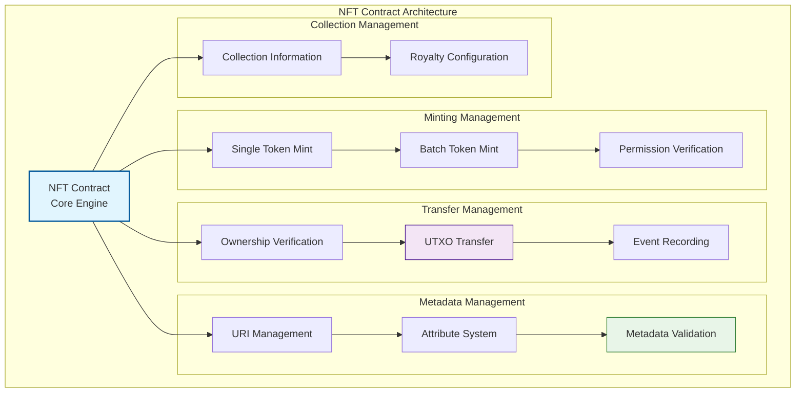
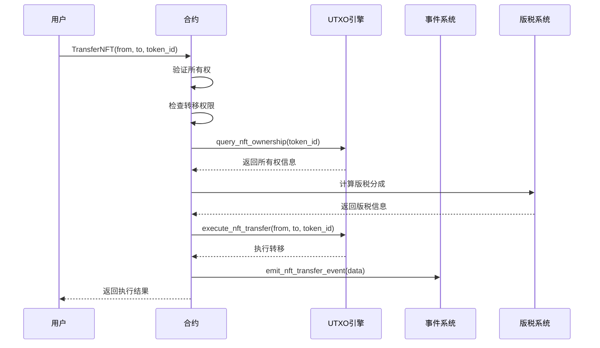
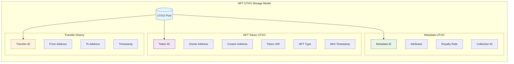

# 🎨 WES标准NFT合约模板

## 🎯 模板定位

**这是一个生产就绪的标准NFT合约模板，适合有经验的开发者用于构建专业级NFT平台。**

### 📚 从Learning进阶到Standard

如果你已经完成了 `../learning/basic-nft` 的学习，恭喜！你现在可以：
- ✅ 理解NFT的基本概念和独特性原理
- ✅ 掌握基础的铸造和转移功能  
- ✅ 熟悉元数据存储和查询机制
- ✅ 了解WES的UTXO-based NFT模型

**现在是时候学习生产级NFT平台开发了！**

### 🔄 Learning vs Standard 功能对比

| 特性 | Learning版本 | Standard版本 (本模板) |
|------|-------------|-------------------|
| **目标** | 🎓 概念学习 | 🏭 专业NFT平台 |
| **代码复杂度** | ~450行 | ~1200行+ |
| **注释风格** | 🔍 详细教学 | 📋 专业文档 |
| **功能范围** | 🔰 基础功能 | ⚡ 完整ERC721+ |
| **NFT类型** | 🖼️ 简单艺术品 | 🌟 8种专业类型 |
| **元数据** | 📝 基础URI | 🎨 丰富属性系统 |
| **版权保护** | ❌ 无 | ✅ 版税分成 |
| **批量操作** | ❌ 无 | ✅ 批量铸造/转移 |
| **集合管理** | ❌ 无 | ✅ 系列化管理 |

---

## 📋 **模板概述**

　　本模板提供了基于WES URES模型的专业级NFT（非同质化代币）平台实现，支持ERC721风格的NFT功能，集成版权保护、元数据管理和批量操作。

**模板类型**：NFT合约（Non-Fungible Token Contract）  
**接口标准**：IContractBase + INonFungibleToken  
**设计模式**：无状态UTXO模型  
**编程语言**：Go (TinyGo编译到WASM)

---

## 🎯 **核心特性**

### **1. 专业级NFT平台**
- 完全无状态设计，所有NFT数据以UTXO形式存在
- 多媒体支持：图像、音频、视频、3D模型等
- 版权保护：内置创作者版税和二次销售分成
- 元数据丰富：支持复杂的属性和特征系统

### **2. 标准ERC721功能**
- ✅ **MintNFT**: NFT铸造
- ✅ **TransferNFT**: NFT转移
- ✅ **GetTokenInfo**: NFT信息查询
- ✅ **SetTokenURI**: 元数据URI设置
- ✅ **BatchMint**: 批量铸造
- ✅ **Burn**: NFT销毁

### **3. 高级功能**
- 集合管理：支持NFT系列和批量操作
- 生成艺术：支持参数化和动态NFT
- 版税分成：创作者收益保护
- 属性系统：丰富的NFT特征描述

---

## 🏗️ **架构设计**



---

## 💡 **从Learning版本进阶指南**

### 🎓 你已经在Learning版本学到了什么

在 `learning/basic-nft` 中，你学习了：

```go
// Learning版本：基础NFT铸造（简化）
func MintNFT() uint32 {
    params := framework.GetContractParams()
    to := params.ParseJSON("to")
    tokenURI := params.ParseJSON("token_uri")
    
    // 基础NFT创建
    tokenID := generateSimpleTokenID()
    err := framework.CreateNFT(to, tokenID, tokenURI)
    return framework.SUCCESS
}
```

### 🏆 Standard版本的进阶实现

在这个Standard版本中，你将学到：

```go
// Standard版本：专业级NFT铸造（完整）
func MintNFT() uint32 {
    // 1. 复杂参数解析和类型验证
    params := parseAndValidateNFTParams()
    
    // 2. 权限和配额检查
    if err := validateMintingPermission(params); err != nil {
        return handleError(err)
    }
    
    // 3. 元数据验证和属性系统
    if err := validateAndProcessMetadata(params); err != nil {
        return handleError(err)
    }
    
    // 4. 版税配置和集合管理
    setupRoyaltyAndCollection(params)
    
    // 5. 执行优化的NFT创建
    tokenID := generateAdvancedTokenID(params.NFTType)
    if err := executeOptimizedNFTCreation(params, tokenID); err != nil {
        return handleError(err)
    }
    
    // 6. 完整的事件发出和索引构建
    emitNFTCreationEvents(params, tokenID)
    
    return SUCCESS
}
```

### 📈 主要进阶特性

#### 1. **更丰富的NFT类型支持**
- Learning: 基础艺术品NFT
- Standard: 8种专业NFT类型（艺术、游戏、证书、身份等）

#### 2. **更强大的元数据系统**
- Learning: 简单的URI链接
- Standard: 复杂属性系统、特征验证、动态元数据

#### 3. **更完善的商业功能**
- Learning: 基础所有权转移
- Standard: 版税分成、批量操作、集合管理

#### 4. **更专业的性能优化**
- Learning: 单个操作为主
- Standard: 批量铸造、执行费用优化、并发安全

---

## 📋 **NFT类型支持**

| 类型 | 标识符 | 描述 | 适用场景 |
|------|--------|------|----------|
| 数字艺术 | ARTWORK | 数字艺术作品 | 艺术品交易、收藏 |
| 收藏品 | COLLECTIBLE | 限量收藏品 | 游戏道具、纪念品 |
| 游戏道具 | GAMING | 游戏内物品 | 游戏装备、角色 |
| 证书凭证 | CERTIFICATE | 认证证书 | 学历证明、资质认证 |
| 身份证明 | IDENTITY | 身份标识 | 会员卡、身份证 |
| 门票凭证 | TICKET | 活动门票 | 演出票、会议票 |
| 域名NFT | DOMAIN | 域名资产 | 区块链域名 |
| 音乐作品 | MUSIC | 音乐版权 | 歌曲、专辑 |

---

## 🚀 **快速开始指南**

### 📋 前置条件

确保你已经：
- ✅ 完成 `learning/basic-nft` 学习
- ✅ 理解NFT的独特性和元数据概念
- ✅ 熟悉WES的UTXO-based NFT模型
- ✅ 具备生产环境NFT项目需求分析能力

### 🔧 使用步骤

#### 1. 复制并配置模板

```bash
# 复制模板到你的项目
cp -r templates/standard/nft/ my-nft-platform/
cd my-nft-platform/

# 编辑配置参数
vim standard_nft_template.go
```

#### 2. 选择NFT类型和配置

```go
// 修改NFT集合基本信息
const (
    COLLECTION_NAME   = "My Professional NFT Collection"
    COLLECTION_SYMBOL = "MPNFT"
    MAX_SUPPLY        = 10000
    BASE_URI          = "https://api.mynft.com/metadata/"
    ROYALTY_RATE      = 250  // 2.5%版税
    NFT_TYPE          = "ARTWORK"  // 选择NFT类型
)
```

#### 3. 编译和测试

```bash
# 生产级编译
tinygo build -o main.wasm -target wasi -opt=2 standard_nft_template.go

# 运行完整测试
go test ./tests/ -v

# 性能基准测试
go test ./tests/ -bench=.
```

#### 4. 部署验证

```bash
# 部署到测试网
./deploy.sh testnet

# 功能验证
./verify.sh main.wasm

# 部署到主网
./deploy.sh mainnet
```

---

## 💡 **使用示例**

### **铸造NFT**

```javascript
// 单个铸造
const mintResult = await contract.call("MintNFT", {
    to: "0x742d35Cc6644C4532B10C7782afd4e7f4f42c07c",
    metadata: {
        name: "Awesome NFT #1",
        description: "A unique digital artwork",
        image: "https://api.mynft.com/images/1.png",
        attributes: [
            { trait_type: "Color", value: "Blue" },
            { trait_type: "Rarity", value: "Legendary" }
        ]
    },
    nft_type: "ARTWORK"
});
```

### **批量铸造**

```javascript
// 批量铸造（空投、预售等场景）
const batchMintResult = await contract.call("BatchMint", {
    recipients: [
        "0x742d35Cc6644C4532B10C7782afd4e7f4f42c07c",
        "0x8ba1f109551bD432803012645Hac136c5aB635D",
        "0x47EA9f0e0e9E4b2b2e7b0b8a9A8b2b2e7b0b8a9A"
    ],
    metadata_base: {
        name: "Limited Edition Series",
        description: "Exclusive NFT collection"
    },
    nft_type: "COLLECTIBLE"
});
```

### **NFT转移**

```javascript
// 转移NFT
const transferResult = await contract.call("TransferNFT", {
    from: "0x742d35Cc6644C4532B10C7782afd4e7f4f42c07c",
    to: "0x8ba1f109551bD432803012645Hac136c5aB635D",
    token_id: "SNFT_1_1640995200"
});
```

### **查询NFT信息**

```javascript
// 获取NFT详细信息
const tokenInfo = await contract.call("GetTokenInfo", {
    token_id: "SNFT_1_1640995200"
});

console.log("NFT信息:", tokenInfo);
// 输出: { name, description, image, attributes, owner, creator, royalty_rate }
```

---

## 📋 **接口规范**

### **必需导出函数**

```go
//export Initialize
func Initialize() uint32

//export MintNFT
func MintNFT() uint32

//export TransferNFT
func TransferNFT() uint32

//export GetTokenInfo
func GetTokenInfo() uint32

//export SetTokenURI
func SetTokenURI() uint32

//export BatchMint
func BatchMint() uint32

//export Burn
func Burn() uint32

//export GetVersion
func GetVersion() uint32
```

### **标准错误码**

| 错误码 | 名称 | 描述 |
|--------|------|------|
| 0 | SUCCESS | 成功 |
| 1 | ERROR_INVALID_PARAMS | 无效参数 |
| 2 | ERROR_TOKEN_NOT_EXISTS | NFT不存在 |
| 3 | ERROR_UNAUTHORIZED | 未授权操作 |
| 4 | ERROR_TRANSFER_FAILED | 转移失败 |
| 5 | ERROR_MINT_LIMIT_EXCEEDED | 铸造上限超出 |
| 6 | ERROR_EXECUTION_FAILED | 执行失败 |

---

## 🔄 **NFT转移流程**



---

## ⚙️ **详细实现规范**

### **NFT存储模型**



### **事件定义**

```go
type NFTMintEvent struct {
    TokenID     string `json:"token_id"`
    To          string `json:"to"`
    Creator     string `json:"creator"`
    TokenURI    string `json:"token_uri"`
    NFTType     string `json:"nft_type"`
    MintTime    int64  `json:"mint_time"`
}

type NFTTransferEvent struct {
    TokenID     string `json:"token_id"`
    From        string `json:"from"`
    To          string `json:"to"`
    TxHash      string `json:"tx_hash"`
    RoyaltyPaid string `json:"royalty_paid"`
}

type NFTBurnEvent struct {
    TokenID  string `json:"token_id"`
    Owner    string `json:"owner"`
    BurnTime int64  `json:"burn_time"`
}
```

---

## 🔧 **高级配置选项**

### **功能开关**

```go
// 高级功能配置
const (
    ENABLE_BATCH_MINT     = true   // 支持批量铸造
    ENABLE_BURN           = true   // 支持NFT销毁
    ENABLE_ROYALTY        = true   // 版税功能
    ENABLE_DYNAMIC_URI    = true   // 动态元数据
    ENABLE_COLLECTION     = true   // 集合管理
    MAX_BATCH_SIZE        = 100    // 最大批量操作数量
)
```

### **版税配置**

```go
// 版税模型参数
const (
    DEFAULT_ROYALTY_RATE = 250     // 2.5% (basis points)
    MAX_ROYALTY_RATE     = 1000    // 10% 最大版税率
    MIN_ROYALTY_RATE     = 0       // 0% 最小版税率
    ROYALTY_DECIMALS     = 4       // 版税精度
)
```

---

## 🧪 **测试策略**

### **测试覆盖率要求**

```bash
# 运行完整测试覆盖
go test ./... -coverprofile=coverage.out
go tool cover -html=coverage.out

# 目标覆盖率 > 95%
```

### **关键测试用例**

1. **基础功能测试**
   - NFT铸造流程完整性
   - 所有权转移准确性
   - 元数据查询一致性

2. **批量操作测试**
   - 批量铸造性能和准确性
   - 并发操作安全性
   - 执行费用消耗优化验证

3. **版税系统测试**
   - 版税计算准确性
   - 分成支付流程
   - 多层版税处理

4. **边界条件测试**
   - 最大供应量限制
   - 无效参数处理
   - 权限控制验证

---

## 📚 **进阶学习路径**

### 🎯 掌握Standard版本后的下一步

#### 如果你想开发NFT交易市场
→ 学习 `../defi/` 模板，了解AMM和流动性机制在NFT交易中的应用

#### 如果你想集成代币经济
→ 学习 `../token/` 模板，实现NFT+代币的混合经济系统

#### 如果你想添加DAO治理
→ 学习 `../governance/` 模板，实现NFT持有者投票和社区治理

#### 如果你想处理实物资产NFT
→ 学习 `../rwa/` 模板，了解实物资产的NFT化流程

### 📖 推荐进阶资源

- **WES技术文档**: 深入理解UTXO和URES模型在NFT中的应用
- **NFT安全最佳实践**: 版税规避防护、元数据攻击防范
- **执行费用优化指南**: NFT批量操作和存储优化技巧
- **NFT市场分析**: 了解不同类型NFT的市场需求和定价策略

---

## 🤝 **社区支持**

### 💬 获得帮助

- **技术问题**: GitHub Issues 或开发者社区
- **使用指导**: 查看 `../../BEGINNER_GUIDE.md`
- **概念学习**: 参考 `../../CONCEPTS.md`  
- **快速上手**: 使用 `../../tools/beginner/help.sh`

### 🏆 贡献方式

- **代码贡献**: 提交新功能和性能优化
- **模板改进**: 完善不同类型NFT的最佳实践
- **测试用例**: 补充边界测试和安全测试
- **社区分享**: 分享你的NFT项目经验和创新应用

---

## 📚 **参考资料**

- [WES标准合约接口规范](../contract_interface_spec.md)
- [NFT元数据标准](https://docs.opensea.io/docs/metadata-standards)
- [ERC721标准参考](https://eips.ethereum.org/EIPS/eip-721)
- [URES架构文档](../../../../docs/specs/ures/URES_SPEC.md)

---

## 🆘 **常见问题**

### **Q: 如何设置NFT版税？**
A: 在Initialize阶段设置版税率，在TransferNFT中计算和分配版税。

### **Q: 批量铸造失败怎么办？**
A: 检查接收者地址格式、权限设置和执行费用限制。

### **Q: 元数据如何存储？**
A: 元数据通过URI引用外部存储，合约内只存储URI和基本属性。

### **Q: 如何实现NFT盲盒？**
A: 铸造时使用占位符元数据，开盒时通过SetTokenURI更新真实元数据。

---

## 💡 总结

这个Standard NFT模板是从Learning版本的**自然进阶**：

- **✅ 保持Learning版本的易理解性**
- **⚡ 提供生产环境需要的完整NFT平台功能**  
- **🔒 集成企业级的安全和性能特性**
- **🎨 支持8种专业NFT类型和丰富的商业功能**

**记住**: 从Learning到Standard不是跳跃，而是NFT开发能力的全面提升。你已经掌握了基础，现在是时候构建真正的NFT平台了！

🚀 **开始你的专业级NFT平台开发吧！**

---

**📝 更新日志**

| 版本 | 日期 | 更新内容 |
|------|------|----------|
| v1.0.0 | 2024-12 | 初始版本，完整ERC721功能 |

---

*📄 如需更多帮助，请参考WES开发者文档或联系技术支持。*