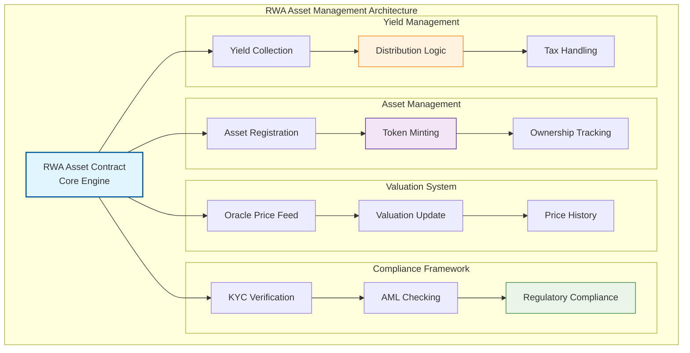
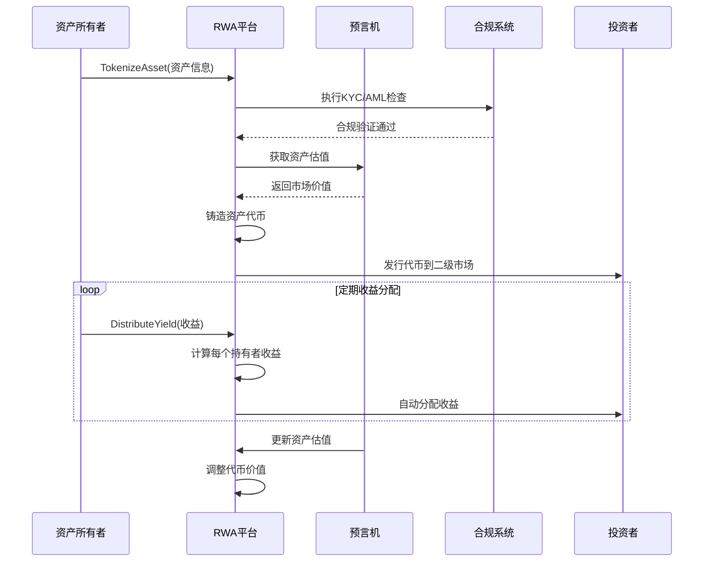

# 🏠 WES标准RWA合约模板

## 🎯 模板定位

**这是一个生产就绪的标准RWA合约模板，适合有经验的开发者用于构建专业级现实资产代币化平台。**

### 📚 RWA概念初学者引导

如果你是第一次接触RWA（现实世界资产）概念，让我们先从基础开始：

#### 🤔 什么是RWA？

### 📚 生活化理解
　　RWA（Real World Assets）就像**将实物变成数字货币**：
- 🏠 把房子变成可交易的数字代币
- 💎 把黄金变成区块链上的数字黄金  
- 📜 把公司股权变成可编程的数字股票
- 🎨 把艺术品变成可分割的数字收藏品

#### 🆚 传统资产 vs RWA 对比

| 特性 | 传统资产 | RWA代币化 |
|------|---------|-----------|
| **交易门槛** | 🏦 高额最低投资 | 🪙 小额投资即可 |
| **流动性** | ⏰ 交易周期长 | ⚡ 24/7即时交易 |
| **地域限制** | 🗺️ 本地市场限制 | 🌍 全球投资者参与 |
| **分割性** | 🏠 无法分割持有 | 🧩 可碎片化投资 |
| **透明度** | 📄 依赖中介机构 | 🔍 区块链透明记录 |
| **手续费** | 💰 高昂中介费用 | 🔧 自动化降低成本 |

### 🌟 RWA代币化的优势
- **💸 降低投资门槛** - 几美元就能投资高价值资产
- **🚀 提高流动性** - 原本难以交易的资产变得高流动
- **🌍 全球化投资** - 世界各地的投资者都能参与
- **🔧 可编程性** - 智能合约自动化分红、治理等功能

### 🔄 从基础概念到Standard版本

现在你了解了RWA的基本概念，让我们看看这个Standard版本提供的完整功能：

### 🆚 基础理解 vs Standard版本 功能对比

| 特性 | 基础理解 | Standard版本 (本模板) |
|------|---------|---------------------|
| **目标** | 🎓 概念学习 | 🏭 生产级资产平台 |
| **资产类型** | 🏠 单一房产代币化 | 🌟 多种资产类型支持 |
| **价值评估** | 📊 手动定价 | 🤖 预言机自动估值 |
| **合规管理** | ❌ 缺乏合规框架 | ⚖️ 内置合规和监管 |
| **收益分配** | 👥 手动分配 | 💰 智能合约自动分红 |
| **治理机制** | 👤 中心化管理 | 🗳️ 代币持有者投票 |
| **流动性** | 📝 场外交易 | 🔄 DEX集成交易 |

---

## 📋 **模板概述**

　　本模板提供了基于WES URES模型的现实世界资产（RWA）代币化平台实现，支持资产上链、价值评估、合规管理、收益分配和流动性提供等完整RWA功能。

**模板类型**：RWA资产合约（Real World Asset Contract）  
**接口标准**：IContractBase + IRealWorldAsset  
**设计模式**：无状态资产管理模型  
**编程语言**：Go (TinyGo编译到WASM)

---

## 🎯 **核心特性**

### **1. 完整资产代币化体系**
- 资产上链：支持多种现实资产的数字化
- 价值评估：集成预言机的动态估值系统
- 合规框架：内置KYC/AML和监管合规
- 分割持有：资产碎片化和共同所有权

### **2. 标准RWA功能**
- ✅ **TokenizeAsset**: 资产代币化
- ✅ **UpdateValuation**: 更新资产估值
- ✅ **DistributeYield**: 收益分配
- ✅ **TransferOwnership**: 所有权转移
- ✅ **GetAssetInfo**: 资产信息查询
- ✅ **ComplianceCheck**: 合规检查

### **3. 高级RWA机制**
- 动态估值：基于市场数据的实时估值
- 收益管理：租金、利息等收益的自动分配
- 治理投票：重大决策的去中心化投票
- 流动性支持：与DEX集成的二级市场

---

## 🏗️ **架构设计**



---

## 💡 **RWA概念进阶指南**

### 🎓 从概念理解到实际实现

让我们通过实际的代码示例来理解RWA是如何工作的：

#### 基础概念：简单资产代币化
```go
// 概念层面：基础资产代币化
func SimpleTokenizeAsset(asset_id, owner, value) {
    // 1. 记录资产信息
    // 2. 铸造对应代币
    // 3. 分配给所有者
}
```

#### Standard版本：专业级资产代币化
```go
// Standard版本：完整的资产代币化（简化示例）
func TokenizeAsset() uint32 {
    // 1. 复杂参数解析和验证
    params := parseAndValidateAssetParams()
    
    // 2. 合规检查（KYC/AML）
    if err := performComplianceCheck(params.Owner); err != nil {
        return ERROR_COMPLIANCE_FAILED
    }
    
    // 3. 资产真实性验证
    if err := verifyAssetAuthenticity(params); err != nil {
        return ERROR_ASSET_VERIFICATION_FAILED
    }
    
    // 4. 预言机估值验证
    marketValue := getOracleValuation(params.AssetType, params.AssetID)
    if abs(marketValue - params.DeclaredValue) > VALUATION_THRESHOLD {
        return ERROR_VALUATION_MISMATCH
    }
    
    // 5. 代币铸造和分割配置
    tokenSupply := calculateTokenSupply(params.DeclaredValue)
    if err := mintAssetTokens(params, tokenSupply); err != nil {
        return handleError(err)
    }
    
    // 6. 注册资产和设置治理
    setupAssetGovernance(params)
    
    // 7. 启动收益分配机制
    initializeYieldDistribution(params)
    
    // 8. 发出资产代币化事件
    emitTokenizationEvent(params, tokenSupply)
    
    return SUCCESS
}
```

### 📈 主要进阶特性

#### 1. **更智能的估值系统**
- 基础: 静态手动估值
- Standard: 预言机动态估值 + 市场数据验证

#### 2. **更完善的合规框架**
- 基础: 简单身份验证
- Standard: 完整KYC/AML + 监管合规 + 税务处理

#### 3. **更高效的收益分配**
- 基础: 手动分红
- Standard: 智能合约自动分配 + 税务优化

---

## 📋 **支持的资产类型**

| 资产类型 | 标识符 | 描述 | 适用场景 |
|----------|--------|------|----------|
| 房地产 | REAL_ESTATE | 住宅、商业地产 | 房产投资、租金收益 |
| 贵金属 | PRECIOUS_METALS | 黄金、白银、铂金 | 价值存储、避险投资 |
| 艺术品 | ARTWORK | 画作、雕塑、古董 | 收藏投资、文化价值 |
| 股权资产 | EQUITY | 公司股权、股票 | 股权投资、分红收益 |
| 债权资产 | DEBT | 债券、票据、贷款 | 固定收益、利息收入 |
| 商品资产 | COMMODITIES | 石油、农产品、工业品 | 商品投资、通胀对冲 |
| 知识产权 | IP_RIGHTS | 专利、版权、商标 | 知识产权投资、许可收益 |
| 基础设施 | INFRASTRUCTURE | 桥梁、公路、管道 | 基建投资、使用费收益 |

---

## 🚀 **快速开始指南**

### 📋 前置条件

确保你已经：
- ✅ 理解RWA和资产代币化的基本概念
- ✅ 熟悉合规要求和监管框架
- ✅ 了解估值方法和价格发现机制
- ✅ 具备资产管理和收益分配经验

### 🔧 使用步骤

#### 1. 复制并配置模板

```bash
# 复制模板到你的项目
cp -r templates/standard/rwa/ my-rwa-platform/
cd my-rwa-platform/

# 编辑RWA参数
vim rwa_asset_template.go
```

#### 2. 配置RWA平台参数

```go
// 修改RWA平台配置
const (
    PLATFORM_NAME         = "My Professional RWA Platform"
    SUPPORTED_JURISDICTIONS = "US,EU,SG"  // 支持的法域
    MIN_ASSET_VALUE       = 100000        // 最小资产价值 $100k
    MAX_ASSET_VALUE       = 100000000     // 最大资产价值 $100M
    VALUATION_THRESHOLD   = 500           // 5% 估值容忍度
    KYC_REQUIRED          = true          // 强制KYC
    YIELD_DISTRIBUTION_FREQ = 2592000     // 30天分红频率
)
```

#### 3. 编译和测试

```bash
# 生产级编译
tinygo build -o rwa.wasm -target wasi -opt=2 rwa_asset_template.go

# 运行RWA测试
go test ./tests/rwa/ -v

# 合规测试
go test ./tests/rwa/ -run TestCompliance
```

#### 4. 部署和初始化

```bash
# 部署RWA平台
./deploy.sh testnet rwa.wasm

# 初始化预言机连接
./scripts/init-oracles.sh

# 验证合规功能
./scripts/test-compliance.sh
```

---

## 💡 **使用示例**

### **资产代币化**

```javascript
// 将房产代币化
const tokenizeResult = await contract.call("TokenizeAsset", {
    asset_type: "REAL_ESTATE",
    asset_id: "NYC_APARTMENT_001",
    owner: "0x742d35Cc6644C4532B10C7782afd4e7f4f42c07c",
    declared_value: "500000000000", // $500,000
    location: "New York, NY, USA",
    documentation: {
        deed: "ipfs://QmXyZ...",
        appraisal: "ipfs://QmAbc...",
        legal_docs: "ipfs://QmDef..."
    },
    kyc_verified: true
});
```

### **估值更新**

```javascript
// 更新资产市场估值
const valuationResult = await contract.call("UpdateValuation", {
    asset_id: "NYC_APARTMENT_001",
    new_valuation: "520000000000", // $520,000
    oracle_source: "chainlink_real_estate",
    appraisal_date: 1640995200,
    validator: "licensed_appraiser_001"
});
```

### **收益分配**

```javascript
// 分配租金收益
const distributeResult = await contract.call("DistributeYield", {
    asset_id: "NYC_APARTMENT_001",
    yield_amount: "2000000000", // $2,000 月租金
    yield_type: "RENTAL_INCOME",
    distribution_date: 1640995200,
    tax_handling: "AUTO_WITHHOLD"
});
```

### **所有权转移**

```javascript
// 转移资产代币所有权
const transferResult = await contract.call("TransferOwnership", {
    asset_id: "NYC_APARTMENT_001",
    from: "0x742d35Cc6644C4532B10C7782afd4e7f4f42c07c",
    to: "0x8ba1f109551bD432803012645Hac136c5aB635D",
    token_amount: "100000000", // 10% 所有权
    compliance_verified: true
});
```

---

## 🔄 **RWA生命周期流程图**



---

## 📋 **接口规范**

### **必需导出函数**

```go
//export Initialize
func Initialize() uint32

//export TokenizeAsset
func TokenizeAsset() uint32

//export UpdateValuation
func UpdateValuation() uint32

//export DistributeYield
func DistributeYield() uint32

//export TransferOwnership
func TransferOwnership() uint32

//export GetAssetInfo
func GetAssetInfo() uint32

//export ComplianceCheck
func ComplianceCheck() uint32

//export GetYieldHistory
func GetYieldHistory() uint32

//export GetVersion
func GetVersion() uint32
```

### **标准错误码**

| 错误码 | 名称 | 描述 |
|--------|------|------|
| 0 | SUCCESS | 成功 |
| 1 | ERROR_INVALID_PARAMS | 无效参数 |
| 2 | ERROR_ASSET_NOT_EXISTS | 资产不存在 |
| 3 | ERROR_COMPLIANCE_FAILED | 合规检查失败 |
| 4 | ERROR_VALUATION_MISMATCH | 估值不匹配 |
| 5 | ERROR_INSUFFICIENT_OWNERSHIP | 所有权不足 |
| 6 | ERROR_REGULATORY_VIOLATION | 违反监管规定 |

---

## ⚙️ **RWA存储模型**

```mermaid
graph LR
    subgraph "RWA UTXO Storage Model"
        UTXO_POOL[(UTXO Pool)]
        
        subgraph "Asset Registry UTXO"
            ASSET_ID["Asset ID"]
            ASSET_TYPE["Asset Type"]
            OWNER["Owner Address"]
            VALUE["Current Value"]
            LOCATION["Physical Location"]
        end
        
        subgraph "Token Holdings UTXO"
            HOLDER["Token Holder"]
            TOKEN_AMOUNT["Token Amount"]
            OWNERSHIP_PERCENT["Ownership %"]
            PURCHASE_PRICE["Purchase Price"]
        end
        
        subgraph "Yield Distribution UTXO"
            YIELD_AMOUNT["Yield Amount"]
            DISTRIBUTION_DATE["Distribution Date"]
            YIELD_TYPE["Yield Type"]
            TAX_STATUS["Tax Status"]
        end
        
        subgraph "Compliance Record UTXO"
            KYC_STATUS["KYC Status"]
            AML_CHECK["AML Check"]
            JURISDICTION["Jurisdiction"]
            LAST_UPDATE["Last Update"]
        end
    end
    
    UTXO_POOL --> ASSET_ID
    UTXO_POOL --> HOLDER
    UTXO_POOL --> YIELD_AMOUNT
    UTXO_POOL --> KYC_STATUS
    
    style UTXO_POOL fill:#e3f2fd,stroke:#1976d2
    style ASSET_ID fill:#f3e5f5,stroke:#7b1fa2
    style HOLDER fill:#e8f5e8,stroke:#388e3c
    style YIELD_AMOUNT fill:#fff3e0,stroke:#f57c00
    style KYC_STATUS fill:#fce4ec,stroke:#c2185b
```



---

## 🔧 **高级配置选项**

### **合规配置**

```go
// 合规框架配置
const (
    ENABLE_KYC             = true     // 启用KYC验证
    ENABLE_AML             = true     // 启用AML检查
    ENABLE_ACCREDITED_ONLY = false    // 仅限合格投资者
    MAX_INVESTORS_PER_ASSET = 1000    // 每个资产最大投资者数
    MIN_INVESTMENT_AMOUNT   = 1000    // 最小投资金额
)
```

### **估值配置**

```go
// 估值系统配置
const (
    ENABLE_ORACLE_VALIDATION = true   // 预言机验证
    VALUATION_UPDATE_INTERVAL = 86400 // 24小时估值更新
    PRICE_DEVIATION_THRESHOLD = 1000  // 10% 价格偏差阈值
    REQUIRE_APPRAISAL        = true   // 要求专业评估
    AUTO_REBALANCE           = false  // 自动重新平衡
)
```

---

## 🧪 **测试策略**

### **测试覆盖率要求**

```bash
# 运行完整RWA测试
go test ./... -coverprofile=coverage.out
go tool cover -html=coverage.out

# 目标覆盖率 > 90%
```

### **关键测试用例**

1. **资产生命周期测试**
   - 代币化、估值、交易完整流程
   - 收益分配准确性
   - 合规检查有效性

2. **合规性测试**
   - KYC/AML流程验证
   - 监管要求遵循
   - 跨境交易合规

3. **估值系统测试**
   - 预言机数据准确性
   - 估值更新机制
   - 价格偏差保护

4. **安全性测试**
   - 资产所有权保护
   - 收益分配安全
   - 合规数据隐私

---

## 📚 **进阶学习路径**

### 🎯 掌握Standard版本后的下一步

#### 如果你想建设RWA交易市场
→ 学习 `../defi/` 模板，实现RWA代币的DEX交易

#### 如果你想集成治理功能
→ 学习 `../governance/` 模板，实现资产持有者的集体决策

#### 如果你想发行证券型代币
→ 学习 `../token/` 模板，设计合规的证券代币经济学

#### 如果你想创建RWA NFT
→ 学习 `../nft/` 模板，将独特资产NFT化

### 📖 推荐进阶资源

- **RWA监管框架**: 了解不同国家的RWA监管要求
- **资产估值方法**: 学习各类资产的专业估值技术
- **合规技术**: KYC/AML技术实现和隐私保护
- **跨境金融**: 国际金融法规和跨境交易合规

---

## 🤝 **社区支持**

### 💬 获得帮助

- **技术问题**: GitHub Issues 或开发者社区
- **合规咨询**: 查看 `../../BEGINNER_GUIDE.md`
- **概念学习**: 参考 `../../CONCEPTS.md`  
- **快速上手**: 使用 `../../tools/beginner/help.sh`

### 🏆 贡献方式

- **代码贡献**: 提交合规功能和估值算法优化
- **合规研究**: 分享不同法域的RWA合规实践
- **估值模型**: 贡献各类资产的估值方法和算法
- **案例分析**: 分享RWA项目经验和最佳实践

---

## 📚 **参考资料**

- [RWA监管框架概述](https://www.bis.org/publ/bcbs_d519.htm)
- [资产代币化最佳实践](https://www.imf.org/en/Publications/fintech-notes)
- [合规技术标准](https://www.fatf-gafi.org/guidance/)
- [WES RWA框架文档](../../../../docs/specs/rwa/RWA_SPEC.md)

---

## 🆘 **常见问题**

### **Q: 如何确保资产代币化的合规性？**
A: 实施完整的KYC/AML流程，遵循当地监管要求，并定期进行合规审计。

### **Q: 资产估值如何保证准确性？**
A: 使用多个可信预言机，结合专业评估师报告，并设置合理的偏差阈值。

### **Q: 如何处理跨境投资的合规问题？**
A: 确保符合所有相关法域的监管要求，并实施地域限制和投资者资格检查。

### **Q: 收益分配如何处理税务问题？**
A: 集成税务计算模块，自动预扣税款，并提供详细的税务报告。

---

## 💡 总结

这个Standard RWA模板提供了**完整的现实资产代币化解决方案**：

- **✅ 从基础概念到生产实现的完整路径**
- **🏠 支持多种现实资产类型的代币化**  
- **⚖️ 内置完整的合规和监管框架**
- **💰 智能化的收益分配和治理机制**

**记住**: RWA不仅是技术创新，更是金融基础设施的重要组成部分。合规为先，技术为本，让现实世界的价值在区块链上高效流动！

🚀 **开始构建你的现实资产代币化平台吧！**

---

**📝 更新日志**

| 版本 | 日期 | 更新内容 |
|------|------|----------|
| v1.0.0 | 2024-12 | 初始版本，完整RWA功能 |

---

*📄 如需更多帮助，请参考WES开发者文档或联系技术支持。*