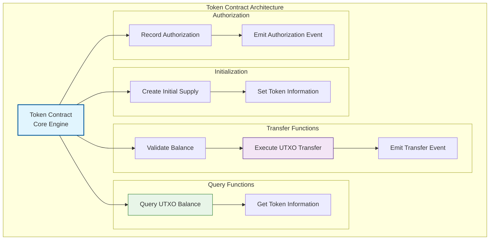
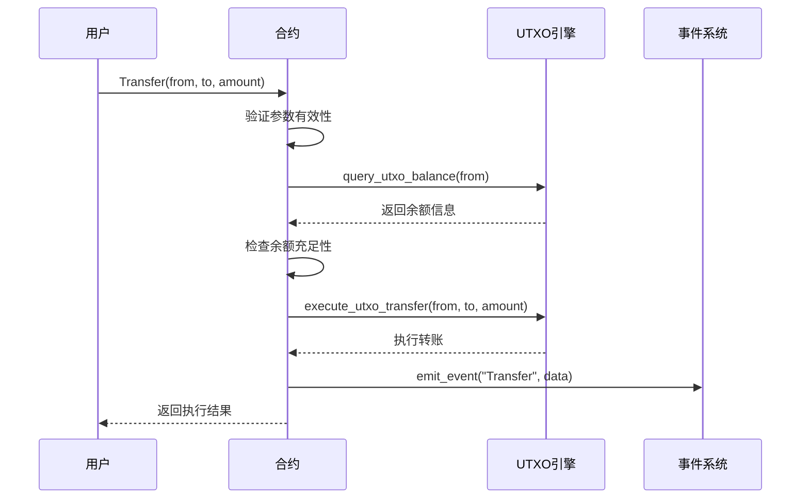
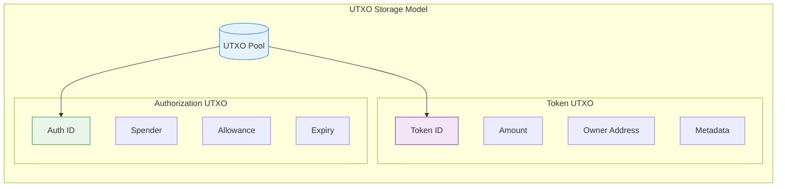

# 🏆 WES标准代币合约模板

## 🎯 模板定位

**这是一个生产就绪的标准代币合约模板，适合有经验的开发者用于实际项目开发。**

### 📚 从Learning进阶到Standard

如果你已经完成了 `../learning/simple-token` 的学习，恭喜！你现在可以：
- ✅ 理解代币的基本概念和UTXO机制  
- ✅ 掌握基础的转账和查询功能
- ✅ 熟悉WES合约开发流程

**现在是时候学习生产级代币开发了！**

### 🔄 Learning vs Standard 功能对比

| 特性 | Learning版本 | Standard版本 (本模板) |
|------|-------------|-------------------|
| **目标** | 🎓 概念学习 | 🏭 生产开发 |
| **代码行数** | ~350行 | ~600行+ |
| **注释风格** | 🔍 详细教学 | 📋 专业文档 |
| **功能范围** | 🔰 基础功能 | ⚡ 完整ERC20+ |
| **安全性** | 🛡️ 基础检查 | 🔒 生产级安全 |
| **性能** | 📚 易理解 | 🚀 高性能优化 |
| **扩展性** | 💡 演示导向 | 🔧 模块化设计 |

---

## 📋 **模板概述**

　　本模板提供了基于WES URES（统一资源执行状态）模型的标准代币合约实现，支持ERC20风格的代币功能，采用完全无状态设计。

**模板类型**：代币合约（Token Contract）  
**接口标准**：IContractBase + ITokenStandard  
**设计模式**：无状态UTXO模型  
**编程语言**：Go (TinyGo编译到WASM)

---

## 🎯 **核心特性**

### **1. 完全无状态设计**
- 不依赖传统的state_get/state_set存储
- 所有代币以ContractTokenAsset UTXO形式存在
- 符合URES三阶段执行模型

### **2. 标准ERC20功能**
- ✅ **Transfer**: 代币转账
- ✅ **GetBalance**: 余额查询
- ✅ **GetTotalSupply**: 总供应量查询
- ✅ **Approve**: 授权管理
- ✅ **Initialize**: 合约初始化
- ✅ **GetMetadata**: 元数据获取

### **3. UTXO原生集成**
- 直接通过create_utxo_output创建代币
- 通过execute_utxo_transfer实现转账
- 通过query_utxo_balance查询余额

---

## 🏗️ **架构设计**



---

## 📋 **接口规范**

### **必需导出函数**

```go
//export Initialize
func Initialize() uint32

//export Transfer  
func Transfer() uint32

//export GetBalance
func GetBalance() uint32

//export GetTotalSupply
func GetTotalSupply() uint32

//export Approve
func Approve() uint32

//export GetMetadata
func GetMetadata() uint32
```

### **函数签名与参数**

#### **Initialize()**
- **目的**: 合约初始化，设置代币基本信息
- **参数**: JSON格式合约参数
- **返回**: 执行结果状态码

```json
{
  "name": "MyToken",
  "symbol": "MTK", 
  "decimals": 18,
  "initial_supply": "1000000000000000000000000"
}
```

#### **Transfer()**
- **目的**: 执行代币转账
- **参数**: JSON格式转账参数
- **返回**: 执行结果状态码

```json
{
  "from": "address_of_sender",
  "to": "address_of_recipient", 
  "amount": "transfer_amount_in_wei"
}
```

#### **GetBalance()**
- **目的**: 查询指定地址的代币余额
- **参数**: JSON格式查询参数
- **返回**: 余额查询结果

```json
{
  "address": "target_address_to_query"
}
```

---

## 🔄 **UTXO转账流程**



---

## 💡 **从Learning版本进阶指南**

### 🎓 你已经在Learning版本学到了什么

在 `learning/simple-token` 中，你学习了：

```go
// Learning版本：基础转账（简化）
func Transfer() uint32 {
    params := framework.GetContractParams()
    to := params.ParseJSON("to")
    amountStr := params.ParseJSON("amount")
    
    // 基础验证和转账
    err := framework.TransferUTXO(from, to, amount, tokenID)
    return framework.SUCCESS
}
```

### 🏆 Standard版本的进阶实现

在这个Standard版本中，你将学到：

```go
// Standard版本：生产级转账（完整）
func Transfer() uint32 {
    // 1. 复杂参数解析和验证
    params := parseAndValidateParams()
    
    // 2. 权限和安全检查
    if err := validatePermissions(params); err != nil {
        return handleError(err)
    }
    
    // 3. 余额和限制检查
    if err := checkBalanceAndLimits(params); err != nil {
        return handleError(err)
    }
    
    // 4. 执行优化的UTXO转账
    if err := executeOptimizedTransfer(params); err != nil {
        return handleError(err)
    }
    
    // 5. 完整的事件发出和日志记录
    emitTransferEvents(params)
    
    return SUCCESS
}
```

### 📈 主要进阶特性

#### 1. **更强大的参数处理**
- Learning: 基础的JSON解析
- Standard: 完整的参数验证、类型检查、边界检查

#### 2. **更完善的安全机制**
- Learning: 基础的余额检查
- Standard: 多层安全验证、权限管理、攻击防护

#### 3. **更高效的性能优化**
- Learning: 直接的UTXO操作
- Standard: 优化的批量操作、缓存机制、执行费用优化

---

## ⚙️ **详细实现规范**

### **状态存储模型**



### **错误处理**

```go
const (
    SUCCESS                = 0
    ERROR_INVALID_PARAMS   = 1
    ERROR_INSUFFICIENT_BALANCE = 2
    ERROR_UNAUTHORIZED     = 3
    ERROR_CONTRACT_PAUSED  = 4
    ERROR_EXECUTION_FAILED = 6
)
```

### **事件定义**

```go
type TransferEvent struct {
    From   string `json:"from"`
    To     string `json:"to"`
    Amount string `json:"amount"`
    TxHash string `json:"tx_hash"`
}

type ApprovalEvent struct {
    Owner   string `json:"owner"`
    Spender string `json:"spender"`
    Amount  string `json:"amount"`
}
```

---

## 🚀 **快速开始指南**

### 📋 前置条件

确保你已经：
- ✅ 完成 `learning/simple-token` 学习
- ✅ 理解WES的UTXO模型  
- ✅ 安装TinyGo编译环境
- ✅ 熟悉生产环境部署流程

### 🔧 使用步骤

#### 1. 复制并配置模板

```bash
# 复制模板到你的项目
cp -r templates/standard/token/ my-production-token/
cd my-production-token/

# 编辑配置参数
vim standard_token_template.go
```

#### 2. 修改基础配置

```go
// 修改代币基本信息
const (
    DEFAULT_NAME     = "My Production Token"
    DEFAULT_SYMBOL   = "MPT"
    DEFAULT_DECIMALS = 18
    MAX_SUPPLY       = 1000000000 // 10亿代币上限
)
```

#### 3. 编译和测试

```bash
# 生产级编译
tinygo build -o main.wasm -target wasi -opt=2 standard_token_template.go

# 运行测试套件
go test ./tests/ -v

# 性能基准测试
go test ./tests/ -bench=.
```

#### 4. 部署验证

```bash
# 部署到测试网
./deploy.sh testnet

# 功能验证
./verify.sh main.wasm

# 部署到主网
./deploy.sh mainnet
```

---

## 🔧 **高级配置选项**

### **功能开关**

```go
// 高级功能配置
const (
    ENABLE_BURNING     = true   // 支持代币销毁
    ENABLE_MINTING     = false  // 禁用增发（安全考虑）
    ENABLE_PAUSE       = true   // 支持紧急暂停
    ENABLE_BLACKLIST   = false  // 黑名单功能
    ENABLE_WHITELIST   = false  // 白名单功能
)
```

### **经济参数**

```go
// 经济模型参数
const (
    TRANSFER_FEE_RATE = 0       // 转账手续费率 (basis points)
    MIN_TRANSFER      = 1       // 最小转账金额
    MAX_TRANSFER      = 0       // 最大转账金额 (0=无限制)
    DAILY_LIMIT       = 0       // 日转账限额 (0=无限制)
)
```

---

## 🧪 **测试策略**

### **测试覆盖率要求**

```bash
# 运行完整测试覆盖
go test ./... -coverprofile=coverage.out
go tool cover -html=coverage.out

# 目标覆盖率 > 90%
```

### **关键测试用例**

1. **基础功能测试**
   - 正常转账流程
   - 余额查询准确性
   - 总供应量一致性

2. **边界条件测试**  
   - 零金额转账
   - 余额不足情况
   - 无效地址处理

3. **安全性测试**
   - 重入攻击防护
   - 整数溢出防护
   - 权限控制验证

4. **性能测试**
   - 大量转账压力测试
   - 执行费用消耗优化验证
   - 并发访问测试

---

## 📚 **进阶学习路径**

### 🎯 掌握Standard版本后的下一步

#### 如果你想开发DeFi应用
→ 学习 `../defi/` 模板，了解AMM和流动性挖矿

#### 如果你想集成NFT功能  
→ 学习 `../nft/` 模板，实现代币+NFT混合应用

#### 如果你想添加治理功能
→ 学习 `../governance/` 模板，实现DAO投票机制

#### 如果你想处理现实资产
→ 学习 `../rwa/` 模板，了解资产代币化

### 📖 推荐进阶资源

- **WES技术文档**: 深入理解UTXO和URES模型
- **智能合约安全**: 生产级安全最佳实践  
- **执行费用优化指南**: 成本优化和性能调优
- **DeFi开发指南**: 去中心化金融应用开发

---

## 🤝 **社区支持**

### 💬 获得帮助

- **技术问题**: GitHub Issues 或开发者社区
- **使用指导**: 查看 `../../BEGINNER_GUIDE.md`
- **概念学习**: 参考 `../../CONCEPTS.md`  
- **快速上手**: 使用 `../../tools/beginner/help.sh`

### 🏆 贡献方式

- **代码贡献**: 提交功能改进和性能优化
- **文档改进**: 完善使用文档和最佳实践
- **测试用例**: 补充边界测试和安全测试
- **社区分享**: 分享你的项目经验和技巧

---

## 💡 总结

这个Standard代币模板是从Learning版本的**自然进阶**：

- **✅ 保持Learning版本的易理解性**
- **⚡ 提供生产环境需要的完整功能**  
- **🔒 集成企业级的安全和性能特性**
- **🔧 支持灵活的定制和扩展需求**

**记住**: 从Learning到Standard不是跳跃，而是能力的提升。你已经掌握了基础，现在是时候构建真正的产品了！

🚀 **开始你的生产级代币项目开发吧！**