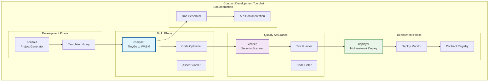

# 合约工具链（contracts/tools）

【模块定位】
　　本目录提供WES智能合约开发的完整工具链，包括编译器、部署器、验证器和项目脚手架。通过自动化工具简化合约开发流程，提高开发效率和代码质量。

【设计原则】
- 自动化优先：减少手动操作，提高开发效率
- 标准化流程：统一的开发、编译、部署流程
- 质量保证：内置代码检查和安全验证
- 易于使用：友好的命令行界面和详细文档
- 可扩展性：支持插件和自定义扩展

【核心职责】
1. **合约编译**：TinyGo到WASM的优化编译
2. **自动部署**：多网络合约部署和管理
3. **代码验证**：静态分析和安全检查
4. **项目脚手架**：快速创建合约项目模板
5. **文档生成**：自动生成API文档和使用指南
6. **测试工具**：合约测试和模拟环境

## 工具链组件

### compiler/ - 智能编译器
**功能**：
- TinyGo到WebAssembly的优化编译
- 自动依赖管理和版本控制
- 代码压缩和性能优化
- 编译错误诊断和修复建议

**使用示例**：
```bash
# 编译单个合约
go run compiler/main.go 
  --source ./my_contract.go 
  --output ./my_contract.wasm 
  --optimize high 
  --target wasm

# 批量编译项目
go run compiler/main.go 
  --project ./my_project 
  --output ./build 
  --parallel 4
```

### deployer/ - 自动部署器
**功能**：
- 多网络部署支持（主网、测试网、本地）
- 部署参数配置和验证
- 部署状态跟踪和回滚
- 执行费用费用估算和优化

**配置文件示例**：
```json
{
  "networks": {
    "mainnet": {
      "rpc_url": "https://mainnet.weisyn.io",
      "chain_id": 1,
      "执行费用_price": "20000000000"
    },
    "testnet": {
      "rpc_url": "https://testnet.weisyn.io", 
      "chain_id": 1337,
      "执行费用_price": "10000000000"
    }
  },
  "contracts": {
    "MyToken": {
      "source": "./token.wasm",
      "constructor_args": ["MyToken", "MTK", 18, 1000000]
    }
  }
}
```

### verifier/ - 安全验证器
**功能**：
- 静态代码分析
- 安全漏洞检测
- 执行费用消耗分析
- 最佳实践检查

**检查项目**：
- 重入攻击防护
- 整数溢出保护
- 权限控制检查
- 状态变量安全性

### scaffold/ - 项目脚手架
**功能**：
- 快速创建合约项目模板
- 预配置开发环境
- 集成测试框架
- CI/CD配置生成

**模板类型**：
- ERC20代币合约
- ERC721 NFT合约
- DeFi协议合约
- 治理合约
- 自定义合约模板

## 工具链架构



## 使用示例

### 1. 创建新项目
```bash
# 创建ERC20代币项目
go run scaffold/main.go create 
  --template erc20 
  --name MyToken 
  --symbol MTK 
  --output ./my-token-project

# 创建NFT项目
go run scaffold/main.go create 
  --template erc721 
  --name MyNFT 
  --symbol MNFT 
  --output ./my-nft-project

# 创建自定义项目
go run scaffold/main.go create 
  --template custom 
  --features "staking,governance,multisig" 
  --output ./my-custom-project
```

### 2. 编译和验证
```bash
# 编译合约
go run compiler/main.go 
  --source ./contracts/token.go 
  --output ./build/token.wasm 
  --optimize high

# 安全验证
go run verifier/main.go 
  --source ./contracts/token.go 
  --rules security,执行费用,best-practices 
  --report ./reports/security.json

# 运行测试
go test ./tests/... -v
```

### 3. 部署合约
```bash
# 部署到测试网
go run deployer/main.go deploy 
  --network testnet 
  --contract ./build/token.wasm 
  --args "MyToken,MTK,18,1000000" 
  --执行费用-limit 500000

# 验证部署
go run deployer/main.go verify 
  --network testnet 
  --address 0x123...abc 
  --source ./contracts/token.go
```

### 4. 生成文档
```bash
# 生成API文档
go run tools/doc_generator.go 
  --source ./contracts/token.go 
  --output ./docs/api.md 
  --format markdown

# 生成用户指南
go run tools/doc_generator.go 
  --project ./my-token-project 
  --output ./docs 
  --include-examples true
```

## 配置文件

### 1. 编译配置（compile.json）
```json
{
  "compiler": {
    "version": "tinygo-0.30.0",
    "target": "wasm",
    "optimization": {
      "level": 2,
      "size": true,
      "speed": false
    },
    "gc": "leaking",
    "scheduler": "none"
  },
  "wasm": {
    "stack_size": 16384,
    "export_memory": true,
    "import_memory": false
  }
}
```

### 2. 验证配置（verify.json）
```json
{
  "rules": {
    "security": {
      "check_reentrancy": true,
      "check_overflow": true,
      "check_permissions": true,
      "check_randomness": true
    },
    "执行费用": {
      "max_function_执行费用": 1000000,
      "warn_expensive_loops": true,
      "check_执行费用_estimation": true
    },
    "best_practices": {
      "check_naming": true,
      "check_documentation": true,
      "check_error_handling": true
    }
  }
}
```

### 3. 部署配置（deploy.json）
```json
{
  "deployment": {
    "执行费用": {
      "price": "auto",
      "limit": "auto",
      "multiplier": 1.2
    },
    "confirmation": {
      "blocks": 2,
      "timeout": 300
    },
    "retry": {
      "max_attempts": 3,
      "delay": 5
    }
  }
}
```

## 自动化流程

### 1. CI/CD集成
```yaml
# .github/workflows/contract.yml
name: Contract CI/CD

on:
  push:
    branches: [main]
  pull_request:
    branches: [main]

jobs:
  build:
    runs-on: ubuntu-latest
    steps:
    - uses: actions/checkout@v3
    
    - name: Setup TinyGo
      uses: acifani/setup-tinygo@v1
      with:
        tinygo-version: '0.30.0'
    
    - name: Compile Contracts
      run: |
        go run tools/compiler/main.go 
          --project . 
          --output ./build
    
    - name: Security Verification
      run: |
        go run tools/verifier/main.go 
          --source ./contracts 
          --report ./security-report.json
    
    - name: Deploy to Testnet
      if: github.ref == 'refs/heads/main'
      run: |
        go run tools/deployer/main.go deploy 
          --network testnet 
          --config ./deploy.json
```

### 2. 开发工作流
```bash
#!/bin/bash
# dev-workflow.sh

echo "Starting development workflow..."

# 1. 创建项目
if [ ! -d "$PROJECT_NAME" ]; then
    go run tools/scaffold/main.go create 
      --template $TEMPLATE 
      --name $PROJECT_NAME 
      --output ./$PROJECT_NAME
fi

cd $PROJECT_NAME

# 2. 编译合约
echo "Compiling contracts..."
go run ../tools/compiler/main.go 
  --source ./contracts 
  --output ./build

# 3. 运行测试
echo "Running tests..."
go test ./tests/... -v

# 4. 安全验证
echo "Security verification..."
go run ../tools/verifier/main.go 
  --source ./contracts 
  --report ./security-report.json

# 5. 部署到本地测试网
echo "Deploying to local testnet..."
go run ../tools/deployer/main.go deploy 
  --network local 
  --contracts ./build

echo "Development workflow completed!"
```

## 性能优化

### 1. 编译优化
```go
type CompilerConfig struct {
    OptimizationLevel int     `json:"optimization_level"`  // 0-3
    SizeOptimization  bool    `json:"size_optimization"`
    SpeedOptimization bool    `json:"speed_optimization"`
    DeadCodeElimination bool  `json:"dead_code_elimination"`
    InlineFunctions   bool    `json:"inline_functions"`
}

func optimizeWasm(wasmPath string, config CompilerConfig) error {
    // 应用WASM优化
    if config.SizeOptimization {
        applySizeOptimizations(wasmPath)
    }
    
    if config.DeadCodeElimination {
        eliminateDeadCode(wasmPath)
    }
    
    return nil
}
```

### 2. 部署优化
```go
func estimate执行费用Usage(contractCode []byte, constructor []byte) (uint64, error) {
    // 静态分析估算执行费用使用量
    base执行费用 := uint64(21000) // 基础交易执行费用
    code执行费用 := uint64(len(contractCode)) * 200 // 代码部署执行费用
    constructor执行费用 := estimateConstructor执行费用(constructor)
    
    return base执行费用 + code执行费用 + constructor执行费用, nil
}
```

## 故障排查

### 1. 编译问题诊断
```bash
# 详细编译日志
go run compiler/main.go 
  --source ./contract.go 
  --output ./contract.wasm 
  --verbose 
  --debug

# 检查TinyGo版本兼容性
tinygo version
go run compiler/main.go --check-compatibility
```

### 2. 部署问题解决
```bash
# 检查网络连接
go run deployer/main.go test-network --network testnet

# 验证执行费用估算
go run deployer/main.go estimate-执行费用 
  --contract ./contract.wasm 
  --network testnet

# 部署状态检查
go run deployer/main.go status 
  --tx-hash 0x123...abc 
  --network testnet
```

---

## 🔗 相关文档

- **SDK框架**：`contracts/sdk/README.md` - 开发框架详情
- **合约模板**：`contracts/templates/README.md` - 模板库使用
- **部署指南**：查看具体的网络部署文档
- **最佳实践**：查看智能合约开发最佳实践指南