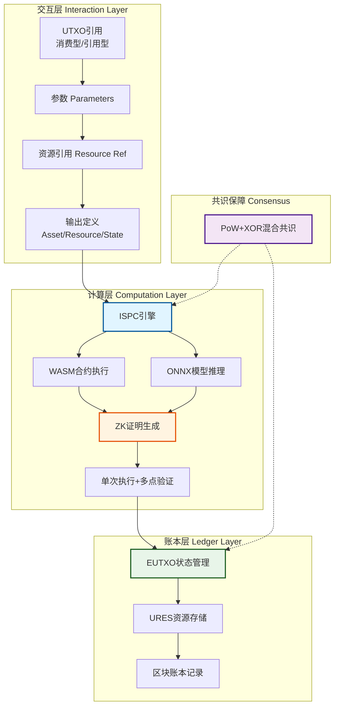
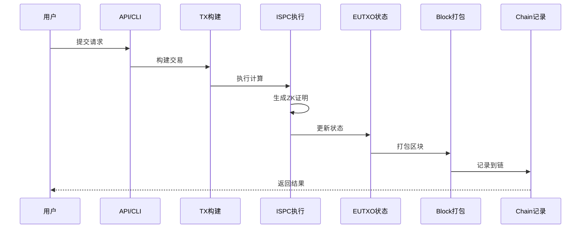
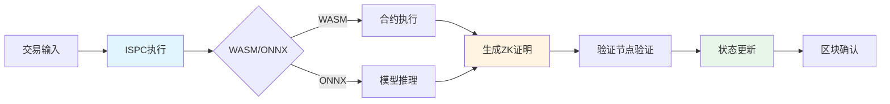

# WES 系统架构鸟瞰

---

## 🎯 系统定位

WES 是**第三代区块链**，通过 ISPC 可验证计算范式，突破了传统区块链的确定性共识限制。

| 时代 | 代表 | 定义 | 局限 | WES 突破 |
|------|------|------|------|---------|
| **第一代** | 比特币 | 数字货币 | 只能转账 | ✅ 可执行资源链上运行 |
| **第二代** | 以太坊 | 智能合约 | 无法运行 AI | ✅ **AI Native 支持** |
| **第三代** | **微迅链** | **可验证计算** | - | **开启新时代** |

---

## 🏗️ 三层经典模型

WES 采用经典的三层架构模型：

**第一层：交互层（Interaction Layer）**
- 定义操作的输入：UTXO引用（消费型/引用型）、参数、资源引用
- 定义操作的输出：Asset/Resource/State 三种输出类型

**第二层：计算层（Computation Layer）**
- **ISPC 是这一层的核心**：执行计算并自动生成可验证证明
- 支持 WASM 智能合约和 ONNX AI 模型执行
- 实现单次执行+多点验证的范式突破

**第三层：账本层（Ledger Layer）**
- **EUTXO**：管理 Asset/Resource/State 三层输出的状态集合
- **URES**：内容寻址存储，管理 WASM/ONNX/文件等资源
- **区块账本**：不可篡改的交易历史记录

**共识保障（横跨各层）**：
- **PoW+XOR**：混合共识机制，保障三层协同的安全性和一致性

---

## 💡 四大核心创新

WES 的四大核心创新分布在不同的架构层级：

| 创新特性 | 定位 | 核心价值 |
|---------|------|---------|
| **PoW+XOR 聚合共识** | 共识层创新 | 工作量证明 + XOR 距离选择，微秒级确认 + 完全去中心化 |
| **EUTXO 扩展模型** | 状态层创新 | 三层输出架构（Asset/Resource/State）+ 引用不消费模式 |
| **URES 统一资源管理** | 资源管理层创新 | 静态资源和可执行资源的统一管理，实现区块链文件系统 |
| **ISPC 本征自证计算** | 计算执行层创新 | 执行即构建机制，单次执行 + 多点验证，零知识证明集成 |

---

## 📦 模块划分与职责

### 核心业务模块

**TX（交易处理）**
- 职责：交易构建、验证、提交
- 能力：支持 Type-state 构建、三阶段验证、渐进式构建

**EUTXO（账本状态）**
- 职责：管理 Asset/Resource/State 三层输出的状态集合
- 能力：支持引用不消费模式、并发访问、状态查询

**URES（资源管理）**
- 职责：内容寻址存储，管理 WASM/ONNX/文件等资源
- 能力：资源存储、查询、去重、完整性验证

**ISPC（可验证计算）**
- 职责：执行计算并自动生成可验证证明
- 能力：WASM 合约执行、ONNX 模型推理、ZK 证明生成

**Chain/Block（区块账本）**
- 职责：不可篡改的交易历史记录
- 能力：区块管理、链状态维护、历史查询

### 协调模块

**Consensus（共识）**
- 职责：PoW+XOR 混合共识，保障系统一致性
- 能力：工作量证明、XOR 距离选择、动态聚合器选择

**Mempool（内存池）**
- 职责：交易缓存管理
- 能力：交易缓存、优先级排序、去重

**Network（网络）**
- 职责：P2P 网络通信和同步
- 能力：节点发现、消息传播、区块同步

### 接口模块

**API（HTTP/RPC）**
- 职责：提供 HTTP/RPC API 供外部调用
- 能力：RESTful API、JSON-RPC API、WebSocket

**CLI（命令行）**
- 职责：提供命令行交互方式
- 能力：账户管理、交易操作、节点管理

**SDK（开发者工具包）**
- 职责：为开发者提供便捷的开发库
- 能力：交易构造、RPC 客户端、事件订阅

---

## 🔄 数据流转

### 交易生命周期

### 执行流程

---

## 🎯 设计原则

### 核心设计原则

| 原则 | 说明 | 价值 |
|------|------|------|
| **分层解耦** | 清晰的层次划分，单向依赖 | 降低耦合，提高可维护性 |
| **关注点分离** | 每个模块单一职责 | 职责明确，易于理解 |
| **依赖反转** | 面向接口编程，而非具体实现 | 提高可测试性和可扩展性 |
| **CQRS 模式** | 读写分离，避免循环依赖 | 优化性能，清晰架构 |
| **事件驱动** | 异步解耦，模块间松耦合 | 提高响应性和可扩展性 |

---

## 📚 相关文档

- [多视角架构说明](./views.md) - 了解不同视角的架构说明
- [术语表](./glossary.md) - 了解关键术语和概念
- [组件能力视图](../components/) - 了解各组件的能力与约束

---

**相关文档**：
- [产品总览](../overview.md) - 了解 WES 是什么、核心价值、应用场景
- [市场定位](../product/positioning.md) - 了解市场定位和竞争分析

