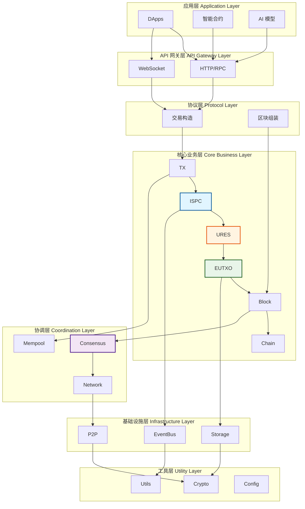

# WES 架构多视角说明

---

## 🎯 文档目的

本文档从不同视角展示 WES 系统架构，帮助读者理解系统的整体设计。

---

## 📐 结构视角：模块划分

### 七层架构

WES 采用清晰的七层架构，从上到下依次为：



**各层职责**：

- **应用层**：DApps / 智能合约 / AI 模型
- **API 网关层**：HTTP/RPC / WebSocket
- **协议层**：交易构造 / 区块组装
- **核心业务层**：Engines → ISPC → URES → UTXO → TX → Block → Chain
- **协调层**：Consensus / Mempool / Network
- **基础设施层**：Storage / P2P / EventBus
- **工具层**：Crypto / Utils / Config

### 模块职责

**核心业务模块**：
- **TX**：交易处理和验证
- **EUTXO**：账本状态管理
- **URES**：资源管理
- **ISPC**：可验证计算
- **Chain/Block**：区块账本

**协调模块**：
- **Consensus**：共识机制
- **Mempool**：交易池管理
- **Network**：网络通信

**接口模块**：
- **API**：HTTP/RPC 接口
- **CLI**：命令行工具
- **SDK**：开发者工具包

---

## 🔄 行为视角：数据流转

### 交易生命周期

```
用户请求 → API/CLI → TX构建 → ISPC执行 → EUTXO状态更新 → Block打包 → Chain记录
```

### 执行流程

```
交易输入 → ISPC执行（WASM/ONNX）→ 生成ZK证明 → 验证节点验证 → 状态更新 → 区块确认
```

### 资源管理流程

```
资源上传 → URES存储 → 内容寻址 → 资源关联 → 交易引用 → 链上记录
```

---

## ⚖️ 共识与状态视角

### 共识机制

**PoW+XOR 聚合共识**：
- **PoW**：工作量证明，保障去中心化安全
- **XOR 距离选择**：确定性高效共识，微秒级确认
- **动态聚合器选择**：基于网络拓扑的动态选择机制

### 状态管理

**EUTXO 扩展模型**：
- **三层输出架构**：Asset/Resource/State 三种输出类型
- **引用不消费模式**：资源可多次并发访问
- **原生多资产支持**：FT/NFT/SFT 作为原生能力

---

## 🚀 执行与存储视角

### 执行模型

**ISPC 本征自证计算**：
- **单次执行+多点验证**：只有一个节点执行，其他节点验证
- **执行即构建**：业务代码执行过程自动构造交易
- **可控外部交互**：HostABI 可验证外部交互

### 存储模型

**URES 统一资源管理**：
- **内容寻址存储**：资源内容通过哈希寻址
- **去重和完整性验证**：相同资源在不同节点产生相同哈希
- **统一资源抽象**：静态资源和可执行资源的统一管理

---

## 🌐 网络与安全视角

### 网络架构

**P2P 网络**：
- **节点发现**：基于 K-bucket 的节点发现机制
- **消息传播**：交易和区块的广播机制
- **区块同步**：链状态同步机制

### 安全机制

**多重安全验证**：
- **交易验证**：三阶段验证（AuthZ → Conservation → Condition）
- **共识安全**：PoW 工作量证明保障
- **执行验证**：ZK 证明验证执行结果

---

## 📚 相关文档

- [架构总览](./overview.md) - 了解系统架构总览
- [术语表](./glossary.md) - 了解关键术语和概念
- [组件能力视图](../components/) - 了解各组件的能力与约束

