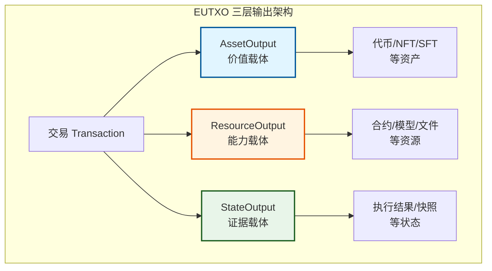
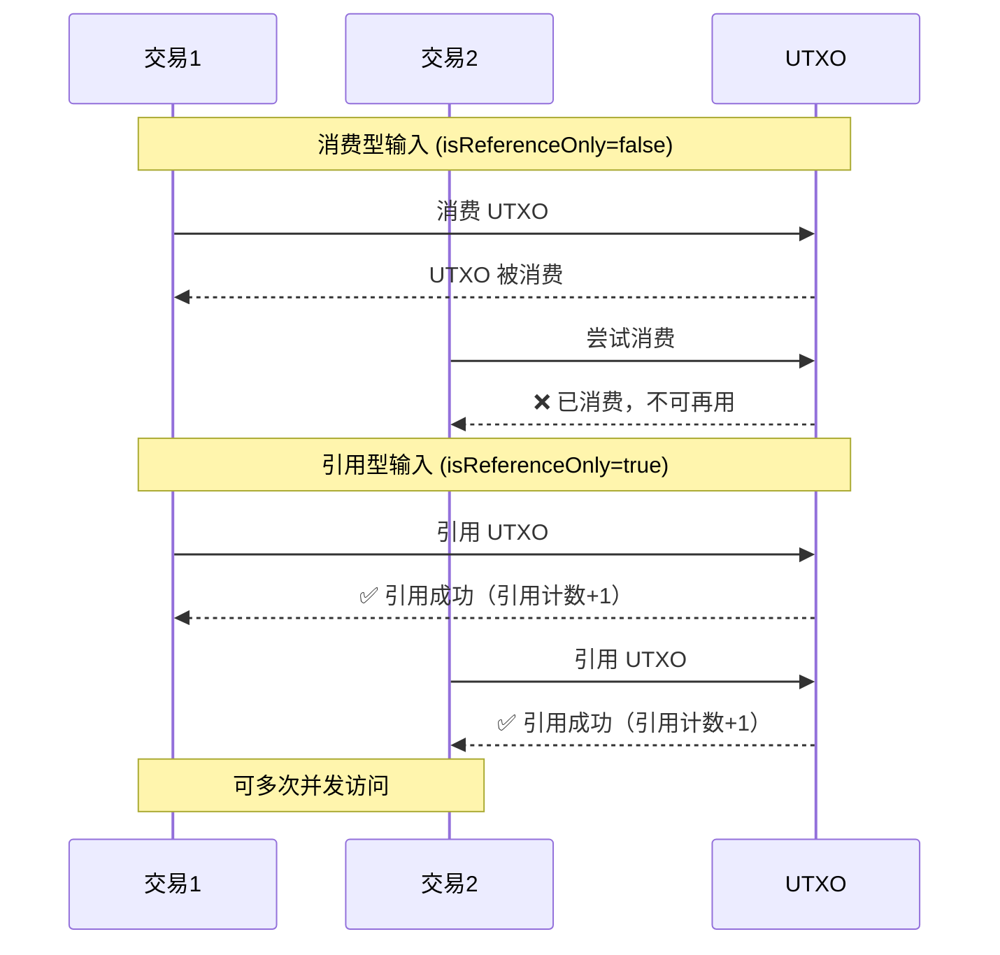

# EUTXO 组件能力视图

---

## 🎯 组件定位

EUTXO（Extended UTXO）组件是 WES 系统的账本状态管理核心，负责管理 Asset/Resource/State 三层输出的状态集合。

**在三层模型中的位置**：账本层（Ledger Layer）

> **战略背景**：EUTXO 组件位于核心业务层垂直依赖链的第④层，依赖 URES（③）和 ISPC（②），被 TX（⑤）依赖。详见 [WES 项目总览](../overview.md)

---

## 💡 核心能力

### 1. 三层输出架构

**能力描述**：
- **AssetOutput**：价值载体，用于代币/NFT/SFT 等资产
- **ResourceOutput**：能力载体，用于合约/模型/文件等资源
- **StateOutput**：证据载体，用于执行结果/快照等状态

**三层输出架构关系**：



**使用约束**：
- 每个输出必须明确指定类型
- AssetOutput 必须指定接收地址和金额
- ResourceOutput 必须指定资源哈希和所有者
- StateOutput 必须包含状态数据和证明

**典型使用场景**：
- 资产转账：使用 AssetOutput
- 资源部署：使用 ResourceOutput
- 执行结果记录：使用 StateOutput

---

### 2. 引用不消费模式

**能力描述**：
- 支持消费型输入（`isReferenceOnly=false`）：UTXO 被消费，不可再使用
- 支持引用型输入（`isReferenceOnly=true`）：UTXO 被引用但不消费，可多次并发访问

**消费型 vs 引用型输入对比**：



**使用约束**：
- 消费型输入计入价值守恒计算
- 引用型输入不计入价值守恒计算，仅用于读取
- 资源 UTXO 通常使用引用型输入，支持程序数据分离

**典型使用场景**：
- 合约调用：引用合约资源，不消费
- 数据读取：引用数据资源，不消费
- 资产转账：消费资产 UTXO，创建新的资产 UTXO

---

### 3. 状态查询

**能力描述**：
- 支持按地址查询 UTXO
- 支持按类别查询 UTXO
- 支持按 OutPoint 查询 UTXO
- 支持状态根查询

**使用约束**：
- 查询是只读操作，不修改状态
- 查询结果反映当前链状态
- 支持快照查询（历史状态）

**查询能力**：
- **按地址查询**：查询某个地址的所有 UTXO
- **按类别查询**：查询某个类别的所有 UTXO
- **按 OutPoint 查询**：查询特定 UTXO
- **状态根查询**：查询当前状态根

---

### 4. 快照管理

**能力描述**：
- 支持创建状态快照
- 支持恢复状态快照
- 支持删除状态快照

**使用约束**：
- 快照创建是原子操作
- 快照恢复会覆盖当前状态
- 快照删除不可恢复

**典型使用场景**：
- 状态回滚：恢复到历史快照
- 状态备份：定期创建快照
- 测试环境：使用快照重置状态

---

## 🔧 接口能力

### UTXOWriter（UTXO 写入器）

**能力**：
- `CreateUTXO()` - 创建 UTXO
- `SpendUTXO()` - 消费 UTXO
- `ReferenceUTXO()` - 引用 UTXO（更新引用计数）

**约束**：
- 写入操作是原子操作
- 写入失败会回滚
- 引用计数自动管理

### UTXOQuery（UTXO 查询器）

**能力**：
- `GetUTXO()` - 查询单个 UTXO
- `GetUTXOsByAddress()` - 按地址查询 UTXO
- `GetUTXOsByCategory()` - 按类别查询 UTXO
- `GetStateRoot()` - 查询状态根

**约束**：
- 查询是只读操作
- 查询结果反映当前状态
- 支持快照查询

---

## ⚙️ 配置说明

### 状态管理配置

| 参数 | 类型 | 默认值 | 说明 |
|------|------|--------|------|
| `max_utxo_count` | int | 1000000 | 最大 UTXO 数量 |
| `snapshot_interval` | int | 1000 | 快照创建间隔（区块数） |
| `enable_reference_counting` | bool | true | 启用引用计数 |

---

## 📋 使用约束

### UTXO 创建约束

1. **格式约束**：
   - OutPoint 必须有效
   - 输出类型必须明确
   - 地址格式必须正确

2. **状态约束**：
   - 不能创建重复的 OutPoint
   - 状态根必须更新
   - 索引必须更新

### UTXO 消费约束

1. **存在性约束**：
   - UTXO 必须存在
   - UTXO 必须未被消费

2. **权限约束**：
   - 必须提供有效的解锁证明
   - 解锁证明必须匹配锁定条件

### 引用计数约束

1. **引用计数管理**：
   - 引用型输入增加引用计数
   - 消费型输入不增加引用计数
   - 引用计数为 0 时 UTXO 可被清理

2. **并发访问**：
   - 支持多个交易并发引用同一 UTXO
   - 引用计数线程安全

---

## 🎯 典型使用场景

### 场景 1：资产转账

```go
// 消费资产 UTXO，创建新的资产 UTXO
builder := tx.NewTxBuilder()
tx := builder.
    AddInput(assetUTXO, false).  // 消费型输入
    AddAssetOutput(toAddress, "100", nil, lock).
    Build()
```

### 场景 2：合约调用

```go
// 引用合约资源，不消费
builder := tx.NewTxBuilder()
tx := builder.
    AddInput(assetUTXO, false).  // 消费型输入（支付费用）
    AddResourceInput(contractHash, true).  // 引用型输入（引用合约）
    AddStateOutput(stateData, proof).
    Build()
```

### 场景 3：资源部署

```go
// 创建资源 UTXO
builder := tx.NewTxBuilder()
tx := builder.
    AddInput(assetUTXO, false).  // 消费型输入（支付费用）
    AddResourceOutput(resourceHash, owner).
    Build()
```

---

## 📚 相关文档

- [架构鸟瞰](../architecture/overview.md) - 了解系统架构
- [TX 能力视图](./tx.md) - 了解交易能力
- [URES 能力视图](./ures.md) - 了解资源管理能力

