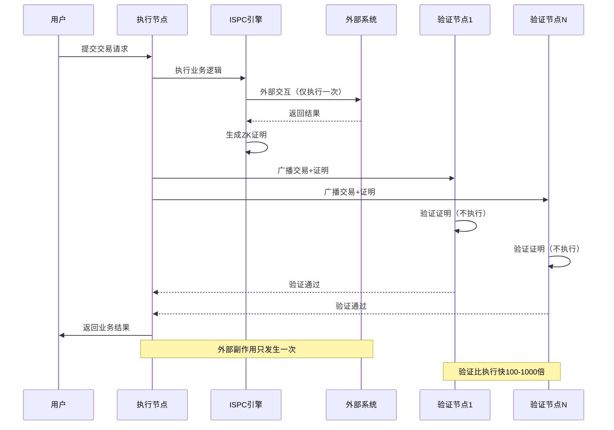

# ISPC 组件能力视图

---

## 🎯 组件定位

ISPC（Intrinsic Self-Proving Computing）组件是 WES 系统的可验证计算核心，负责执行计算并自动生成可验证证明。

**在三层模型中的位置**：计算层（Computation Layer）

> **战略背景**：ISPC 定义了区块链的可验证计算范式，详见 [WES 项目总览](../overview.md)

---

## 💡 核心能力

### 1. 单次执行 + 多点验证

**能力描述**：
- 只有一个节点执行业务逻辑，生成零知识证明
- 其他节点验证零知识证明，不重复执行
- 验证效率提升 1000 倍

**执行流程**：



**使用约束**：
- 执行节点必须生成有效的 ZK 证明
- 验证节点必须验证 ZK 证明
- 执行结果必须可验证

**核心价值**：
- 彻底解决外部副作用问题：外部副作用只发生一次
- 传统业务系统零改造：无需考虑可重入性设计
- 验证效率提升：验证比执行快 100-1000 倍
- **CU 统一计量**：合约和 AI 模型使用统一的 CU（Compute Units，计算单位）计量算力

---

### 2. WASM 合约执行

**能力描述**：
- 支持 WebAssembly 合约执行
- 支持多语言合约开发（Rust/Go/JS/Python）
- 通过 HostABI 提供区块链能力

**使用约束**：
- 合约必须是有效的 WASM 格式
- 合约函数必须正确导出
- 执行必须是确定性的

**HostABI 能力**：
- **UTXO 操作**：查询、添加输出
- **资源操作**：查询资源、添加资源输出
- **状态操作**：查询区块高度、时间戳等
- **事件操作**：发出事件

---

### 3. ONNX 模型推理

**能力描述**：
- 支持 ONNX 格式的 AI 模型推理
- 支持 GPU 加速推理
- 推理过程完全可验证

**使用约束**：
- 模型必须是有效的 ONNX 格式
- 输入张量格式必须正确
- 推理结果必须可验证

**推理能力**：
- **模型加载**：从缓存或存储加载模型
- **张量转换**：输入输出张量格式转换
- **推理执行**：基于标准 ONNX 推理引擎执行推理
- **结果验证**：生成 ZK 证明验证推理结果

---

### 4. 执行即构建

**能力描述**：
- 业务代码执行过程自动构造交易
- 用户直接获得业务结果
- Transaction 静默上链

**使用约束**：
- 执行上下文在执行开始时固定
- 执行过程中的操作记录到 TransactionDraft
- 执行完成后自动构建 Transaction

**关键原则**：
> **用户直接获得业务结果，Transaction 是静默上链的**

---

### 5. 可控外部交互

**能力描述**：
- 支持受控的外部系统交互
- 外部交互被纳入执行轨迹
- 形成端到端的可验证闭环

**使用约束**：
- 外部交互必须通过 HostABI
- 外部交互必须可验证
- 外部交互结果必须记录到执行轨迹

**典型使用场景**：
- 数据库查询：通过 HostABI 查询外部数据库
- API 调用：通过 HostABI 调用外部 API
- 文件操作：通过 HostABI 操作外部文件系统

---

## 🔧 接口能力

### ISPCCoordinator（ISPC 协调器）

**能力**：
- `ExecuteWASMContract()` - 执行 WASM 合约
- `ExecuteONNXModel()` - 执行 ONNX 模型推理
- `GetExecutionTrace()` - 获取执行轨迹
- `CalculateCU()` - 计算 CU（Compute Units，计算单位）算力消耗

**约束**：
- 执行是原子操作
- 执行失败会回滚
- 执行结果必须可验证
- CU 计算是确定性的（相同输入产生相同 CU 值）

**CU 计量**：
- 合约和 AI 模型使用统一的 CU 计量标准
- CU 值记录在执行轨迹的 metadata 中
- 用户无需理解 CU，这是系统内部的资源计量单位

### HostABI（宿主函数接口）

**能力**：
- **WASM 宿主函数**：17 个完整原语（UTXO 操作、资源操作、状态操作、事件操作）
- **ONNX 宿主函数**：5 个只读原语（区块高度、时间戳、UTXO 查询、资源查询、链 ID）

**约束**：
- 宿主函数通过执行上下文传递
- 宿主函数调用记录到执行轨迹
- 宿主函数调用必须可验证

---

## ⚙️ 配置说明

### 执行引擎配置

| 参数 | 类型 | 默认值 | 说明 |
|------|------|--------|------|
| `max_execution_time` | int | 30s | 最大执行时间 |
| `enable_gpu_acceleration` | bool | false | 启用 GPU 加速 |
| `zk_proof_enabled` | bool | true | 启用 ZK 证明生成 |

---

## 📋 使用约束

### WASM 执行约束

1. **合约约束**：
   - 合约必须是有效的 WASM 格式
   - 合约函数必须正确导出
   - 合约执行必须是确定性的

2. **执行约束**：
   - 执行时间不能超过 `max_execution_time`
   - 执行内存有大小限制
   - 执行失败会回滚

### ONNX 推理约束

1. **模型约束**：
   - 模型必须是有效的 ONNX 格式
   - 模型大小不能超过限制
   - 模型输入输出格式必须正确

2. **推理约束**：
   - 推理时间不能超过 `max_execution_time`
   - 推理内存有大小限制
   - 推理失败会回滚

### ZK 证明约束

1. **证明生成**：
   - 证明生成是异步的
   - 证明生成时间可能较长
   - 证明生成失败会回滚

2. **证明验证**：
   - 验证节点必须验证证明
   - 验证失败会拒绝交易
   - 验证成功会接受交易

---

## 🎯 典型使用场景

### 场景 1：WASM 合约调用

```go
// 调用 WASM 合约
coordinator := ispc.NewISPCCoordinator()
result, err := coordinator.ExecuteWASMContract(
    contractHash,
    method,
    params,
)
if err != nil {
    return err
}
// 使用 result 业务结果
```

### 场景 2：ONNX 模型推理

```go
// 执行 ONNX 模型推理
coordinator := ispc.NewISPCCoordinator()
result, err := coordinator.ExecuteONNXModel(
    modelHash,
    inputTensors,
)
if err != nil {
    return err
}
// 使用 result 推理结果
```

### 场景 3：混合执行

```go
// WASM 合约调用 ONNX 模型
coordinator := ispc.NewISPCCoordinator()
// WASM 合约内部调用 ONNX 模型
result, err := coordinator.ExecuteWASMContract(
    contractHash,
    "predict",
    params,
)
// 合约内部会调用 ONNX 模型
```

---

## 📚 相关文档

- [架构鸟瞰](../architecture/overview.md) - 了解系统架构
- [TX 能力视图](./tx.md) - 了解交易能力
- [URES 能力视图](./ures.md) - 了解资源管理能力


