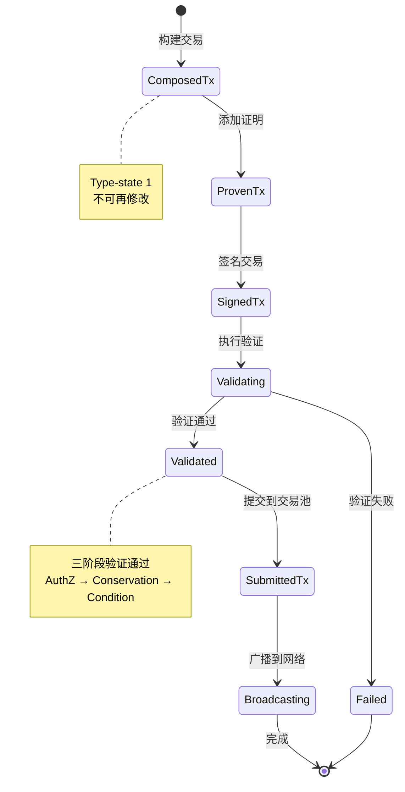

# TX 组件能力视图

---

## 🎯 组件定位

TX（Transaction）组件是 WES 系统的交易处理核心，负责交易的构建、验证和提交。

**在三层模型中的位置**：交互层（Interaction Layer）

> **战略背景**：TX 组件位于核心业务层垂直依赖链的第⑤层，依赖 EUTXO（④）和 URES（③），被 Block（⑥）依赖。详见 [WES 项目总览](../overview.md)

---

## 💡 核心能力

### 1. 交易构建

**能力描述**：
- 支持通过流式 API 构建交易
- 支持添加多种类型的输入和输出（Asset/Resource/State）
- 支持消费型输入和引用型输入
- 通过 Type-state 模式保证构建顺序的正确性

**使用约束**：
- 交易构建必须按照：ComposedTx → ProvenTx → SignedTx → SubmittedTx 的顺序
- 每个阶段完成后不可再修改
- 必须提供有效的 UTXO 引用和输出地址

**典型使用场景**：
- 简单转账：添加资产输入和输出
- 合约调用：添加资源引用和状态输出
- 复杂交易：组合多种输入输出类型

---

### 2. 交易验证

**能力描述**：
- 三阶段验证机制：AuthZ（权限）→ Conservation（守恒）→ Condition（条件）
- 支持插件化验证规则
- 快速失败机制：任一阶段失败立即返回

**使用约束**：
- 所有输入必须通过权限验证
- 价值必须守恒：Σ输入 ≥ Σ输出 + Fee
- 时间锁、高度锁等条件必须满足
- 合约代币铸造场景有特殊规则（参见相关文档）

**验证规则**：
- **AuthZ 验证**：每个输入必须提供有效的解锁证明
- **Conservation 验证**：价值守恒，不允许凭空创造价值
- **Condition 验证**：时间窗口、高度窗口、Nonce、ChainID 等条件检查

---

### 3. 交易提交

**能力描述**：
- 验证通过后自动提交到交易池
- 支持查询交易状态
- 自动广播到网络

**使用约束**：
- 必须先验证，验证通过后才能提交
- 交易池有容量限制
- 重复交易会被拒绝

**提交流程**：



---

## 🔧 接口能力

### TxBuilder（交易构建器）

**能力**：
- `AddInput()` - 添加交易输入
- `AddAssetOutput()` - 添加资产输出
- `AddResourceOutput()` - 添加资源输出
- `AddStateOutput()` - 添加状态输出
- `Build()` - 构建交易

**约束**：
- 支持链式调用
- 构建后进入 ComposedTx 状态，不可再修改

### TxVerifier（交易验证器）

**能力**：
- `Verify()` - 执行三阶段验证
- `RegisterAuthZPlugin()` - 注册权限验证插件
- `RegisterConservationPlugin()` - 注册价值守恒插件
- `RegisterConditionPlugin()` - 注册条件检查插件

**约束**：
- 验证是只读操作，不修改交易
- 验证失败会返回具体错误信息

### TxProcessor（交易处理器）

**能力**：
- `SubmitTx()` - 提交交易（验证 + 入池）
- `GetTxStatus()` - 查询交易状态

**约束**：
- 提交前必须完成签名
- 验证失败不会入池

---

## ⚙️ 配置说明

### 验证配置

| 参数 | 类型 | 默认值 | 说明 |
|------|------|--------|------|
| `enable_batch_verification` | bool | true | 启用批量验证 |
| `max_batch_size` | int | 100 | 最大批量大小 |
| `enable_parallel_authz` | bool | false | 启用 AuthZ 并行验证 |

### 性能特性

**高吞吐量支持**：
- 支持批量交易处理
- 支持并行验证
- 优化的验证算法

---

## 📋 使用约束

### 交易构建约束

1. **输入约束**：
   - 必须引用有效的 UTXO
   - 消费型输入（`isReferenceOnly=false`）会被消费
   - 引用型输入（`isReferenceOnly=true`）不会被消费，仅用于读取

2. **输出约束**：
   - AssetOutput：必须指定接收地址和金额
   - ResourceOutput：必须指定资源哈希和所有者
   - StateOutput：必须包含状态数据和证明

3. **构建顺序约束**：
   - 必须按照 Type-state 顺序构建
   - 每个阶段完成后不可回退

### 交易验证约束

1. **权限验证**：
   - 每个输入必须提供有效的解锁证明
   - 解锁证明必须匹配锁定条件

2. **价值守恒**：
   - Σ输入 ≥ Σ输出 + Fee
   - 合约代币铸造场景有特殊规则

3. **条件检查**：
   - 时间锁必须满足
   - 高度锁必须满足
   - Nonce 必须正确
   - ChainID 必须匹配

### 交易提交约束

1. **提交前要求**：
   - 交易必须完成签名
   - 交易必须通过验证

2. **交易池限制**：
   - 交易池有容量限制
   - 重复交易会被拒绝
   - 过期交易会被清理

---

## 🎯 典型使用场景

### 场景 1：简单转账

```go
builder := tx.NewTxBuilder()
tx := builder.
    AddInput(utxoRef, false).
    AddAssetOutput(toAddress, "100", nil, lock).
    Build()
```

### 场景 2：合约调用

```go
builder := tx.NewTxBuilder()
tx := builder.
    AddInput(utxoRef, false).
    AddResourceInput(contractHash, true).  // 引用型输入
    AddStateOutput(stateData, proof).
    Build()
```

### 场景 3：复杂交易

```go
builder := tx.NewTxBuilder()
tx := builder.
    AddInput(utxoRef1, false).
    AddInput(utxoRef2, true).  // 引用型输入
    AddAssetOutput(toAddress1, "100", nil, lock1).
    AddResourceOutput(resourceHash, owner).
    AddStateOutput(stateData, proof).
    Build()
```

---

## 📚 相关文档

- [架构鸟瞰](../architecture/overview.md) - 了解系统架构
- [EUTXO 能力视图](./eutxo.md) - 了解账本能力
- [API 参考](../reference/api/) - 了解 API 接口

