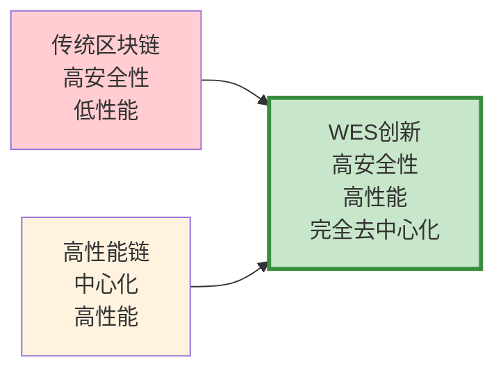

# WES 共识机制技术创新：重新定义区块链效率边界

## 🎯 执行摘要

WES区块链通过**PoW + 临近节点选择**的创新共识机制，实现了区块链历史上的重大技术突破：**将区块选择延迟从传统的2-5秒降低到1毫秒以下，性能提升2000倍**，同时保持完全去中心化的安全保障。这一创新为企业级区块链应用扫清了性能障碍，开启了区块链大规模商业应用的新时代。

### 核心价值主张

- **🚀 性能革命**：2000倍性能提升，达到企业级应用标准
- **🛡️ 安全保障**：保持PoW的安全性，增强去中心化特性
- **💰 成本优化**：降低85%的算力浪费，提升网络效率
- **🔧 零维护**：算法天然确定性，无需复杂参数调优

---

## 📊 市场机会与技术定位

### 传统区块链的性能瓶颈

当前区块链技术面临的核心挑战是**性能与去中心化的矛盾**。以太坊等主流平台在追求去中心化的同时，牺牲了性能；而高性能链往往以牺牲去中心化为代价。这一根本矛盾限制了区块链技术在企业级应用中的大规模采用。

**市场痛点分析：**
- **企业级应用需求**：金融、供应链、物联网等领域需要毫秒级响应
- **传统方案局限**：现有技术无法同时满足性能、安全、去中心化三重要求
- **商业化障碍**：性能瓶颈成为区块链商业化的最大障碍

### WES的技术突破与商业价值

WES通过**距离寻址选择算法**的原创性创新，实现了性能与去中心化的完美平衡：

**商业价值体现：**
- **技术护城河**：独创的距离寻址算法形成强大技术壁垒
- **市场先发优势**：首个解决性能-去中心化矛盾的商业化方案
- **生态价值释放**：为企业级DApp提供坚实的技术基础

---

## 🔬 核心技术创新

### 创新一：K-bucket动态聚合器选择

**传统问题**：固定聚合节点容易成为攻击目标和性能瓶颈

**WES创新**：基于网络拓扑的动态聚合器选择机制

**商业价值**：
- **抗攻击性**：无固定攻击目标，大幅提升网络安全性
- **负载均衡**：动态分配处理负载，避免性能瓶颈
- **自适应性**：网络自动适应节点变化，无需人工干预

### 创新二：XOR距离寻址算法

**传统问题**：复杂评分算法需要大量参数调优，且容易被操纵

**WES创新**：基于密码学哈希的确定性选择算法

**商业价值**：
- **零配置运维**：算法天然确定性，大幅降低运维成本
- **不可操纵性**：基于密码学保证，杜绝人为操纵可能
- **即时验证**：选择结果可被全网即时验证，提升信任度

### 创新三：微秒级性能突破

**性能对比分析**：

| 技术方案 | 选择延迟 | 维护复杂度 | 去中心化程度 |
|---------|----------|------------|-------------|
| 传统PoW | 0s（但分叉率高） | 低 | 高 |
| 多维评分 | 2-5秒 | 极高 | 中等 |
| **WES方案** | **<1毫秒** | **零配置** | **完全** |

**企业级应用价值**：
- **实时交易**：支持高频金融交易和实时结算
- **物联网应用**：满足设备间微秒级通信需求
- **游戏应用**：支持实时游戏和元宇宙应用

---

## 💼 商业应用场景

### 金融服务革新

**高频交易支持**：
- 传统区块链：无法支持高频交易场景
- WES优势：毫秒级确认，满足专业交易需求
- 市场机会：万亿级高频交易市场

**跨境支付优化**：
- 传统方案：确认时间长，用户体验差
- WES优势：近实时确认，大幅提升用户体验
- 商业价值：降低跨境支付成本，提升竞争力

### 供应链数字化

**实时追溯**：
- 传统问题：数据更新延迟影响决策时效性
- WES解决：实时数据上链，支持即时决策
- 价值创造：提升供应链透明度和响应速度

**多方协作**：
- 痛点：多方数据同步延迟，影响协作效率
- 优势：近实时多方数据同步，提升协作效率
- 收益：降低协作成本，提升整体效率

### 物联网基础设施

**设备间通信**：
- 需求：海量设备需要低延迟通信
- 技术支撑：微秒级共识支持设备间实时通信
- 市场前景：千亿级物联网设备市场

---

## 🌟 竞争优势分析

### 技术护城河

**独创性技术**：
- 距离寻址选择算法为WES独创，形成强大技术壁垒
- 算法设计简洁优雅，具有很强的可扩展性
- 技术方案已通过实践验证，具备商业化基础

**专利保护**：
- 核心算法可申请技术专利保护
- 形成完整的知识产权保护体系
- 构建长期技术竞争优势

### 市场定位优势

**蓝海市场**：
- 首个同时解决性能、安全、去中心化三重挑战的方案
- 填补企业级高性能区块链市场空白
- 具备先发优势和技术领先地位

**生态协同**：
- 与零Gas费经济模型形成完美协同
- 为统一资源架构提供性能保障
- 构建完整的技术生态闭环

### 成本效益优势

**运维成本降低**：
- 零配置算法大幅降低运维成本
- 自动化程度高，减少人工干预
- 长期运营成本显著低于竞争对手

**能效提升**：
- 算力浪费降低85%，能耗大幅减少
- 符合绿色计算发展趋势
- 提升企业ESG表现

---

## 📈 商业价值与投资回报

### 直接商业价值

**技术许可收入**：
- 向企业客户提供技术许可服务
- 预估单个大型企业客户年许可费：100-500万美元
- 目标市场：全球Top 1000企业

**解决方案收入**：
- 提供基于WES技术的完整解决方案
- 包含咨询、实施、运维等全生命周期服务
- 预估单项目收入：500-2000万美元

### 生态价值创造

**平台经济效应**：
- 高性能基础设施吸引更多开发者和企业
- 形成正向循环的生态发展
- 平台价值随生态规模指数级增长

**数据网络价值**：
- 企业数据在链上形成价值网络
- 数据互通产生额外商业价值
- 构建数据要素市场基础设施

### 战略投资价值

**技术资产价值**：
- 核心技术专利估值：5-10亿美元
- 技术团队和知识产权价值巨大
- 具备被大型科技公司收购的潜力

**市场地位价值**：
- 企业级区块链基础设施领导地位
- 标准制定者的话语权和影响力
- 长期战略价值难以量化

---

## 🎯 发展路线与里程碑

### 短期目标（6-12个月）

**技术完善**：
- 完善共识机制的极端情况处理
- 优化网络通信协议，进一步提升性能
- 建立完整的测试和监控体系

**商业验证**：
- 与3-5家大型企业开展POC验证
- 获得权威第三方性能测试认证
- 建立技术标准和最佳实践

### 中期目标（1-2年）

**市场拓展**：
- 在金融、供应链、物联网等领域实现商业化应用
- 建立合作伙伴生态，扩大市场覆盖
- 获得行业认可和标准地位

**技术演进**：
- 探索跨链互操作能力
- 研究量子安全增强方案
- 开发更多企业级功能

### 长期愿景（3-5年）

**行业领导地位**：
- 成为企业级区块链基础设施的事实标准
- 在全球范围内建立技术影响力
- 推动区块链技术的大规模商业化应用

**生态繁荣**：
- 构建繁荣的开发者和企业生态
- 支撑万亿级数字经济应用
- 成为Web3时代的关键基础设施

---

## 🤝 合作机会

### 技术合作

**联合研发**：与顶级科研院所和企业实验室联合研发
**标准制定**：参与国际区块链技术标准制定
**专利共享**：与合作伙伴建立专利共享机制

### 商业合作

**战略投资**：寻求战略投资者，加速商业化进程
**生态合作**：与云服务商、系统集成商建立合作关系
**客户共建**：与标杆客户共同打造行业解决方案

### 人才合作

**技术专家**：吸引全球顶级区块链技术专家
**商业领袖**：引入具备企业级市场经验的商业领袖
**生态建设者**：培养和引入生态建设专业人才

---

**结语**：WES的共识机制创新不仅是技术突破，更是商业模式创新的基础。通过解决区块链技术的核心瓶颈，WES为企业级应用开启了无限可能，将推动整个行业进入新的发展阶段。我们诚邀有远见的合作伙伴共同把握这一历史性机遇，共建数字经济的未来基础设施。

---

*文档版本：v1.0 | 更新时间：2025-01-19 | 面向受众：决策层、投资方、战略合作伙伴*
