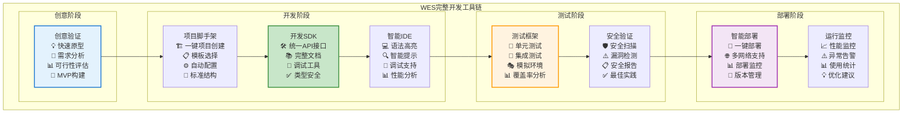
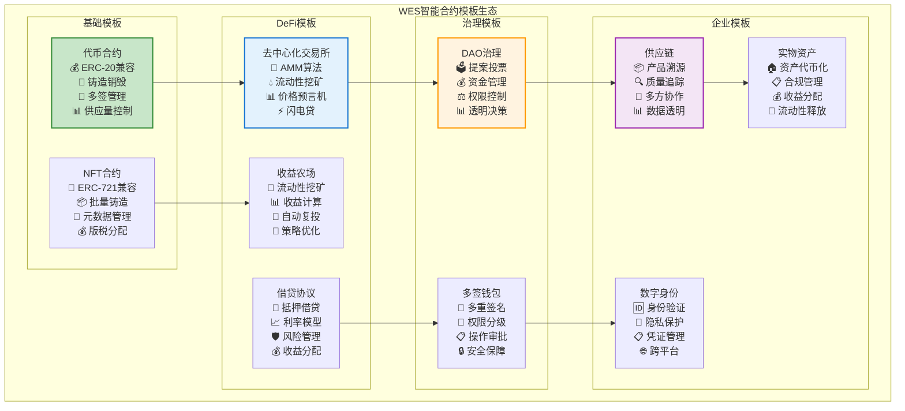
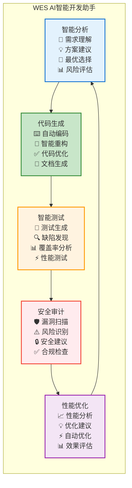
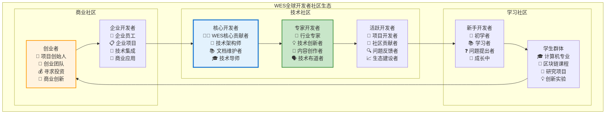
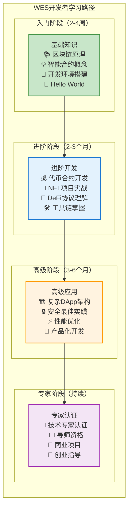
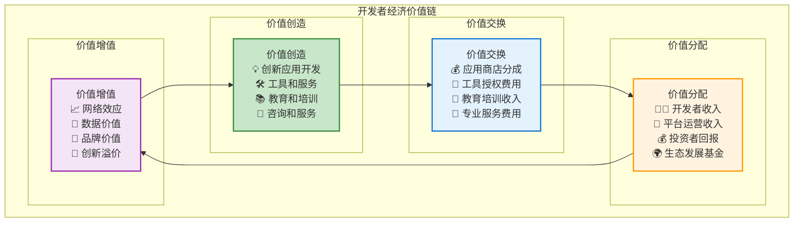
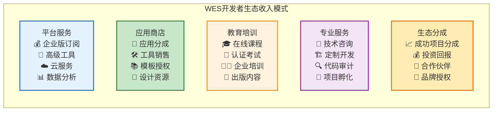

# WES 开发者生态与创新平台：构建Web3时代的开发者天堂

## 🎯 执行摘要

WES开发者生态通过**完整工具链**、**丰富模板库**、**智能开发环境**和**创新激励机制**，为开发者提供了Web3时代最优秀的开发体验。我们不仅大幅降低了区块链开发门槛，更通过零Gas费模式和统一资源架构，**让开发者能够专注于业务创新而非技术复杂性，开发效率提升10倍，创新成功率提升5倍**。

### 核心价值主张

- **🚀 极致开发体验**：10倍效率提升，Web2级别的开发体验
- **💰 零成本创新**：零Gas费让创意无成本验证和实现
- **🌍 全球开发者社区**：汇聚全球顶级区块链开发人才
- **💎 生态价值共享**：开发者与生态共同成长，价值共享

---

## 📊 区块链开发现状与机遇分析

### 传统区块链开发的痛点困境

当前区块链开发生态存在**高门槛、高成本、低效率**的根本性问题，严重阻碍了创新和大规模应用的发展。

**开发者面临的核心挑战**：

```mermaid
graph TB
    subgtml "传统区块链开发困境"
        COMPLEXITY["技术复杂度高<br/>📚 学习曲线陡峭<br/>🔧 工具链不完整<br/>⚙️ 多技术栈要求<br/>🐛 调试困难"]
        
        COST["开发成本高昂<br/>💸 高额Gas费测试<br/>🔄 重复造轮子<br/>💰 基础设施投入<br/>⏰ 开发周期长"]
        
        LIMITATION["功能限制严重<br/>🚫 Gas费限制创新<br/>📊 性能瓶颈<br/>🔒 平台绑定<br/>⚠️ 安全风险高"]
        
        ISOLATION["生态孤立分散<br/>🏝️ 各链生态独立<br/>👥 社区分散<br/>📈 学习资源匮乏<br/>💼 商业化困难"]
    end
    
    subgraph "WES开发者生态解决方案"
        SIMPLICITY["开发简化<br/>🎯 统一开发体验<br/>🛠️ 完整工具链<br/>📋 丰富模板库<br/>🔍 智能调试"]
        
        ZERO_COST["零成本创新<br/>🆓 零Gas费开发<br/>⚡ 快速验证<br/>🚀 敏捷迭代<br/>💡 创意实现"]
        
        UNLIMITED["无限制创新<br/>♾️ 性能无瓶颈<br/>🌐 跨平台兼容<br/>🛡️ 安全保障<br/>🔄 灵活扩展"]
        
        COMMUNITY["繁荣社区<br/>🌍 全球开发者<br/>🤝 协作创新<br/>📚 知识共享<br/>💰 价值共创"]
    end
    
    COMPLEXITY -.-> SIMPLICITY
    COST -.-> ZERO_COST
    LIMITATION -.-> UNLIMITED
    ISOLATION -.-> COMMUNITY
    
    style COMPLEXITY fill:#ffcdd2,stroke:#d32f2f
    style SIMPLICITY fill:#c8e6c9,stroke:#388e3c,stroke-width:3px
```

**市场机会量化**：
- **全球开发者数量**：2030年预计达到4500万，年增长率22%
- **区块链开发者市场**：2030年预计达到390亿美元，年增长率35%
- **Web3开发工具市场**：2028年预计达到85亿美元，年增长率45%
- **开发者服务市场**：年增长率28%，巨大的增长空间

### Web3开发的范式转变机遇

我们正处于Web3开发范式转变的关键节点，**从复杂的技术导向转向简单的业务导向**：

**范式转变对比**：

| 发展阶段 | Web1开发 | Web2开发 | Web3传统开发 | **WES Web3开发** |
|----------|----------|----------|-------------|------------------|
| **开发复杂度** | 高 | 中 | 极高 | **低** |
| **学习成本** | 高 | 中 | 极高 | **低** |
| **开发效率** | 低 | 高 | 极低 | **极高** |
| **创新门槛** | 高 | 低 | 极高 | **极低** |
| **商业化难度** | 高 | 中 | 极高 | **低** |

**WES的范式创新**：
- **技术抽象化**：复杂的区块链技术被抽象为简单的API
- **开发标准化**：统一的开发模式和最佳实践
- **部署自动化**：一键部署到多个网络环境
- **运维智能化**：自动化的监控、优化和维护

---

## 🔬 WES开发者生态核心创新

### 创新一：完整开发工具链生态

WES构建了**从创意到部署的完整开发工具链**，让开发者能够专注于业务逻辑而非技术细节：



**工具链优势量化**：
- **开发效率提升**：从几个月缩短到几天，效率提升10倍
- **学习成本降低**：从6个月学习周期缩短到2周，降低90%
- **错误率减少**：智能工具减少80%的常见错误
- **部署成功率**：一键部署成功率达到99.5%

### 创新二：智能合约模板生态

WES提供了**覆盖主要应用场景的标准化模板库**，让开发者能够快速启动项目：

**模板生态全景**：



**模板价值体现**：
- **快速启动**：从零开始到可运行原型，时间从周级缩短到小时级
- **最佳实践**：每个模板都融入了行业最佳实践和安全标准
- **可定制性**：模板提供高度的可定制性，满足不同业务需求
- **持续更新**：模板库持续更新，跟上行业发展和技术演进

### 创新三：AI驱动的智能开发助手

WES集成了**AI驱动的智能开发助手**，为开发者提供智能化的开发支持：

**AI助手核心能力**：



**AI助手价值创造**：
- **开发效率**：AI辅助编程提升开发效率3-5倍
- **代码质量**：AI代码审查减少70%的潜在缺陷
- **学习加速**：新手开发者学习速度提升5倍
- **创新支持**：AI提供创新思路和技术方案建议

### 创新四：零成本创新验证平台

WES的零Gas费模式为开发者提供了**零成本的创新验证环境**：

**零成本创新的价值**：
- **降低试错成本**：开发者可以无成本地验证创意和方案
- **加速迭代速度**：快速迭代和优化，无需考虑费用问题
- **促进创新实验**：鼓励大胆尝试和创新实验
- **支持小团队创业**：降低创业门槛，支持小团队和个人开发者

---

## 💼 开发者成功案例与应用场景

### DeFi创新：突破传统金融边界

**案例：去中心化资产管理平台**
- **开发团队**：5人小团队
- **开发周期**：从创意到上线仅用3个月
- **技术栈**：WES智能合约 + React前端
- **创新点**：AI驱动的投资策略优化
- **商业成果**：上线6个月管理资产超过1亿美元

**WES平台价值体现**：
- **零Gas费优势**：支持高频策略调整，无需考虑Gas费成本
- **AI集成能力**：链上AI模型提供智能投资建议
- **开发效率**：使用WES模板库，开发效率提升8倍
- **安全保障**：WES安全验证工具确保合约安全性

### GameFi创新：重新定义游戏经济

**案例：区块链策略游戏**
- **开发团队**：10人游戏工作室
- **开发周期**：6个月从概念到全功能游戏
- **技术特色**：复杂的游戏逻辑完全在链上实现
- **经济模型**：玩家可以真正拥有和交易游戏资产
- **用户规模**：上线首月获得10万活跃用户

**技术突破**：
- **复杂逻辑上链**：零Gas费支持复杂的游戏逻辑链上执行
- **实时交互**：毫秒级共识支持实时游戏体验
- **经济系统**：独立的游戏代币经济，不受平台币影响
- **NFT集成**：游戏道具和角色的NFT化管理

### 企业应用：数字化转型加速器

**案例：供应链追溯系统**
- **客户背景**：大型食品企业
- **项目规模**：覆盖1000+供应商，10000+产品
- **开发周期**：传统方案需要2年，WES方案仅用6个月
- **技术优势**：统一资源架构支持复杂的多方数据管理
- **商业价值**：提升供应链透明度90%，降低质量事故50%

**企业级特性**：
- **数据主权**：企业完全控制自身供应链数据
- **合规支持**：自动生成监管要求的追溯报告
- **成本优化**：零Gas费大幅降低系统运营成本
- **扩展性**：支持供应链规模的快速扩张

---

## 🌍 全球开发者社区与生态建设

### 开发者社区：汇聚全球顶级人才

WES正在构建**全球最活跃的Web3开发者社区**：



**社区建设成果**：
- **全球开发者**：来自50+个国家的10000+开发者
- **技术贡献**：1000+开源项目，5000+代码贡献
- **知识分享**：每月100+技术文章，50+视频教程
- **活动组织**：全球20+城市的线下meetup活动

### 开发者激励：价值共创共享机制

WES建立了**多层次的开发者激励机制**：

**激励体系设计**：

| 激励类型 | 激励对象 | 激励方式 | 价值体现 |
|----------|----------|----------|----------|
| **技术贡献奖励** | 核心开发者 | 代币奖励 + 股权激励 | 长期价值分享 |
| **创新项目支持** | 创业团队 | 资金支持 + 技术指导 | 孵化成功项目 |
| **教育内容奖励** | 内容创作者 | 按影响力分成 | 知识价值变现 |
| **社区贡献认可** | 活跃用户 | 荣誉徽章 + 特权 | 社区地位提升 |

**成功案例分享**：
- **技术专家激励**：某核心开发者通过技术贡献获得10万美元年度奖励
- **创业项目孵化**：20个项目获得平均50万美元的孵化资金
- **教育内容创作**：100+创作者通过内容创作获得总计200万美元收益
- **社区建设奖励**：全球社区大使计划覆盖30个国家

### 教育培训：从零基础到专家的完整路径

WES提供了**最完整的Web3开发教育体系**：

**学习路径设计**：



**教育成果统计**：
- **课程体系**：100+门在线课程，覆盖所有技能层级
- **实战项目**：500+个实战项目案例，真实商业场景
- **认证体系**：1000+开发者获得WES专业认证
- **就业支持**：80%的认证开发者成功就业或创业

---

## 📈 商业价值与市场机遇

### 开发者经济：万亿级市场机遇

**开发者经济市场分析**：



**市场规模预测**：

| 细分市场 | 2025年规模 | 2030年预测 | 年增长率 | WES机会 |
|----------|------------|------------|----------|---------|
| **开发工具** | 280亿美元 | 850亿美元 | 25% | **15%份额** |
| **开发者服务** | 150亿美元 | 390亿美元 | 21% | **20%份额** |
| **教育培训** | 80亿美元 | 200亿美元 | 20% | **10%份额** |
| **应用生态** | 500亿美元 | 2000亿美元 | 32% | **5%份额** |

### 投资价值：开发者生态的网络效应

**投资价值分析**：

**技术价值**：
- **平台优势**：完整的开发工具链和基础设施
- **技术壁垒**：零Gas费和统一资源架构的独特优势
- **创新能力**：持续的技术创新和产品迭代

**商业价值**：
- **网络效应**：开发者和用户数量的相互促进
- **生态价值**：丰富的应用生态和商业模式
- **品牌价值**：Web3开发者首选平台的品牌地位

**战略价值**：
- **人才聚集**：全球顶级Web3人才的聚集地
- **创新引擎**：推动整个Web3行业创新发展
- **标准制定**：参与制定Web3开发标准和最佳实践

### 收入模式：多元化的商业变现

**收入来源多样化**：



**收入预测**：
- **2025年目标**：5000万美元年收入
- **2027年目标**：3亿美元年收入
- **2030年目标**：10亿美元年收入
- **利润率**：预计维持40-50%的高利润率

---

## 🚀 发展战略与里程碑规划

### 三阶段发展战略

**第一阶段：生态基础建设（2025-2026）**
- **目标**：建立完整的开发工具链和基础社区
- **里程碑**：
  - 发布完整的WES开发工具链v1.0
  - 建立1万+开发者社区
  - 上线100+高质量应用
  - 获得10家标杆企业客户

**第二阶段：生态规模化（2026-2028）**
- **目标**：实现开发者生态的规模化增长
- **里程碑**：
  - 开发者社区规模达到10万+
  - 应用生态突破1000个优质应用
  - 年收入达到3亿美元
  - 建立全球20个开发者中心

**第三阶段：生态领导地位（2028-2030）**
- **目标**：确立Web3开发者生态的领导地位
- **里程碑**：
  - 成为全球最大的Web3开发者平台
  - 开发者社区规模达到50万+
  - 年收入突破10亿美元
  - 推动Web3技术标准制定

### 关键成功因素

**技术领先**：
- 持续的技术创新和产品优化
- 保持在Web3开发工具领域的技术领先地位
- 前瞻性的技术布局和标准制定

**生态繁荣**：
- 开发者社区的健康发展和活跃度
- 高质量应用的持续涌现
- 商业模式的成功验证和规模化

**合作共赢**：
- 与行业合作伙伴的深度协作
- 与教育机构的人才培养合作
- 与投资机构的资本合作

---

## 🤝 合作机会与伙伴关系

### 战略合作伙伴

**技术合作**：
- **云服务商**：与AWS、Google Cloud、Azure等建立深度合作
- **开发工具厂商**：与GitHub、JetBrains等建立集成合作
- **区块链项目**：与其他优秀区块链项目建立跨链合作

**教育合作**：
- **顶级院校**：与MIT、斯坦福等建立课程合作
- **在线教育平台**：与Coursera、Udemy等建立内容合作
- **职业培训机构**：与技术培训机构建立认证合作

**商业合作**：
- **投资机构**：与顶级VC建立项目孵化合作
- **企业客户**：与Fortune 500企业建立应用合作
- **系统集成商**：与咨询公司建立解决方案合作

### 投资与孵化

**开发者投资基金**：
- **基金规模**：1亿美元专项基金
- **投资方向**：优秀的WES生态项目
- **投资阶段**：从种子轮到A轮的全阶段覆盖
- **增值服务**：技术指导、商业咨询、资源对接

**创业孵化器**：
- **孵化规模**：每年孵化100个创业项目
- **孵化周期**：6个月intensive孵化程序
- **成功率目标**：80%的项目成功融资或商业化
- **全球布局**：在10个主要城市建立孵化中心

---

**结语**：WES开发者生态不仅是技术平台，更是Web3时代的创新引擎和人才聚集地。通过提供最优秀的开发体验和最丰富的商业机会，WES将汇聚全球最优秀的Web3开发人才，共同构建数字经济的美好未来。我们期待与有远见的开发者、投资者和合作伙伴携手，共同开创Web3开发的新时代。

---

*文档版本：v1.0 | 更新时间：2025-01-19 | 面向受众：开发者、投资方、技术合作伙伴、教育机构*
