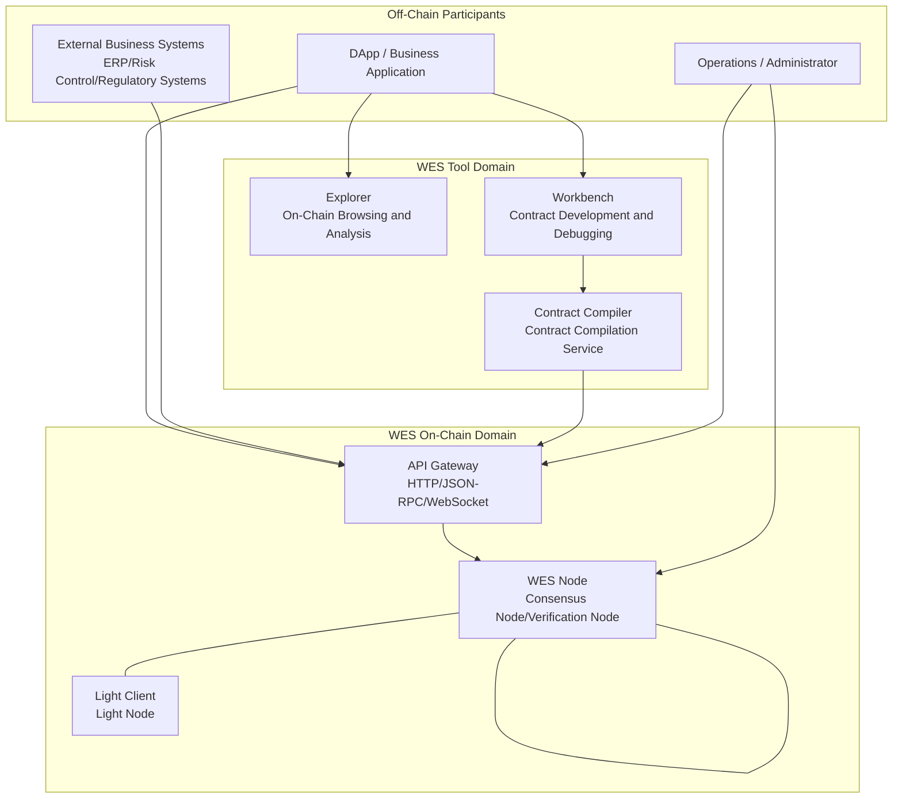
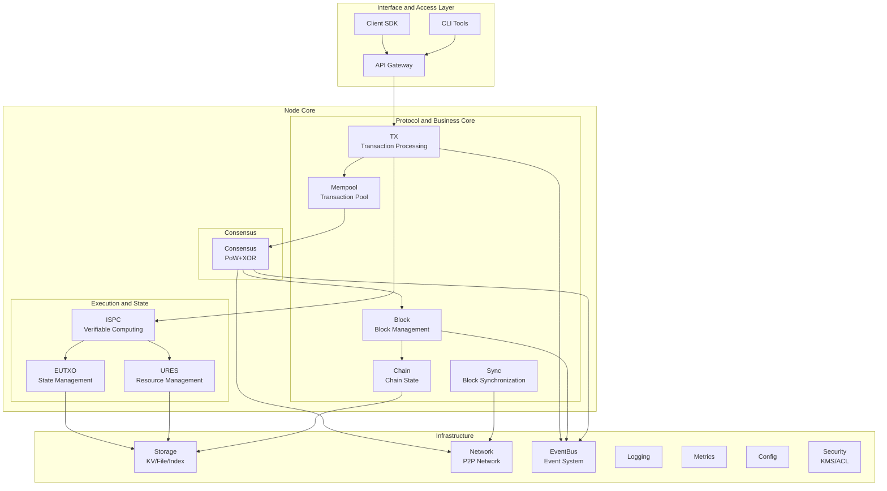
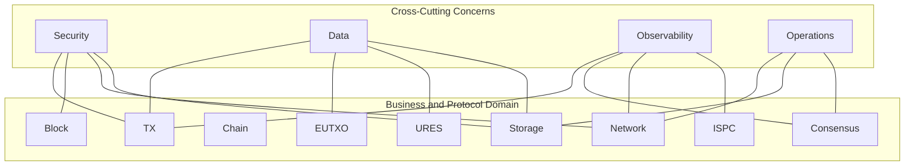

# Architecture Overview

---

## System Positioning

WES is a complete blockchain execution platform that implements verifiable computing through the ISPC (Intrinsic Self-Proving Computing) paradigm, supporting AI inference and enterprise applications running on-chain.

This document provides a global blueprint of WES from a system architecture perspective, helping you understand the overall system design and relationships between components.

---

## System Boundaries and Participants



**Description**:
- **System Boundary**: "WES Network + Gateway + Tools" as the main system, connecting off-chain applications and external systems
- **Tool Domain**: Explorer / Workbench / Compiler interact with nodes using public APIs
- **Participants**: Users, operators, and external systems are all constrained by security policies at capability boundaries

---

## Three-Layer Architecture Model

WES adopts a classic three-layer architecture model:

```
Interaction Layer → Computation Layer → Ledger Layer
```

### First Layer: Interaction Layer

**Responsibility**: Define operation inputs and outputs

- **Input Definition**: UTXO references (consumable/reference), parameters, resource references
- **Output Definition**: Asset/Resource/State three output types

**Key Components**:
- API Gateway: External interfaces
- Client SDK: Client development packages
- CLI Tools: Command-line tools

### Second Layer: Computation Layer

**Responsibility**: Execute computation and generate verifiable proofs

**Core Innovation - ISPC**:
- Execution as proof: Build proof during execution
- Single execution + multi-point verification: One node executes, others verify
- Support WASM contracts and ONNX models

**Key Components**:
- [ISPC](./ispc.md): Verifiable computing core
- WASM Engine: Contract execution engine
- ONNX Engine: AI model inference engine

### Third Layer: Ledger Layer

**Responsibility**: Manage state and resources

**Key Components**:
- [EUTXO](./eutxo.md): Extended UTXO state management
- [URES](./ures.md): Unified resource management
- Block/Chain: Block and chain management
- Persistence: Persistent storage

---

## Subsystem Blueprint



**Key Points**:
- **Node Core** revolves around six modules: `TX / BLOCK / CHAIN / MEMPOOL / SYNC / CONSENSUS`
- **Execution and State** consists of the trio: `ISPC + EUTXO + URES`
- **Infrastructure** (storage / network / logging / monitoring / configuration / security) provides unified services to upper layers

---

## Four Core Innovations

### 1. ISPC Intrinsic Self-Proving Computing

**Positioning**: Computing execution layer core innovation

**Core Capabilities**:
- Single execution + multi-point verification
- WASM contract execution
- ONNX model inference
- ZK proof generation and verification

**Detailed Description**: [ISPC Technical Details](./ispc.md)

### 2. EUTXO Extended Model

**Positioning**: State layer core innovation

**Core Capabilities**:
- Three-layer output architecture (Asset/Resource/State)
- Reference without consumption mode
- State query and snapshots

**Detailed Description**: [EUTXO Model](./eutxo.md)

### 3. URES Unified Resource Management

**Positioning**: Resource management layer core innovation

**Core Capabilities**:
- Content-addressable storage
- Unified management of static and executable resources
- Resource association and query

**Detailed Description**: [URES Resource Management](./ures.md)

### 4. PoW+XOR Distance Selection Consensus

**Positioning**: Consensus layer core innovation

**Core Capabilities**:
- Proof of Work (PoW)
- XOR distance selection
- Microsecond confirmation

**Detailed Description**: [PoW+XOR Distance Selection Consensus](./consensus-pow-xor.md)

---

## Cross-Cutting Concerns



### Security and Trust

- Threat model and trust boundaries
- Key management (KMS)
- Access control (ACL/RBAC)

### Data and Storage

- Data types and physical layout
- Indexing and caching strategies
- Snapshots and archiving

### Observability

- Log collection
- Metrics monitoring
- Distributed tracing

### Operations and Deployment

- Deployment modes
- Scaling strategies
- Upgrade processes

---

## Module Dependencies

```
API Gateway
    ↓
TX (Transaction Processing)
    ↓
┌───────────────┐
│    ISPC       │ ← Verifiable Computing Core
└───────────────┘
    ↓
┌───────────────┬───────────────┐
│    EUTXO      │     URES      │ ← State and Resource Management
└───────────────┴───────────────┘
    ↓
┌───────────────────────────────┐
│          Storage              │ ← Persistent Storage
└───────────────────────────────┘
```

**Dependency Rules**:
- Upper layers depend on lower layers, lower layers don't depend on upper layers
- Modules at the same level interact through interfaces
- Infrastructure provides services to all layers

---

## Code Directory Mapping

| Concept Module | Code Directory | Description |
|---------------|----------------|-------------|
| ISPC | `internal/core/ispc/` | Verifiable computing core |
| EUTXO | `internal/core/eutxo/` | UTXO state management |
| URES | `internal/core/ures/` | Resource management |
| Consensus | `internal/core/consensus/` | Consensus mechanism |
| TX | `internal/core/tx/` | Transaction processing |
| Block | `internal/core/block/` | Block management |
| Chain | `internal/core/chain/` | Chain state management |
| Network | `internal/core/network/` | P2P network |
| Persistence | `internal/core/persistence/` | Persistent storage |
| Mempool | `internal/core/mempool/` | Transaction pool |
| Compliance | `internal/core/compliance/` | Compliance policies |

---

## Next Steps

### Deep Dive into Core Innovations

- [ISPC Technical Details](./ispc.md) - Verifiable computing core
- [EUTXO Model](./eutxo.md) - State management
- [URES Resource Management](./ures.md) - Resource management
- [PoW+XOR Consensus](./consensus-pow-xor.md) - Consensus mechanism

### Understand Core Chain

- [Transaction Model](./transaction.md) - Transaction processing
- [Block Model](./block.md) - Block management
- [Chain Model](./chain.md) - Chain state management

### Internal Design Documents

For more detailed architecture design, please refer to:
- [`_dev/02-架构设计-architecture/`](../../../_dev/02-架构设计-architecture/) - Detailed architecture design descriptions
- [`_dev/01-协议规范-specs/`](../../../_dev/01-协议规范-specs/) - Protocol specification definitions

