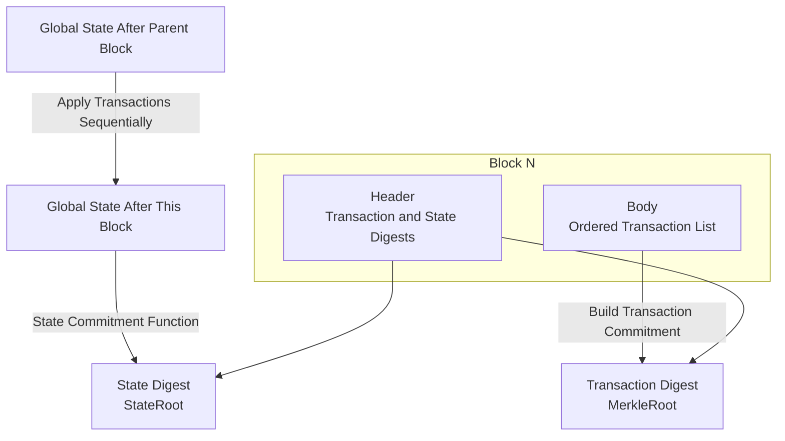
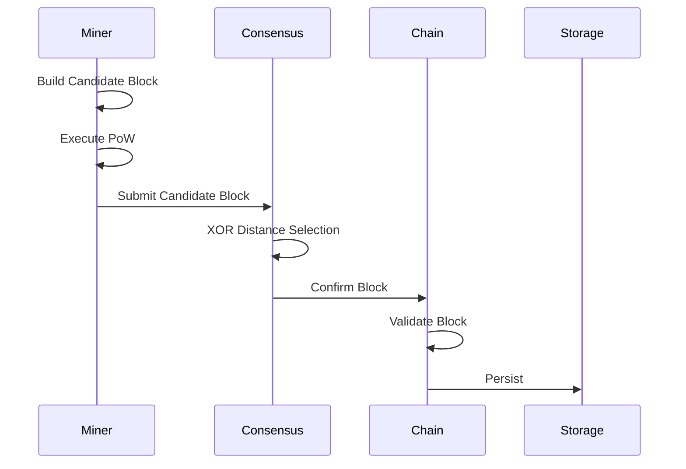

# Block Model

---

## Overview

Block is a container for transactions in the WES system, organizing transactions through Merkle trees and containing consensus-related information.

**Core Responsibilities**:
- Organize and package transactions
- Provide transaction existence proofs
- Maintain chain continuity

---

## Block Structure

### Basic Structure

```
Block
├── Header           # Block header
│   ├── Version      # Version number
│   ├── Height       # Block height
│   ├── PrevHash     # Previous block hash
│   ├── MerkleRoot   # Merkle root
│   ├── StateRoot    # State root
│   ├── Timestamp    # Timestamp
│   ├── Difficulty   # Difficulty target
│   └── Nonce        # PoW nonce
└── Body             # Block body
    └── Transactions # Transaction list
```

### Block Header

Block header contains block metadata for fast validation and linking.

**Key Fields**:
- `PrevHash`: Links to previous block, forming blockchain
- `MerkleRoot`: Transaction Merkle root for transaction existence verification
- `StateRoot`: Post-execution state root for state verification
- `Nonce`: Random number for PoW computation

### Block Body

Block body contains actual transaction data.

---

## Merkle Tree

### Structure

```
        MerkleRoot
           /\
          /  \
         /    \
      H(AB)   H(CD)
       /\       /\
      /  \     /  \
    H(A) H(B) H(C) H(D)
      |    |    |    |
     TxA  TxB  TxC  TxD
```

### Uses

- **Transaction Existence Proof**: Prove a transaction is in the block
- **Light Client Verification**: No need to download complete block
- **Data Integrity**: Any transaction change will change MerkleRoot

### Light Client Perspective

**Transaction Digest Commitment**:
- `MerkleRoot` in block header is a digest commitment to block body transaction set `Txs = [T_0, …, T_{k-1}]`
- Given transaction and Merkle proof, can verify if transaction belongs to this block

**State Digest Commitment**:
- `StateRoot` in block header is a digest commitment to post-execution global state `Σ_k`
- After obtaining `Σ_k` from `Σ_parent` in `Txs` order, `StateRoot` must match `commit(Σ_k)`

**Light Client Verification Capability**:
- Light clients can rely only on block headers and related proofs:
  - Verify if a transaction is included in a block (through Merkle proof)
  - Verify if a state belongs to post-execution global state of a block (through state proof)
- Can verify transaction existence and state correctness without downloading complete block body

**Digest Commitment Relationship Diagram**:



> **Protocol Layer Definition**: Block protocol defines structure and validity conditions of individual blocks. Digest commitments support light client verification. See [`_dev/01-协议规范-specs/03-区块与链协议-block-and-chain/BLOCK_PROTOCOL_SPEC.md`](../../../_dev/01-协议规范-specs/03-区块与链协议-block-and-chain/BLOCK_PROTOCOL_SPEC.md) §3.4, §5.

---

## Block Lifecycle



### State Transitions

```
Created → Proposed → Validated → Confirmed → Finalized
    ↓         ↓          ↓
  Invalid   Orphan    Rejected
```

---

## Block Validation

### Header Validation

- Version number valid
- Previous block exists
- Timestamp reasonable
- Difficulty target correct
- PoW valid

### Body Validation

- Transaction formats correct
- Transactions validated
- MerkleRoot correct
- StateRoot correct

---

## Difficulty Adjustment

WES uses dynamic difficulty adjustment algorithm:

- **Target Block Time**: Configurable (default 10s)
- **Adjustment Period**: Adjust every N blocks
- **Adjustment Range**: Limit single adjustment magnitude

---

## Configuration

| Parameter | Type | Default | Description |
|-----------|------|---------|-------------|
| `block_interval` | duration | 10s | Target block interval |
| `max_block_size` | int | 10MB | Maximum block size |
| `max_tx_per_block` | int | 10000 | Maximum transactions per block |
| `difficulty_adjustment_interval` | int | 100 | Difficulty adjustment interval |

---

## Related Documentation

- [Transaction Model](./transaction.md) - Transaction structure
- [Chain Model](./chain.md) - Chain management
- [PoW+XOR Consensus](./consensus-pow-xor.md) - Consensus mechanism

### Internal Design Documents

- [`_dev/01-协议规范-specs/03-区块与链协议-block-and-chain/`](../../../_dev/01-协议规范-specs/03-区块与链协议-block-and-chain/) - Block protocol specifications

