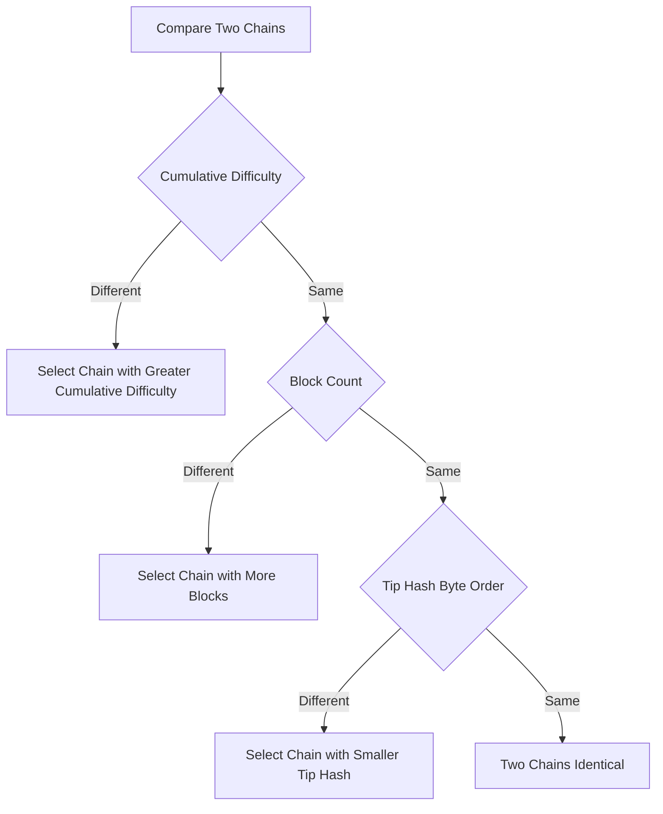
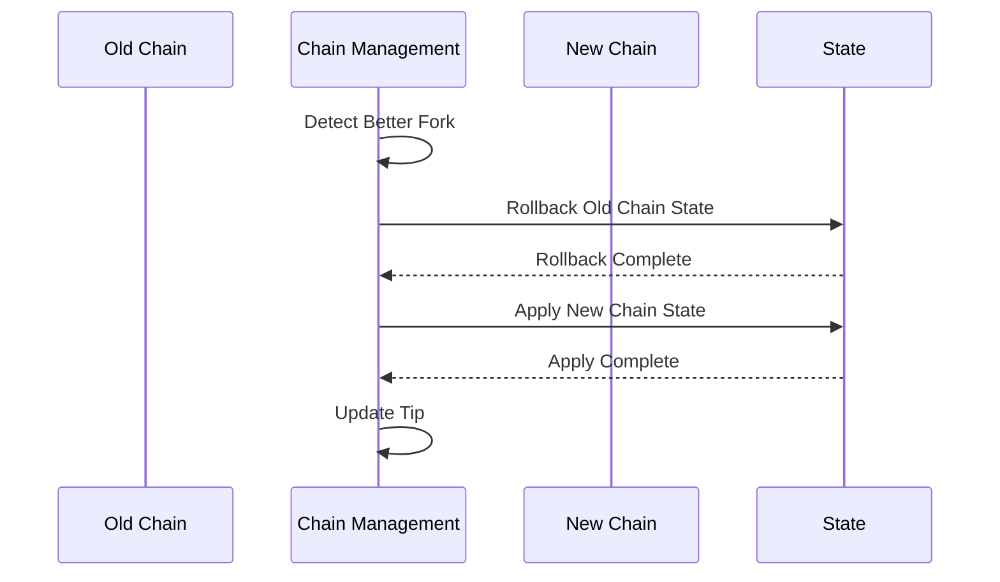
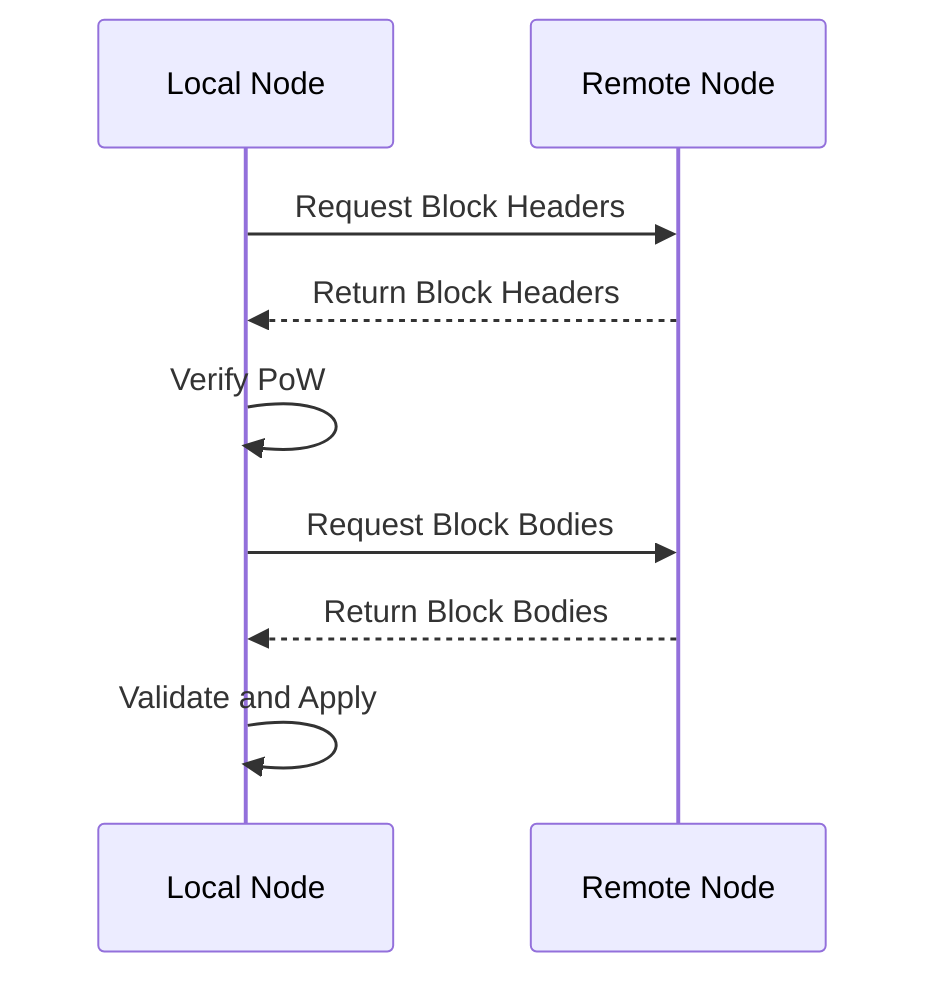

# Chain Model

---

## Overview

Chain is an ordered collection of blocks in the WES system, responsible for managing chain state, handling forks and reorganizations.

**Core Responsibilities**:
- Maintain ordered linking of blocks
- Manage chain state (latest height, optimal chain)
- Handle forks and reorganizations

---

## Chain Structure

### Main Chain

Main chain is the currently authoritative block sequence:

```
Genesis → Block 1 → Block 2 → ... → Block N (Tip)
```

### Fork

When multiple blocks point to the same parent block, a fork occurs:

```
              → Block 2a → Block 3a
             /
Genesis → Block 1
             \
              → Block 2b
```

---

## Chain State Management

### Key State

- **Tip**: Latest block of current main chain
- **Height**: Height of current main chain
- **StateRoot**: Current state root

### State Query

```go
// Get current height
height := chain.GetHeight()

// Get latest block
tip := chain.GetTip()

// Query block by height
block := chain.GetBlockByHeight(height)

// Query block by hash
block := chain.GetBlockByHash(hash)
```

---

## Fork Handling

### Fork Detection

When received block points to non-Tip block, a fork is detected.

### Fork Evaluation

Evaluate fork chain weights and select optimal chain. Chain weight comparison follows these rules (by priority):

**Weight Comparison Rules**:

1. **Cumulative Difficulty Priority**: Compare cumulative work of two chains (`Σ(difficulty of each block)`)
   - Chain with greater cumulative difficulty is preferred

2. **Block Count Next**: If cumulative difficulty is same, compare block count
   - Chain with more blocks is preferred

3. **Deterministic Tie-break**: If cumulative difficulty and block count are both same, use tip hash byte order comparison
   - Chain with **smaller** tip hash (by byte order) is preferred
   - This is a deterministic rule ensuring all nodes select consistently under same input

**Weight Comparison Diagram**:



> **Implementation Layer Definition**: Complete rules for chain weight comparison see `CompareChainWeight` function in [`internal/core/chain/fork/weight.go`](../../../internal/core/chain/fork/weight.go). This function ensures that when cumulative difficulty and block count are same, tip hash byte order is used as deterministic tie-break, avoiding use of manipulable timestamp fields.

### Reorganization (Reorg)

When fork chain weight exceeds main chain, execute reorganization:

1. **Rollback**: Undo state changes of main chain blocks
2. **Apply**: Apply state changes of new chain blocks
3. **Update**: Update chain state (Tip, Height)



---

## Block Synchronization

### Synchronization Modes

1. **Fast Sync**: Download block headers, verify PoW, quickly catch up
2. **Full Sync**: Download and verify all blocks and state

### Synchronization Flow



---

## Configuration

| Parameter | Type | Default | Description |
|-----------|------|---------|-------------|
| `max_reorg_depth` | int | 100 | Maximum reorganization depth |
| `sync_batch_size` | int | 100 | Synchronization batch size |
| `prune_blocks` | int | 10000 | Retained block count (0=no pruning) |

---

## Related Documentation

- [Block Model](./block.md) - Block structure
- [PoW+XOR Consensus](./consensus-pow-xor.md) - Consensus mechanism
- [Data Persistence](./data-persistence.md) - Storage management

### Internal Design Documents

- [`_dev/01-协议规范-specs/03-区块与链协议-block-and-chain/`](../../../_dev/01-协议规范-specs/03-区块与链协议-block-and-chain/) - Chain protocol specifications

