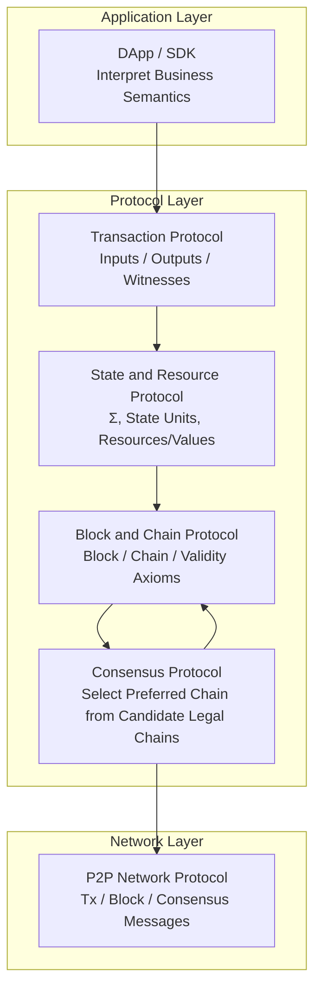
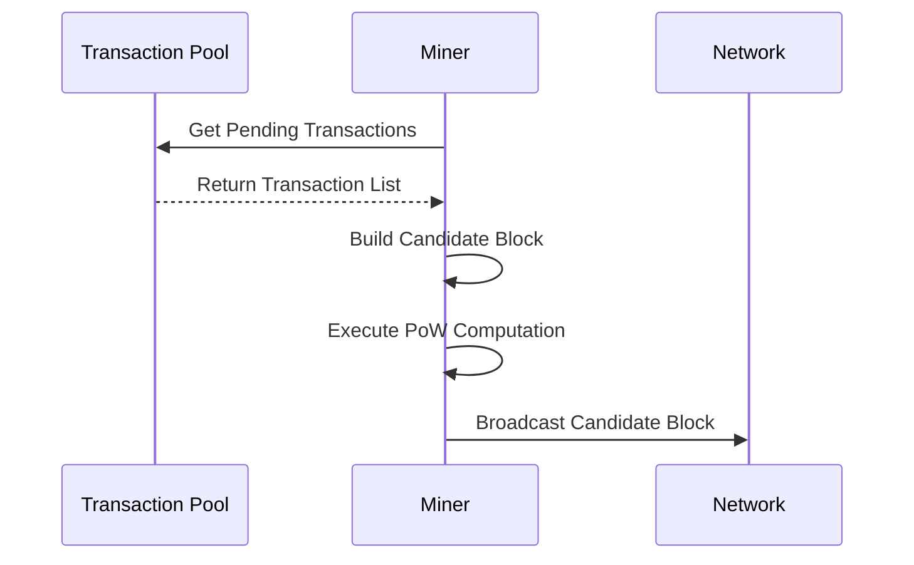
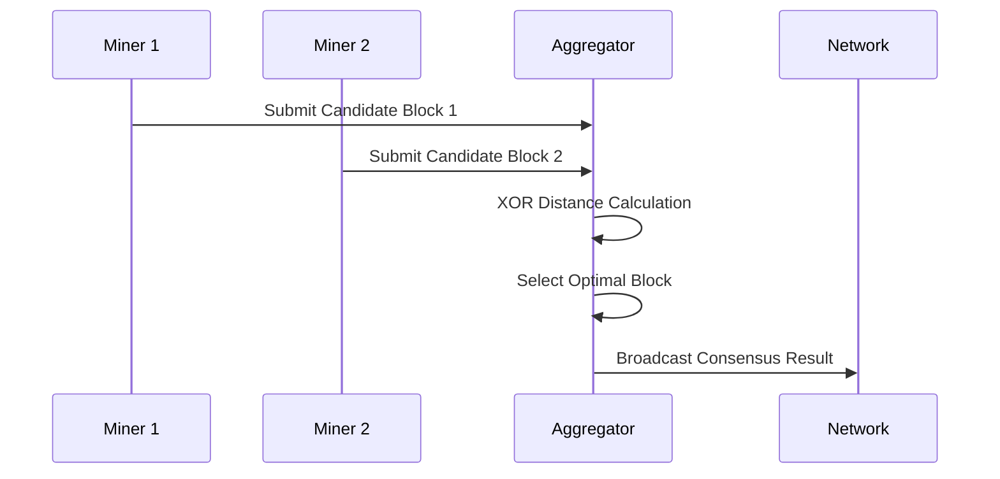

# PoW+XOR Distance Selection Consensus

---

## Overview

WES adopts PoW+XOR hybrid consensus mechanism, combining the security of Proof of Work (PoW) with the efficiency of XOR distance selection, achieving microsecond-level confirmation decentralized consensus.

**Position in Three-Layer Model**: Coordination Layer

**Core Philosophy**: Ensure block production security through PoW, achieve fast deterministic consensus through XOR distance selection.

**Position in Protocol Stack**:



> **Protocol Layer Responsibility**: Consensus protocol only works on "legal block and legal chain candidate" sets, does not change semantics of state, transactions, or blocks. See [`_dev/01-协议规范-specs/04-共识协议-consensus/CONSENSUS_PROTOCOL_SPEC.md`](../../../_dev/01-协议规范-specs/04-共识协议-consensus/CONSENSUS_PROTOCOL_SPEC.md).

---

## Consensus Architecture

### Two-Phase Consensus

WES consensus is divided into two phases:

```
Phase 1: PoW Block Production
    Miners compete to compute PoW, produce candidate blocks
        ↓
Phase 2: XOR Distance Selection
    Aggregators select optimal block based on XOR distance
```

### Key Roles

1. **Miner**
   - Execute PoW computation
   - Produce candidate blocks
   - Broadcast candidate blocks

2. **Aggregator**
   - Collect candidate blocks
   - Execute XOR distance selection
   - Broadcast consensus results

---

## Core Capabilities

### 1. Miner Service

**Capability Description**:
- PoW proof of work computation
- Candidate block template creation
- Mining lifecycle management
- Height gate management (prevent duplicate mining)

**Workflow**:



**Usage Constraints**:
- Mining requires valid transaction pool
- Mining requires blockchain service support
- Mining results passed to aggregator through internal interface

---

### 2. Aggregator Service

**Capability Description**:
- Unified network processing (block sending, receiving, routing decisions)
- Dynamic role decision (determine if aggregator node based on K-bucket distance)
- Distance selection engine (deterministic block selection based on XOR distance)
- Candidate block collection and deduplication
- Consensus result broadcasting

**Workflow**:



**Protocol Layer Constraints**:
- Aggregator only runs chain selection function on **legal candidate block sets**
- Selection results must satisfy consensus protocol safety, liveness, and consistency properties

---

### 3. XOR Distance Selection

**Principle**:
- Calculate XOR distance between candidate block hash and target value
- Select block with smallest distance
- Selection is deterministic, same input must produce unique result

**Determinism Guarantee**:
- All nodes use same distance calculation algorithm
- Same candidate block set produces same selection result
- No additional voting or communication needed

**Selection Latency**:
- Selection computation < 1ms
- Microsecond-level confirmation

### 4. Chain Selection Rules (Fork-choice)

**Heaviest Chain Principle**:
- PoW+XOR consensus adopts **heaviest chain (maximum cumulative work)** as main rule
- Cumulative work = `Σ (2^256 / target_i)`, where `target_i` derived from block difficulty
- **Longest chain (maximum height)** is not reliable main rule, only as observation metric

**Deterministic Tie-break Rules**:
- When cumulative work is same or difficult to distinguish, **must** use deterministic tie-break to ensure different correct nodes select consistently under same input
- Recommendation: Use tip hash (chain head block hash) byte order as tie-break (choosing smaller/larger end must be fixed and documented in implementation)

**Constraints**:
- Transaction count, fees, etc. **must not** be used as main rule, at most as supplementary signals for tie-break
- Network observations (peer count, connection quality, etc.) **must not** be used as hard conditions for block validity

> **Protocol Layer Definition**: Chain selection rules must satisfy consensus protocol safety, liveness, and consistency properties. See [`_dev/01-协议规范-specs/04-共识协议-consensus/CONSENSUS_PROTOCOL_SPEC.md`](../../../_dev/01-协议规范-specs/04-共识协议-consensus/CONSENSUS_PROTOCOL_SPEC.md) §5.

---

### 5. Dynamic Role Decision

**Role Judgment**:
- Determine node role based on K-bucket distance
- Closest node becomes aggregator node
- Non-aggregator nodes forward blocks to closer nodes

**Routing Strategy**:
- Candidate blocks routed to nearest aggregator node
- Aggregation results broadcast to entire network

---

## Interface Capabilities

### MinerService (Miner Service)

**Capabilities**:
- `StartMining(ctx)` - Start mining
- `StopMining(ctx)` - Stop mining
- `PauseMining(ctx)` - Pause mining
- `ResumeMining(ctx)` - Resume mining
- `GetMiningStatus()` - Get mining status
- `SetMiningParameters(params)` - Set mining parameters

### AggregatorService (Aggregator Service)

**Capabilities**:
- `StartAggregation(ctx)` - Start aggregation
- `StopAggregation(ctx)` - Stop aggregation
- `GetAggregationStatus()` - Get aggregation status
- `ProcessCandidateBlock(block)` - Process candidate block
- `GetDecisionResult(height)` - Get decision result

---

## Configuration

### Miner Configuration

| Parameter | Type | Default | Description |
|-----------|------|---------|-------------|
| `confirmation_timeout` | duration | 30s | Confirmation wait timeout |
| `block_interval` | duration | 10s | Target block interval |
| `mining_threads` | int | 4 | PoW computation thread count |
| `neighbor_fanout` | int | 2 | First hop fanout |
| `max_retries` | int | 3 | Maximum retry count on send failure |

### Aggregator Configuration

| Parameter | Type | Default | Description |
|-----------|------|---------|-------------|
| `aggregation_interval` | duration | 5s | Aggregation round interval |
| `min_candidates` | int | 1 | Minimum candidate block count |
| `max_candidates` | int | 100 | Maximum candidate block count |
| `selection_timeout` | duration | 0.01s | Distance selection timeout |
| `distance_algorithm` | string | "XOR" | Distance calculation algorithm |

---

## Consensus Protocol Properties

Consensus protocol must satisfy the following three core properties:

### Safety

**Unforkable Finality**:
- No two incompatible blocks (e.g., conflicting in state or transactions) are simultaneously considered "finally confirmed" by majority of correct nodes
- Once a block reaches protocol-defined "finality condition", under protocol assumptions, it should not be removed from preferred chain through reorganization

**Prefix Consistency**:
- Any two correct nodes, at any moment, differences between their preferred chain views are limited to "tail few blocks"
- Block prefixes considered "deep enough" by both parties will not be replaced by incompatible sequences in the future

### Liveness

Under given network and fault assumptions, consensus protocol should guarantee:
- As long as new legal transactions are continuously submitted, system will eventually produce new blocks containing these transactions
- These new blocks will enter some preferred chain, not remain in pending state indefinitely

In other words, under protocol assumptions (e.g., network sufficiently stable, malicious node ratio limited), system will not fall into permanent stagnation.

### Consistency

Consistency property requires:
- Any two correct nodes, after sufficient time, their preferred chain views are consistent before some height
- They have compatible judgments on "which blocks are finally confirmed"

This property ensures applications and users can obtain unified views in cross-node environments.

> **Protocol Layer Definition**: Any consensus algorithm claiming WES compatibility must satisfy the above three properties within its system model assumptions. See [`_dev/01-协议规范-specs/04-共识协议-consensus/CONSENSUS_PROTOCOL_SPEC.md`](../../../_dev/01-协议规范-specs/04-共识协议-consensus/CONSENSUS_PROTOCOL_SPEC.md) §3.

## Difficulty Adjustment Strategy

### Strategy Overview

WES uses **PoW+XOR as underlying consensus mechanism** uniformly in public chain, consortium chain, and private chain modes, but difficulty adjustment strategies differ:

- **Public Chain Mode**: Fully on-chain driven, automatically adjust difficulty based on historical block times, maintain target block interval
- **Consortium Chain Mode**: Retain automatic adjustment, but parameters can be modified through on-chain governance, support emergency mode
- **Private Chain Mode**: Support static difficulty or slow adjustment mode, prioritize performance and operational simplification

### Key Constraints

**Determinism Guarantee**:
- Difficulty calculation **must** be deterministic: all correct nodes must calculate same difficulty value under same chain state
- **Must not** depend on non-deterministic factors like node local time, random numbers, network latency

**Timestamp Rules (MTP)**:
- Public chain and consortium chain modes **must** use Median Time Past (MTP) constraints
- MTP is median of recent 11 block timestamps
- Block timestamp must satisfy: `MTP_{h-1} <= t_h <= now + 2 hours`
- Blocks not satisfying timestamp rules are considered invalid

**Difficulty Adjustment Formula (v2)**:
- Calculate actual average block time `T_actual` based on statistical window
- Calculate adjustment ratio: `ratio = T_target / T_actual`
- Map ratio to difficulty increment (in bits): `Δbits = round(log2(ratio_clamped))`
- Maximum step limit per block: `Δbits ∈ [-1, +1]` (prevent rapid difficulty spike causing long periods without blocks)

> **Protocol Layer Definition**: Detailed specifications of difficulty strategy and parameter configurations for three chain modes, see [`_dev/01-协议规范-specs/04-共识协议-consensus/POWXOR_DIFFICULTY_POLICY_SPEC.md`](../../../_dev/01-协议规范-specs/04-共识协议-consensus/POWXOR_DIFFICULTY_POLICY_SPEC.md).

## Security Analysis

### PoW Security

- **Computing Power Protection**: Requires computing power to produce valid blocks
- **Cost Attack**: Attacks require large computing power costs
- **History Immutability**: Modifying history requires recalculating PoW

### XOR Selection Security

- **Determinism**: Selection result is deterministic, cannot be manipulated
- **Fairness**: All valid blocks have equal chance of being selected
- **Fast Finality**: Consensus reached immediately after selection

### Combined Advantages

- PoW provides block production security
- XOR provides fast confirmation
- Combination achieves security + efficiency

---

## Typical Usage Scenarios

### Scenario 1: Start Mining

```go
minerService := consensus.NewMinerService()
err := minerService.StartMining(ctx)
if err != nil {
    return err
}
// Mining started, automatically participate in block production
```

### Scenario 2: Process Candidate Block

```go
aggregatorService := consensus.NewAggregatorService()
err := aggregatorService.ProcessCandidateBlock(candidateBlock)
if err != nil {
    return err
}
// Candidate block processed, waiting for distance selection decision
```

### Scenario 3: Get Consensus Result

```go
aggregatorService := consensus.NewAggregatorService()
result, err := aggregatorService.GetDecisionResult(height)
if err != nil {
    return err
}
// Get consensus result for specified height
```

---

## Relationships with Other Components

### Dependencies

```
Consensus
  ├── Depends on Mempool (Get pending transactions)
  ├── Depends on Block (Block construction)
  ├── Depends on Network (Block broadcasting)
  └── Depended on by Chain (Chain state update)
```

### Data Flow

```
Transaction Pool
    ↓
Miner Builds Candidate Block
    ↓
PoW Computation
    ↓
Broadcast Candidate Block
    ↓
Aggregator Collects
    ↓
XOR Distance Selection
    ↓
Consensus Result Broadcasting
    ↓
Chain State Update
```

---

## Related Documentation

- [Architecture Overview](./architecture-overview.md) - Understand system architecture
- [Block Model](./block.md) - Understand block processing
- [Network and Topology](./network-and-topology.md) - Understand network layer

### Internal Design Documents

- [`_dev/01-协议规范-specs/04-共识协议-consensus/`](../../../_dev/01-协议规范-specs/04-共识协议-consensus/) - Consensus protocol specifications
- [`_dev/02-架构设计-architecture/05-共识架构-consensus/`](../../../_dev/02-架构设计-architecture/05-共识架构-consensus/) - Consensus architecture design

