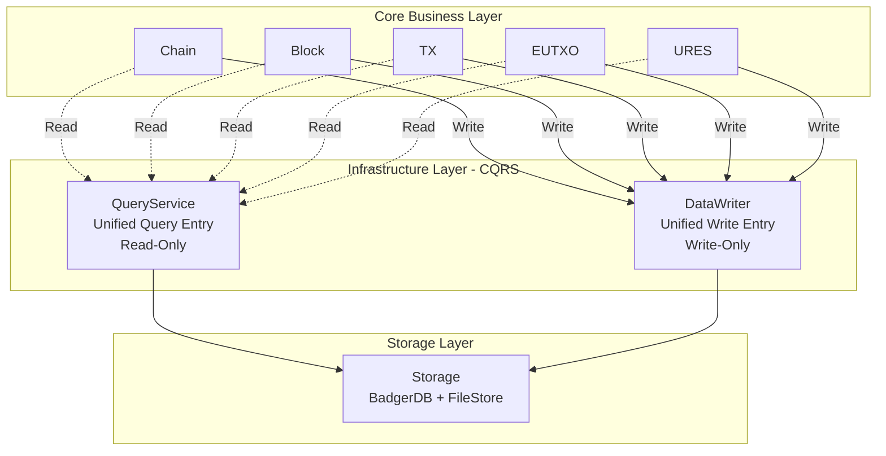
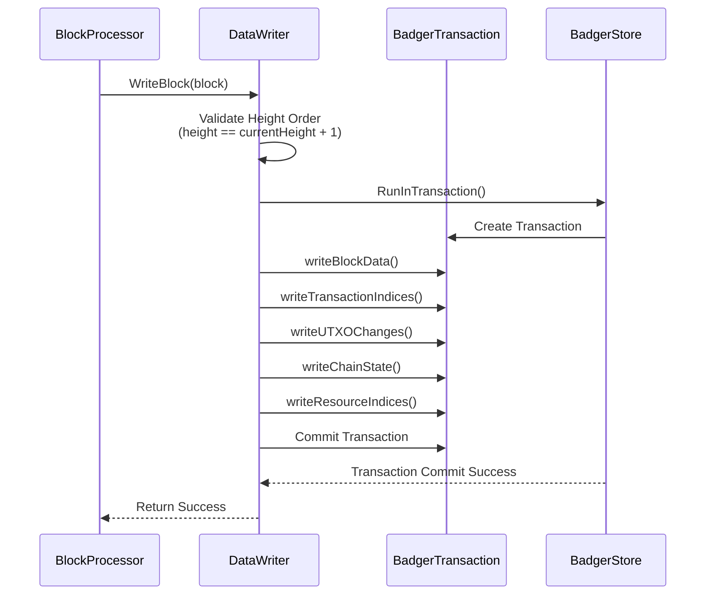

# Data Persistence

---

## Overview

WES's data persistence layer is responsible for storing blocks, transactions, state, resources, and other data, supporting efficient queries and data integrity guarantees.

**Core Responsibilities**:
- Persistent storage of various data types
- Provide efficient query interfaces
- Guarantee data integrity and consistency

---

## Data Types

### Block Data

- **Block Headers**: Block metadata
- **Block Bodies**: Transaction lists
- **Block Indices**: Height, hash indices

### State Data

- **UTXO Set**: Current unspent outputs
- **State Root**: Merkle root of state
- **Snapshots**: Historical state snapshots

### Resource Data

- **Resource Content**: WASM/ONNX/files, etc.
- **Resource Metadata**: Type, size, hash, etc.
- **Resource Indices**: Content hash indices

### Transaction Data

- **Transaction Content**: Complete transaction data
- **Transaction Indices**: TxID, block position indices
- **Transaction Receipts**: Execution results

---

## Storage Architecture

### CQRS Architecture

WES's data persistence layer adopts **CQRS (Command Query Responsibility Segregation) architecture**, implementing read-write separation:

**Core Principles**:

- ✅ **Called by Business Layer**: Business layer reads through QueryService, writes through DataWriter
- ❌ **Does Not Call Business Layer**: Persistence only operates storage, does not depend on business components
- ✅ **CQRS Architecture**: QueryService (read-only) + DataWriter (write-only)
- ✅ **Unified Entry**: All reads through QueryService, all writes through DataWriter
- ✅ **Avoid Circular Dependencies**: Decouple business layer through unified query service

> **Implementation Layer Definition**: Detailed design of CQRS architecture see [`internal/core/persistence/README.md`](../../../internal/core/persistence/README.md).

### Unified Write Entry

**DataWriter** as the only write entry, ensures atomicity of all data writes:

**Ordered Write Principle**:
- Strict validation: Only accepts blocks with `height == currentHeight + 1`
- Atomicity guarantee: All write operations completed in single transaction
- Coordinated writes: Unified coordination of block data, transaction indices, UTXO changes, chain state, resource indices writes

**Write Flow**:

### Unified Query Entry

**QueryService** aggregates all domain query services, providing unified query entry:

- **ChainQuery**: Chain state queries
- **BlockQuery**: Block queries
- **TxQuery**: Transaction queries
- **UTXOQuery**: UTXO queries
- **ResourceQuery**: Resource queries
- **AccountQuery**: Account queries

### Storage Engines

| Engine | Characteristics | Use Cases | Default |
|--------|----------------|-----------|---------|
| **BadgerDB** | Pure Go, SSD optimized, transaction support | Go native deployment, production environment | ✅ **Default** |
| RocksDB | High performance, tunable | Large-scale deployment | Optional |
| LevelDB | Lightweight, stable | Small-scale deployment | Optional |

**Note**: WES defaults to using BadgerDB as storage engine, providing transaction support and atomicity guarantees.

---

## Indexing Strategy

### Main Indices

| Index Type | Key | Value | Purpose |
|------------|-----|-------|---------|
| Block Height Index | height | blockHash | Query by height |
| Block Hash Index | blockHash | block | Query by hash |
| Transaction Index | txHash | (blockHash, index) | Transaction location |
| UTXO Index | outpoint | utxo | UTXO query |
| Address Index | address | []outpoint | Query by address |

### Index Updates

Indices update synchronously with block confirmation, ensuring consistency.

---

## Snapshot Management

### Snapshot Types

- **State Snapshots**: Complete snapshots of UTXO set
- **Incremental Snapshots**: Snapshots recording only changes

### Snapshot Uses

- **State Recovery**: Recover state from snapshot
- **Historical Queries**: Query historical state
- **Data Backup**: Periodic backups

---

## Data Repair

### Integrity Checks

- Blockchain continuity checks
- Merkle root verification
- State root verification

### Repair Strategies

- **Auto Repair**: Automatically repair detected issues
- **Rebuild Indices**: Rebuild indices from raw data
- **State Replay**: Replay all transactions from genesis block

---

## Configuration

| Parameter | Type | Default | Description |
|-----------|------|---------|-------------|
| `data_dir` | string | "./data" | Data directory |
| `db_engine` | string | "leveldb" | Storage engine |
| `cache_size` | int | 256MB | Cache size |
| `snapshot_interval` | int | 1000 | Snapshot interval (block count) |

---

## Related Documentation

- [Architecture Overview](./architecture-overview.md) - System architecture
- [EUTXO Model](./eutxo.md) - State management
- [URES Resource Management](./ures.md) - Resource storage

### Internal Design Documents

- [`_dev/02-架构设计-architecture/10-数据与存储架构-data-and-storage/`](../../../_dev/02-架构设计-architecture/10-数据与存储架构-data-and-storage/) - Storage architecture design
- [`internal/core/persistence/README.md`](../../../internal/core/persistence/README.md) - Persistence layer implementation architecture

