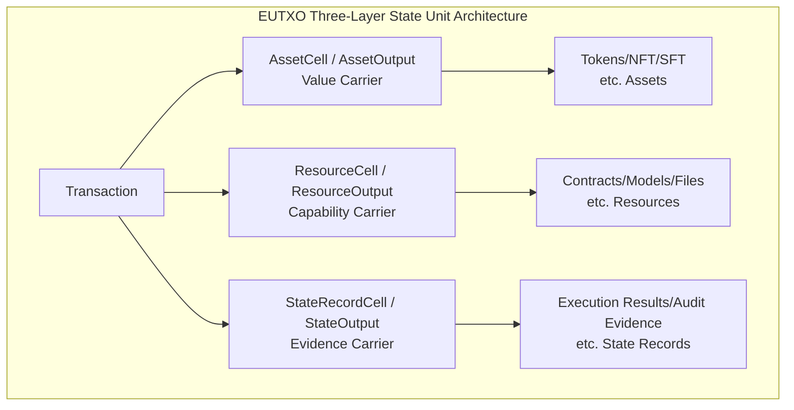
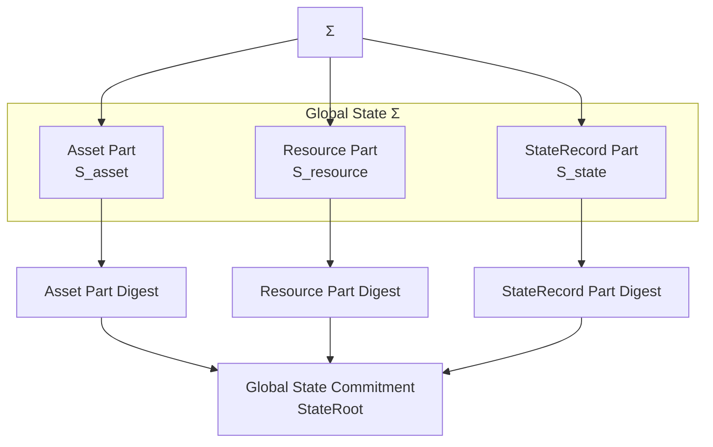
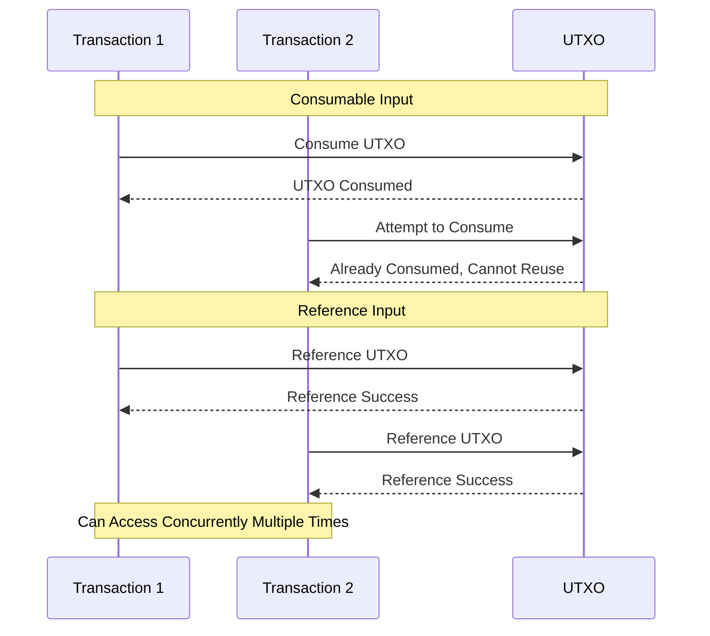

# EUTXO Extended Model

---

## Overview

EUTXO (Extended UTXO) is the ledger state management core of the WES system, extending the traditional UTXO model with a three-layer output architecture and reference-without-consumption mode.

**Position in Three-Layer Model**: Ledger Layer

**Core Philosophy**: Through Asset/Resource/State three-layer output architecture, achieve separate management of value, capability, and state; through reference-without-consumption mode, support separation of programs and data and concurrent access.

---

## Why EUTXO?

### Limitations of Traditional UTXO

Traditional UTXO model (e.g., Bitcoin) only supports:
- Single asset type (native tokens)
- Use-after-consumption-destroy mode
- Simple lock/unlock logic

### Problems with Account Model

Account model (e.g., Ethereum) is flexible but has:
- Global state sharing, poor concurrency
- State bloat problem
- Complex state dependencies

### Advantages of EUTXO

EUTXO combines the advantages of both:
- **Concurrency**: UTXO naturally supports parallel processing
- **Flexibility**: Three-layer output supports multiple usage scenarios
- **Composability**: Reference-without-consumption supports program-data separation

---

## Core Capabilities

### 1. Three-Layer State Unit Architecture

EUTXO defines three types of state units at the protocol layer:

**Protocol Layer Terminology (`_dev` specification)**:
- `AssetCell`: Asset layer state unit, carrying value unit `Value`
- `ResourceCell`: Resource layer state unit, carrying or referencing resource objects
- `StateRecordCell`: State record layer state unit, recording execution results, audit information, and evidence

**Implementation Layer Terminology (Transaction Outputs)**:
- `AssetOutput`: Asset output, corresponding to creation of `AssetCell`
- `ResourceOutput`: Resource output, corresponding to creation of `ResourceCell`
- `StateOutput`: State output, corresponding to creation of `StateRecordCell`

> **Terminology Mapping**: `Cell` is an abstract concept at the protocol layer, representing "state unit"; `Output` is a concrete implementation at the transaction layer, representing "transaction output". They correspond semantically, but `Cell` emphasizes the lifecycle of state units (creation, consumption, reference), while `Output` emphasizes the output structure of transactions. See [`_dev/01-协议规范-specs/01-状态与资源模型协议-state-and-resource/STATE_MODEL_PROTOCOL_SPEC.md`](../../../_dev/01-协议规范-specs/01-状态与资源模型协议-state-and-resource/STATE_MODEL_PROTOCOL_SPEC.md).

**Three-Layer Architecture Diagram**:



#### AssetCell / AssetOutput (Value Carrier)

**Purpose**: Represents transferable value, such as tokens, NFTs, SFTs

**Key Fields**:
- `address`: Receiving address
- `amount`: Amount
- `asset_type`: Asset type
- `lock`: Locking conditions

**Usage Scenarios**:
- Token transfers
- NFT issuance and transfer
- Asset staking

#### ResourceCell / ResourceOutput (Capability Carrier)

**Purpose**: Represents referable resources, such as contracts, models, files

**Key Fields**:
- `resource_hash`: Resource content hash
- `owner`: Owner (right bearer)
- `metadata`: Metadata

**Usage Scenarios**:
- Contract deployment
- AI model deployment
- File storage

**Protocol Layer Constraints**:
- Resource layer state units can be referenced multiple times as "reference-only inputs" without consumption (e.g., public readable resource definitions)
- Can also participate in resource upgrades or deprecation as "consumable inputs" (creating new resource version state units and making old versions unavailable)

#### StateRecordCell / StateOutput (Evidence Carrier)

**Purpose**: Record execution results, audit information, and evidence

**Key Fields**:
- `state_data`: State data
- `proof`: Related proofs
- `timestamp`: Timestamp

**Usage Scenarios**:
- Execution result records
- Audit evidence
- Compliance and risk control records

**Protocol Layer Constraints**:
- State record layer state units are usually "append-only" records, not used as value carriers
- Generally not consumed again, but form an audit trail that grows over time

---

### 2. Global State View and Commitment

**Global State Σ**:
- At any moment, the system's global state is represented by set `Σ ⊆ S`
- For any `s ∈ Σ`, predicate `usable(s) = true` (currently available)

**State Evolution**:
- Input set `In ⊆ Σ` (consumable inputs)
- Output set `Out ⊆ S` (newly created state units)
- Reference set `Ref ⊆ S` (only read, does not change availability)

New global state after evolution:
```
Σ' = (Σ \ In) ∪ Out
```

**Global State Commitment (StateRoot)**:

To support light nodes and state proofs, a digest commitment for global state `Σ` is needed:



> **Protocol Layer Definition**: State commitment function `commit(Σ) → digest` maps current global state to a digest, which is carried in the block header as `state_root`. See [`_dev/01-协议规范-specs/01-状态与资源模型协议-state-and-resource/STATE_MODEL_PROTOCOL_SPEC.md`](../../../_dev/01-协议规范-specs/01-状态与资源模型协议-state-and-resource/STATE_MODEL_PROTOCOL_SPEC.md) §2.3.

### 3. Reference-Without-Consumption Mode

EUTXO supports two input modes:

#### Consumable Input (isReferenceOnly=false)

- State unit cannot be used again after consumption
- Counted in value conservation calculation
- Used for asset transfers

**Protocol Layer Constraints**:
- Unique consumption constraint: For any state unit `s`, it can be consumed at most once in the entire chain history
- Availability constraint: Only when `usable(s) = true`, `s` can be consumed as input

#### Reference Input (isReferenceOnly=true)

- State unit is referenced but not consumed
- Can be accessed concurrently multiple times
- Not counted in value conservation calculation
- Used for reading shared data

**Protocol Layer Constraints**:
- Repeatable reference units: Can appear in `Ref` sets of multiple evolution steps
- One-time reference units: Once used as key input in rule determination, they are consumed
- Implementation **must** explicitly specify reference policy for each type of state unit



**Typical Applications**:
- **Contract Calls**: Reference contract resources without consumption
- **Data Reading**: Reference data resources without consumption
- **Concurrent Processing**: Multiple transactions concurrently reference the same resource

**Protocol Layer Constraints (EUTXO Style Usage Patterns)**:

- **Asset Layer State Units `AssetCell`**:
  - Can only participate in state evolution in "consumable input + new output" mode
  - Does not support long-term reference-only mode
  - Must comply with value conservation axiom

- **Resource Layer State Units `ResourceCell`**:
  - Can be referenced multiple times as "reference-only inputs" without consumption (e.g., public readable resource definitions)
  - Can also participate in resource upgrades or deprecation as "consumable inputs" (creating new resource version state units and making old versions unavailable)

- **State Record Layer State Units `StateRecordCell`**:
  - Usually "append-only" records, not used as value carriers
  - Generally not consumed again, but form an audit trail that grows over time

> **Protocol Layer Definition**: See [`_dev/01-协议规范-specs/01-状态与资源模型协议-state-and-resource/STATE_MODEL_PROTOCOL_SPEC.md`](../../../_dev/01-协议规范-specs/01-状态与资源模型协议-state-and-resource/STATE_MODEL_PROTOCOL_SPEC.md) §3.4.

### 4. Value Conservation Axiom

**Value Conservation Axiom (Asset Layer)**:

For any atomic state evolution step `e`:
- Input asset set: `In_asset ⊆ S_asset`
- Output asset set: `Out_asset ⊆ S_asset`
- `fee(e)`: Value consumed or destroyed by the system in this evolution (e.g., fees, penalties)

Requirement:

```
Σ_{s ∈ In_asset} value(s) ≥ Σ_{s ∈ Out_asset} value(s) + fee(e)
```

**Constraints**:
- Unless introducing explicitly modeled issuance or destruction mechanisms, total system value should remain constant
- Issuance and destruction, if they exist, should be formalized as special evolution steps with consistent and auditable behavior

> **Protocol Layer Definition**: Value conservation axiom is a global invariant in the state model protocol and must always be satisfied. See [`_dev/01-协议规范-specs/01-状态与资源模型协议-state-and-resource/STATE_MODEL_PROTOCOL_SPEC.md`](../../../_dev/01-协议规范-specs/01-状态与资源模型协议-state-and-resource/STATE_MODEL_PROTOCOL_SPEC.md) §4.

### 5. State Traceability Axiom

For any currently available state unit `s`, there must exist a finite causal chain:

```
s_0 → s_1 → ... → s_n = s
```

Where:
- `s_0` belongs to genesis or some explicit initial state set
- Each step `s_i → s_{i+1}` can be interpreted as a legal state evolution

**Meaning**:
- Does not allow "appearing out of thin air" untraceable states
- Auditors can restore the complete evolution history of any current state through finite-step traversal

> **Protocol Layer Definition**: State traceability axiom ensures all state units have clear origins. See [`_dev/01-协议规范-specs/01-状态与资源模型协议-state-and-resource/STATE_MODEL_PROTOCOL_SPEC.md`](../../../_dev/01-协议规范-specs/01-状态与资源模型协议-state-and-resource/STATE_MODEL_PROTOCOL_SPEC.md) §5.

### 6. State Query

**Query Capabilities**:
- Query UTXO by address
- Query UTXO by category
- Query UTXO by OutPoint
- State root query

**Constraints**:
- Queries are read-only operations
- Query results reflect current chain state
- Support snapshot queries (historical state)

---

### 7. Snapshot Management

**Snapshot Capabilities**:
- Create state snapshots
- Restore state snapshots
- Delete state snapshots

**Usage Scenarios**:
- State rollback: Restore to historical snapshot
- State backup: Periodically create snapshots
- Test environment: Use snapshots to reset state

---

## Interface Capabilities

### UTXOWriter (UTXO Writer)

**Capabilities**:
- `CreateUTXO()` - Create UTXO
- `SpendUTXO()` - Consume UTXO
- `ReferenceUTXO()` - Reference UTXO

### UTXOQuery (UTXO Query)

**Capabilities**:
- `GetUTXO()` - Query single UTXO
- `GetUTXOsByAddress()` - Query by address
- `GetUTXOsByCategory()` - Query by category
- `GetStateRoot()` - Query state root

---

## Configuration

| Parameter | Type | Default | Description |
|-----------|------|---------|-------------|
| `max_utxo_count` | int | 1000000 | Maximum UTXO count |
| `snapshot_interval` | int | 1000 | Snapshot creation interval (block count) |
| `enable_reference_counting` | bool | true | Enable reference counting |

---

## Usage Constraints

### UTXO Creation Constraints

1. **Format Constraints**:
   - OutPoint must be valid
   - Output type must be explicit
   - Address format must be correct

2. **State Constraints**:
   - Cannot create duplicate OutPoints
   - State root must be updated

### UTXO Consumption Constraints

1. **Existence Constraints**:
   - UTXO must exist
   - UTXO must not be consumed

2. **Permission Constraints**:
   - Must provide valid unlock proof
   - Unlock proof must match locking conditions

### Reference Counting Constraints

1. **Reference Counting Management**:
   - Reference inputs increase reference count
   - Consumable inputs do not increase reference count

2. **Concurrent Access**:
   - Support multiple transactions concurrently referencing the same UTXO
   - Reference counting is thread-safe

---

## Typical Usage Scenarios

### Scenario 1: Asset Transfer

```go
// Consume asset UTXO, create new asset UTXO
builder := tx.NewTxBuilder()
tx := builder.
    AddInput(assetUTXO, false).  // Consumable input
    AddAssetOutput(toAddress, "100", nil, lock).
    Build()
```

### Scenario 2: Contract Call

```go
// Reference contract resource without consumption
builder := tx.NewTxBuilder()
tx := builder.
    AddInput(assetUTXO, false).  // Consumable input (pay fees)
    AddResourceInput(contractHash, true).  // Reference input (reference contract)
    AddStateOutput(stateData, proof).
    Build()
```

### Scenario 3: Resource Deployment

```go
// Create resource UTXO
builder := tx.NewTxBuilder()
tx := builder.
    AddInput(assetUTXO, false).  // Consumable input (pay fees)
    AddResourceOutput(resourceHash, owner).
    Build()
```

---

## Relationships with Other Components

### Dependencies

```
EUTXO
  ├── Depends on URES (Resource content storage)
  ├── Depends on Storage (State persistence)
  └── Depended on by TX (Transaction state management)
```

### Relationship with URES

- **EUTXO**: Manages resource ownership and reference relationships
- **URES**: Manages actual resource content

ResourceOutput contains `resource_hash`, pointing to actual content stored in URES.

---

## Related Documentation

- [Architecture Overview](./architecture-overview.md) - Understand system architecture
- [URES Resource Management](./ures.md) - Understand resource management
- [Transaction Model](./transaction.md) - Understand transaction processing

### Internal Design Documents

- [`_dev/01-协议规范-specs/01-状态与资源模型协议-state-and-resource/`](../../../_dev/01-协议规范-specs/01-状态与资源模型协议-state-and-resource/) - EUTXO protocol specifications
- [`_dev/02-架构设计-architecture/02-状态与资源架构-state-and-resource/`](../../../_dev/02-架构设计-architecture/02-状态与资源架构-state-and-resource/) - State architecture design

