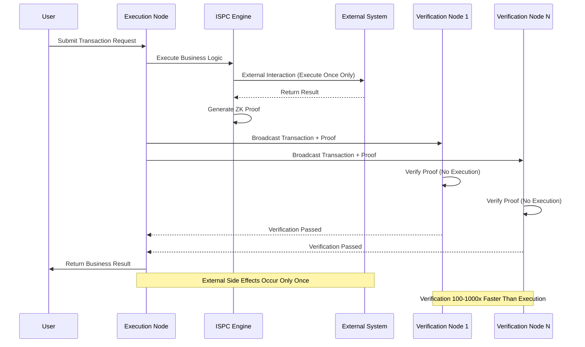

# ISPC Intrinsic Self-Proving Computing

---

## Overview

ISPC (Intrinsic Self-Proving Computing) is the verifiable computing core of the WES system, defining the verifiable computing paradigm for blockchain.

**Position in Three-Layer Model**: Computation Layer

**Core Philosophy**: Execution as proof — automatically generate verifiable zero-knowledge proofs during computation execution, achieving single execution + multi-point verification.

---

## Why ISPC?

### Traditional Blockchain Dilemma

Traditional blockchains adopt **deterministic consensus**:

```
Transaction Submission → All Nodes Execute → Compare Results → Reach Consensus
```

This brings three fundamental limitations:

1. **Determinism Requirement**: Same input must produce same output
   - AI inference is non-deterministic (floating-point errors, randomness)
   - Cannot support non-deterministic computing

2. **Repeated Execution**: All nodes must execute the same computation
   - AI models are too large, computation is too expensive
   - Cost grows linearly with number of nodes

3. **External Side Effects**: Each node triggers external operations
   - 50 nodes = 50 database operations
   - Cannot integrate external systems

### ISPC Paradigm Breakthrough

ISPC adopts **verifiability consensus**:

```
Transaction Submission → Single Node Execution + Proof Generation → Other Nodes Verify Proof → Reach Consensus
```

**Core Breakthroughs**:

1. **Verifiability Replaces Determinism**
   - Don't require same result, only require verifiability
   - Supports non-deterministic computing like AI

2. **Single Execution + Multi-Point Verification**
   - Only one node executes business logic
   - Other nodes verify ZK proof
   - Verification is 100-1000x faster than execution

3. **Controlled External Interaction**
   - External side effects occur only once
   - Provides verifiable external integration through HostABI

---

## Execution Protocol Abstraction

### Call Model

At the protocol layer, an execution call can be represented as an abstract tuple:

```
Call = (er, entry, args, context)
```

Where:
- `er`: Target executable resource identifier
- `entry`: Entry point to call
- `args`: Abstract value sequence of call parameters
- `context`: Environment information related to this execution (e.g., caller identifier, current block height)

### Execution Semantics

Given current global state `Σ`, executable resource `er`, and call `Call`, the execution engine produces:

```
exec(Σ, Call) → (Σ', result, meter, evidence) or error
```

Where:
- `Σ'`: New global state after execution (or related local changes)
- `result`: Return result (can be empty)
- `meter`: Consumption metric for this execution (for billing)
- `evidence`: Optional execution proof or audit information

**Protocol Layer Constraints**:
- If `error` is returned, the impact on `Σ` is determined by error semantics
- If `(Σ', ...)` is returned, `Σ'` **must** still satisfy all axioms of the state and resource model protocol
- All persistent changes **must** be explicitly reflected through state units in transaction outputs

### Error Types and Rollback Semantics

Execution-related errors are divided into:

1. **Pre-execution Errors**: Problems discovered before execution (parameter errors, insufficient permissions, resources unavailable, etc.)
   - Usually considered as invalid transaction overall, does not change global state
   - May allow partial or full network fee collection to penalize invalid transactions

2. **Execution-time Errors**: Problems occurring during execution (arithmetic exceptions, illegal state access, inference failures, etc.)
   - Sub-specifications **must** clarify: how to rollback or record errors under their respective `ExecutableKind`
   - Must not leave intermediate states violating state and transaction axioms on error paths

3. **Environment Errors**: Problems from outside the execution environment (resource exhaustion, engine crash, etc.)
   - Should not lead to inconsistent states being recorded on-chain
   - Should manifest as identifiable failure patterns for upper layers to handle

**Requirement**: Under any error, on-chain visible state evolution must remain self-consistent and satisfy state and transaction axioms.

> **Protocol Layer Definition**: Core abstractions and constraints of executable resource execution protocol, see [`_dev/01-协议规范-specs/06-可执行资源执行协议-executable-resource-execution/EXECUTION_PROTOCOL_CORE_SPEC.md`](../../../_dev/01-协议规范-specs/06-可执行资源执行协议-executable-resource-execution/EXECUTION_PROTOCOL_CORE_SPEC.md).

---

## Core Capabilities

### 1. Single Execution + Multi-Point Verification

**Execution Flow**:



**Core Value**:
- Completely solve external side effects problem: External side effects occur only once
- Zero modification for traditional business systems: No need to consider reentrancy design
- Verification efficiency improvement: Verification is 100-1000x faster than execution
- **CU Unified Measurement**: Contracts and AI models use unified CU (Compute Units) to measure computing power

---

### 2. WASM Contract Execution

**Capability Description**:
- Support WebAssembly contract execution
- Support multi-language contract development (Rust/Go/JS/Python)
- Provide blockchain capabilities through HostABI

**HostABI Capabilities**:
- **UTXO Operations**: Query, add outputs
- **Resource Operations**: Query resources, add resource outputs
- **State Operations**: Query block height, timestamp, etc.
- **Event Operations**: Emit events

**Usage Constraints**:
- Contracts must be valid WASM format
- Contract functions must be correctly exported
- Execution must be deterministic (within ISPC framework)

---

### 3. ONNX Model Inference

**Capability Description**:
- Support ONNX format AI model inference
- Support GPU-accelerated inference
- Inference process is fully verifiable

**Inference Capabilities**:
- **Model Loading**: Load models from cache or storage
- **Tensor Conversion**: Input/output tensor format conversion
- **Inference Execution**: Execute inference based on standard ONNX inference engine

**Usage Constraints**:
- Models must be valid ONNX format
- Input tensor format must be correct
- Inference results must be verifiable

---

### 4. Controlled External Interaction

**Capability Description**:
- Support trusted interaction with external systems
- External calls occur only once on execution node
- Call results are recorded and verifiable

**Interaction Types**:
- **HTTP Calls**: Call external APIs
- **Database Operations**: Execute database queries/updates
- **File System**: Read external files

**Usage Constraints**:
- External interactions must go through HostABI
- Interaction results are recorded in proofs
- Verification nodes do not repeat external interactions

---

### 5. ZK Proof

**Capability Description**:
- Automatically generate zero-knowledge proofs
- Support proof verification
- Proofs can be aggregated and compressed

**Proof Content**:
- Correctness of computation process
- Consistency of input/output
- Results of external interactions

**Usage Constraints**:
- Proof generation has computational overhead
- Proof size is related to computation complexity
- Verification speed is much faster than execution

---

## Interface Capabilities

### ISPCExecutor (ISPC Executor)

**Capabilities**:
- `ExecuteWASM()` - Execute WASM contracts
- `ExecuteONNX()` - Execute ONNX model inference
- `GenerateProof()` - Generate execution proof
- `VerifyProof()` - Verify execution proof

**Constraints**:
- Executor is thread-safe
- Execution failures return detailed errors
- Proof generation is automatic

### HostABI (Host ABI)

**Capabilities**:
- `GetUTXO()` - Query UTXO
- `AddOutput()` - Add outputs
- `GetResource()` - Query resources
- `EmitEvent()` - Emit events
- `CallExternal()` - External calls

**Constraints**:
- All calls are recorded
- External calls execute only once
- Call results are included in proofs

---

## Configuration

### ISPC Configuration

| Parameter | Type | Default | Description |
|-----------|------|---------|-------------|
| `max_execution_time` | duration | 30s | Maximum execution time |
| `max_memory` | int | 256MB | Maximum memory usage |
| `enable_gpu` | bool | false | Enable GPU acceleration |
| `proof_level` | string | "standard" | Proof level |

### WASM Engine Configuration

| Parameter | Type | Default | Description |
|-----------|------|---------|-------------|
| `stack_size` | int | 1MB | Stack size |
| `heap_size` | int | 64MB | Heap size |
| `enable_simd` | bool | true | Enable SIMD |

### ONNX Engine Configuration

| Parameter | Type | Default | Description |
|-----------|------|---------|-------------|
| `model_cache_size` | int | 10 | Model cache count |
| `execution_provider` | string | "CPU" | Execution provider |
| `optimization_level` | int | 1 | Optimization level |

---

## Typical Usage Scenarios

### Scenario 1: Smart Contract Execution

```go
// Execute WASM contract
executor := ispc.NewExecutor()
result, proof, err := executor.ExecuteWASM(
    contractHash,  // Contract hash
    "transfer",    // Method name
    params,        // Parameters
    utxoInputs,    // UTXO inputs
)
if err != nil {
    return err
}
// result contains execution result
// proof contains ZK proof
```

### Scenario 2: AI Model Inference

```go
// Execute ONNX model inference
executor := ispc.NewExecutor()
result, proof, err := executor.ExecuteONNX(
    modelHash,     // Model hash
    inputTensor,   // Input tensor
)
if err != nil {
    return err
}
// result contains inference result
// proof contains ZK proof
```

### Scenario 3: External System Call

```go
// Call external API in contract
func (c *Contract) ProcessOrder(orderID string) error {
    // Call external ERP system (execute once only)
    status, err := hostabi.CallExternal("http://erp/api/order", orderID)
    if err != nil {
        return err
    }
    // Update on-chain state
    hostabi.AddOutput(NewStateOutput(status))
    return nil
}
```

---

## Relationships with Other Components

### Dependencies

```
ISPC
  ├── Depends on URES (Get contract/model resources)
  ├── Depends on EUTXO (Query state)
  └── Depended on by TX (Transaction execution)
```

### Data Flow

```
Transaction Input
    ↓
ISPC Execution (WASM/ONNX)
    ↓
Generate Output + ZK Proof
    ↓
EUTXO Update State
```

---

## Related Documentation

- [Architecture Overview](./architecture-overview.md) - Understand system architecture
- [EUTXO Model](./eutxo.md) - Understand state management
- [URES Resource Management](./ures.md) - Understand resource management
- [Privacy and Proof](./privacy-and-proof.md) - Understand ZK proof system

### Internal Design Documents

- [`_dev/01-协议规范-specs/06-可执行资源执行协议-executable-resource-execution/`](../../../_dev/01-协议规范-specs/06-可执行资源执行协议-executable-resource-execution/) - ISPC protocol specifications
- [`_dev/02-架构设计-architecture/06-执行与计算架构-execution-and-compute/`](../../../_dev/02-架构设计-architecture/06-执行与计算架构-execution-and-compute/) - Execution architecture design

