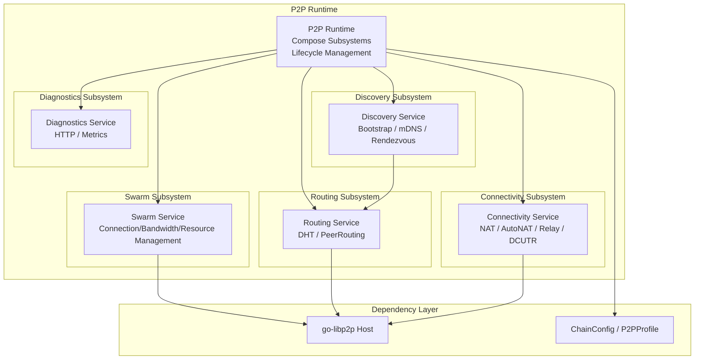

# Network and Topology

---

## Overview

WES adopts a decentralized P2P network architecture, supporting node discovery, message routing, and data synchronization.

**Core Responsibilities**:
- Node discovery and connection management
- Message broadcasting and routing
- Data synchronization

---

## Network Architecture

### P2P Layered Architecture

WES's P2P network adopts a layered architecture, implemented based on go-libp2p, aligned with IPFS Kubo's network subsystem:



**Core Subsystems**:

1. **Swarm Service**: Connection management, bandwidth statistics, resource management
   - Maintains all active connections and streams
   - Provides Dial, Peer, and connection information views
   - Manages connection watermarks (HighWater/LowWater) and resource limits

2. **Routing Service**: DHT-based Peer routing
   - Provides PeerRouting capability based on `go-libp2p-kad-dht`
   - Supports multiple DHT modes (`server/client/auto/lan`)

3. **Discovery Service**: Node discovery
   - Unified scheduling of discovery plugins like Bootstrap / mDNS / Rendezvous
   - Actively triggers discovery when peer count is below threshold

4. **Connectivity Service**: Connectivity enhancement
   - NAT PortMap, AutoNAT, Relay Client/Service, DCUTR hole punching
   - Maintains Reachability status (`Unknown/Public/Private`)

5. **Diagnostics Service**: Diagnostics and metrics
   - Exposes `/debug/p2p/*` HTTP endpoints
   - Exports Swarm, Routing, Discovery, Connectivity metrics to Prometheus

> **Implementation Layer Definition**: Detailed design of P2P layered architecture see [`internal/core/p2p/README.md`](../../../internal/core/p2p/README.md).

### Profile-Driven Configuration

WES's P2P behavior is **Profile-driven**, automatically configured based on chain type (public chain/consortium chain/private chain):

**Chain Type and Profile Mapping**:

| Chain Type | Profile | DHT Mode | PrivateNetwork | Connectivity Strategy |
|------------|---------|----------|----------------|----------------------|
| **Public Chain (public)** | `server` | `server` | `false` | RelayClient + AutoNAT enabled |
| **Consortium Chain (consortium)** | `server` | `client` or `auto` | `true` (requires PSK) | More dependent on static bootstrap |
| **Private Chain (private)** | `lan` | `lan` | `true` | Strong mDNS / LAN DHT, mostly no RelayService |

**DHT Mode Descriptions**:

- **server**: Full DHT server, stores and provides routing information
- **client**: DHT client, queries but does not store routing information
- **auto**: Automatic mode, selects based on network conditions
- **lan**: LAN mode, suitable for private network environments

**Single Source of Truth Principle**:

All P2P configuration items and default values are uniformly managed through `internal/config/p2p.Options`, `internal/core/p2p` layer only reads configuration, does not define defaults.

### P2P Network Foundation

WES uses Kademlia-based P2P network:

- **Node Identifier**: Each node has unique NodeID (based on libp2p PeerID)
- **Distance Calculation**: Uses XOR distance
- **Routing Table**: K-bucket organizes neighbor nodes
- **Underlying Implementation**: Based on go-libp2p, including Host, Swarm, DHT, GossipSub

### Node Roles

| Role | Description | Responsibilities |
|------|-------------|------------------|
| **Full Node** | Fully participates in consensus | Validation, storage, broadcasting |
| **Miner Node** | Participates in block production | Full node + mining |
| **Light Node** | Lightweight participation | Validates block headers |

---

## Node Discovery

### Bootstrap Nodes

New nodes join network through bootstrap nodes:

```
New Node → Bootstrap Node → Get Neighbor List → Connect to Neighbors
```

### Kademlia Discovery

Use Kademlia protocol to discover more nodes:

1. Calculate XOR distance to target
2. Query nearest known nodes
3. Iteratively query until target found

---

## Message Propagation

### Gossip Protocol

Transactions and blocks propagate through Gossip protocol:

```
Node A → Neighbor Nodes → More Nodes → Entire Network
```

**Characteristics**:
- Decentralized: No central node needed
- Fault-tolerant: Partial node failures don't affect propagation
- Eventually consistent: Messages eventually reach all nodes

### Message Types

| Message Type | Description |
|--------------|-------------|
| `NewTx` | New transaction broadcast |
| `NewBlock` | New block broadcast |
| `GetBlocks` | Request blocks |
| `GetHeaders` | Request block headers |
| `Ping/Pong` | Heartbeat detection |

---

## Connection Management

### Connection Limits

| Parameter | Default | Description |
|-----------|---------|-------------|
| `max_peers` | 50 | Maximum connections |
| `min_peers` | 8 | Minimum connections |
| `max_inbound` | 30 | Maximum inbound connections |
| `max_outbound` | 20 | Maximum outbound connections |

### Connection Maintenance

- **Heartbeat Detection**: Periodic Ping/Pong
- **Reconnection**: Automatically reconnect disconnected nodes
- **Blacklist**: Block malicious nodes

### Connectivity Enhancement

**Connectivity Service** provides multiple connectivity enhancement capabilities:

1. **NAT PortMap**: Automatically configure router port mapping
2. **AutoNAT**: Automatically detect NAT type and reachability
3. **Relay**: Relay service, supports Relay Client and Relay Service
   - Relay Client: Connect to other nodes through relay nodes
   - Relay Service: Act as relay node to serve other nodes
4. **DCUTR**: Direct Connection Upgrade Through Relay
   - After establishing connection through relay, attempt direct connection (hole punching)

**Reachability Status**:

- **Unknown**: Unknown status, detecting
- **Public**: Publicly reachable, can connect directly
- **Private**: Private network, needs relay connection

> **Implementation Layer Definition**: Detailed implementation of connectivity enhancement see [`internal/core/p2p/connectivity/`](../../../internal/core/p2p/connectivity/).

---

## Configuration

### Network Configuration

| Parameter | Type | Default | Description |
|-----------|------|---------|-------------|
| `listen_addr` | string | "0.0.0.0:30303" | Listen address |
| `bootstrap_nodes` | []string | [] | Bootstrap node list |
| `enable_upnp` | bool | true | Enable UPnP |
| `nat_type` | string | "any" | NAT type |

### P2P Configuration

| Parameter | Type | Default | Description |
|-----------|------|---------|-------------|
| `k_bucket_size` | int | 20 | K-bucket size |
| `refresh_interval` | duration | 1h | Routing table refresh interval |
| `lookup_interval` | duration | 30m | Node lookup interval |

---

## Related Documentation

- [Architecture Overview](./architecture-overview.md) - System architecture
- [PoW+XOR Consensus](./consensus-pow-xor.md) - Consensus message propagation
- [Chain Model](./chain.md) - Block synchronization

### Internal Design Documents

- [`_dev/01-协议规范-specs/05-网络协议-network/`](../../../_dev/01-协议规范-specs/05-网络协议-network/) - Network protocol specifications
- [`_dev/02-架构设计-architecture/07-网络与拓扑架构-network-and-topology/`](../../../_dev/02-架构设计-architecture/07-网络与拓扑架构-network-and-topology/) - Network architecture design

