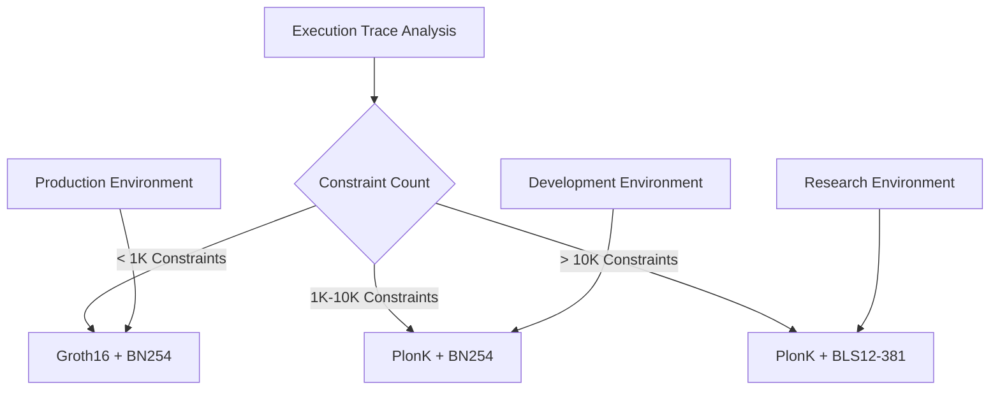
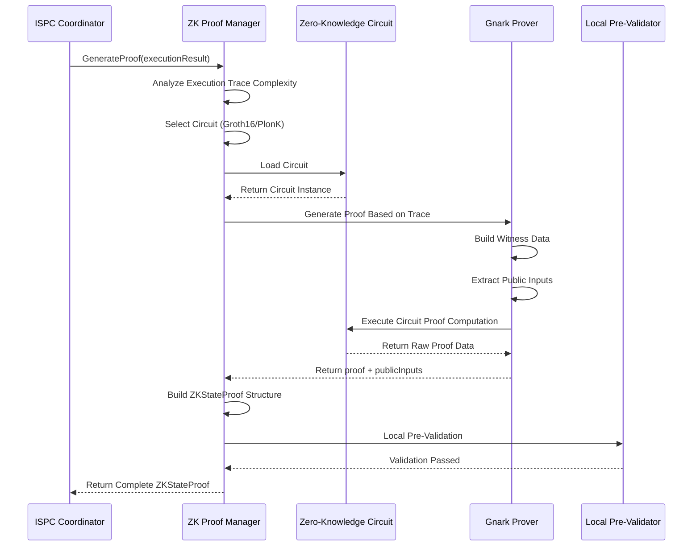
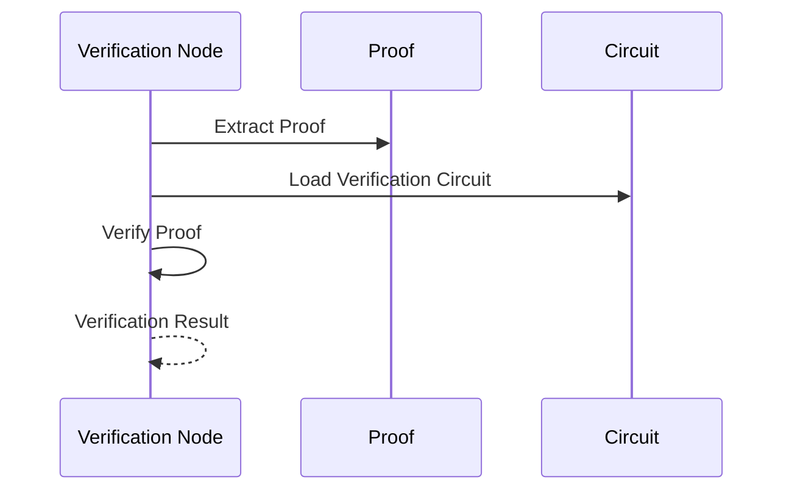

# Privacy and Proof

---

## Overview

WES implements verifiable computing through zero-knowledge proof (ZK Proof) technology, ensuring computation correctness while protecting privacy.

**Core Responsibilities**:
- Generate computation correctness proofs
- Verify proof validity
- Protect computation process privacy

---

## Zero-Knowledge Proof Basics

### What is Zero-Knowledge Proof?

Zero-knowledge proof allows a prover to prove to a verifier that a statement is true without revealing any additional information.

**Three Properties**:
- **Completeness**: If statement is true, honest prover can convince verifier
- **Soundness**: If statement is false, cheating prover cannot convince verifier
- **Zero-Knowledge**: Verifier gains no additional information except that statement is true

### Application in WES

In ISPC, zero-knowledge proofs are used for:
- Proving computation process executed correctly
- Proving input-output relationships are correct
- Verification nodes can verify without re-executing

### Proof Schemes

WES supports two zero-knowledge proof schemes:

**1. Groth16**
- **Characteristics**: Efficient, small proof, fast verification
- **Use Cases**: Simple circuits with < 1K constraints
- **Performance**: Generation time 100-500ms, proof size ~256B, verification time < 5ms

**2. PlonK**
- **Characteristics**: General-purpose, flexible, supports larger circuits
- **Use Cases**: Medium circuits with 1K-10K constraints, or complex circuits with > 10K constraints
- **Performance**:
  - Medium (1K-10K constraints): Generation time 1-5s, proof size ~512B, verification time < 20ms
  - Complex (> 10K constraints): Generation time 5-30s, proof size ~1KB, verification time < 50ms

**Circuit Selection Strategy**:

> **Implementation Layer Definition**: Detailed implementation of proof schemes and circuit selection see [`internal/core/ispc/zkproof/README.md`](../../../internal/core/ispc/zkproof/README.md).

---

## Proof Generation

### ZKStateProof Structure

Proofs generated by ISPC map to `ZKStateProof` structure, containing the following fields:

**Core Fields**:
- `proof`: Proof data (Groth16 or PlonK format)
- `public_inputs`: Public input array (state hashes, etc.)
- `proving_scheme`: Proof scheme ("groth16" or "plonk")
- `curve`: Elliptic curve ("bn254" or "bls12-381")
- `verification_key_hash`: Verification key hash

**Circuit Information**:
- `circuit_id`: Circuit identifier (e.g., "contract_execution.v1")
- `circuit_version`: Circuit version
- `circuit_commitment`: Circuit commitment (optional)

**Performance Information**:
- `constraint_count`: Constraint count
- `proof_generation_time_ms`: Proof generation time (milliseconds)

**Business Extensions**:
- `custom_attributes`: Custom attribute map

### Generation Flow

### Manager Responsibility Boundaries

**ZK Proof Manager (Manager) Responsibilities**:
- ✅ Zero-knowledge proof generation: Automatically generate verifiable zero-knowledge proofs based on execution traces
- ✅ ZKStateProof construction: Build ZKStateProof structure conforming to transaction.proto specification
- ✅ Circuit management: Manage different types of zero-knowledge circuits like Groth16, PlonK
- ✅ Local pre-validation: Perform local pre-validation after generation, ensure proof format is correct

**Network Validation Responsibilities** (not Manager responsibilities):
- Verification node validation: Receive StateOutput.zk_proof and verify ZKStateProof
- Network consensus validation: Participate in network consensus, confirm computation correctness
- Block confirmation validation: Final validation after block confirmation

> **Implementation Layer Definition**: Detailed responsibilities and boundaries of ZK proof manager see [`internal/core/ispc/zkproof/README.md`](../../../internal/core/ispc/zkproof/README.md).

---

## Proof Verification

### Verification Flow

### Verification Efficiency

**Performance Metrics**:

| Circuit Type | Constraint Count | Generation Time | Proof Size | Verification Time |
|--------------|------------------|-----------------|------------|-------------------|
| **Simple Groth16** | < 1K | 100-500ms | ~256B | < 5ms |
| **Medium PlonK** | 1K-10K | 1-5s | ~512B | < 20ms |
| **Complex PlonK** | > 10K | 5-30s | ~1KB | < 50ms |

**Key Advantages**:
- **Verification Time**: Millisecond-level (much faster than re-execution)
- **Verification Complexity**: Related to proof size, not computation complexity
- **Single Execution + Multi-Point Verification**: Business logic runs only once on execution node, verification nodes only need to verify proofs, 100-1000x faster than repeated execution

---

## Privacy Protection

### Computation Privacy

- Verifiers don't know specific computation process
- Can only verify result correctness, cannot obtain intermediate states

### Data Privacy

- Input data can remain private
- Only reveal necessary outputs

### Application Scenarios

- **Privacy Transactions**: Amount and participants confidential
- **Privacy Computing**: Business logic confidential
- **Privacy AI**: Model parameters and data confidential

---

## Configuration

| Parameter | Type | Default | Description |
|-----------|------|---------|-------------|
| `proof_level` | string | "standard" | Proof level |
| `proof_timeout` | duration | 30s | Proof generation timeout |
| `verify_timeout` | duration | 1s | Proof verification timeout |

---

## Related Documentation

- [ISPC Intrinsic Self-Proving Computing](./ispc.md) - Verifiable computing core
- [Transaction Model](./transaction.md) - Proof position in transactions

### Internal Design Documents

- [`_dev/01-协议规范-specs/07-隐私与证明协议-privacy-and-proof/`](../../../_dev/01-协议规范-specs/07-隐私与证明协议-privacy-and-proof/) - Privacy and proof protocol specifications
- [`internal/core/ispc/zkproof/README.md`](../../../internal/core/ispc/zkproof/README.md) - ZK proof manager implementation architecture

