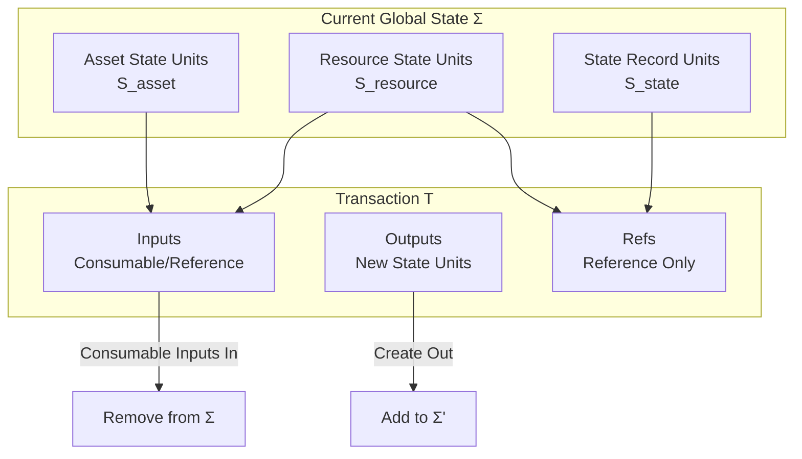
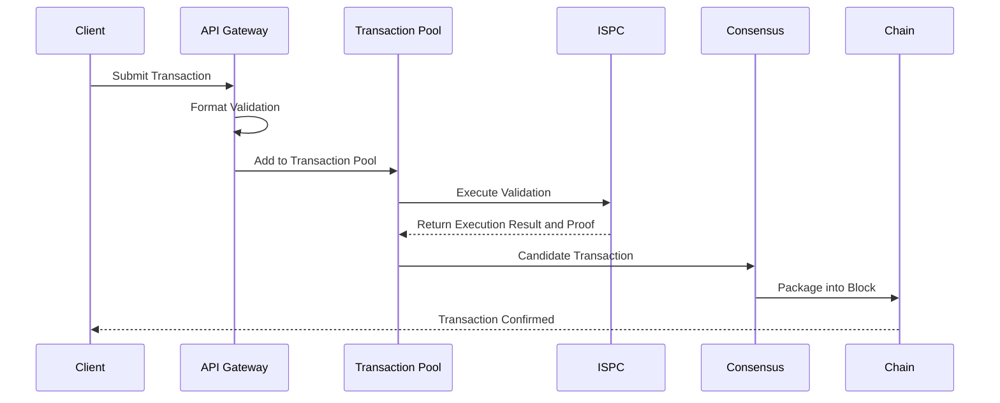

# Transaction Model

---

## Overview

Transaction is the basic unit of state change in the WES system, defining inputs, outputs, and execution logic.

**Core Responsibilities**:
- Define inputs and outputs of state changes
- Trigger ISPC execution
- Record immutable operation history

---

## Transaction as State Transition Function

### Protocol Layer Abstraction

At the protocol layer, a transaction `T` can be viewed as a state transition on given global state `Σ`:

```
apply : (Σ, T) → Σ' or error
```

**Transaction Effect on State Set**:

At the abstract level, the effect of a transaction `T` can be viewed as:

- Select finite set `In ⊆ Σ` from current global state `Σ` as **inputs** (consumable)
- Create finite set `Out ⊆ S` as **outputs** (new state units)
- Select finite set `Ref ⊆ S` as **reference set** (read-only, does not change availability)

If the transaction is considered "valid and executed" by the protocol, the new global state is:

```
Σ' = (Σ \ In) ∪ Out
```

**Transaction Effect on Three-Layer State Diagram**:



> **Protocol Layer Definition**: Transaction protocol only concerns whether state is sufficient, permissions are satisfied, value and resource-related axioms are satisfied, context matches. This specification does not assign independent semantics to any specific business scenario. See [`_dev/01-协议规范-specs/02-交易协议-transaction/TRANSACTION_PROTOCOL_SPEC.md`](../../../_dev/01-协议规范-specs/02-交易协议-transaction/TRANSACTION_PROTOCOL_SPEC.md) §2.

## Transaction Structure

### Basic Structure

```
Transaction
├── TxID          # Transaction unique identifier
├── Version       # Version number
├── Inputs        # Input list
│   ├── UTXORef   # UTXO reference
│   ├── IsReference # Whether reference input
│   └── UnlockProof # Unlock proof
├── Outputs       # Output list
│   ├── AssetOutput    # Asset output
│   ├── ResourceOutput # Resource output
│   └── StateOutput    # State output
├── Execution     # Execution information
│   ├── ContractRef    # Contract reference
│   ├── Method         # Method name
│   └── Parameters     # Parameters
├── Proof         # ZK proof
└── Metadata      # Metadata
```

### Input Types

#### Consumable Input (In)

- State unit cannot be used again after consumption
- Counted in value conservation calculation
- Used for asset transfers

#### Reference Input (Ref)

- State unit is referenced but not consumed
- Not counted in value conservation calculation
- Used for reading shared data (e.g., contracts, configuration)

### Output Types

See three-layer output architecture in [EUTXO Model](./eutxo.md).

---

## Transaction Lifecycle (Protocol Layer Abstraction)

From protocol layer abstraction, a transaction's life includes:

### 1. Construction Phase

- Transaction initiator locally constructs transaction draft `T_draft` based on currently known state set
- Draft can be temporarily incomplete in witness or some fields, but must complete all necessary information before broadcasting

### 2. Local Validation

- Before any transaction is broadcast, implementation must perform protocol-level validation locally:
  - Structural integrity
  - Authorization legality
  - Value conservation and resource constraints
  - No conflicting consumption (under premise of locally known transaction set)
  - Context binding correctness
- Transactions failing local validation must not be considered "candidate transactions" and should not be broadcast

### 3. Broadcasting and Staging

- After node receives external transaction, should perform same validation process as local initiation
- For transactions temporarily competing for resources or having input conflicts with other unconfirmed transactions, implementation can prioritize or stage according to strategy

### 4. Packaging and Confirmation

- Consensus and block protocol select a set of validated transactions, order them and package into blocks
- Once a block and its contained transactions achieve sufficient consensus confirmation on some chain, their changes to global state are considered finally effective

> **Protocol Layer Boundary**: Transaction protocol defines transaction validity rules and state transition semantics. Mempool, consensus, chain selection, etc. belong to implementation layer processes and strategies, not defined in transaction protocol specification. See [`_dev/01-协议规范-specs/02-交易协议-transaction/TRANSACTION_PROTOCOL_SPEC.md`](../../../_dev/01-协议规范-specs/02-交易协议-transaction/TRANSACTION_PROTOCOL_SPEC.md) §6.

**Implementation Layer Flow Diagram** (for reference only, not protocol requirement):



---

## Transaction Validation

### Format Validation

- Transaction structure complete
- Field formats correct
- Signatures valid

### State Validation

- Input UTXO exists and not consumed
- Input UTXO can be unlocked
- Value conservation (consumable inputs)

### Execution Validation

- ISPC execution successful
- ZK proof valid
- Outputs correctly generated

---

## Transaction Construction

### Using TxBuilder

```go
builder := tx.NewTxBuilder()

// Add inputs
builder.AddInput(utxoRef, false)  // Consumable
builder.AddInput(contractRef, true)  // Reference

// Set execution
builder.SetExecution(contractHash, "transfer", params)

// Add outputs
builder.AddAssetOutput(toAddress, amount, lock)
builder.AddStateOutput(stateData)

// Build transaction
tx, err := builder.Build()
```

### Sign Transaction

```go
// Sign using wallet
signedTx, err := wallet.SignTransaction(tx)

// Or sign manually
signature := crypto.Sign(privateKey, tx.Hash())
tx.SetSignature(signature)
```

---

## Configuration

| Parameter | Type | Default | Description |
|-----------|------|---------|-------------|
| `max_tx_size` | int | 1MB | Maximum transaction size |
| `max_inputs` | int | 100 | Maximum input count |
| `max_outputs` | int | 100 | Maximum output count |
| `tx_timeout` | duration | 1h | Transaction timeout |

---

## Related Documentation

- [EUTXO Model](./eutxo.md) - Input/output model
- [ISPC Intrinsic Self-Proving Computing](./ispc.md) - Execution validation
- [Block Model](./block.md) - Transaction packaging

### Internal Design Documents

- [`_dev/01-协议规范-specs/02-交易协议-transaction/`](../../../_dev/01-协议规范-specs/02-交易协议-transaction/) - Transaction protocol specifications

