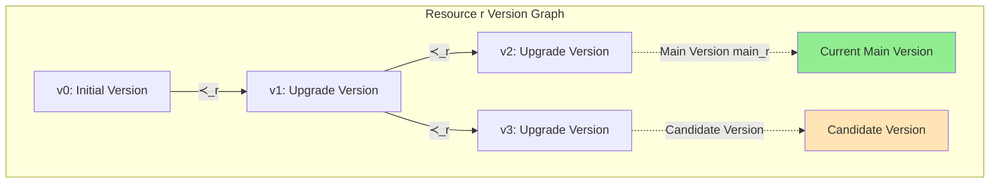
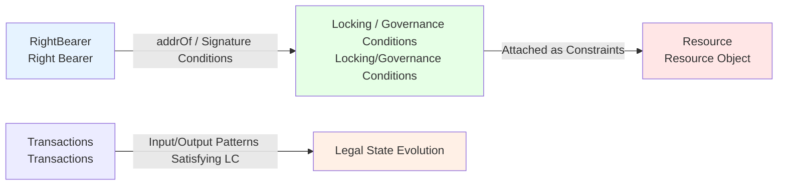
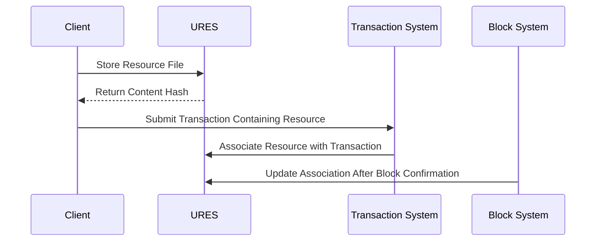

# URES Unified Resource Management

---

## Overview

URES is the resource management core of the WES system, responsible for content-addressable storage, unified management of WASM contracts, ONNX models, files, and other resources.

**Position in Three-Layer Model**: Ledger Layer

**Core Philosophy**: Unified resource management based on content addressing, achieving resource deduplication, environment independence, and efficient distribution, while ensuring secure use and evolution of resources through right bearers and version management.

---

## Why URES?

### Traditional Blockchain Resource Management Problems

1. **Scattered Resource Storage**
   - Inconsistent storage methods for contracts, data, files
   - Difficult to manage and query uniformly

2. **Duplicate Storage**
   - Same content stored multiple times
   - Wasted storage space

3. **Environment Dependencies**
   - Resource identifiers are environment-dependent
   - Cross-node synchronization is complex

### URES Solution

1. **Unified Management**
   - All resources use the same storage and query interfaces
   - Unified resource lifecycle management

2. **Content Addressing**
   - Unique identifier based on content hash
   - Automatic deduplication, saving storage

3. **Environment Independence**
   - Same content produces same hash in different environments
   - Simplifies cross-node synchronization

---

## Core Capabilities

### 1. Content-Addressable Storage

**Principle**:
- Use SHA-256 to calculate hash value of resource content
- Hash value as unique identifier for resources
- Same content produces same hash

**Advantages**:
- **Automatic Deduplication**: Same content stored only once
- **Environment Independence**: Not dependent on paths or names
- **Integrity Verification**: Hash is checksum

```
Resource Content → SHA-256 → Content Hash → Storage/Query
```

---

### 2. Unified Resource Management

URES manages two types of resources:

#### Static Resources (STATIC)

**Characteristics**:
- Not executable
- Used for data storage

**Types**:
- Files
- Images
- Configuration data
- Arbitrary binary data

#### Executable Resources (EXECUTABLE)

**Characteristics**:
- Can be executed by ISPC
- Require specific runtime

**Types**:
- `CONTRACT`: General smart contracts (WASM)
- `MODEL`: AI/ML models (ONNX)
- Other executable formats

> **Protocol Layer Definition**: Resource classification follows the hierarchical structure of `ResourceCategory` (`EXECUTABLE` / `STATIC`) and `ExecutableKind` (`CONTRACT` / `MODEL`). See [`_dev/01-协议规范-specs/01-状态与资源模型协议-state-and-resource/RESOURCE_MODEL_PROTOCOL_SPEC.md`](../../../_dev/01-协议规范-specs/01-状态与资源模型协议-state-and-resource/RESOURCE_MODEL_PROTOCOL_SPEC.md).

---

### 3. Resource Query

**Query Capabilities**:
- Query resources by content hash
- Query resource metadata
- Check resource file existence

**Metadata**:
- Resource type
- Resource size
- Creation time
- Associated transactions/blocks

---

### 4. Resource Version Management

Resource objects are managed through **Version Graph** on-chain:

**Version Graph Structure**:
- Each resource object `r` is associated with a set of resource layer state units `S_r`
- These state units form a version graph through directed acyclic precedence relation `≺_r`
- `s1 ≺_r s2` means version `s2` directly evolved from version `s1`

**Main Version Selection**:
- At any moment, each resource object has at most one **main version** (`main_r(t)`)
- Main version selection function ensures version chain continuity: any version must be traceable to initial version

**Version Graph Diagram**:



**Version Management Constraints**:
- **Main Version Uniqueness**: At most one main version at any moment
- **Version Chain Continuity**: All versions must be traceable to initial version
- **Identity Stability**: All versions of the same resource share the same resource identity

> **Protocol Layer Definition**: Resource uniqueness axiom requires version graph to be a directed acyclic graph (DAG), and main version selection function must satisfy determinism. See [`_dev/01-协议规范-specs/01-状态与资源模型协议-state-and-resource/RESOURCE_MODEL_PROTOCOL_SPEC.md`](../../../_dev/01-协议规范-specs/01-状态与资源模型协议-state-and-resource/RESOURCE_MODEL_PROTOCOL_SPEC.md) §4.

### 5. Right Bearer and Resource Binding

**Right Bearer**:
- From protocol perspective, abstract "control carrier" that has specific rights to certain resources
- Manifested through verifiable on-chain conditions (addresses, scripts, signature conditions)
- Not equivalent to real-world individuals/organizations, but abstraction of cryptographic control relationships

**Three Basic Right Types**:

1. **Ownership**: Has final disposal right over resource object
2. **Usage Right**: Right to use resource under given conditions
3. **Management Right**: Right to adjust usage conditions, allocate usage rights, etc.

**Right Binding Relationship**:



**Right Constraints**:
- Any resource object **must** be associated with at least one type of right bearer set
- Mutually conflicting ownership allocations are not allowed
- All right relationships **must** be implemented as verifiable conditions in state and transactions
- Authorization and revocation must be attributable to specific right bearers and comply with permission constraints

**Reference Safety Axiom**:
- When state unit `s` references resource object `r`, there must exist a valid resource layer state unit associated with `r` when `s` is created
- Subsequent evolution of `r` will not silently change the semantics referred to by `s`, unless `s` explicitly declares acceptance of such changes
- If state unit binds to specific resource version, this binding cannot be unilaterally rewritten by external state during its lifecycle

> **Protocol Layer Definition**: Right bearer and resource binding follow resource reference safety axiom, ensuring determinism and security of resource references. See [`_dev/01-协议规范-specs/01-状态与资源模型协议-state-and-resource/RESOURCE_MODEL_PROTOCOL_SPEC.md`](../../../_dev/01-协议规范-specs/01-状态与资源模型协议-state-and-resource/RESOURCE_MODEL_PROTOCOL_SPEC.md) §3, §5.

### 6. Resource Association

**Association Flow**:



**Association Information**:
- Associated transaction hash
- Associated block hash (after confirmation)
- Deployer address

---

## Interface Capabilities

### ResourceWriter (Resource Writer)

**Capabilities**:
- `StoreResourceFile()` - Store resource file
- `LinkResourceToTransaction()` - Associate resource with transaction

**Constraints**:
- Storage operations are atomic
- Automatic deduplication check
- Returns content hash

### ResourceQuery (Resource Query)

**Capabilities**:
- `GetResourceFromBlockchain()` - Query resource from blockchain
- `GetResourceFile()` - Get resource file
- `CheckResourceFileExists()` - Check resource file existence

**Constraints**:
- Queries are read-only operations
- Files may need to be synchronized from other nodes

---

## Configuration

| Parameter | Type | Default | Description |
|-----------|------|---------|-------------|
| `max_resource_size` | int | 100MB | Maximum resource size |
| `enable_deduplication` | bool | true | Enable deduplication |
| `storage_path` | string | "./storage" | Storage path |

---

## Usage Constraints

### Resource Storage Constraints

1. **Size Constraints**:
   - Resource size cannot exceed `max_resource_size`
   - Large resources need chunked storage

2. **Format Constraints**:
   - Resource content must be verifiable
   - Resource hash must be correct

3. **Deduplication Constraints**:
   - Same content automatically deduplicated
   - Existing resources directly return hash

### Resource Query Constraints

1. **Existence Constraints**:
   - Resource must exist
   - Resource metadata must be complete

2. **File Constraints**:
   - Files may not be local
   - Need to synchronize from other nodes

### Resource Version Constraints

1. **Version Graph Constraints**:
   - Version graph must be a directed acyclic graph (DAG)
   - All versions must be traceable to initial version
   - Main version selection must satisfy uniqueness

2. **Reference Safety Constraints**:
   - Resource references must have valid resource layer state units when created
   - Resource version evolution cannot unilaterally change semantics of existing references
   - Version binding relationships must be explicit and auditable

### Right Bearer Constraints

1. **Right Allocation Constraints**:
   - Any resource must be associated with at least one type of right bearer set
   - Mutually conflicting ownership allocations are not allowed
   - Right relationships must be implemented as verifiable conditions

2. **Authorization Constraints**:
   - Authorization and revocation must be attributable to specific right bearers
   - Executing entity must have sufficient management or ownership rights
   - New right states must be traceable to old states

---

## Typical Usage Scenarios

### Scenario 1: Contract Deployment

```go
// Store WASM contract file
writer := ures.NewResourceWriter()
hash, err := writer.StoreResourceFile("contract.wasm")
if err != nil {
    return err
}
// Use hash to create ResourceOutput
builder := tx.NewTxBuilder()
tx := builder.
    AddInput(assetUTXO, false).
    AddResourceOutput(hash, owner).
    Build()
```

### Scenario 2: Model Deployment

```go
// Store ONNX model file
writer := ures.NewResourceWriter()
hash, err := writer.StoreResourceFile("model.onnx")
if err != nil {
    return err
}
// Use hash to create ResourceOutput
```

### Scenario 3: Resource Query

```go
// Query resource information
query := ures.NewResourceQuery()
resource, err := query.GetResourceFromBlockchain(contentHash)
if err != nil {
    return err
}
// Check resource type
if resource.Type == "wasm" {
    // Handle WASM contract
}
```

---

## Relationships with Other Components

### Dependencies

```
URES
  ├── Depends on Storage (File storage)
  ├── Depended on by EUTXO (ResourceOutput)
  └── Depended on by ISPC (Load resources for execution)
```

### Relationship with EUTXO

- **URES**: Manages actual resource content
- **EUTXO**: Manages resource ownership and reference relationships

```
ResourceOutput (EUTXO)
    ↓
resource_hash → Content Hash
    ↓
Resource Content (URES)
```

### Relationship with ISPC

- **URES**: Provides resource content
- **ISPC**: Loads resources and executes

```
ISPC Execution Request
    ↓
Load Resource from URES
    ↓
Execute (WASM/ONNX)
```

---

## Related Documentation

- [Architecture Overview](./architecture-overview.md) - Understand system architecture
- [EUTXO Model](./eutxo.md) - Understand state management
- [ISPC Intrinsic Self-Proving Computing](./ispc.md) - Understand verifiable computing

### Internal Design Documents

- [`_dev/01-协议规范-specs/01-状态与资源模型协议-state-and-resource/`](../../../_dev/01-协议规范-specs/01-状态与资源模型协议-state-and-resource/) - URES protocol specifications
- [`_dev/02-架构设计-architecture/02-状态与资源架构-state-and-resource/`](../../../_dev/02-架构设计-architecture/02-状态与资源架构-state-and-resource/) - Resource architecture design

