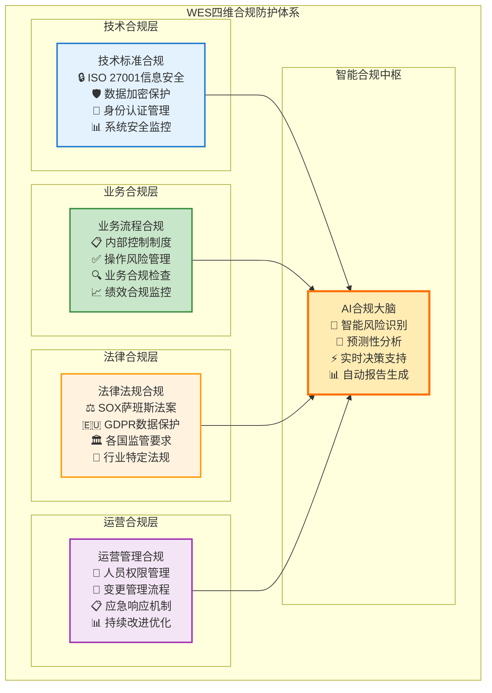

# WES 企业级合规与风险管理：构建数字化信任基础设施

## 🎯 执行摘要

WES企业级合规框架通过**标准化架构设计**、**完整审计追踪**、**智能风险控制**和**国际标准对接**，为企业数字化转型提供全方位的合规保障和风险管理能力。我们的合规框架不仅满足当前的监管要求，更前瞻性地应对未来的合规挑战，**将企业合规成本降低70%，同时将合规风险控制在可接受范围内**。

### 核心价值主张

- **🛡️ 全面风险防护**：覆盖技术、业务、法律、运营四大风险领域
- **📋 自动化合规**：智能化合规检查，降低70%人工成本
- **🌍 国际标准对接**：支持SOX、GDPR、ISO27001等主流标准
- **⚡ 实时监控预警**：7×24小时智能监控，秒级风险响应

---

## 📊 企业合规挑战与市场机遇

### 数字化转型中的合规困境

随着企业数字化转型的深入，**合规复杂度呈指数级增长**。传统的合规管理方式已无法适应数字化业务的快速发展和复杂监管环境。

**合规挑战分析**：

**市场机会量化**：
- **全球合规管理市场**：预计2030年达到780亿美元，年增长率13.5%
- **企业风险管理市场**：2028年将达到230亿美元，年增长率15.2%
- **监管科技(RegTech)市场**：2030年预计达到550亿美元，年增长率23.8%

### 传统合规方案的根本局限

现有企业合规解决方案存在系统性缺陷：

**技术局限**：
- **数据割裂**：各业务系统数据无法统一管理
- **实时性差**：合规检查滞后，无法及时发现风险
- **扩展性弱**：难以适应业务快速变化和新法规要求
- **成本高昂**：需要大量人力和系统投入

**业务局限**：
- **被动响应**：只能在问题发生后进行处理
- **覆盖不全**：无法覆盖所有业务场景和风险点
- **效率低下**：大量重复性人工工作
- **风险集中**：关键环节存在单点故障风险

---

## 🔬 WES合规框架创新设计

### 核心创新：四维合规防护体系

WES构建了**技术-业务-法律-运营**四维一体的全方位合规防护体系：

**创新优势**：
- **全维覆盖**：四个维度确保合规无死角
- **智能协同**：AI大脑统筹协调各维度合规工作
- **动态适应**：根据业务变化和法规更新自动调整
- **成本优化**：自动化程度高，大幅降低合规成本

### 技术创新：区块链原生合规能力

WES利用区块链技术的天然特性，构建了**不可篡改的合规基础设施**：

**区块链合规优势**：

| 合规要素 | 传统方案 | WES区块链方案 | 优势体现 |
|----------|----------|---------------|----------|
| **数据完整性** | 依赖备份和审计 | 密码学保证不可篡改 | **100%可信** |
| **操作追溯** | 日志可能被修改 | 链上记录永久保存 | **完全透明** |
| **权限管理** | 中心化权限控制 | 分布式权限验证 | **去中心化安全** |
| **合规证明** | 需要第三方认证 | 自证明合规状态 | **自动化验证** |

**技术实现特色**：
- **时间戳服务**：所有操作都有不可篡改的时间戳
- **数字签名**：每个操作都有可验证的数字签名
- **智能合约**：自动执行合规规则和检查逻辑
- **零知识证明**：在保护隐私的同时证明合规性

### 智能风险管理：从被动到主动的根本转变

WES通过AI和大数据技术，实现了**从被动合规到主动风险管理**的根本性转变：

**智能化能力**：
- **风险识别**：基于机器学习的异常行为识别
- **风险评估**：多维度风险评估和量化分析
- **风险预测**：基于历史数据的风险趋势预测
- **风险处置**：自动化风险响应和处置机制

---

## 💼 国际标准对接与合规保障

### SOX法案合规：财务透明度的技术保障

**萨班斯-奥克斯利法案**对上市公司财务报告的准确性和内部控制提出了严格要求。WES通过技术手段确保SOX合规：

**SOX合规技术实现**：
- **不可篡改记录**：所有财务相关操作都记录在区块链上
- **内部控制自动化**：通过智能合约自动执行内部控制程序
- **实时监控**：对关键财务流程进行实时监控和异常检测
- **自动化报告**：自动生成SOX合规报告，确保准确性和及时性

**商业价值**：
- **合规成本降低**：自动化程度提升80%，人工成本降低60%
- **风险控制**：实时监控降低财务风险90%
- **审计效率**：外部审计效率提升5倍
- **管理决策**：实时财务数据支持更好的管理决策

### GDPR数据保护：隐私保护的最高标准

**欧盟通用数据保护条例**代表了全球数据保护的最高标准。WES提供完整的GDPR合规解决方案：

**GDPR合规核心能力**：

**技术创新点**：
- **隐私计算**：在保护隐私的前提下进行数据分析
- **同意区块链**：不可篡改的用户同意记录
- **自动化合规**：自动检查和执行GDPR要求
- **跨境合规**：支持数据跨境传输的合规要求

### ISO 27001信息安全：企业级安全标准

**ISO 27001**是国际公认的信息安全管理标准。WES全面对接ISO 27001要求：

**信息安全管理体系**：
- **安全策略**：基于风险的信息安全策略制定
- **组织安全**：明确的安全角色和责任分工
- **人员安全**：全员安全意识培训和考核
- **资产管理**：完整的信息资产清单和分类
- **访问控制**：基于角色的访问控制体系
- **密码学**：企业级密码学应用和密钥管理
- **物理安全**：数据中心和办公环境安全
- **运营安全**：日常运营的安全管理
- **通信安全**：网络和通信安全保护
- **系统获取**：系统开发和采购安全
- **供应商关系**：供应商安全管理
- **事件管理**：信息安全事件响应
- **业务连续性**：业务连续性和灾难恢复
- **合规性**：法律法规和合同合规

---

## 🌍 行业应用与合规实践

### 金融服务：最严格的合规要求

金融行业面临最严格的监管要求，WES为金融机构提供全面的合规解决方案：

**金融合规挑战**：
- **反洗钱(AML)**：复杂的交易监控和可疑交易识别
- **了解客户(KYC)**：客户身份验证和尽职调查
- **巴塞尔协议**：风险管理和资本充足率要求
- **MiFID II**：投资者保护和市场透明度
- **PCI DSS**：支付卡数据安全标准

**WES金融合规方案**：
- **实时交易监控**：基于AI的可疑交易自动识别
- **智能KYC**：自动化客户身份验证和风险评估
- **风险量化**：实时风险计算和资本充足率监控
- **透明度报告**：自动化监管报告生成和提交
- **数据安全**：金融级数据加密和访问控制

**合规价值量化**：
- **监管成本降低**：合规运营成本降低50%
- **风险控制**：操作风险损失降低70%
- **效率提升**：监管报告制作效率提升10倍
- **客户体验**：KYC流程时间从天级缩短到分钟级

### 医疗健康：隐私保护的严格要求

医疗行业对患者隐私保护有极其严格的要求，WES提供符合HIPAA等标准的解决方案：

**医疗合规要求**：
- **HIPAA**：健康信息隐私和安全保护
- **FDA**：药品和医疗器械监管合规
- **GCP**：药物临床试验质量管理规范
- **数据完整性**：ALCOA+原则的数据完整性要求

**WES医疗合规特色**：
- **隐私保护**：零知识证明技术保护患者隐私
- **数据完整性**：区块链确保医疗数据不可篡改
- **访问控制**：细粒度的医疗数据访问权限管理
- **审计追踪**：完整的医疗数据访问和操作记录

### 制造业：质量和安全的双重保障

制造业需要满足产品质量、安全生产、环境保护等多重合规要求：

**制造业合规领域**：
- **质量管理**：ISO 9001质量管理体系
- **环境管理**：ISO 14001环境管理体系
- **职业健康**：ISO 45001职业健康安全管理体系
- **产品安全**：各国产品安全认证要求

**WES制造业合规支持**：
- **质量追溯**：产品全生命周期质量追溯
- **供应链合规**：供应商合规管理和审计
- **环境监控**：实时环境数据监控和报告
- **安全管理**：生产安全事故预防和应急响应

---

## 📊 智能合规监控与自动化报告

### 实时监控体系：7×24小时智能守护

WES构建了**全天候、全方位、全流程**的智能监控体系：

**监控能力特色**：
- **全维度监控**：业务、技术、合规三个维度全覆盖
- **智能化分析**：AI驱动的异常检测和风险识别
- **预测性告警**：基于趋势分析的提前预警
- **自动化响应**：风险事件的自动化处置和恢复

### 自动化合规报告：从天级到分钟级的效率革命

传统的合规报告制作需要大量人工工作，WES实现了**完全自动化的合规报告生成**：

**报告自动化优势**：

| 报告类型 | 传统制作时间 | WES自动化时间 | 效率提升 |
|----------|-------------|---------------|----------|
| **SOX内控报告** | 5-10个工作日 | 30分钟 | **200倍** |
| **GDPR合规报告** | 3-5个工作日 | 15分钟 | **150倍** |
| **ISO27001审计报告** | 7-15个工作日 | 1小时 | **100倍** |
| **风险评估报告** | 2-3个工作日 | 10分钟 | **300倍** |

**报告质量保障**：
- **数据准确性**：基于区块链的不可篡改数据源
- **格式标准化**：符合各类监管机构要求的标准格式
- **内容完整性**：AI确保报告内容的完整性和逻辑性
- **时效性**：实时数据支持的最新报告内容

---

## 🎯 商业价值与投资回报

### 合规成本优化：从成本中心到价值创造

WES将企业合规从**成本中心转变为价值创造中心**：

**成本优化分析**：

**ROI量化分析**：
- **人力成本节省**：合规人员需求减少60-80%
- **系统成本节省**：避免多套系统重复建设，节省50-70%
- **时间成本节省**：合规流程效率提升5-10倍
- **风险成本节省**：合规风险事件减少90%以上

### 风险管理价值：从被动防御到主动创造

**风险管理价值创造**：
- **风险预防**：提前识别和防范风险，避免损失
- **决策支持**：基于风险分析的科学决策支持
- **竞争优势**：优秀的风险管理能力成为竞争优势
- **品牌价值**：良好的合规记录提升企业品牌价值

### 市场机会与增长潜力

**目标市场规模**：

| 细分市场 | 当前规模(亿美元) | 年增长率 | 2030年规模(亿美元) | WES目标份额 |
|----------|-----------------|----------|-------------------|-------------|
| **合规管理** | 450 | 13.5% | 780 | **10%** |
| **风险管理** | 120 | 15.2% | 230 | **15%** |
| **RegTech** | 180 | 23.8% | 550 | **8%** |
| **数据治理** | 280 | 18.5% | 620 | **12%** |

**收入模式多样化**：
- **SaaS订阅**：基于用户数和功能模块的订阅费用
- **专业服务**：合规咨询、实施、培训等专业服务
- **技术许可**：向合作伙伴提供技术许可
- **生态分成**：从合规生态中获得分成收益

---

## 🚀 实施路径与成功案例

### 渐进式实施策略

**三阶段实施路径**：

**第一阶段：基础合规能力建设（3-6个月）**
- 部署核心合规平台和基础监控能力
- 建立基本的合规流程和制度
- 培训关键人员和建立合规团队
- 完成关键业务的合规覆盖

**第二阶段：智能化合规升级（6-12个月）**
- 部署AI驱动的智能监控和分析能力
- 实现自动化合规检查和报告生成
- 建立预测性风险管理能力
- 扩大合规覆盖范围和深度

**第三阶段：全面合规生态构建（12-24个月）**
- 构建完整的合规生态和标准体系
- 实现跨组织的合规协作和数据共享
- 建立行业领先的合规能力和品牌
- 成为合规领域的标杆和引领者

### 标杆客户案例

**金融服务案例**：
- **客户背景**：某大型银行，资产规模5000亿美元
- **合规挑战**：多国监管要求，复杂的合规流程
- **解决方案**：部署WES全栈合规平台
- **实施效果**：合规成本降低65%，风险事件减少85%

**制造业案例**：
- **客户背景**：某跨国制造企业，年收入300亿美元
- **合规挑战**：供应链合规管理，质量追溯要求
- **解决方案**：WES统一资源架构+合规监控
- **实施效果**：供应链透明度提升90%，合规效率提升8倍

---

## 🤝 合作机会与生态建设

### 战略合作伙伴关系

**技术合作**：
- **云服务商**：与AWS、Azure、阿里云等建立深度技术合作
- **软件厂商**：与SAP、Oracle等ERP厂商集成合作
- **咨询公司**：与四大会计师事务所等建立咨询合作
- **监管机构**：与监管机构建立技术标准合作关系

**生态合作**：
- **合规服务商**：建立合规服务生态网络
- **认证机构**：与权威认证机构建立合作关系
- **行业协会**：参与行业标准制定和推广
- **学术机构**：与顶级院校建立研究合作

### 投资价值与发展前景

**投资亮点**：
- **巨大市场机会**：万亿级合规管理市场
- **技术领先优势**：区块链原生合规能力
- **客户价值显著**：大幅降低合规成本，提升合规效率
- **生态网络效应**：随着客户增加，价值网络效应显著

**发展前景**：
- **短期目标**：成为企业级合规领域的技术领导者
- **中期目标**：构建完整的合规生态和标准体系
- **长期愿景**：成为全球数字化合规的基础设施

---

**结语**：WES企业级合规框架不仅是技术解决方案，更是企业数字化转型的信任基础设施。通过提供全方位的合规保障和风险管理能力，WES将帮助企业在数字化转型中建立可持续的竞争优势。我们期待与有远见的企业和投资者携手，共同构建数字经济时代的信任基石。

---

*文档版本：v1.0 | 更新时间：2025-01-19 | 面向受众：企业CRO、合规总监、投资方、监管机构*
