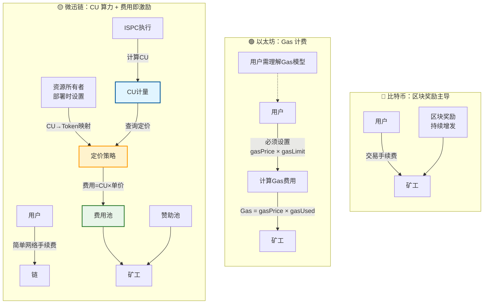
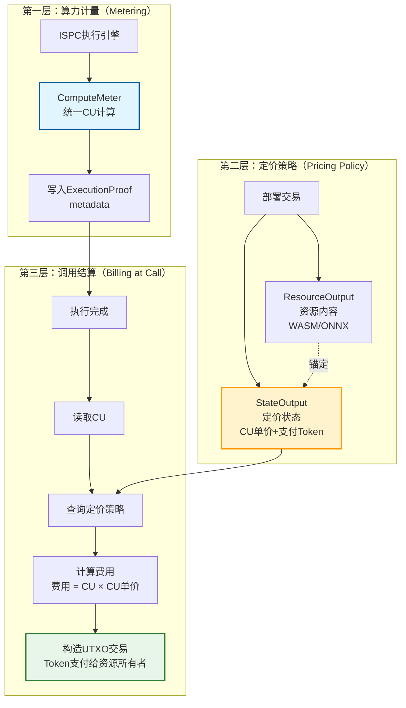
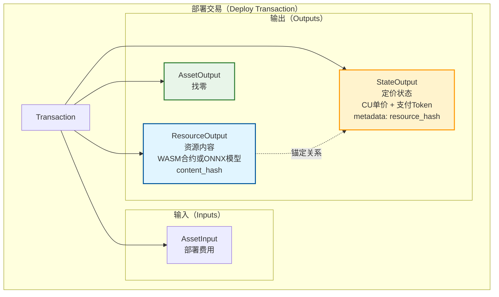
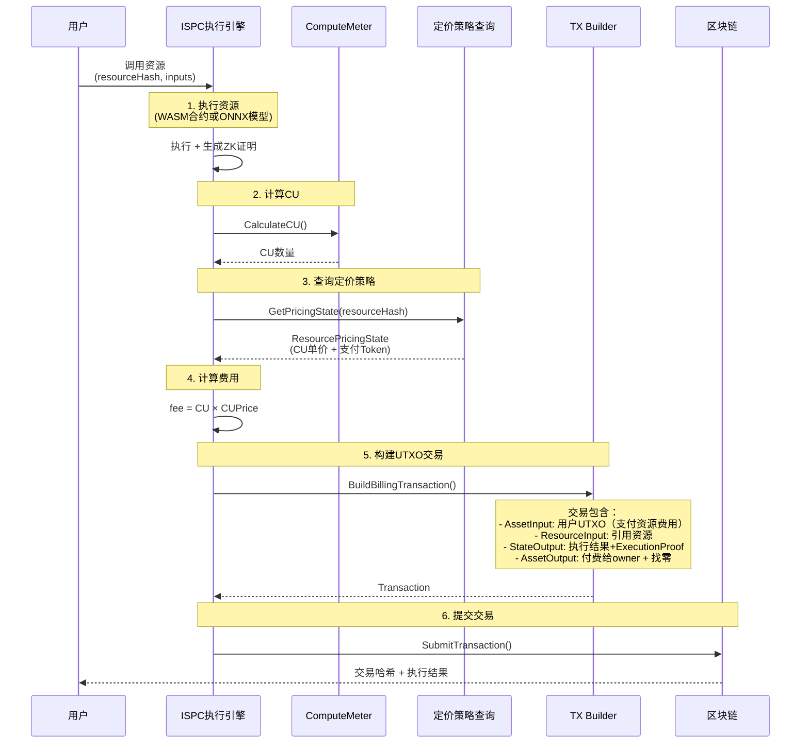
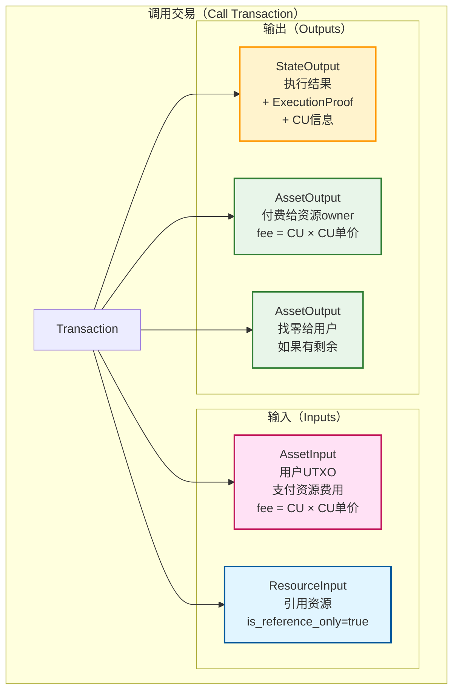
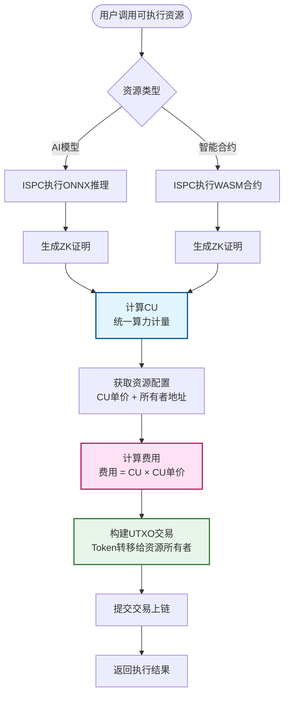

# WES 费用与经济模型

---

## 🎯 本章目的

本章系统说明 WES 的**费用模型与激励设计**，澄清几个关键本质：

- **用户视角**：  
  - 不需要理解或手动设置 Gas；  
  - 日常使用中只看到简单、可预期的「网络手续费」（主要发生在转账等少数操作上）；  
  - 部署合约、部署 AI 模型、绝大多数业务调用几乎没有成本（费用由业务方在后台通过赞助池等方式覆盖）。
- **协议视角**：  
  - 采用「**费用即激励（Fee as Incentive）**」的零增发模型；  
  - 交易手续费直接聚合为矿工激励，而不是依赖持续增发或额外区块奖励。
- **业务视角**：  
  - 通过**赞助池 + 合约自有代币**，业务方可以主动奖励矿工，维持网络与业务运行；  
  - 赞助池是业务层激励机制，**不是“代替用户付 Gas”**。

更高层的产品价值和场景，请参考：

- [产品总览](../overview.md) – 战略定位与核心能力  
- [核心价值与场景概览](./value-proposition.md)

---

## 👤 用户视角：只看到简单的「网络手续费」

在传统公链（如以太坊）中，用户必须理解并手动配置：

- `gasPrice` / `maxFee` / `priorityFee`
- `gasLimit`
- 合约复杂度越高、调用越复杂，Gas 成本越高（传统公链的情况）

这导致：

- 费用不可预期（网络拥堵时暴涨）  
- 使用门槛高（需要理解 Gas 模型）  
- 业务难以给出稳定的成本预估

在 **微迅链** 中，我们刻意把这套复杂度**从用户体验中抽离掉**：

- ✅ 用户在钱包或应用里看到的只是：  
  - 「这笔**转账**的网络手续费是多少」  
  - 调用合约方法或运行 AI 模型时，系统自动显示需要支付的 Token 数量（基于 CU × CU单价）
- ✅ 对用户而言：
  - **没有 Gas 概念，更没有 Gas 参数需要配置**  
  - 微迅链使用 **CU（Compute Units，计算单位）** 作为内部算力计量，用户无需理解
  - **合约和 AI 模型采用统一的经济模型**：部署时由资源所有者设置 CU→Token 映射，调用时按 CU 自动消费 Token
  - 合约部署、模型部署、业务调用**通常不单独收取用户费用**（费用由业务方在后台通过赞助池等方式覆盖）

可以简单理解为：

> **在微迅链上，用户只需要关心"转账要不要付一点手续费"，  
> 调用合约或运行 AI 模型时，系统会自动按部署时设置的 CU→Token 映射关系计算费用。**  
> 系统内部使用 CU 统一计量合约和 AI 模型的算力消耗，但用户无需面对这个概念。

---

## ⚙️ 协议视角：费用即激励（Fee as Incentive）

从协议视角看，WES 采用「**费用即激励**」的零增发模型：

- **不通过持续增发来奖励矿工**（零增发）  
- **所有交易手续费直接聚合为矿工激励**

---

## 🧪 对比：比特币 / 以太坊 / 微迅链（微迅链）

为了更直观地理解微迅链的经济模型，先看一个对比表：

| 体系 | 主要激励来源 | 计量单位 | 用户需要做什么 | 设计问题 | 微迅链的改进 |
|------|--------------|----------|----------------|----------|--------------|
| **比特币** | 区块奖励 + 交易手续费 | 无显式计算单位（隐含在难度 + 区块奖励中） | 无需设置 Gas，只需等待确认 | 通胀依赖区块奖励，长期需调参或减半；难以承载复杂业务 | 微迅链不依赖持续增发，采用费用即激励 + 业务级激励 |
| **以太坊** | Gas 费 + （部分链的）区块奖励 | Gas（按每条指令 / 操作计费） | 必须设置 `gasPrice` / `gasLimit`，理解 Gas 模型 | 用户体验复杂；费用不可预期；业务成本难以估算 | 微迅链将计算复杂度隐藏在 CU 内部计量中，用户只看到简单手续费 |
| **微迅链** | 网络手续费 + 赞助池激励 | **CU（Compute Units，计算单位） + 简单手续费** | 用户只需支付简单的网络手续费（主要在转账时），业务侧通过 CU 映射和赞助池处理算力成本 | 无须用户理解 Gas / CU；业务方可精细控制“算力 → 费用”的映射 | 统一的 CU 计量 + 部署时自定义定价 + 赞助池，实现低门槛与强激励 |

可以用一张简单的示意图来理解三者的差异：



- 在 **比特币** 中，矿工主要依赖**区块奖励**（+手续费）维持激励，长期需要面对减半与通胀/安全性的平衡问题。  
- 在 **以太坊** 中，用户必须理解 Gas 模型，并在每笔交易中配置 Gas 相关参数。  
- 在 **微迅链** 中：
  - **算力消耗统一用 CU 计量**（合约与 AI 模型都一样）；  
  - **CU 与 Token 的映射由合约/模型所有者在部署时定义**（部署时写入链上状态）；  
  - 最终的**费用 = CU × 单价**，以简单网络手续费 + 业务赞助池的方式呈现给用户与矿工。

下面分别从"CU 怎么算""CU 怎么变成钱"两个层面展开。

---

## 💰 核心机制：部署时设置 CU→Token 映射，调用时按 CU 消费 Token

这是微迅链经济模型的核心创新：**所有可执行资源（智能合约和 AI 模型）都采用统一的算力消费模型**。

### 🎯 核心原则

**微迅链不仅仅是传统区块链，更是 AI 原生的可验证计算平台**。无论是智能合约（WASM）还是 AI 模型（ONNX），都遵循相同的经济模型：

1. **部署时**：资源所有者（开发者/模型提供者）设置 **"多少 CU 需要消耗多少什么 Token"**
2. **调用时**：用户调用合约方法或运行推理模型时，系统自动计算 CU，并按部署时设置的映射关系消费对应的 Token

### 📊 三层架构模型

微迅链的算力计量与结算采用三层架构：



### 🔢 第一层：算力计量（CU 计算）

**CU（Compute Units，计算单位）** 是微迅链统一的算力计量单位，**合约和 AI 模型使用相同的 CU 计量标准**。

#### AI 模型推理的 CU 计算

```
CU = ModelComplexityFactor × InputDataFactor × TimeFactor

其中：
- ModelComplexityFactor：模型复杂度系数
  - 小型模型（<10MB）：1.0
  - 中型模型（10-100MB）：2.0
  - 大型模型（>100MB）：5.0
- InputDataFactor：输入数据量系数（基于输入张量的总元素数量）
- TimeFactor：执行时间系数（基于实际执行时间，毫秒）
```

#### 智能合约执行的 CU 计算

```
CU = ContractComplexityFactor × InputDataFactor × ExecutionTimeFactor × OperationFactor

其中：
- ContractComplexityFactor：合约复杂度系数
  - 小型合约（<10KB）：1.0
  - 中型合约（10-100KB）：2.0
  - 大型合约（>100KB）：5.0
- InputDataFactor：输入数据量系数（基于调用参数大小，字节数）
- ExecutionTimeFactor：执行时间系数（基于实际执行时间，毫秒）
- OperationFactor：操作复杂度系数
  - 基础操作：1.0
  - 存储操作：+0.5
  - 跨合约调用：+1.0
```

**关键特性**：
- ✅ **统一接口**：所有 ExecutionType（CONTRACT / AI_MODEL）都使用相同的 ComputeMeter 接口
- ✅ **ZK 友好**：CU 计算基于可证明指标，而非 wall-clock 时间
- ✅ **确定性**：相同输入必须产生相同的 CU 值

### 💵 第二层：定价策略（部署时设置）

**核心设计**：资源内容与定价策略分离，通过 EUTXO 组合在部署交易中锚定。

#### 部署交易结构



#### 定价配置说明

部署时，资源所有者需要设置以下定价信息：

- **资源标识**：资源的唯一标识（用于区分不同的合约或模型）
- **所有者地址**：接收 Token 的地址（用户支付的费用会转到这里）
- **支付代币**：用户调用时可以使用的代币类型（可以是合约代币）
- **CU 单价**：每个 CU 需要支付的代币数量（例如：0.001 Token / CU）
- **计费模式**：选择免费模式、固定费用模式或按 CU 计费模式

#### 部署示例

**示例 1：AI 模型部署（按 CU 计费模式）**

当 AI 模型所有者部署模型时，需要设置以下定价信息：

| 配置项 | 说明 | 示例值 |
|--------|------|--------|
| **资源标识** | 模型的唯一标识（content_hash） | ONNX 模型的哈希值 |
| **所有者地址** | 接收 Token 的地址 | 模型所有者的钱包地址 |
| **支付代币** | 用户调用时使用的代币 | 某个合约代币地址 |
| **CU 单价** | 每个 CU 需要支付的代币数量 | 0.001 Token / CU |
| **计费模式** | 计费方式 | 按 CU 计费 |

**示例 2：智能合约部署（按 CU 计费模式）**

当智能合约所有者部署合约时，需要设置以下定价信息：

| 配置项 | 说明 | 示例值 |
|--------|------|--------|
| **资源标识** | 合约的唯一标识（content_hash） | WASM 合约的哈希值 |
| **所有者地址** | 接收 Token 的地址 | 合约所有者的钱包地址 |
| **支付代币** | 用户调用时使用的代币 | 某个合约代币地址 |
| **CU 单价** | 每个 CU 需要支付的代币数量 | 0.0005 Token / CU |
| **计费模式** | 计费方式 | 按 CU 计费 |

**示例 3：免费模式**

资源所有者也可以选择免费模式，此时用户调用时不收费，但系统仍会记录 CU（用于统计和限流）：

| 配置项 | 说明 | 示例值 |
|--------|------|--------|
| **资源标识** | 资源的唯一标识 | 合约或模型的哈希值 |
| **所有者地址** | 资源所有者地址 | 所有者钱包地址 |
| **计费模式** | 计费方式 | 免费模式 |
| **免费期限** | （可选）免费期限 | 某个时间戳，到期后自动转为收费模式 |

**关键要点**：
- ✅ **部署时一次性设置**：CU→Token 映射关系在部署时写入链上状态（StateOutput）
- ✅ **完全自主定义**：资源所有者可以自由选择支付 Token 和 CU 单价
- ✅ **合约和模型一致**：无论是 WASM 合约还是 ONNX 模型，都使用相同的定价机制

### 💸 第三层：调用结算（调用时按 CU 消费 Token）

当用户调用合约方法或运行推理模型时，系统自动执行以下流程：



#### 费用计算逻辑

当用户调用资源时，系统会根据部署时设置的计费模式自动计算费用：

**免费模式（FREE）**：
- 用户无需支付任何费用
- 系统仍会记录 CU 消耗（用于统计和限流）

**按 CU 计费模式（CU_BASED）**：
- 费用计算公式：**费用 = CU 数量 × CU 单价**
- 例如：如果本次调用消耗了 100 CU，CU 单价为 0.001 Token/CU，则费用 = 100 × 0.001 = 0.1 Token
- 如果用户选择的支付代币不在资源支持的代币列表中，调用会失败

**固定费用模式（FIXED）**：
- 无论消耗多少 CU，都收取固定的费用
- 费用金额由资源所有者在部署时设定

#### 调用交易结构



### 🎯 统一算力模型：合约与 AI 模型的一致性

**核心洞察**：**AI 推理模型 = 可执行资源 = 消费 Token 获得算力**  
**智能合约 = 可执行资源 = 消费 Token 获得算力**

两者本质相同，采用**完全一致的算力消费模型**：



**统一设计原则**：
1. ✅ **统一计量单位**：所有可执行资源都用 CU 计量算力
2. ✅ **统一定价方式**：资源所有者设置 CU 单价
3. ✅ **统一支付方式**：Token 支付给资源所有者
4. ✅ **统一用户体验**：用户每次调用都能看到 CU 和费用

---

## ⚙️ 协议视角：费用即激励（Fee as Incentive）

从协议视角看，WES 采用「**费用即激励**」的零增发模型：

- **不通过持续增发来奖励矿工**（零增发）  
- **所有交易手续费直接聚合为矿工激励**

### 1. 手续费的来源

在 WES 中，手续费的来源主要有两类：

- **L1 基础类操作**：  
  - 例如链上资产转账、基础链级别的操作  
  - 这类操作通常会收取一笔**简单、固定规则的网络手续费**
- **可执行资源调用费用**：  
  - 用户调用智能合约方法或运行 AI 模型时，按 **CU × CU单价** 支付 Token 给资源所有者
  - 这部分费用由资源所有者在部署时自主定义（见上方"部署时设置 CU→Token 映射"章节）

### 2. 手续费的去向：费用即激励

无论手续费从何而来，其走向是统一的：

- **统一进入费用池 → 汇聚为矿工收入**
- 不引入额外的"区块补贴"或"额外增发"

这带来几件重要的事情：

- 📉 **通胀可控 / 可为零**：无需通过增发代币来"补贴"矿工  
- 🔄 **经济模型更透明**：用户与业务方可以直接看到「自己支付的费用是如何变成矿工激励的」  
- 🧮 **成本与价值闭环清晰**：谁发起了交易，谁就为这笔交易对应的链上资源付费

---

## 🏭 业务视角：赞助池与合约代币激励

业务方的核心诉求有两点：

1. **终端用户体验尽可能“免手续费 / 无感知”**  
2. **网络与算力必须有稳定激励，否则业务跑不动**

为此，WES 在协议之上提供了业务级的激励工具：

### 1. 赞助池（Sponsor Pool）

**定义（业务视角）**：

- 由业务方 / 协议方**主动注入资产**形成的奖励池  
- 用于在用户使用业务时，**向参与相关计算与记账的矿工发放奖励**

**几个关键本质：**

- 赞助池中的资产**通常是业务自身发行或绑定的合约代币**  
- 它的作用是**奖励矿工 / 节点为该业务提供算力与服务**  
- 它**不是**"帮用户代付 Gas"的钱包（微迅链本身就没有 Gas 概念），而是一种**业务激励预算**

可以将其类比为：

> “我这个业务愿意为每一笔相关交易额外支付多少奖励，  
> 来换取更好的网络服务质量与确认速度。”

### 2. 与传统 “Gas 代付” 的区别

传统公链里的「Gas 代付」通常指：

- 仍然有 Gas 模型（按运算步数计费）  
- 只是把“谁出钱”的主体从用户换成了某个赞助方

而在微迅链中：

- **微迅链本身就没有 Gas 概念**，使用 CU（Compute Units，计算单位）作为内部算力计量
- **用户本来就不直接面对 Gas 模型**  
- 赞助池是业务级的**额外激励渠道**，而不是对底层 Gas 模型的"遮罩"

简单说：

- 在微迅链里，我们**没有 Gas 概念**，使用 CU（Compute Units，计算单位）作为内部算力计量，  
- 再通过赞助池 + 合约代币，为业务提供“想多给就多给”的激励空间。

---

## 💱 多 Token 支付与成本结构

为了降低门槛，WES 在费用与激励的具体实现上还做了两件事：

- **多 Token 支付**：  
  - 手续费不被绑定在某个单一平台币上  
  - 支持使用多种符合条件的 Token 支付网络手续费
- **成本结构优化（ISPC 带来的副作用）**：  
  - 传统链：N 个节点重复执行 → 成本随节点数线性放大  
  - WES：1 个节点执行 + N–1 个节点验证 →  
    - 执行成本一次性  
    - 验证成本远低于执行  
  - 这使得**同等安全性下，整体成本显著下降**，为“低费甚至业务侧全包”创造空间

这两点配合起来，使得：

- 用户侧体验可以长期维持在「简单、可预期的费用模型」  
- 业务侧可以通过代币设计与赞助池，构造更丰富的商业模式（挖矿 / 分润 / 回购销毁 等）

---

## 🧩 与其它文档的关系

- **高层定位与价值**：  
  - [产品总览](../overview.md) – “灵活费用机制”作为核心能力之一  
  - [市场定位与竞争分析](./positioning.md) – 与其他公链在费用模型上的对比
- **术语与概念**：  
  - [`architecture/glossary.md`](../architecture/glossary.md) – “费用即激励 / Gas / 矿工”等术语的简明定义（本章是其详细展开）
- **使用与排障**：  
  - [`troubleshooting/faq.md`](../troubleshooting/faq.md) – 只回答「为什么我看到的费用是这样」这类操作性问题，并指回本章

后续如有新的经济机制（例如更复杂的二级市场激励），建议都在本章集中阐述，再由其他文档以**一两句话 + 链接**的方式引用，避免多点重复解释、增加维护成本。


