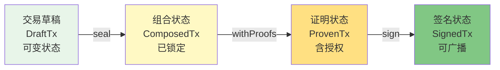
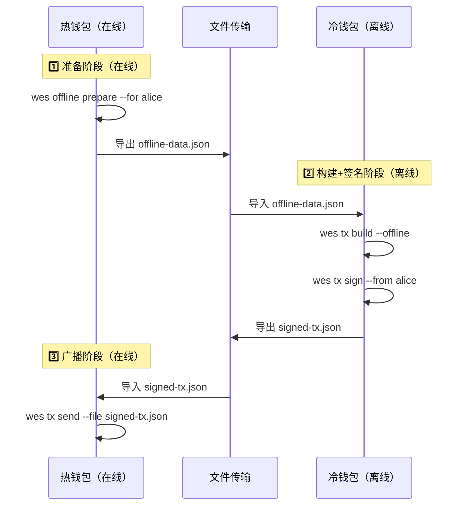

# WES CLI 参考

---

## 🎯 概述

WES 命令行工具（CLI）是面向节点运维人员、高级用户和开发者的命令行接口。

**设计定位**：
- ✅ 节点运维 + 基础操作
- ✅ 支持离线签名模式
- ✅ 支持状态锚定查询
- ✅ 支持重组安全订阅
- ✅ Type-State 交易构建机制

**架构原则**：
- 客户端签名模式（零信任架构）
- 离线能力支持
- 区块链原生特性（重组安全、状态锚定、SPV验证）

---

## 📚 命令分类

### 交易操作

#### `wes tx build`

构建交易草稿（DraftTx）。

**基本用法**：
```bash
wes tx build transfer --from alice --to bob --amount 100
```

**离线模式**：
```bash
wes tx build --offline --data offline.json
```

**说明**：
- 创建可变状态的交易草稿
- 支持在线和离线两种模式
- 离线模式需要预先准备离线数据（`wes offline prepare`）

#### `wes tx seal`

将交易草稿密封为组合状态（ComposedTx）。

**用法**：
```bash
wes tx seal --tx draft.json
```

**说明**：
- DraftTx → ComposedTx 状态转换
- 计算交易ID，锁定输入输出

#### `wes tx sign`

签名交易。

**用法**：
```bash
wes tx sign --tx composed.json --from alice
```

**说明**：
- ProvenTx → SignedTx 状态转换
- 使用本地密钥库签名
- 完全离线操作

#### `wes tx send`

提交已签名交易。

**用法**：
```bash
wes tx send --file signed.json
```

**说明**：
- 广播已签名交易到节点
- 需要在线连接

### 链查询

#### `wes chain info`

查询链信息。

**用法**：
```bash
wes chain info
```

**说明**：
- 返回链ID和同步状态
- 使用 JSON-RPC `wes_chainId` 和 `wes_syncing`

#### `wes block get`

查询区块信息。

**用法**：
```bash
wes block get 12345
wes block get 12345 --at-height 12000  # 状态锚定查询
```

**说明**：
- 支持按高度或哈希查询
- 支持状态锚定查询（`--at-height` / `--at-hash`）

### 账户管理

#### `wes account balance`

查询账户余额。

**用法**：
```bash
wes account balance 0x123...
wes account balance 0x123... --at-height 12000  # 状态锚定查询
```

**说明**：
- 使用 JSON-RPC `wes_getBalance`
- 支持状态锚定查询

#### `wes account utxo`

查询账户 UTXO。

**用法**：
```bash
wes account utxo 0x123...
```

**说明**：
- 使用 JSON-RPC `wes_getUTXO`
- 返回账户的所有未花费输出

### 节点管理

#### `wes node health`

节点健康检查（Liveness）。

**用法**：
```bash
wes node health
```

**说明**：
- 使用 REST API `/api/v1/health/live`
- 仅检查进程是否响应

#### `wes node ready`

节点就绪检查（Readiness）。

**用法**：
```bash
wes node ready
```

**说明**：
- 使用 REST API `/api/v1/health/ready`
- 检查节点是否已同步且可对外服务

#### `wes node peers`

查询节点连接列表。

**用法**：
```bash
wes node peers
```

**说明**：
- 使用 REST API `/api/v1/node/peers`
- 返回当前连接的节点信息

### 离线操作

#### `wes offline prepare`

准备离线数据。

**用法**：
```bash
wes offline prepare --for alice
```

**说明**：
- 导出离线操作所需的数据
- 包含 UTXO 列表、费率建议、区块高度等
- 数据包含签名，防止篡改

**离线数据内容**：
- UTXO 列表
- 费率建议
- 区块高度/哈希（可验证新鲜度）
- 数据签名（防篡改）

---

## 🔧 Type-State 交易构建流程

WES CLI 采用 Type-State 模式，用类型系统表达交易状态机：



**状态说明**：

| 状态 | 命令 | 可变性 | 说明 |
|------|------|--------|------|
| **DraftTx** | `wes tx build` | ✅ 可变 | 可以添加输入/输出 |
| **ComposedTx** | `wes tx seal` | ❌ 不可变 | 交易ID已计算，输入输出已锁定 |
| **ProvenTx** | `wes tx sign` (准备) | ❌ 不可变 | 包含解锁证明 |
| **SignedTx** | `wes tx sign` (完成) | ❌ 不可变 | 包含签名，可广播 |

**完整流程示例**：
```bash
# 1. 构建交易草稿
wes tx build transfer --from alice --to bob --amount 100 > draft.json

# 2. 密封交易
wes tx seal --tx draft.json > composed.json

# 3. 签名交易
wes tx sign --tx composed.json --from alice > signed.json

# 4. 广播交易
wes tx send --file signed.json
```

---

## 🔐 离线签名模式

WES CLI 支持完整的离线签名流程，适合冷钱包场景：

### 三阶段流程



### 离线能力矩阵

| 阶段 | 离线能力 | 数据依赖 | 验收标准 |
|-----|---------|---------|---------|
| **准备** | ❌ 需要在线 | 查询 UTXO/余额/费率 | 导出完整离线数据 |
| **构建** | ✅ 完全离线 | 离线数据 + 本地keystore | 无网络请求 |
| **签名** | ✅ 完全离线 | 本地私钥 | 无网络请求 |
| **广播** | ❌ 需要在线 | 已签名交易 | sendRawTransaction |

---

## 🌐 协议选择策略

CLI 命令根据用途自动选择最合适的协议：

| 命令类型 | 示例 | 首选协议 | 降级协议 | 对应 API |
|---------|------|---------|---------|---------|
| **链查询** | `wes chain info`<br/>`wes block get 12345` | JSON-RPC | → REST | `wes_chainId`<br/>`wes_getBlockByHeight` |
| **账户管理** | `wes account balance 0x...`<br/>`wes account utxo 0x...` | JSON-RPC | → REST | `wes_getBalance`<br/>`wes_getUTXO` |
| **交易提交** | `wes tx send` | JSON-RPC | → REST | `wes_sendRawTransaction` |
| **健康检查** | `wes node health`<br/>`wes node ready` | REST | → JSON-RPC | `/api/v1/health/liveness`<br/>`/api/v1/health/readiness` |
| **节点运维** | `wes node peers`<br/>`wes node sync` | REST | → JSON-RPC | `/api/v1/node/peers`<br/>`/api/v1/node/sync` |
| **实时订阅** | `wes subscribe newHeads` | WebSocket | → 不支持 | `wes_subscribe` |

---

## 🔒 安全模型

### 客户端签名模式

- ✅ **零信任架构**：CLI 不信任节点，所有签名在客户端完成
- ✅ **私钥不出本地**：私钥永远不离开本地密钥库
- ✅ **离线签名支持**：支持完全离线的签名流程

### 密钥管理

- **密钥库位置**：`~/.wes/keystore/`
- **密钥格式**：加密存储，需要密码解锁
- **助记词支持**：支持 BIP39 助记词导入/导出

---

## 📋 配置

### 配置文件位置

- **Linux/macOS**：`~/.wes/config.yaml`
- **Windows**：`%APPDATA%\wes\config.yaml`

### 配置示例

```yaml
# 节点连接配置
node:
  rpc_url: "http://localhost:8545"
  rest_url: "http://localhost:8080/api/v1"
  ws_url: "ws://localhost:8545"

# 默认账户
account:
  default_account: "alice"

# 密钥库路径
wallet:
  keystore_path: "~/.wes/keystore"
```

---

## 📚 相关文档

- [API 参考](../api/index.md) - API 接口文档
- [配置参考](../config/index.md) - 配置字段说明
- [CLI 架构设计](../../../_dev/architecture/cli.md) - CLI 完整架构规范

---

**相关文档**：
- [产品总览](../../overview.md) - 了解 WES 是什么、核心价值、应用场景
- [快速开始](../../tutorials/quickstart/) - 快速上手 WES
