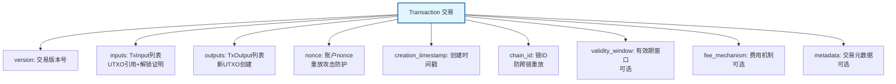
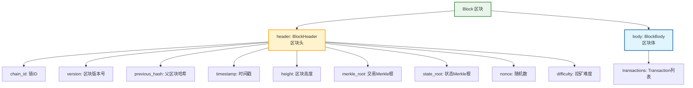
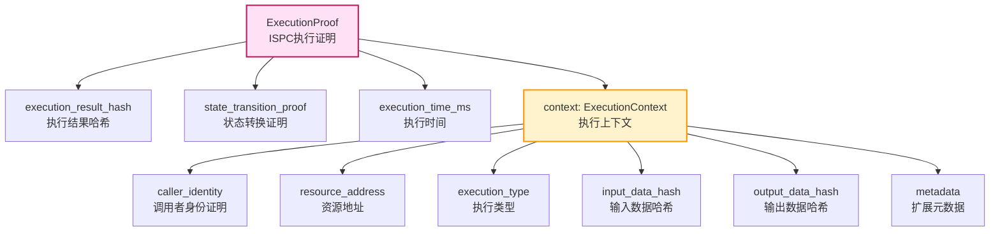

# WES 数据格式规范

---

## 🎯 概述

本文档说明 WES 系统中使用的核心数据格式，基于 Protocol Buffers 定义。

**数据格式来源**：
- 所有数据结构定义在 `pb/blockchain/block/transaction/transaction.proto` 和 `pb/blockchain/block/block.proto`
- 使用 Protocol Buffers 3.0 语法
- 支持多种编程语言的代码生成

---

## 📋 核心数据结构

### Transaction（交易）

**定义位置**：`pb/blockchain/block/transaction/transaction.proto`

**核心结构**：

**关键字段**：

| 字段 | 类型 | 必需 | 说明 |
|------|------|------|------|
| `version` | uint32 | ✅ | 交易版本号 |
| `inputs` | repeated TxInput | ✅ | 交易输入列表（UTXO引用+解锁证明） |
| `outputs` | repeated TxOutput | ✅ | 交易输出列表（新UTXO创建） |
| `nonce` | uint64 | ✅ | 账户nonce（重放攻击防护） |
| `creation_timestamp` | uint64 | ✅ | 交易创建时间戳 |
| `chain_id` | bytes | ✅ | 链ID（防跨链重放攻击） |
| `validity_window` | oneof | ❌ | 有效期窗口（时间/高度） |
| `fee_mechanism` | oneof | ❌ | 费用机制（默认UTXO差额） |
| `metadata` | TransactionMetadata | ❌ | 交易元数据 |

**EUTXO 三层输出模型**：

| 输出类型 | 用途 | 说明 |
|---------|------|------|
| **AssetOutput** | 价值载体 | 创建经济价值权利（转账、支付） |
| **ResourceOutput** | 能力载体 | 创建计算能力权利（合约/模型部署） |
| **StateOutput** | 证据载体 | 创建历史证据权利（执行结果记录） |

---

### Block（区块）

**定义位置**：`pb/blockchain/block/block.proto`

**核心结构**：

**关键字段**：

| 字段 | 类型 | 说明 |
|------|------|------|
| `header` | BlockHeader | 区块头（元数据和哈希根） |
| `body` | BlockBody | 区块体（交易列表） |

**BlockHeader 字段**：

| 字段 | 类型 | 说明 |
|------|------|------|
| `chain_id` | uint64 | 链ID（防止跨链重放攻击） |
| `version` | uint64 | 区块版本号 |
| `previous_hash` | bytes | 父区块哈希 |
| `timestamp` | uint64 | 区块生成时间戳 |
| `height` | uint64 | 区块高度 |
| `merkle_root` | bytes | 交易Merkle树根 |
| `state_root` | bytes | 状态Merkle根（可选） |
| `nonce` | bytes | 随机数（PoW共识） |
| `difficulty` | uint64 | 挖矿难度 |

---

### ExecutionProof（ISPC执行证明）

**定义位置**：`pb/blockchain/block/transaction/transaction.proto`

**核心结构**：

**关键字段**：

| 字段 | 类型 | 说明 |
|------|------|------|
| `execution_result_hash` | bytes | 执行结果哈希（32字节SHA-256） |
| `state_transition_proof` | bytes | 状态转换证明（Merkle证明） |
| `execution_time_ms` | uint64 | 实际执行时间（毫秒） |
| `context` | ExecutionContext | 执行上下文 |

**ExecutionContext 字段**：

| 字段 | 类型 | 说明 |
|------|------|------|
| `caller_identity` | IdentityProof | 调用者身份证明（密码学签名） |
| `resource_address` | bytes | 资源地址（20字节，合约/模型地址） |
| `execution_type` | ExecutionType | 执行类型（CONTRACT/AI_MODEL） |
| `input_data_hash` | bytes | 输入数据哈希（32字节SHA-256，隐私保护） |
| `output_data_hash` | bytes | 输出数据哈希（32字节SHA-256，隐私保护） |
| `metadata` | map<string, bytes> | 扩展元数据（如 compute_units、method_name 等） |

**执行类型（ExecutionType）**：

| 值 | 说明 |
|----|------|
| `EXECUTION_TYPE_CONTRACT` | 智能合约（WASM） |
| `EXECUTION_TYPE_AI_MODEL` | AI模型（ONNX） |

---

### TxInput（交易输入）

**核心结构**：

| 字段 | 类型 | 说明 |
|------|------|------|
| `out_point` | OutPoint | UTXO引用（tx_hash + output_index） |
| `is_reference_only` | bool | 是否只读引用（true=引用不消费，false=消费） |
| `unlocking_proof` | oneof | 解锁证明（SingleKeyProof/MultiKeyProof/ExecutionProof等） |

**两种引用模式**：

| 模式 | `is_reference_only` | 用途 | 生命周期 |
|------|---------------------|------|---------|
| **消费引用** | `false` | 转账、支付手续费 | UTXO被消费，从集合中移除 |
| **只读引用** | `true` | 合约调用、模型推理 | UTXO保持在集合中，支持并发访问 |

---

### TxOutput（交易输出）

**EUTXO 三层输出**：

#### AssetOutput（资产输出）

| 字段 | 类型 | 说明 |
|------|------|------|
| `amount` | uint64 | 金额 |
| `token_reference` | TokenReference | 代币引用 |
| `locking_conditions` | repeated LockingCondition | 锁定条件 |

#### ResourceOutput（资源输出）

| 字段 | 类型 | 说明 |
|------|------|------|
| `resource` | Resource | 资源内容（WASM/ONNX等） |
| `locking_conditions` | repeated LockingCondition | 锁定条件 |

#### StateOutput（状态输出）

| 字段 | 类型 | 说明 |
|------|------|------|
| `state_data` | bytes | 状态数据 |
| `zk_proof` | bytes | ZK证明（可选） |
| `locking_conditions` | repeated LockingCondition | 锁定条件 |

---

## 🔐 锁定条件（LockingCondition）

**7种标准锁定方式**：

| 类型 | 说明 | 解锁方式 |
|------|------|---------|
| `PubkeyLock` | 公钥锁定 | SingleKeyProof |
| `HashLock` | 哈希锁定 | HashProof |
| `MultiSigLock` | 多重签名锁定 | MultiKeyProof |
| `TimeLock` | 时间锁定 | TimeProof |
| `HeightLock` | 高度锁定 | HeightProof |
| `ScriptLock` | 脚本锁定 | ScriptProof |
| `ContractLock` | 合约锁定 | ExecutionProof |

---

## 📊 数据格式特点

### 1. EUTXO 三层架构

- **AssetOutput**：价值载体（经济价值权利）
- **ResourceOutput**：能力载体（计算能力权利）
- **StateOutput**：证据载体（历史证据权利）

### 2. ISPC 执行证明

- **ExecutionProof**：通用执行证明，适用于合约和AI模型
- **隐私保护**：输入/输出数据使用哈希，原始数据不在链上
- **ZK友好**：支持零知识证明验证

### 3. 引用模式

- **消费引用**（`is_reference_only=false`）：UTXO被消费
- **只读引用**（`is_reference_only=true`）：UTXO被引用但不消费

---

## 📚 相关文档

- [API 参考](../api/index.md) - API 接口文档
- [Transaction Proto 定义](../../../pb/blockchain/block/transaction/transaction.proto) - 完整交易结构定义
- [Block Proto 定义](../../../pb/blockchain/block/block.proto) - 完整区块结构定义

---

**相关文档**：
- [产品总览](../../overview.md) - 了解 WES 是什么、核心价值、应用场景
- [EUTXO 组件](../../components/eutxo.md) - EUTXO 模型详解
- [ISPC 组件](../../components/ispc.md) - ISPC 可验证计算详解
