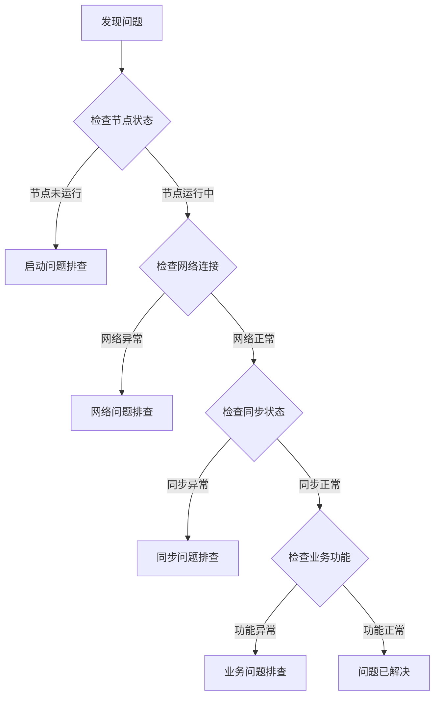

# WES 运维问题排查

---

## 🎯 故障排查概览

本文档帮助您解决 WES 节点运维中的常见问题，提供系统化的排查方法和解决方案。

**排查原则**：
- 🔍 **从现象到根因**：先观察现象，再逐步深入排查
- 📊 **数据驱动**：基于日志、指标、状态信息诊断
- 🔄 **分层排查**：从基础设施层 → 网络层 → 应用层 → 业务层

---

## 🔍 故障排查流程

### 标准排查流程



---

## ❓ 常见问题与排查

### 问题 1：节点无法启动

**现象**：
- 启动命令执行后立即退出
- 启动后进程消失
- 启动时报错

**排查步骤**：

#### 步骤 1：检查端口占用

```bash
# 检查 API 端口（默认 8080）
lsof -i :8080
# 或
netstat -tulpn | grep 8080

# 检查 P2P 端口（默认 8081）
lsof -i :8081
# 或
netstat -tulpn | grep 8081
```

**解决方案**：
- 如果端口被占用，停止占用进程或修改配置中的端口号
- 查找占用进程：`lsof -i :8080 | grep LISTEN`
- 终止进程：`kill -9 <PID>`

#### 步骤 2：检查配置文件

```bash
# 验证配置文件格式
wes node config validate

# 检查配置文件是否存在
ls -la ~/.wes/config.yaml
# 或
ls -la ./configs/development/config.json

# 检查配置文件内容（JSON/YAML 格式）
cat ~/.wes/config.yaml | yq .
# 或
cat ./configs/development/config.json | jq .
```

**常见配置错误**：
- JSON/YAML 格式错误（缺少逗号、引号不匹配）
- 路径不存在（`data_path`、`log_path` 等）
- 端口号超出范围（0-65535）
- 网络配置错误（`network_id`、`chain_id` 不匹配）

**解决方案**：
- 使用配置验证命令检查：`wes node config validate`
- 参考 [配置参考](../reference/config/) 检查配置项
- 使用默认配置测试：`wes node start --config default`

#### 步骤 3：检查数据目录权限

```bash
# 检查数据目录是否存在
ls -la ./data

# 检查目录权限
stat ./data

# 检查磁盘空间
df -h ./data
```

**常见权限问题**：
- 数据目录不存在
- 数据目录权限不足（需要读写权限）
- 磁盘空间不足

**解决方案**：
```bash
# 创建数据目录
mkdir -p ./data

# 设置正确的权限
chmod 755 ./data

# 检查磁盘空间（至少需要 10GB）
df -h
```

#### 步骤 4：查看启动日志

```bash
# 查看标准输出/错误
wes node start 2>&1 | tee node.log

# 查看日志文件
tail -f ./logs/wes.log

# 查看错误日志
tail -f ./logs/error.log

# 查看最近的错误
grep -i error ./logs/wes.log | tail -20
```

**常见启动错误**：
- `bind: address already in use` - 端口被占用
- `permission denied` - 权限不足
- `no such file or directory` - 文件/目录不存在
- `invalid configuration` - 配置错误

---

### 问题 2：节点无法连接到网络

**现象**：
- 节点启动成功但无法发现其他节点
- `wes node peers` 返回空列表
- 节点孤立运行

**排查步骤**：

#### 步骤 1：检查节点状态

```bash
# 检查节点基本信息
wes node info

# 检查节点运行状态
wes node status

# 检查节点健康状态
wes node health
```

**预期输出**：
```json
{
  "status": "healthy",
  "peer_count": 5,
  "is_syncing": false,
  "current_height": 12345
}
```

#### 步骤 2：检查网络连接

```bash
# 检查本地网络接口
ip addr show
# 或
ifconfig

# 测试网络连通性
ping 8.8.8.8

# 检查 DNS 解析
nslookup example.com
```

#### 步骤 3：检查防火墙配置

```bash
# Ubuntu/Debian - 检查 UFW
sudo ufw status
sudo ufw status verbose

# CentOS/RHEL - 检查 firewalld
sudo firewall-cmd --list-all

# 检查 iptables 规则
sudo iptables -L -n

# 检查端口是否开放
sudo netstat -tulpn | grep 8081
```

**解决方案**：
```bash
# Ubuntu/Debian - 开放端口
sudo ufw allow 8080/tcp
sudo ufw allow 8081/tcp
sudo ufw reload

# CentOS/RHEL - 开放端口
sudo firewall-cmd --permanent --add-port=8080/tcp
sudo firewall-cmd --permanent --add-port=8081/tcp
sudo firewall-cmd --reload
```

#### 步骤 4：检查节点发现配置

```bash
# 检查节点配置
wes node config show | grep -i bootstrap
wes node config show | grep -i discovery

# 检查 Bootstrap 节点列表
cat ~/.wes/config.yaml | grep -A 5 bootstrap
```

**常见问题**：
- Bootstrap 节点列表为空
- Bootstrap 节点地址错误
- 节点发现功能被禁用

**解决方案**：
- 配置有效的 Bootstrap 节点
- 检查 Bootstrap 节点是否可达：`ping <bootstrap-ip>`
- 启用节点发现：`discovery.enabled: true`

#### 步骤 5：手动连接节点

```bash
# 手动连接到指定节点
wes node connect <peer-address>

# 查看连接状态
wes node peers

# 检查连接日志
tail -f ./logs/wes.log | grep -i connect
```

---

### 问题 3：区块同步失败

**现象**：
- 节点高度长时间不增长
- 同步进度卡在某个高度
- 同步错误日志频繁出现

**排查步骤**：

#### 步骤 1：检查同步状态

```bash
# 检查链状态
wes chain status

# 检查同步进度
wes node status | grep -i sync

# 检查当前高度和网络高度
wes chain height
```

**预期输出**：
```json
{
  "current_height": 1000,
  "network_height": 1500,
  "sync_progress": 66.67,
  "is_syncing": true
}
```

#### 步骤 2：检查网络连接

```bash
# 检查节点连接数
wes node peers | wc -l

# 检查节点连接质量
wes node peers | grep -i "connected\|disconnected"

# 检查网络延迟
wes node status | grep -i latency
```

**问题诊断**：
- 连接数 < 3：网络连接不足，可能导致同步慢
- 连接数 = 0：完全孤立，无法同步
- 延迟 > 1000ms：网络质量差，影响同步速度

#### 步骤 3：检查存储空间

```bash
# 检查磁盘使用情况
df -h

# 检查数据目录大小
du -sh ./data

# 检查区块数据大小
du -sh ./data/blocks
```

**解决方案**：
- 如果磁盘空间不足，清理旧数据或扩容
- 检查是否有大文件占用空间：`find ./data -type f -size +1G`

#### 步骤 4：检查数据完整性

```bash
# 检查区块数据完整性
wes chain verify

# 检查状态根一致性
wes chain verify-state

# 检查最近的区块
wes chain block latest
```

**常见问题**：
- 区块数据损坏
- 状态根不一致
- 区块哈希验证失败

**解决方案**：
```bash
# 如果数据损坏，重置同步
wes chain reset --sync

# 从指定高度重新同步
wes chain reset --height 1000

# 完全重置（谨慎使用）
wes chain reset --all
```

#### 步骤 5：检查同步日志

```bash
# 查看同步相关日志
tail -f ./logs/wes.log | grep -i sync

# 查看同步错误
grep -i "sync.*error\|sync.*fail" ./logs/wes.log | tail -20

# 查看同步性能指标
wes node metrics | grep sync
```

---

### 问题 4：交易提交失败

**现象**：
- 交易提交后立即返回错误
- 交易提交成功但长时间未确认
- 交易被拒绝

**排查步骤**：

#### 步骤 1：检查交易池状态

```bash
# 检查交易池状态
wes txpool status

# 检查交易池大小
wes node status | grep -i txpool

# 检查待处理交易数
wes txpool pending
```

**预期输出**：
```json
{
  "pending": 100,
  "queued": 50,
  "max_size": 10000
}
```

**问题诊断**：
- `pending` 接近 `max_size`：交易池可能已满
- `queued` 持续增长：交易处理速度跟不上提交速度

#### 步骤 2：检查交易格式

```bash
# 验证交易格式
wes tx validate <tx-hash>

# 检查交易详情
wes tx get <tx-hash>

# 检查交易状态
wes tx status <tx-hash>
```

**常见交易错误**：
- `invalid signature` - 签名无效
- `insufficient balance` - 余额不足
- `invalid nonce` - Nonce 错误
- `transaction too large` - 交易过大

#### 步骤 3：检查账户余额

```bash
# 检查账户余额
wes account balance <address>

# 检查账户 UTXO
wes account utxo <address>

# 检查账户交易历史
wes account history <address>
```

**解决方案**：
- 如果余额不足，需要先充值或等待其他交易确认
- 检查 UTXO 是否被锁定：`wes account utxo <address> | grep locked`

#### 步骤 4：检查网络和共识状态

```bash
# 检查节点是否同步
wes chain status | grep syncing

# 检查共识状态
wes chain status | grep consensus

# 检查最新区块时间
wes chain block latest | grep timestamp
```

**问题诊断**：
- 如果节点未同步，交易可能无法被打包
- 如果共识异常，区块生产可能暂停

---

### 问题 5：节点频繁崩溃

**现象**：
- 节点运行一段时间后自动退出
- 日志中出现 panic 或 fatal 错误
- 内存占用持续增长后崩溃

**排查步骤**：

#### 步骤 1：检查系统资源

```bash
# 检查内存使用
free -h

# 检查 CPU 使用
top -p $(pgrep wes)

# 检查磁盘 I/O
iostat -x 1

# 检查系统负载
uptime
```

**问题诊断**：
- 内存不足（OOM）：`dmesg | grep -i "out of memory"`
- CPU 100%：可能是死循环或计算密集型任务
- 磁盘 I/O 高：可能是存储性能瓶颈

#### 步骤 2：检查崩溃日志

```bash
# 查看系统日志
sudo journalctl -u wes -n 100

# 查看崩溃堆栈
grep -i "panic\|fatal" ./logs/wes.log | tail -20

# 查看错误日志
tail -100 ./logs/error.log
```

**常见崩溃原因**：
- 内存泄漏导致 OOM
- 并发访问冲突（race condition）
- 空指针引用（nil pointer）
- 数组越界（index out of range）

#### 步骤 3：检查配置和资源限制

```bash
# 检查进程资源限制
ulimit -a

# 检查文件描述符限制
ulimit -n

# 检查配置中的资源限制
cat ~/.wes/config.yaml | grep -i "limit\|max\|memory"
```

**解决方案**：
```bash
# 增加文件描述符限制
ulimit -n 65535

# 增加内存限制（如果使用 systemd）
# 编辑 systemd service 文件，添加：
# LimitNOFILE=65535
# MemoryLimit=8G
```

---

### 问题 6：API 请求超时或失败

**现象**：
- API 请求返回超时错误
- API 响应时间过长
- API 返回 5xx 错误

**排查步骤**：

#### 步骤 1：检查节点健康状态

```bash
# 检查节点健康
curl http://localhost:8080/api/v1/health/liveness

# 检查节点就绪状态
curl http://localhost:8080/api/v1/health/readiness

# 检查节点信息
curl http://localhost:8080/api/v1/node/info
```

#### 步骤 2：检查 API 服务状态

```bash
# 检查 API 端口监听
netstat -tulpn | grep 8080

# 检查 API 进程
ps aux | grep wes | grep api

# 检查 API 日志
tail -f ./logs/api.log
```

#### 步骤 3：检查请求负载

```bash
# 检查当前请求数
wes node metrics | grep -i "request\|api"

# 检查请求队列
wes node status | grep -i queue

# 检查响应时间
wes node metrics | grep -i "latency\|duration"
```

**解决方案**：
- 如果请求队列过长，考虑增加 API 并发处理能力
- 如果响应时间过长，检查底层存储和网络性能
- 如果频繁超时，检查超时配置：`api.timeout`

---

## 📊 监控与诊断工具

### 节点状态监控

```bash
# 实时监控节点状态
watch -n 1 'wes node status'

# 监控节点指标
wes node metrics

# 监控链状态
watch -n 1 'wes chain status'
```

### 日志分析

```bash
# 实时查看日志
tail -f ./logs/wes.log

# 查看错误日志
tail -f ./logs/error.log

# 搜索特定错误
grep -i "error\|fail\|panic" ./logs/wes.log | tail -50

# 按时间范围查看日志
grep "2024-01-15 10:" ./logs/wes.log

# 统计错误类型
grep -i error ./logs/wes.log | awk '{print $NF}' | sort | uniq -c | sort -rn
```

### 性能分析

```bash
# 检查系统资源使用
htop

# 检查网络连接
netstat -an | grep ESTABLISHED | wc -l

# 检查磁盘 I/O
iostat -x 1 5

# 检查内存使用
free -h && ps aux --sort=-%mem | head -10
```

---

## 🔧 常见运维操作

### 节点重启

```bash
# 优雅停止节点
wes node stop

# 等待进程完全退出
sleep 5

# 检查进程是否已退出
ps aux | grep wes

# 重新启动节点
wes node start
```

### 数据备份

```bash
# 备份数据目录
tar -czf wes-backup-$(date +%Y%m%d).tar.gz ./data

# 备份配置文件
cp ~/.wes/config.yaml ~/.wes/config.yaml.backup

# 备份日志（可选）
tar -czf wes-logs-$(date +%Y%m%d).tar.gz ./logs
```

### 数据恢复

```bash
# 停止节点
wes node stop

# 恢复数据目录
tar -xzf wes-backup-20240115.tar.gz

# 恢复配置文件
cp ~/.wes/config.yaml.backup ~/.wes/config.yaml

# 重新启动节点
wes node start
```

### 日志清理

```bash
# 清理旧日志（保留最近 7 天）
find ./logs -name "*.log" -mtime +7 -delete

# 压缩旧日志
find ./logs -name "*.log" -mtime +3 -exec gzip {} \;

# 清理错误日志（谨慎操作）
# find ./logs -name "error.log" -size +100M -exec truncate -s 0 {} \;
```

---

## 📚 相关文档

- [性能问题](./performance.md) - 性能相关问题排查
- [通用 FAQ](./faq.md) - 通用常见问题
- [部署指南](../tutorials/deployment/) - 部署配置说明
- [CLI 参考](../reference/cli/) - 命令行工具文档
- [配置参考](../reference/config/) - 配置字段说明
