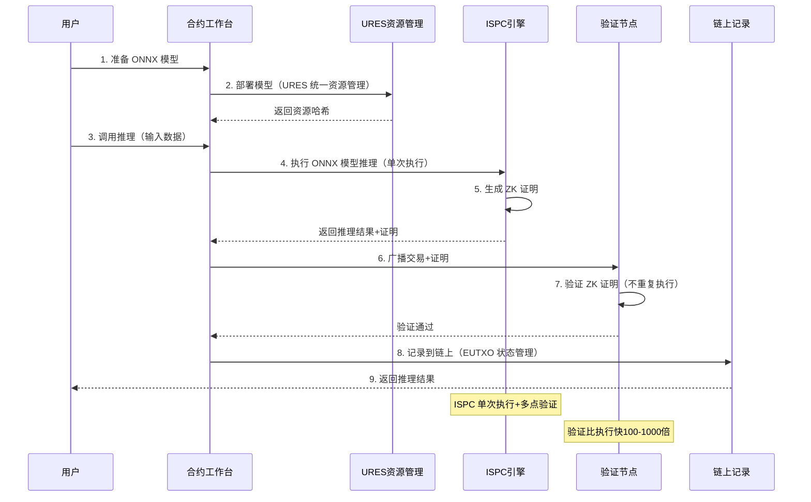

# AI 推理场景实践

---

## 🎯 场景概览

本文档介绍如何在 WES 上使用 AI 模型进行链上推理，包括模型部署、推理调用、结果验证等。

---

## 📋 场景说明

### 场景描述

**业务需求**：
- 在链上执行 AI 模型推理
- 推理结果可验证
- 支持多种 AI 模型

**WES 方案**：
- 使用 ONNX 格式部署模型（通过 URES 统一资源管理）
- 通过 ISPC（Intrinsic Self-Proving Computing，本征自证计算）执行推理
- 单次执行+多点验证：只有执行节点执行推理，其他节点通过验证 ZK 证明来确认
- **统一的经济模型**：AI 模型与智能合约采用完全一致的算力消费模型
  - **部署时**：模型所有者设置"多少 CU 需要消耗多少什么 Token"（CU→Token 映射）
  - **调用时**：用户运行推理模型时，系统自动计算 CU，并按部署时设置的映射关系消费对应的 Token
  - CU 统一计量：AI 模型推理使用 CU（Compute Units，计算单位）计量算力消耗，与合约使用相同的计量标准

> 💡 **关键要点**：微迅链不仅仅是传统区块链，更是 AI 原生的可验证计算平台。AI 模型和智能合约在经济模型上完全对等，都遵循"部署时设置 CU→Token 映射，调用时按 CU 消费 Token"的机制。详细设计请参考 [费用与经济模型](../../product/economics.md)。

### AI 推理完整流程



---

## 🚀 快速开始

### Step 1: 准备 ONNX 模型

```bash
# 转换模型为 ONNX 格式
python convert_to_onnx.py --model model.pth --output model.onnx
```

### Step 2: 部署模型

```bash
# 部署模型到链上
wes dev model deploy model.onnx
```

### Step 3: 执行推理

```bash
# 调用模型推理
wes dev model inference <model-hash> --input input.json
```

---

## 💡 典型应用场景

### 场景 1：链上风控模型

**业务需求**：在链上执行风险评估

**实现步骤**：
1. 部署风控模型
2. 调用模型推理
3. 获取风险评估结果

### 场景 2：智能定价算法

**业务需求**：基于市场数据动态定价

**实现步骤**：
1. 部署定价模型
2. 输入市场数据
3. 获取定价建议

### 场景 3：内容推荐引擎

**业务需求**：基于用户行为推荐内容

**实现步骤**：
1. 部署推荐模型
2. 输入用户行为数据
3. 获取推荐结果

---

## 📚 相关文档

- [ISPC 能力视图](../../components/ispc.md) - 了解可验证计算能力
- [合约开发入门](../contracts/beginner.md) - 了解合约开发
- [API 参考](../../reference/api/) - 了解 API 接口

---

**相关文档**：
- [产品总览](../../overview.md) - 了解 WES 是什么、核心价值、应用场景
- [ISPC 能力视图](../../components/ispc.md) - 了解可验证计算能力

